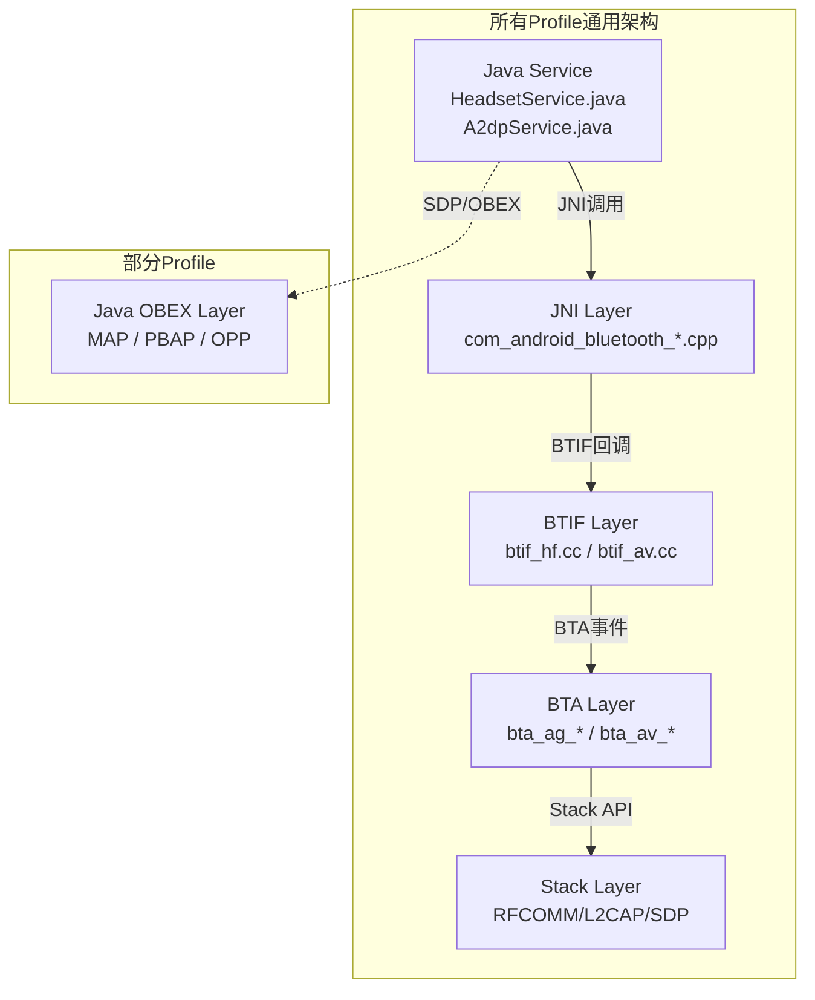
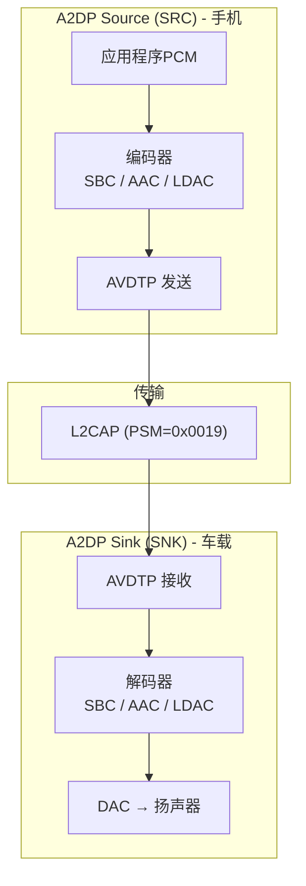
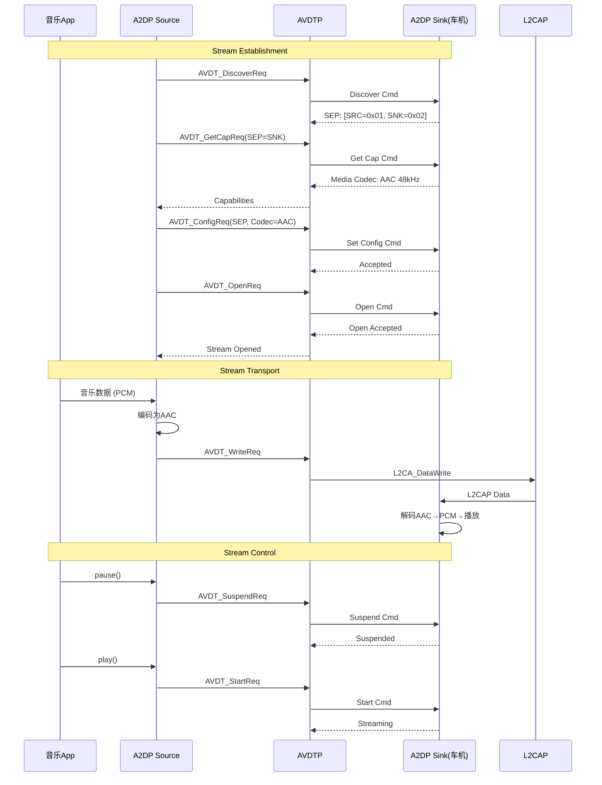
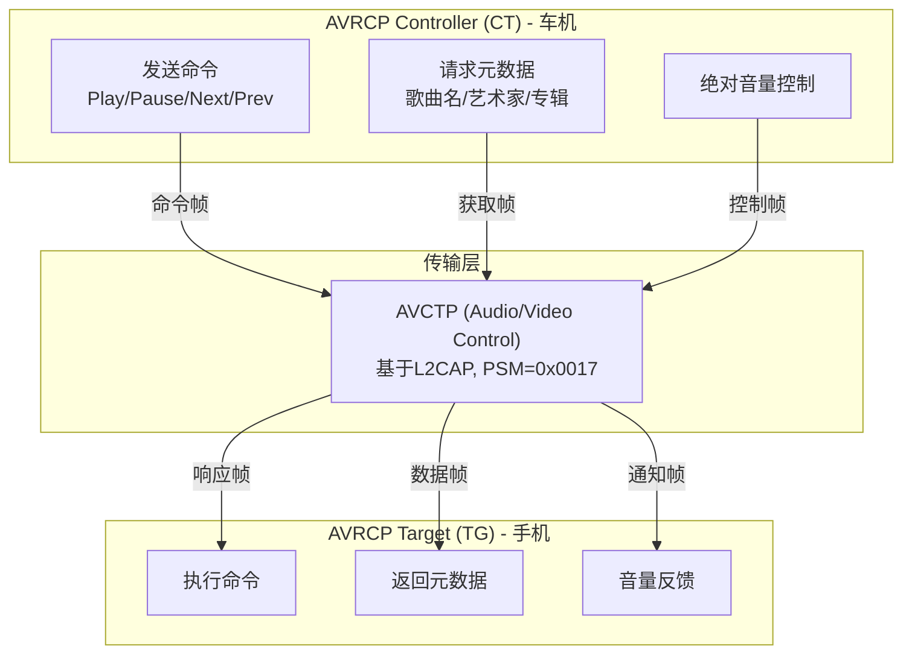
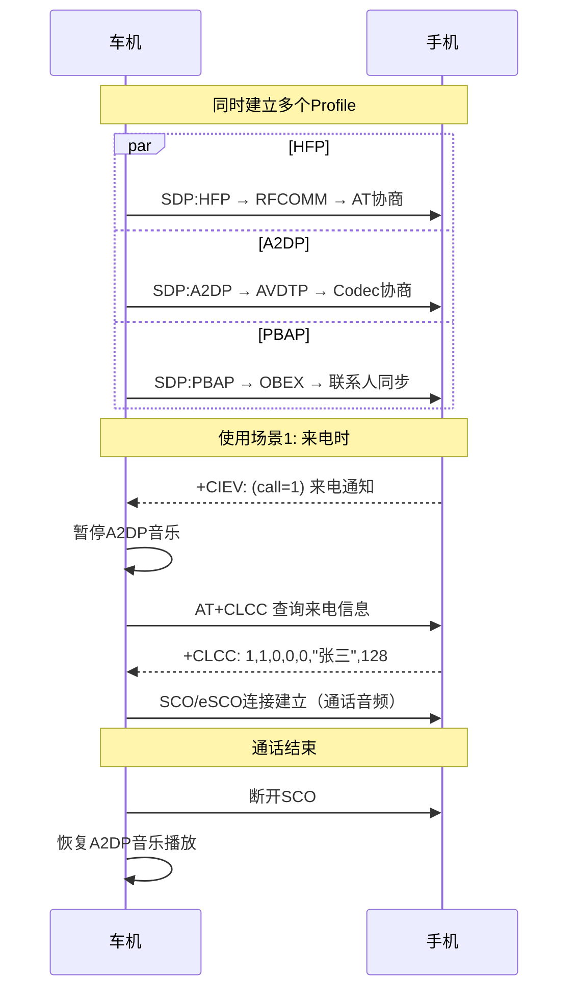

# 第11章：经典Profile详解

> **难度**: ★★★★☆ | **前置知识**: Ch10 Stack Core, Ch7 JNI, Ch8 BTIF, Ch9 BTA | **C++依赖**: 中
> **预计阅读时间**: 4-5小时 | **预计学习天数**: 5-7天
> **核心作用**: 理解各经典Profile从Java到Native的完整实现

---

## 学习目标

- 深入理解HFP免提Profile在车载场景的完整实现
- 掌握A2DP/AVRCP的音频流控制实现
- 了解MAP/PBAP/PAN/HID/SAP/OPP的基本实现
- 知道各Profile在车载场景中的应用

---

## 1. 各Profile在栈中的完整路径

每个Profile的调用路径都是：**Java Service → JNI → BTIF → BTA → Stack**



| Profile | Java Service | JNI | BTIF | BTA |
|---------|-------------|-----|------|-----|
| **HFP** | `HeadsetService.java` | `com_android_bluetooth_hfp.cpp` | `btif_hf.cc` | `bta_ag_*` |
| **A2DP** | `A2dpService.java` | `com_android_bluetooth_a2dp.cpp` | `btif_av.cc` | `bta_av_*` |
| **AVRCP** | `AvrcpControllerService.java` | `com_android_bluetooth_avrcp_controller.cpp` | `btif_rc.cc` | `stack/avrc/` |
| **HID** | `HidHostService.java` | `com_android_bluetooth_hid_host.cpp` | `btif_hh.cc` | `bta_hh_*` |
| **PAN** | `PanService.java` | `com_android_bluetooth_pan.cpp` | `btif_pan.cc` | `bta_pan_*` |
| **MAP** | `BluetoothMapService.java` | `com_android_bluetooth_sdp.cpp` | (OBEX in Java) | — |
| **PBAP** | `PbapClientService.java` | `com_android_bluetooth_sdp.cpp` | (OBEX in Java) | — |
| **SAP** | `SapService.java` | — | — | — |
| **OPP** | `BluetoothOppService.java` | — | (OBEX in Java) | — |

---

## 2. HFP — Hands-Free Profile（最核心的车载Profile）

### 2.1 Profile结构

```
HFP 角色:
┌────────────┐                    ┌────────────┐
│    HF      │                    │    AG      │
│ (Hands-Free)│ ←―― RFCOMM ―――→  │ (Audio     │
│  车机端     │ ←―― SCO/eSCO ――→  │  Gateway)  │
└────────────┘    (语音数据)       │  手机端     │
                                    └────────────┘
```

**车载视角**：车机是 HF，手机是 AG。

### 2.2 HFP 版本演进

```
HFP 1.5 (2003)   ─── CVSD, 窄带语音(8kHz)
HFP 1.6 (2008)   ─── mSBC, 宽带语音(16kHz)
HFP 1.7 (2014)   ─── 三方通话增强
HFP 1.8 (2018)   ─── LC3超宽带支持(32kHz)
HFP 1.9 (2023)   ─── 增强型语音质量
```

### 2.3 完整连接流程

```
Step 1: ACL建立
    HCI Create Connection → Connection Complete

Step 2: SDP查询
    查询 UUID_SERVCLASS_HFP_HF (0x111E) → 获取RFCOMM通道号

Step 3: RFCOMM连接
    L2CAP Connect(PSM=SDP) → SDP查询 →
    L2CAP Connect(PSM=RFCOMM) → RFCOMM连接 →
    AT命令通道建立

Step 4: 能力协商 (AT+BRSF)
    HF → AT+BRSF=<hf_features>
    AG → +BRSF: <ag_features>
    HF → AT+BRSF=<hf_features>

Step 5: 事件注册
    HF → AT+CIND=?  (查询可用指示器)
    AG → +CIND: (service,call,callsetup,callheld,signal,roam,battchg)
    HF → AT+CMER=... (注册事件报告)
    HF → AT+BIND=?  (查询HF指示器)
    AG → +BIND: (..., ...)

Step 6: 可选查询
    HF → AT+CHLD=?  (呼叫保持能力)
    HF → AT+CNUM    (本机号码)
    HF → AT+CLCC    (当前通话)

Step 7: 准备就绪
    HF → AT+BAC=<codec_ids>  (支持的Codec)
    车载HFP连接完成 → 等待电话事件
```

### 2.4 HFP状态机

```cpp
// 对应代码: HeadsetStateMachine.java
// HFP连接状态
public static final int DISCONNECTED = 0;
public static final int CONNECTING = 1;
public static final int CONNECTED = 2;
public static final int DISCONNECTING = 3;

// 音频状态
public static final int AUDIO_DISCONNECTED = 0;
public static final int AUDIO_CONNECTING = 1;
public static final int AUDIO_CONNECTED = 2;

// 通话状态
public static final int CALL_IDLE = 0;
public static final int CALL_INCOMING = 1;
public static final int CALL_DIALING = 2;
public static final int CALL_ACTIVE = 3;
public static final int CALL_TERMINATED = 4;
```

### 2.5 SCO/eSCO音频

SCO（Synchronous Connection-Oriented）是HFP的语音传输通道：

```cpp
// sco/eSCO 参数
typedef struct {
    uint8_t transmit_bandwidth;    // 传输带宽 (8000/16000)
    uint8_t receive_bandwidth;     // 接收带宽
    uint16_t voice_setting;        // 语音设置
    uint8_t packet_types;          // 包类型
    uint8_t air_mode;              // 传输模式 (CVSD/mSBC/LC3)
} tBTM_ESCO_PARAMS;

// 建立SCO连接
tBTM_STATUS BTM_CreateSco(const RawAddress& remote_bda,
                            tBTM_SCO_CB* p_conn_cb,
                            tBTM_ESCO_PARAMS* p_params);
```

### 2.6 关键AT命令

| AT命令 | 方向 | 功能 | 车载场景 |
|--------|------|------|---------|
| `AT+BRSF=<n>` | HF→AG | 特性协商 | 初始化连接 |
| `AT+CIND?` | HF→AG | 查询指示器 | 获取信号/电量 |
| `AT+CMER=...` | HF→AG | 事件报告 | 注册事件通知 |
| `AT+CLCC` | HF→AG | 查询通话 | 同步通话列表 |
| `AT+CHLD=<n>` | 双向 | 呼叫保持 | 切换/保持通话 |
| `AT+VTS=<n>` | HF→AG | DTMF音 | 按键拨号 |
| `AT+BLDN` | HF→AG | 重拨 | 重拨上次号码 |
| `+CLIP: <num>` | AG→HF | 来电显示 | 显示来电号码 |
| `+CCWA: <num>` | AG→HF | 呼叫等待 | 三方来电 |
| `+CIEV: <ind,val>` | AG→HF | 指示器更新 | 信号变化等 |

---

## 3. A2DP — Advanced Audio Distribution Profile

### 3.1 角色


A2DP Source (SRC):        A2DP Sink (SNK):
  手机/媒体播放器           耳机/扬声器/车机
  ┌────────────┐            ┌────────────┐
  │ 音频编码    │  AVDTP     │ 音频解码   │
  │ SBC/AAC/   │ ────────→  │ SBC/AAC/   │
  │ aptX/LDAC │  流传输     │ aptX/LDAC  │
  └────────────┘            └────────────┘
```

**车载视角**：手机是 Source，车机是 Sink。

### 3.2 支持Codec

| Codec | 强制/可选 | 比特率 | 采样率 | 特色 |
|-------|----------|--------|-------|------|
| SBC | ✅ 强制 | 328kbps | 44.1/48kHz | 所有设备支持 |
| AAC | 可选 | 250kbps | 44.1/48kHz | iPhone常用 |
| aptX | 可选 | 352kbps | 44.1/48kHz | 高通设备 |
| aptX HD | 可选 | 576kbps | 44.1/48kHz | 高清音频 |
| LDAC | 可选 | 990kbps | 44.1/48/96kHz | Sony高清 |
| LC3 | 可选(LE) | 192kbps | 48kHz | LE Audio新标准 |
| Opus | 可选 | 160kbps | 48kHz | Google |

### 3.3 流建立与控制



---

## 4. AVRCP — Audio/Video Remote Control Profile

### 4.1 角色



**车载视角**：车机是 Controller，手机是 Target。

### 4.2 关键功能

```java
// AvrcpControllerService.java
// 1. 播放控制
public void sendMediaKeyEvent(int keyEvent) {
    // KEY_PLAY, KEY_PAUSE, KEY_NEXT, KEY_PREVIOUS
    mAvrcpNativeInterface.sendMediaKeyEvent(keyEvent);
}

// 2. 获取播放状态
public int getPlayStatus() {
    // PLAYING, PAUSED, STOPPED, FWD_SEEK, REV_SEEK, ERROR
    return mPlayStatus;
}

// 3. 获取元数据
public void getNowPlayingList() {
    // 当前播放列表
    // 歌曲名、艺术家、专辑名、时长
}

// 4. 绝对音量控制
public void setAbsoluteVolume(int volume) {
    // 同步车机音量到手机
    mAvrcpNativeInterface.setVolume(volume);
}
```

### 4.3 AVRCP 版本

```
AVRCP 1.0  ─── Play/Pause/Next/Prev (基本遥控)
AVRCP 1.3  ─── 元数据（歌曲名、艺术家、专辑）
AVRCP 1.4  ─── 播放列表浏览（从车机浏览手机音乐）
AVRCP 1.5  ─── 绝对音量控制
AVRCP 1.6  ─── 封面图片（Cover Art）
```

---

## 5. MAP — Message Access Profile

### 5.1 角色

```
MAP Client (MCE):             MAP Server (MSE):
  车机                          手机
  ┌────────────┐                ┌────────────┐
  │ 读取短信    │   OBEX/MAP     │ 短信/邮件  │
  │ 发送短信    │ ←―――――――――→   │ 通知推送   │
  │ 通知推送    │   (RFCOMM)     │ 消息存储   │
  └────────────┘                └────────────┘
```

### 5.2 主要功能

- 新消息通知（SMS/MMS/Email）
- 读取消息内容
- 发送消息（通过手机）
- 标记已读/删除

**车载场景**：车机显示短信通知，用户可通过语音回复。

---

## 6. PBAP — Phone Book Access Profile

### 6.1 角色

```
PBAP Client (PCE):            PBAP Server (PSE):
  车机                          手机
  ┌────────────┐                ┌────────────┐
  │ 联系人查询  │   OBEX/PBAP   │ 电话本存储  │
  │ 通话记录    │ ←―――――――――→   │ 通话记录    │
  │ 同步通讯录  │                │ vCard格式   │
  └────────────┘                └────────────┘
```

### 6.2 主要功能

- 下载电话本（所有联系人）
- 查询通话记录（已拨/已接/未接）
- vCard 格式传输

**车载场景**：车机显示联系人姓名，语音拨号。

---

## 7. PAN — Personal Area Network

### 7.1 角色

```
PAN User (PANU):              Network Access Point (NAP):
  车机                          手机
  ┌────────────┐                ┌────────────┐
  │ 上网/热点   │   BNEP/L2CAP  │ 互联网共享  │
  │ IP数据包    │ ←―――――――――→   │ DHCP/NAT    │
  └────────────┘                └────────────┘
```

### 7.2 代码实现

```cpp
// btif_pan.cc — PAN的BTIF实现
bt_status_t btif_pan_connect(const RawAddress* bd_addr) {
    // PAN使用BNEP协议
    return BTA_PanOpen(bd_addr, PAN_ROLE_NAP, nullptr, 0);
}
```

**车载场景**：车机通过手机上网，或车机作为热点给乘客使用。

---

## 8. HID — Human Interface Device

### 8.1 角色

```
HID Host:                     HID Device:
  车机                          键盘/游戏手柄
  ┌────────────┐                ┌────────────┐
  │ 接收输入    │   L2CAP/HID   │ 发送报告    │
  │ 键盘/鼠标   │ ←―――――――――→   │ 键盘鼠标    │
  │ 游戏控制    │                │ 游戏手柄    │
  └────────────┘                └────────────┘
```

---

## 9. SAP — SIM Access Profile

车载集成SIM卡访问协议。车机通过蓝牙访问手机的SIM卡。

```java
// SapService.java
public class SapService extends ProfileService {
    // SAP Server — 让SAP Client（车机）访问手机SIM
    
    public void connect(BluetoothDevice device) {
        // 建立SAP连接
        // 车机可以通过蓝牙使用手机的SIM卡
    }
    
    // SAP协议消息
    public enum SapMsg {
        CONNECT_REQ,        // 连接请求
        DISCONNECT_REQ,     // 断开请求
        TRANSFER_APDU_REQ,  // APDU传输（SIM卡命令）
        TRANSFER_ATR_REQ,   // ATR传输
        POWER_SIM_OFF_REQ,  // SIM卡断电
        POWER_SIM_ON_REQ,   // SIM卡上电
        RESET_SIM_REQ,      // SIM卡复位
        STATUS_IND,         // 状态指示
    }
}
```

---

## 10. OPP — Object Push Profile

基于OBEX的文件传输协议。

```java
// BluetoothOppService.java
// 接收/发送文件（vCard/vCal/vMsg）
public class BluetoothOppService extends Service {
    // 接收文件
    public void onReceive(BluetoothDevice device, Uri fileUri) {
        // 通过OBEX接收文件
        // 存储到下载目录
    }
    
    // 发送文件
    public void sendFile(BluetoothDevice device, Uri fileUri) {
        // 通过OBEX推送文件
    }
}
```

---

## 11. 车载多Profile并发场景

这是车载蓝牙最重要的特性——多个Profile同时工作：



---

### 11.2 深度参考（V8）

**经典发现流程**（`startDiscovery()`）：

| 步骤 | 代码位置 | 线程 |
|------|---------|------|
| `BluetoothAdapter.startDiscovery()` | `BluetoothAdapter.java` | App 任意线程 |
| Binder IPC | — | Binder 线程池 |
| `btif_dm_start_discovery()` | `btif_dm.cc` | BT Main Thread |
| `BTM_StartInquiry()` | `btm_inq.cc` | BTU Task |
| HCI `HCI_Inquiry` | Controller | 硬件 |

> 完整发现流程分析见 [V8_Discovery_Analysis.md](V8_Discovery_Analysis.md)

**HFP/A2DP 调试**：
- logcat: `bt_btif_hf`（HFP AT命令+SCO）, `bt_btif_av`（A2DP音频流）
- dumpsys: `adb shell dumpsys bluetooth | grep -A 20 "HeadsetService"` / `grep -A 20 "A2dpService"`
- 详见 [V8_Log_Analysis.md](V8_Log_Analysis.md) §2.2 和 [V8_Dumpsys_Analysis.md](V8_Dumpsys_Analysis.md) §3.2

---

## 12. 实战练习

### 练习1：HFP AT命令分析

```cpp
// 用Snoop log抓取一次HFP连接
// 1. 找到所有的AT命令交互
// 2. 找出哪些是HFP必需的，哪些是可选的
// 3. 找到Codec协商的过程
```

> **答案**: ① HFP连接时的AT命令在Wireshark中过滤`btl2cap`查看RFCOMM channel(PSM=3)，典型序列：`AT+BRSF=<support_feature>`(能力协商) → `<+BRSF>`(响应) → `AT+CIND=?`(指示器查询) → `+CIND: ...` → `AT+CIND=...`(当前状态) → `AT+CMER=...`(事件报告模式) → `AT+CHLD=?`(呼叫保持查询) → `AT+BIND=?`(HF指示器)。② 必需AT命令(HFP v1.7规范)：`AT+BRSF`, `AT+CIND`, `AT+CMER`, `AT+CHLD`；可选：`AT+VTS`(DTMF)，`AT+CLCC`(来电列表)，`AT+NREC`(噪声消除)，`AT+BINP`(HF指示器)，`AT+BIA`(指示器激活)。③ Codec协商：HFP 1.6+用`AT+BAC=<codec1>,<codec2>`(支持Codec列表) → 远端响应(选择支持的最高优先级Codec)。Codec ID：1=CVSD(必选)，2=MSBC(宽带)。协商成功后进入SCO/eSCO连接阶段选择对应的Codec。

### 练习2：A2DP Codec切换

```java
// 阅读 A2dpService.java 中的setCodecConfigPreference
// 1. 如何切换codec优先级？
// 2. Codec参数如何在native协商？
// 3. 如果远端不支持选中的Codec会怎样？
```

> **答案**: ① `setCodecConfigPreference()` (A2dpService.java:890)设置codec优先级：通过`A2dpNativeInterface.setCodecConfigPreference()` → JNI → `btif_av.cc:btif_av_set_codec_config()` → `bta_av_act.cc:bta_av_set_config()`更新本地支持Codec列表中的优先级顺序。② Codec参数协商(`stack/a2dp/a2dp_sbc.cc`)：本地创建`tA2DP_SBC_IE`结构体包含采样率(44100/48000)、声道模式(stereo/mono)、比特率(320kbps)、块长度(16)等，通过`AVDTP_AVDT_MSG_SETCONFIG_CMD`设置到远端，远端响应`SET_CONFIG_ACCEPT`或`SET_CONFIG_REJECT`。③ 远端不支持时：`SET_CONFIG_REJECT`包含错误码(如`AVDT_BAD_CODEC_TYPE`)，触发`bta_av_act.cc:bta_av_rcfg_ohter()`重选下一个可用的Codec。如果所有Codec都不支持，连接失败回`btif_av.cc`报告FAIL状态。

### 练习3：多Profile优先级

```java
// 阅读 PhonePolicy.java
// 1. 来电时如何处理A2DP Audio Focus？
// 2. 导航提示音如何插入？
// 3. 多手机同时连接时如何处理？
```

> **答案**: ① 来电时(PhonePolicy.java:178)：`onAudioStateChanged()`检测`mHeadsetService.isCallActive()`为true → 调用`mA2dpService.suspendStream()`暂停A2DP音频流 → 实际暂停通过AVDTP的`AVDT_SUSPEND_CMD`命令实现 → 同时通过AudioManager请求`AUDIOFOCUS_GAIN_TRANSIENT`。通话结束后恢复调用`mA2dpService.resumeStream()`。② 导航提示音插入：导航播报开始时→`requestAudioFocus(AUDIOFOCUS_GAIN_TRANSIENT_MAY_DUCK)`→ A2DP音量降低(ducking)但不断开→播报结束→`abandonAudioFocus()`→ A2DP音量恢复。如果使用混音模式，在A2DP混音器将导航音和音乐混合播放。③ 多手机连接处理：`ActiveDeviceManager.java`中维护优先级队列(主驾驶→乘客)；来电时检查当前活跃设备，如果主驾驶手机没有通话而乘客手机有，`phonePolicy`会通过`setActiveDevice()`切换HFP到乘客手机；同一时刻只允许一个设备在HFP活跃状态。

---

## 本章总结

学完本章后，你应该能：
- 理解每个Profile的完整调用链：Java Service ↔ JNI ↔ BTIF ↔ BTA/Stack
- 掌握HFP的核心机制：AT命令双向传输 + SCO/eSCO音频 + Codec协商（CVSD/mSBC）
- 掌握A2DP的音频流控制：AVDTP信令（Discover→GetCap→SetConfig→Open→Start→Suspend）+ Codec编码
- 理解AVRCP的媒体控制通道（PTS控制）和元数据传输通道（浏览）
- 理解MAP/PBAP的OBEX协议基础
- 理解车载多Profile并发场景下的音频优先级管理（PhonePolicy + ActiveDeviceManager）
- 知道每个Profile对应的代码目录结构，能快速定位问题

> Classic Profiles的知识是车载蓝牙开发的基础。下一章我们进入不同的世界——BLE协议栈。

---

## 车载场景

经典Profile在车载环境中的特殊应用：

### 1. HFP免提Profile
- 车载HFP需要支持**双麦克风**（驾驶员+副驾驶），通过两路SCO链路传输音频
- HFP的AT命令集需要扩展支持车厂特定功能（如`+XAPL`车载应用列表）
- 通话时车载DSP的AEC（回声消除）和NR（降噪）必须启用，确保通话质量

### 2. A2DP音频分发
- 车载A2DP需要支持**多音源切换**：驾驶员手机→乘客手机→车载USB音乐
- Codec协商需要优先选择LDAC/aptX HD，确保车载功放下的高音质
- 导航音插入时，A2DP需要支持"暂停而非断开"策略，确保恢复延迟<100ms

### 3. AVRCP媒体控制
- 车载AVRCP需要支持方向盘按键控制（播放/暂停/上下曲）
- 元数据传输（歌曲名/艺术家）需要显示在车载HMI屏幕上
- 多音源场景下，AVRCP需要正确路由到当前活跃设备

### 4. 多Profile并发音频优先级
- 车载音频优先级：通话(HFP) > 导航音 > 媒体(A2DP) > 游戏音
- `PhonePolicy`和`ActiveDeviceManager`共同管理多Profile的音频路由
- 详见[第19章](19_Automotive_Scenarios.md)的音频优先方案

---

## 相关章节

- **HFP/A2DP/AVRCP的底层协议实现**：[第10章](10_Classic_Stack_Core.md)的RFCOMM/AVDTP/AVCT
- **HFP SCO音频的HAL处理**：[第16章音频系统](16_Audio_System.md)
- **多Profile并发的PhonePolicy和ActiveDeviceManager**：[第19章车载场景](19_Automotive_Scenarios.md)

---

## 参考文件清单

| Profile | Java Service | JNI | BTIF | BTA/Stack |
|---------|-------------|-----|------|-----------|
| **HFP** | `app/.../hfp/HeadsetService.java` | `jni/com_android_bluetooth_hfp.cpp` | `btif/src/btif_hf.cc` | `bta/ag/` |
| **A2DP** | `app/.../a2dp/A2dpService.java` | `jni/com_android_bluetooth_a2dp.cpp` | `btif/src/btif_av.cc` | `bta/av/` |
| **AVRCP** | `app/.../avrcpcontroller/AvrcpControllerService.java` | `jni/com_android_bluetooth_avrcp_controller.cpp` | `btif/src/btif_rc.cc` | `stack/avrc/` |
| **HID** | `app/.../hid/HidHostService.java` | `jni/com_android_bluetooth_hid_host.cpp` | `btif/src/btif_hh.cc` | `bta/hh/` |
| **PAN** | `app/.../pan/PanService.java` | `jni/com_android_bluetooth_pan.cpp` | `btif/src/btif_pan.cc` | `bta/pan/` |
| **MAP** | `app/.../map/BluetoothMapService.java` | — | — | (Java OBEX) |
| **PBAP** | `app/.../pbapclient/PbapClientService.java` | — | — | (Java OBEX) |
| **SAP** | `app/.../sap/SapService.java` | — | — | — |
| **OPP** | `app/.../opp/BluetoothOppService.java` | — | — | — |
| **V8 深度分析报告** | | | | |
| `V8_Profile_Analysis.md` | Profile 生命周期 + 状态机 + 线程模型 + 失败点 | | | |
| `V8_Discovery_Analysis.md` | Classic 发现流程 + HCI_Inquiry 调用链 | | | |
| `V8_Dumpsys_Analysis.md` | Headset/A2DP/GATT dumpsys 输出字段 | | | |
| `V8_Log_Analysis.md` | bt_btif_hf / bt_btif_av / bt_btm_sec LOG_TAG | | | |

> **下一步**: 阅读 [第12章：BLE协议栈详解](12_BLE_Stack.md)
