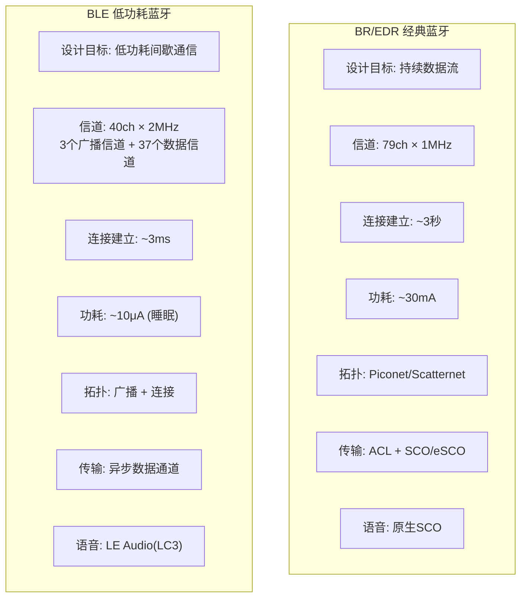
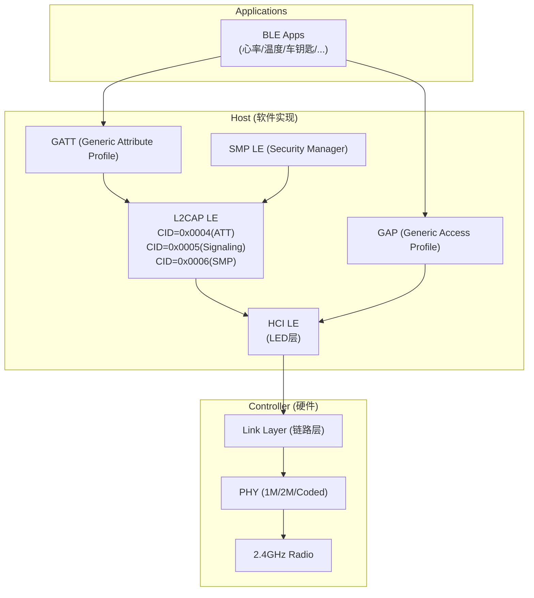
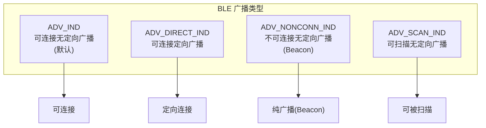
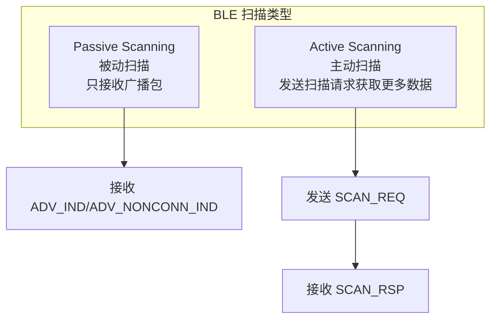
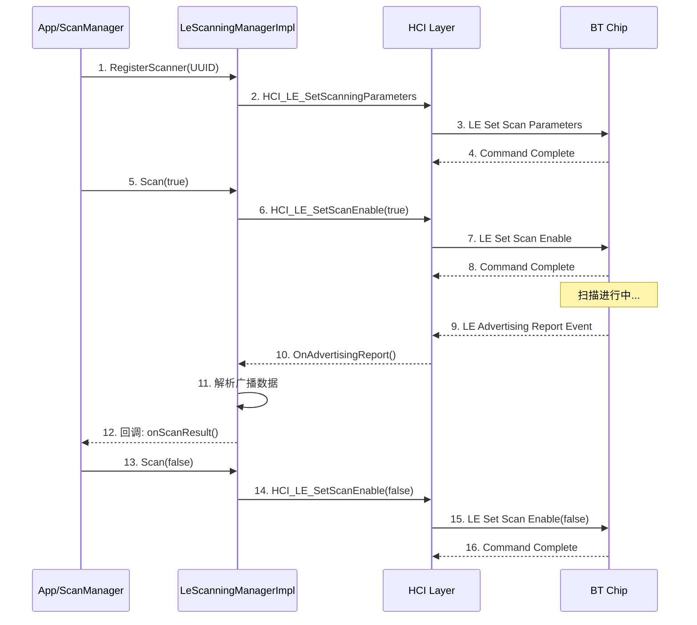
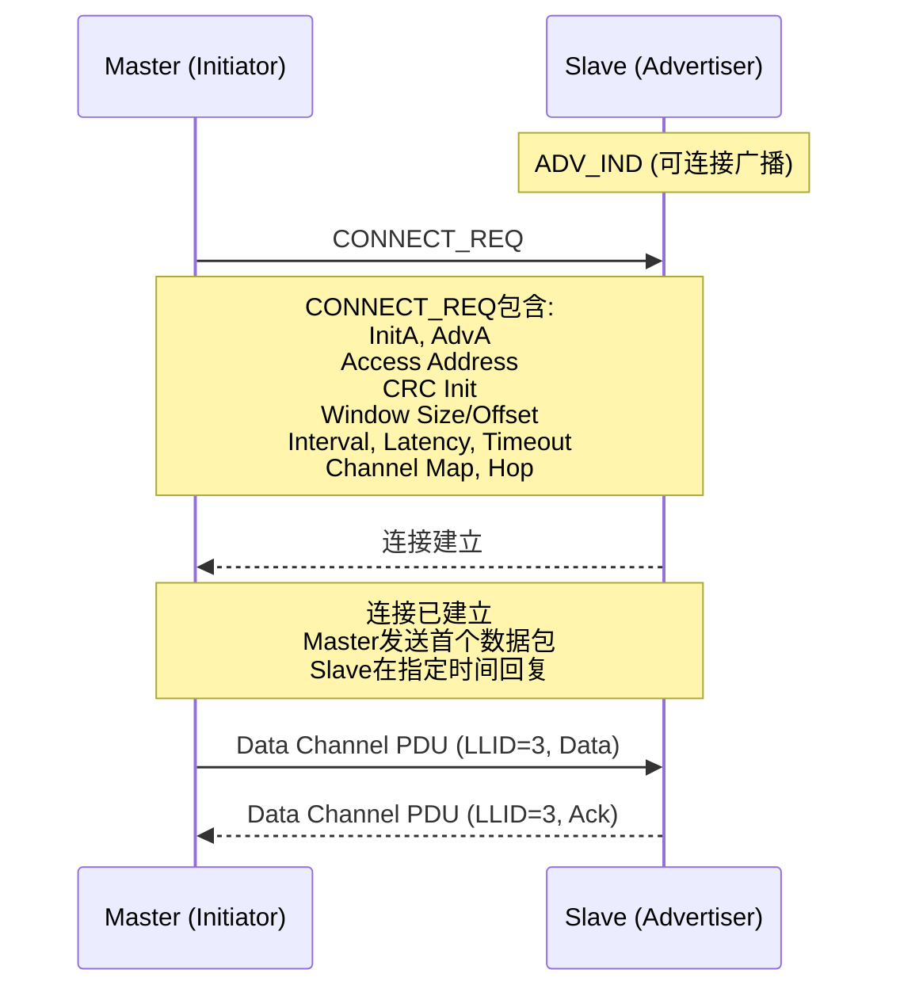
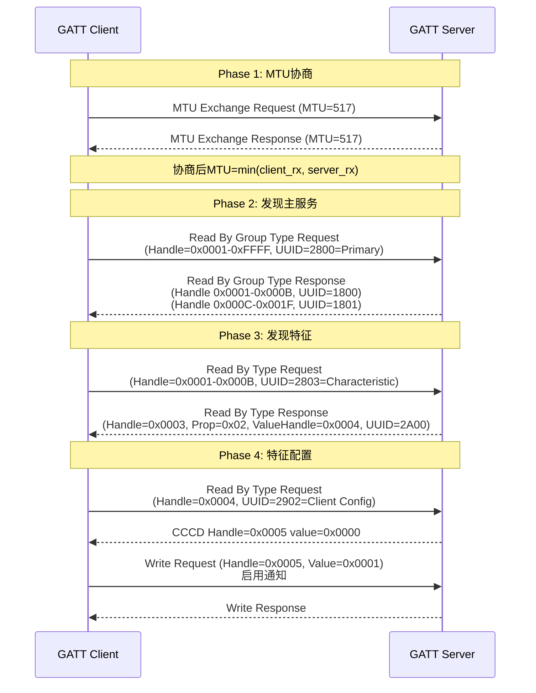
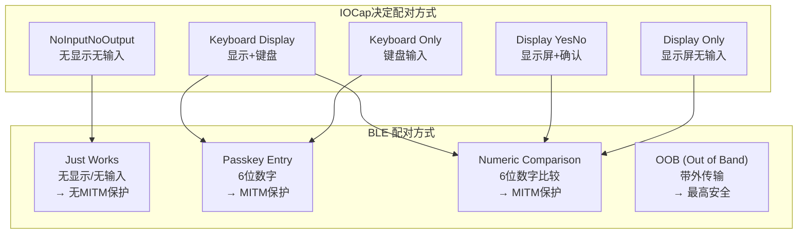
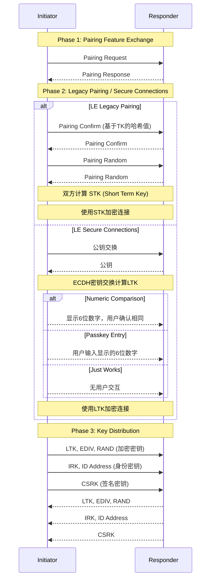

# 第12章：BLE协议栈详解

> **难度**: ★★★★☆ | **前置知识**: Ch10 Core Stack, Ch6 Profile Services | **C++依赖**: 中
> **预计阅读时间**: 4-5小时 | **预计学习天数**: 5-7天
> **核心作用**: 理解BLE协议栈的完整实现，从物理层到应用层

---

## 学习目标

- 理解BR/EDR与BLE的核心差异
- 掌握BLE广播和扫描机制的完整实现
- 掌握BLE连接管理和参数配置
- 理解GATT协议的操作和方法
- 理解BLE安全机制（配对、隐私）
- 掌握BLE 5.0+新特性

---

## 1. BLE 基础概念

### 1.1 BR/EDR vs BLE 核心差异



### 1.2 BLE 信道分配

```
BLE 40个信道:
┌─────┬─────┬─────┬─────────────────────────┬─────┬─────┐
│ ch37│     │ch38 │  数据信道 (ch0-ch36)     │ch39 │     │
│2402 │     │2426 │   2404-2478 MHz          │2480 │     │
│MHz  │     │MHz  │                          │MHz  │     │
└─────┴─────┴─────┴─────────────────────────┴─────┴─────┘
  ↑           ↑                                ↑
 广播信道    广播信道                         广播信道
  37         38                                39

广播信道: 用于广播、扫描、连接请求
数据信道: 连接建立后传输数据，自适应跳频
```

### 1.3 BLE 版本演进

```
BLE 4.0 (2010)  ─── 基础BLE，广播+连接+GATT
BLE 4.1 (2013)  ─── L2CAP CoC，多角色并发
BLE 4.2 (2014)  ─── LE Data Length Extension (251字节)
                   ─── LE Secure Connections
                   ─── 隐私功能增强

BLE 5.0 (2016)  ─── 2倍速度 (2M PHY)
                   ─── 4倍距离 (Coded PHY)
                   ─── 8倍广播容量 (Extended Advertising)
                   ─── 改进的跳频算法

BLE 5.1 (2019)  ─── 测向 (AoA/AoD)
BLE 5.2 (2020)  ─── LE Audio, LE Power Control
BLE 5.3 (2021)  ─── 连接更新改进
BLE 5.4 (2023)  ─── PAwR, Encrypted Advertising Data
BLE 6.0 (2024)  ─── Channel Sounding (高精度测距)
```

---

## 2. BLE 协议栈分层



### 2.1 代码中的协议对应

| 协议层 | 代码位置 | 核心文件 | 作用 |
|--------|---------|---------|------|
| **GAP** | `gd/hci/le_advertising_manager_impl.cc` | 广播管理 | 设备发现、连接 |
| **GAP** | `gd/hci/le_scanning_manager_impl.cc` | 扫描管理 | 扫描设备 |
| **GATT** | `stack/gatt/` | `att_protocol.cc` | 属性协议 |
| **SMP** | `stack/smp/` | `smp_main.cc` | 安全管理 |
| **L2CAP LE** | `stack/l2cap/l2c_ble.cc` | LE L2CAP | 数据通道 |
| **HCI LE** | `gd/hci/hci_layer.cc` | HCI接口 | 命令/事件 |
| **Link Layer** | 硬件芯片实现 | — | 链路层 |
| **PHY** | 硬件芯片实现 | — | 物理层 |

---

## 3. BLE 广播 (Advertising)

### 3.1 广播类型



### 3.2 广播数据格式

```
ADV PDU 格式 (Legacy):
┌──────────┬───────────┬─────────────┬──────────────┐
│ PDU Type │ AdvA(6B) │ AdvData(0-31B)│  (可选)     │
├──────────┼───────────┼─────────────┼──────────────┤
│  ADV_IND │ MAC地址   │ AD Structure│              │
└──────────┴───────────┴─────────────┴──────────────┘

AD Structure (Advertising Data):
┌──────────┬───────────┬──────────────┐
│ Length   │ AD Type   │  AD Data     │
│ (1字节)   │ (1字节)    │  (可变)       │
├──────────┼───────────┼──────────────┤
│ 0x03     │ 0x01      │ 0x04 0x06    │ ← Flags: LE General Discoverable
│ 0x11     │ 0x07      │ 0x0F...0x00  │ ← 128-bit Service UUID
│ 0x05     │ 0x08      │ "B""T""0""1" │ ← Shortened Local Name
```

### 3.3 扩展广播 (BLE 5.0+)

```
Extended Advertising PDU:
┌──────────┬────────────┬─────────────┬──────────────┬──────────┐
│ AdvMode  │ AdvA(6B)  │ TargetA(6B) │ CTE Info     │ AdvData  │
│          │            │ (定向时)     │ (5.1测向)     │ (0-255B) │
├──────────┼────────────┼─────────────┼──────────────┼──────────┤
│ Extended │ MAC        │ 可选         │ 可选          │ 数据     │
└──────────┴────────────┴─────────────┴──────────────┴──────────┘

特点:
- 数据从31字节扩展到251字节(单次)或更大(分段)
- 支持 1M/2M/Coded PHY
- 支持周期性广播
```

### 3.4 broadcast/LE 广播代码实现

```cpp
// gd/hci/le_advertising_manager_impl.h
class LeAdvertisingManagerImpl : public LeAdvertisingManager {
 public:
  static constexpr uint16_t kLeMaximumLegacyAdvertisingDataLength = 31;
  static constexpr uint16_t kLeMaximumFragmentLength = 251;

  void ExtendedCreateAdvertiser(
      uint8_t client_id, int reg_id, const AdvertisingConfig config,
      common::Callback<void(Address, AddressType)> scan_callback,
      common::Callback<void(Address, AddressType)> connect_callback,
      common::Callback<void(uint8_t)> set_terminated_callback,
      common::Callback<void(Address, AddressType)> set_scan_response_callback);
  
  void RemoveAdvertiser(AdvertiserId advertiser_id);

  void StartAdvertising(AdvertiserId advertiser_id);
  void StopAdvertising(AdvertiserId advertiser_id);

  // 设置广播数据
  void SetData(AdvertiserId advertiser_id, bool is_scan_response,
               const std::vector<uint8_t>& data);

  // 周期性广播 (BLE 5.0)
  void StartPeriodicAdvertising(const PeriodicAdvertisingParameters parameters,
                                const std::vector<uint8_t>& data,
                                uint16_t interval);
};
```

---

## 4. BLE 扫描 (Scanning)

### 4.1 扫描类型



### 4.2 扫描参数

```cpp
// gd/hci/le_scanning_manager_impl.h
class LeScanningManagerImpl : public LeScanningManager {
  void SetScanParameters(
      LeScanType scan_type,        // PASSIVE/ACTIVE
      ScannerId scanner_id_1m,     // 1M PHY扫描器ID
      uint16_t scan_interval_1m,   // 扫描间隔 (2.5ms - 10.24s)
      uint16_t scan_window_1m,     // 扫描窗口
      ScannerId scanner_id_coded,  // Coded PHY扫描器ID
      uint16_t scan_interval_coded,
      uint16_t scan_window_coded,
      uint8_t scan_phy);           // 扫描PHY (1M/2M/Coded)
};
```

### 4.3 扫描流程



---

### 4.4 扫描深度参考（V8）

BLE 扫描是 Android 蓝牙框架中调用链最长的路径之一，涵盖 Framework → system_server → BT App → JNI → GD 共 9 层。

**完整调用链与线程模型**：

| 步骤 | 代码位置 | 线程 | 说明 |
|------|---------|------|------|
| `startScan()` 入口 | `BluetoothLeScanner.java:280` | App 任意线程 | 框架内部做权限检查 |
| `startRegistration()` | `BluetoothLeScanner.java:429` | App 任意线程 | synchronized 保护 |
| Binder IPC | `IScannerCallback.aidl` | Binder 线程池 | 跨进程到 com.android.bluetooth |
| `ScanBinder.registerScanner()` | `ScanBinder.kt:74` | 强制 `mScanThread` | `doOnScanThread { }` |
| `ScanController.registerScanner()` | `ScanController.java:1209` | `mScanThread` | `enforceScanThread()` 检查 |
| `scanNative()` JNI | `com_android_bluetooth_scan.cpp:345` | `mScanThread` | 同步调用 |
| `BleScannerInterfaceImpl::RegisterScanner()` | `le_scanning_manager.cc:136` | BT Main Thread | `do_in_main_thread` 切换 |
| `LeScanningManagerImpl` | `le_scanning_manager_impl.cc:520-570` | `gd_stack_thread` | Handler post |

**回调上行**：`gd_stack_thread` → BT Main Thread (`do_in_main_thread`) → `mScanThread` → Binder 线程池 → App 任意线程。

**权限检查点**：
- `startScan()` 需要 `BLUETOOTH_SCAN` 权限（Android 12+ 细粒度）
- Android 10+ 额外需要 `ACCESS_FINE_LOCATION` 运行时权限
- Binder IPC 在 `ScanBinder.kt` 侧有 `enforceBluetoothScanPermission()` 二次检查

**常见失败点**：
- 非法线程：`IllegalStateException("Not on scan thread")` → `ScanController.java:1631`
- 扫描频率超限：`AppScanStats` 限制 `maxScansPerApp` → `ScanController.java:1660`
- JNI 回调失败：`CallbackEnv` 获取失败 → `com_android_bluetooth_scan.cpp:150-192`

> 完整分析见 [V8_BLE_Scan_Analysis.md](V8_BLE_Scan_Analysis.md)（539 行，含调用链全景图 + 关键类清单 + 状态机 + 线程模型 + 9 大易踩坑）

---

## 5. BLE 连接管理

### 5.1 连接建立



### 5.2 连接参数

```cpp
// 连接参数结构
typedef struct {
    uint16_t interval;         // 连接间隔 (1.25ms units)
                               // 范围: 6 (7.5ms) ~ 3200 (4s)
    uint16_t latency;          // 从设备延迟 (连接事件数)
                               // 允许从设备跳过N个连接事件
    uint16_t timeout;          // 监督超时 (10ms units)
                               // 范围: 10 (100ms) ~ 3200 (32s)
} le_connection_parameters;

// 连接参数对功耗和延迟的影响:
// 小间隔(7.5ms) = 低延迟 + 高功耗
// 大间隔(100ms+) = 高延迟 + 低功耗
// 
// 典型值:
// 音频: interval=8 (10ms)
// 数据: interval=24 (30ms)
// 传感器: interval=400 (500ms)
// 车钥匙: interval=80 (100ms)
```

### 5.3 连接参数更新

```cpp
// L2CAP LE 信令通道: 连接参数更新请求
// CID = 0x0005 (LE Signaling)

typedef struct {
    uint16_t interval_min;    // 最小间隔
    uint16_t interval_max;    // 最大间隔
    uint16_t latency;         // 从设备延迟
    uint16_t timeout;         // 监督超时
} tL2CAP_LE_CONN_REQ;

// 发送连接参数更新请求
void L2CA_LeConnectionParameterUpdate(const RawAddress& remote_bda,
                                        tL2CAP_LE_CONN_REQ* p_params);
```

### 5.4 ACL BLE 管理

```cpp
// gd/hci/acl_manager/acl_manager_le_impl.h
class AclManagerLeImpl {
  // LE ACL连接管理
  struct LeAclConnection {
    uint16_t handle;               // 连接句柄
    AddressWithType local_address;
    AddressWithType remote_address;
    LeConnectionParameters params; // 当前连接参数
    bool is_encrypted;
    bool is_bonded;
  };

  void CreateLeConnection(const AddressWithType& address);
  void DisconnectLeConnection(uint16_t handle);
  void UpdateConnectionParameters(uint16_t handle,
                                   LeConnectionParameters params);
};
```

---

### 5.5 连接深度参考（V8）

`connectGatt()` 是 BLE 连接的 App 入口，完整调用链跨 8 个层：

| 步骤 | 代码位置 | 线程 |
|------|---------|------|
| `BluetoothDevice.connectGatt()` | `BluetoothDevice.java:3241`（5 个重载） | App 任意线程 |
| `BluetoothGatt.connect()` | `BluetoothGatt.java:1154` | App 任意线程 |
| Binder IPC `IBluetoothGatt.clientConnect()` | — | Binder 线程池 |
| `GattService.clientConnect()` | `GattService.java:999` | GattService Handler |
| `GattNativeInterface.gattClientConnect()` | `com_android_bluetooth_gatt.cpp:1086` | BT Main Thread |
| `btif_gattc_open()` | `btif_gatt_client.cc:425` | BT Main Thread |
| `gatt_connect()` | `stack/gatt/gatt_main.cc:527` | BTU Task |

**连接状态机**（`BluetoothGatt.java` 端）：IDLE → CONNECTING → CONNECTED → DISCONNECTING → IDLE。Native 端状态在 `gatt_main.cc` 中以 `tGATT_TCB::ch_state` 跟踪。

**常见失败点**：
- **Binder 阻塞**：App 主线程调用 `connectGatt()` 后等待回调，但回调在 Binder 线程池执行，若回调中未 `post` 到主线程 Handler 则可能死锁
- **BLE 地址变更**：配对的 RPA 轮换后，Resolving List 中不存在对应条目导致连不上
- **GATT_Error 0x85**：连接参数不被 Controller 接受 → 检查 `interval/window/latency/timeout`

> 完整分析见 [V8_BLE_Connect_Analysis.md](V8_BLE_Connect_Analysis.md)（含连接调用链 + 状态机 + 线程模型 + 易踩坑清单）

---

## 6. GATT 协议

### 6.1 ATT 操作码

```cpp
// stack/gatt/att_protocol.cc
// ATT 操作码定义

// 请求 (0x01-0x3F)
#define ATT_MTU_REQ                 0x02  // MTU协商
#define ATT_FIND_INFO_REQ           0x04  // 查找信息
#define ATT_FIND_BY_TYPE_VALUE_REQ  0x06  // 按类型查找
#define ATT_READ_BY_TYPE_REQ        0x08  // 按类型读
#define ATT_READ_REQ                0x0A  // 读
#define ATT_READ_BLOB_REQ           0x0C  // 读长数据
#define ATT_READ_MULTI_REQ          0x0E  // 读多个
#define ATT_WRITE_REQ               0x12  // 写(需要响应)
#define ATT_WRITE_CMD               0x52  // 写(无需响应)
#define ATT_PREPARE_WRITE_REQ       0x16  // 准备写(长数据)
#define ATT_EXECUTE_WRITE_REQ       0x18  // 执行写
#define ATT_HANDLE_VALUE_NTF        0x1B  // 通知
#define ATT_HANDLE_VALUE_IND        0x1D  // 指示(需要确认)
```

### 6.2 GATT 发现服务流程



### 6.3 GATT 安全级别

```cpp
// GATT安全级别
typedef enum {
    GATT_SEC_NONE = 0,          // 无安全要求
    GATT_SEC_UNAUTH,            // 未认证加密 (Just Works配对)
    GATT_SEC_AUTH,              // 已认证加密 (Numeric Comparison/Passkey)
    GATT_SEC_MITM,              // MITM保护
    GATT_SEC_ENCRYPTION,        // 需要加密
    GATT_SEC_SIGNED,            // 需要签名(用于未加密时的认证)
} tGATT_SEC_LEVEL;
```

### 6.4 EATT (Enhanced ATT)

BLE 5.2 引入的增强ATT承载，支持并发ATT操作：

```cpp
// stack/eatt/
class EattChannel {
  // EATT支持多个并发的L2CAP通道 (CID 0x0040-0x0046)
  // 传统ATT: 一个操作完成才能进行下一个 (串行)
  // EATT: 多个操作可以并行进行 (并发)
  
  static constexpr uint16_t kEattMinCid = 0x0040;
  static constexpr uint16_t kEattMaxCid = 0x0046;
  static constexpr uint8_t kEattMaxChannels = 5;
};
```

---

### 6.5 GATT 深度参考（V8）

**GATT Client 读写路径**（以 `readCharacteristic()` 为例）：

| 步骤 | 代码位置 | 线程 |
|------|---------|------|
| `BluetoothGatt.readCharacteristic()` | `BluetoothGatt.java:1322` | App 任意线程 |
| Binder IPC | — | Binder 线程池 |
| `GattService.clientRead()` | `GattService.java:1134` | GattService Handler |
| `GattNativeInterface.gattClientRead()` | `com_android_bluetooth_gatt.cpp:1086` | BT Main Thread |
| `btif_gattc_read_char()` | `btif_gatt_client.cc:652` | BT Main Thread |
| `GATTC_Read()` | `stack/gatt/gatt_api.cc:1234` | BTU Task |

**GATT Server 路径**（`registerServer()` + `addService()`）：

| 步骤 | 代码位置 | 线程 |
|------|---------|------|
| `BluetoothGattServer.open()` | `BluetoothGattServer.java:85` | App 任意线程 |
| `GattService.registerServer()` | `GattService.java:1634` | GattService Handler |
| JNI `gattServerRegisterNative()` | `com_android_bluetooth_gatt.cpp:485` | BT Main Thread |
| `btif_gatt_server.cc:RegisterServer()` | `btif_gatt_server.cc:220` | BT Main Thread |
| `-> addService()` | `GattService.java:1830` | GattService Handler |
| Native `bta_gatts_add_service()` | `bta_gatts_api.cc:262` | BTU Task |

**GATT 线程关键约束**：
- `GattService` 所有操作在单 Handler 线程上串行执行，保证操作顺序
- `btif_gatt_client.cc` / `btif_gatt_server.cc` 中所有回调通过 `do_in_main_thread` 投递到 BT Main Thread
- GATT 回调（`onCharacteristicRead` 等）在 Binder 线程池上执行——App 必须在回调中 `post` 到自己的 Handler 才能更新 UI

**GATT 操作串行化**：
- **传统 ATT**：一个 ATT 操作完成前不能发起下一个（`gatt_cmd_queue` 排队）
- **EATT**（BLE 5.2+）：5 个并发通道，允许并行操作
- `GattService.java:1134` 中的 `clientRead()` 通过 `callbackToApp()` 保证回调顺序

> 完整分析见 [V8_GATT_Client_Analysis.md](V8_GATT_Client_Analysis.md) 和 [V8_GATT_Server_Analysis.md](V8_GATT_Server_Analysis.md)

---

## 7. BLE 安全

### 7.1 配对方式



### 7.2 BLE 配对流程



### 7.3 BLE 隐私 (Privacy)

```cpp
// 可解析私有地址 (RPA)
// RPA = hash || random
//   hash = AES-CMAC(IRK, random || 0x00)
//   random = 24位随机数

class LePrivacyManager {
  // 生成RPA
  AddressWithType GenerateResolvablePrivateAddress(const Octet16& irk);
  
  // 解析RPA
  bool ResolvePrivateAddress(const Address& address, const Octet16& irk);
  
  // 地址轮换 (默认15分钟)
  void SetAddressRotationTimeout(uint16_t minutes);
};
```

**RPA工作原理**：
1. 配对的双方各自存储对方的IRK（Identity Resolving Key）
2. 发送方用本地IRK加密随机数，生成24位hash，附加24位随机数=48位RPA
3. 接收方收到RPA后，用存储的对端IRK尝试解密hash——成功则确定对端身份
4. RPA每隔`T_GAP(private_addr_time)`（默认15分钟）轮换，防止被长期追踪
5. 车载BLE车钥匙场景：手机RPA轮换后，车机通过Resolving List仍能识别——但Resolving List条目数有限（高通芯片通常≤32条），设备数超限时需管理LRU淘汰

**Resolving List管理**（`gd/hci/le_address_manager.cc:210`）：
```cpp
// 控制器侧Resolving List
// 每项包含: 对端IRK + 本地IRK + 对端Identity Address
// 当控制器收到RPA时自动解析，无需Host参与
void LeAddressManager::AddDeviceToResolvingList(
    const AddressWithType& peer_identity,
    const Octet16& peer_irk,
    const Octet16& local_irk);
```

> 车载场景：建议在配对时检查Resolving List容量，满时提示用户移除旧设备。RPA轮换过快（<5分钟）会导致控制器频繁中断处理地址解析，增加功耗。

---

## 8. BLE 5.0+ 新特性

### 8.1 2M PHY / Coded PHY

```cpp
// PHY选择
typedef enum {
    PHY_LE_1M = 0x01,       // 1Mbps, 标准
    PHY_LE_2M = 0x02,       // 2Mbps, 高速
    PHY_LE_CODED = 0x04,    // 125/500kbps, 远距离
} le_phy_type_t;

// 2M PHY:   2倍速率，但距离略短 (适合音频、数据传输)
// Coded PHY: 4倍距离，但速率低 (适合远距离传感器)
```

### 8.2 扩展广播

```cpp
// 扩展到251(+可选更多的分段)字节广播数据
struct AdvertisingConfig {
  uint16_t interval_min;       // 广播间隔
  uint16_t interval_max;
  LePhy primary_phy;           // 主要PHY (1M/Coded)
  LePhy secondary_phy;         // 次要PHY (1M/2M/Coded)
  uint8_t own_address_type;
  AdvertisingType advertising_type;  // CONNECTABLE/NON_CONNECTABLE
  uint8_t channel_map;              // ch37/38/39
  bool include_tx_power;
  bool connectable;
  bool scannable;
  bool directed;
};
```

### 8.3 周期性广播

```cpp
class PeriodicAdvertisingManager {
  // 同步到周期性广播 (PAST)
  void SyncWithPeriodicAdvertising(const Address& address,
                                     uint16_t sid,
                                     uint16_t skip,
                                     uint16_t sync_timeout);
  
  // 周期性广播同步传输 (PAST)
  void TransferSync(const Address& address,
                     uint16_t service_data,
                     uint16_t sync_handle);
};
```

---

## 9. BLE 测试与调试

### 9.1 Wireshark BLE过滤

```
btle                   → 所有BLE包
btle_advertising       → BLE广播包
btatt                  → ATT/GATT操作
btsmp                  → SMP配对
btl2cap.cid == 0x0005  → LE L2CAP信令
btle.advertising_address == xx:xx:xx:xx:xx:xx → 指定设备广播
```

### 9.2 hcitool BLE调试

```bash
# BLE扫描
sudo hcitool lescan

# BLE连接参数
sudo hcitool leinfo <address>

# 发送LE命令
sudo hcitool cmd 0x08 0x000E  # LE Set Scan Parameters
```

### 9.3 dumpsys 与日志深度参考（V8）

**dumpsys 命令**：
```bash
# 扫描状态
adb shell dumpsys bluetooth | grep -A 30 "ScanController"

# GattService 状态（客户端连接、服务器注册、广播）
adb shell dumpsys bluetooth | grep -A 50 "GattService"

# App 扫描统计（频率、已拒绝数）
adb shell dumpsys bluetooth | grep -A 30 "AppScanStats"
```

**模块级 LOG_TAG**：

| LOG_TAG | 对应源码 | 说明 |
|---------|---------|------|
| `bt_shim_scanner` | `le_scanning_manager.cc` | GD 扫描 HCI 命令/事件 |
| `bt_shim_advertiser` | `le_advertising_manager.cc` | GD 广播 |
| `bt_btif_gattc` | `btif_gatt_client.cc` | GATT 客户端 Native |
| `bt_btif_gatt` | `btif_gatt.cc` | GATT 接口 |
| `bt_shim_hci` | `shim/hci_layer.cc` | HCI 命令/事件 |
| `bt_btm_sec` | `btm_sec.cc` | 安全/SMP |
| `AudioManager` | framework 侧 | GATT 操作日志 |

**典型调试序列**（BLE 扫描不返回结果）：
```
1. logcat -s bt_shim_hci:*      # HCI LE_Set_Scan_Enable 是否发出？
2. logcat -s bt_shim_scanner:*  # LE Advertising Report 是否收到？
3. logcat -s bt_btif_gattc:*   # 扫描结果是否到达 BTIF？
4. grep onScanResult            # 上层回调是否触发？
```

> 完整调试参考见 [V8_Dumpsys_Analysis.md](V8_Dumpsys_Analysis.md)（158 行）和 [V8_Log_Analysis.md](V8_Log_Analysis.md)（214 行）

---

## 10. 实战练习

### 练习1：分析BLE广播包

- 在代码中找到 `le_advertising_manager_impl.cc` 中的 `ExtendedCreateAdvertiser`
- 广播配置参数如何从Java端传递到Native？

> **答案**: 广播参数传递路径：Java `BluetoothLeAdvertiser.startAdvertising()` → `gatt/AdvertiseManager.java:510`构建`AdvertiseData`对象 → JNI `advertiseNative()` → `btif_gatt.cc:btif_gattc_advertise()` → `bta_gattc_co_cache.cc` → `bta_gattc_api.cc` → `le_advertising_manager_impl.cc:ExtendedCreateAdvertiser()`。关键参数(在`le_advertising_manager_impl.cc:320`)包括：`advertising_interval_min/max`(广播间隔，毫秒)、`advertising_type_properties`(可连接/可扫描/不可连接)、`tx_power_level`(发射功率dBm)、`advertising_data`(广播包内容31字节)、`scan_response_data`(扫描响应31字节)、`primary_advertising_phy`(1M/2M LE PHY)、`secondary_advertising_phy`、`owner_address_type`(公共/随机地址类型)。`ExtendedCreateAdvertiser`最终调用HCI `LE_EXTENDED_CREATE_ADVERTISING`命令配置硬件。

### 练习2：GATT Service Discovery

```cpp
// 阅读 stack/gatt/att_protocol.cc
// 1. 找到 ReadByTypeReq 的处理
// 2. Service/UUID如何编码到ATT包？
// 3. 响应如何组包？
```

> **答案**: ① `ReadByTypeReq`处理在`att_protocol.cc:225`的`attp_send_cl_msg()`中：构建ATT请求包，opcode=`GATT_REQ_READ_BY_TYPE`(0x08)，包含起始句柄(2字节)、结束句柄(2字节)、UUID类型(2或16字节)。底层通过l2cap发送到远端。② Service/UUID编码(GATT规范§3.1)：UUID有两种表示——16-bit UUID(Bluetooth SIG标准，如0x1800=Generic Access)用2字节直接编码；128-bit UUID(自定义)用16字节编码。在ATT包中，UUID类型由PDU头中的"Attribute Type"字段决定长度。`GATT_REQ_READ_BY_TYPE`中UUID编码为`p_req->value[0..len-1]`。③ 响应组包(att_protocol.cc:510)：`attp_send_svr_msg()`接收`tGATT_SR_MSG`，构建`GATT_RSP_READ_BY_TYPE`(opcode=0x09)，包含：`Length`(每个Attribute Data总长，1字节)、`Attribute_Data_List`(pairs of handle+value)。每个pair：`Handle`(2字节) + `Attribute_Value`(可变)。远端接收到后通过回调`gatt_process_read_by_type_rsp()`解析。

### 练习3：分析SMP配对

```cpp
// 阅读 stack/smp/smp_main.cc
// 1. SMP状态机有哪些状态？
// 2. Legacy Pairing和Secure Connections的分支点在哪？
// 3. 配对失败时如何处理？
```

> **答案**: ① SMP状态(smp_main.cc:105)：`SMP_ST_IDLE`→`SMP_ST_WAIT_APP_RSP`→`SMP_ST_PAIR_REQ_PEND`→`SMP_ST_PAIR_CONFIG`→`SMP_ST_WAIT_CONFIRM`→`SMP_ST_CONFIRM`→`SMP_ST_WAIT_PAIR_RAND`→`SMP_ST_RAND`→`SMP_ST_ENCRYPT_PENDING`→`SMP_ST_BOND_PENDING`(共12个状态)。② Legacy vs SC分支点在`smp_main.cc:670`的`smp_process_pairing_random()`中检测配对方法(p_cb->peer_sc_support)：如果双方Secure Connections支持且协商使用SC→SC流程(ECDH公钥交换+Numeric Comparison等)；否则Legacy→传统STK/TK流程。③ 配对失败(`smp_main.cc:870`)：收到`SMP_AUTH_CMPL_EVT` → `smp_proc_pairing_cmpl()`设置失败原因 → 释放`p_cb->timer` → 回调`smp_cb.p_callback`通知上层 → 清除配对上下文 → 状态回到`SMP_ST_IDLE`。额外的清理包括清零密钥材料和解除L2CAP固定通道注册。

---

## 车载场景BLE应用

| 场景 | BLE角色 | 技术要点 |
|------|---------|---------|
| **BLE车钥匙** | Peripheral（车机）+ Central（手机） | RPA隐私 + LE SC配对 + RSSI测距 |
| **胎压传感器** | Broadcaster（传感器） | BLE广播 + 电池续航>1年 |
| **车门控制** | Central（车机→手机） | 低延迟连接(<100ms) + 加密指令 |
| **车载诊断** | BLE GATT Server | 读取车辆状态信息 |
| **多传感器** | BLE扫描 + 批处理 | 同时管理10+传感器 |

> 详见第19章完整车载场景分析

---

## 本章总结

学完本章后，你应该能：
- 理解BLE与Classic BT的本质区别：连接导向vs广播导向、短包vs长包、低功耗vs高性能
- 掌握BLE协议栈分层：PHY→LL→L2CAP→ATT/GATT→Generic Access Profile
- 理解BLE广播(Advertising)的4种类型和广播集(Advertising Set)概念（BLE 5.0+）
- 理解BLE扫描(Scanning)的主动/被动模式，以及`ScanManager`的多App合并策略
- 掌握GATT Client/Server架构和ATT协议的操作（Read/Write/Notify/Indicate）
- 理解SMP在BLE中的配对流程（Legacy vs Secure Connections）和RPA隐私机制
- 掌握BLE 5.0+的新特性：2M PHY、Coded PHY、Extended Advertising、LE Audio基础
- 知道车载场景下BLE用于车钥匙（RPA+LE SC+RSSI测距）、胎压传感器（广播）、车载诊断（GATT服务器）

> BLE是现代蓝牙最重要的技术方向，也是LE Audio的基础。下一章我们深入LE Audio的架构和实现。

---

## 车载场景

BLE协议栈在车载环境中的关键应用：

### 1. BLE车钥匙（Digital Key）
- 车载BLE车钥匙使用**RPA（Resolvable Private Address）**保护用户隐私
- LE Secure Connections (LE SC) 用于车钥匙与车机的安全配对
- RSSI测距用于判断钥匙与车辆的距离：>10m（迎宾）→ 3-10m（解锁准备）→ <3m（解锁）
- `ScanManager`需要配置低功耗扫描参数，确保车钥匙在远距离（20m+）能被检测到

### 2. BLE胎压传感器（TPMS）
- 胎压传感器使用BLE广播（Advertising）周期性发送胎压数据
- 车机作为GATT Client读取传感器属性，每5秒更新一次
- 广播间隔需要平衡功耗和实时性：通常配置为1-5秒

### 3. BLE车载诊断（OBD）
- 车载OBD-II适配器通过BLE GATT服务器暴露车辆诊断数据
- 车机或手机App作为GATT Client读取故障码、油耗、车速等数据
- GATT的Notify特性用于实时数据推送（如车速变化）

### 4. BLE扫描功耗优化
- 车载场景下，BLE扫描需要平衡发现速度和功耗
- 驾驶状态：高占空比扫描（快速发现手机）
- 驻车状态：低占空比扫描（省电模式）
- 详见[第17章电源管理](17_Power_Management.md)的BLE扫描参数优化

---

## 相关章节

- **BLE GATT在Java层的Profile实现**：[第6章](06_Profile_Services.md)的GattService
- **BLE安全的SMP详解**：[第18章](18_Security_Architecture.md)
- **BLE扫描的功耗优化**：[第17章电源管理](17_Power_Management.md)
- **LE Audio依赖的ISO通道**：[第13章LE Audio](13_LE_Audio.md)
- **BLE车钥匙场景**：[第19章](19_Automotive_Scenarios.md)

---

## 参考文件清单

| 文件 | 核心内容 |
|------|---------|
| `gd/hci/le_advertising_manager_impl.h` | BLE广播管理 |
| `gd/hci/le_scanning_manager_impl.h` | BLE扫描管理 |
| `gd/hci/le_address_manager.h` | LE地址管理 |
| `gd/hci/le_scanning_callback.h` | 扫描回调 |
| `gd/hci/le_iso_interface.h` | ISO通道接口 |
| `gd/hci/le_security_interface.h` | LE安全接口 |
| `stack/gatt/att_protocol.cc` | ATT协议 |
| `stack/gatt/gatt_main.cc` | GATT主控 |
| `stack/smp/smp_main.cc` | SMP管理 |
| `stack/btm/btm_ble*.cc` | BLE BTM |
| `stack/l2cap/l2c_ble.cc` | LE L2CAP |
| `stack/eatt/` | EATT增强ATT |
| `pdl/hci/hci_packets.pdl` | HCI包定义 |
| `framework/.../BluetoothLeScanner.java` | 扫描 API（4141 行） |
| `android/app/.../le_scan/ScanController.java` | 扫描服务（1728 行） |
| `android/app/jni/com_android_bluetooth_scan.cpp` | 扫描 JNI（1039 行） |
| `android/app/jni/com_android_bluetooth_gatt.cpp` | GATT JNI（2134 行） |
| `system/main/shim/le_scanning_manager.cc` | GD 扫描 shim（875 行） |
| `system/gd/hci/le_scanning_manager_impl.cc` | GD 扫描实现（1810 行） |
| **V8 深度分析报告** | |
| `V8_BLE_Scan_Analysis.md` | BLE 扫描完整调用链 + 线程模型 + 权限 + 坑 |
| `V8_BLE_Connect_Analysis.md` | BLE 连接调用链 + 状态机 + 失败点 |
| `V8_GATT_Client_Analysis.md` | GATT 读写路径 + ATT 操作串行化分析 |
| `V8_GATT_Server_Analysis.md` | GATT Server 注册 + 属性服务 + 回调路径 |
| `V8_Log_Analysis.md` | BLE 模块 LOG_TAG 全表 |
| `V8_Dumpsys_Analysis.md` | 扫描/GATT dumpsys 输出字段 |

> **下一步**: 阅读 [第13章：LE Audio架构与实现](13_LE_Audio.md)
