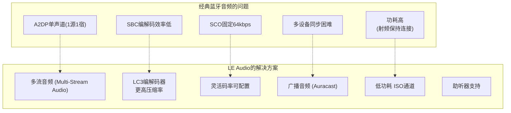
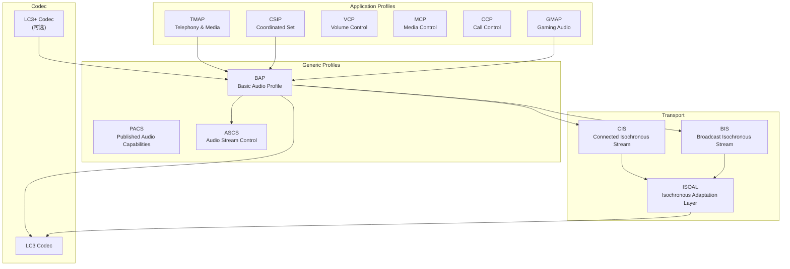
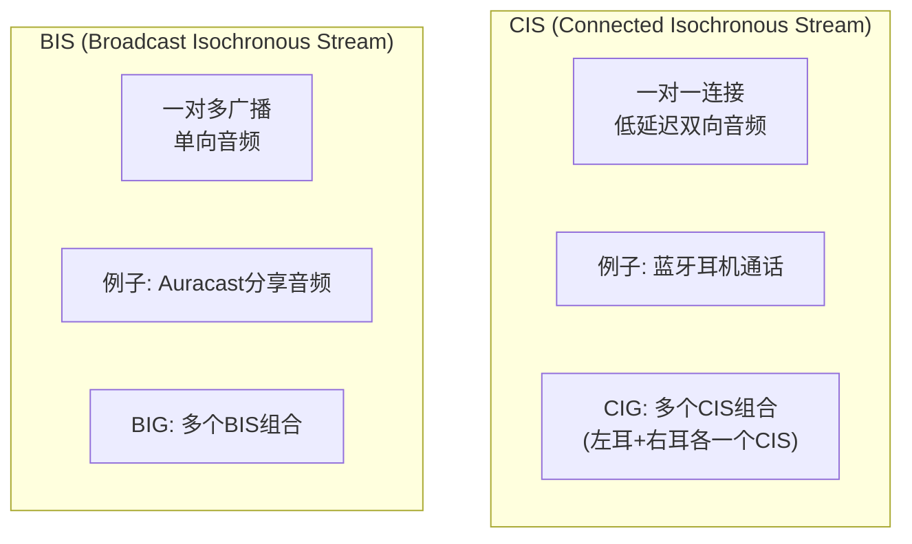
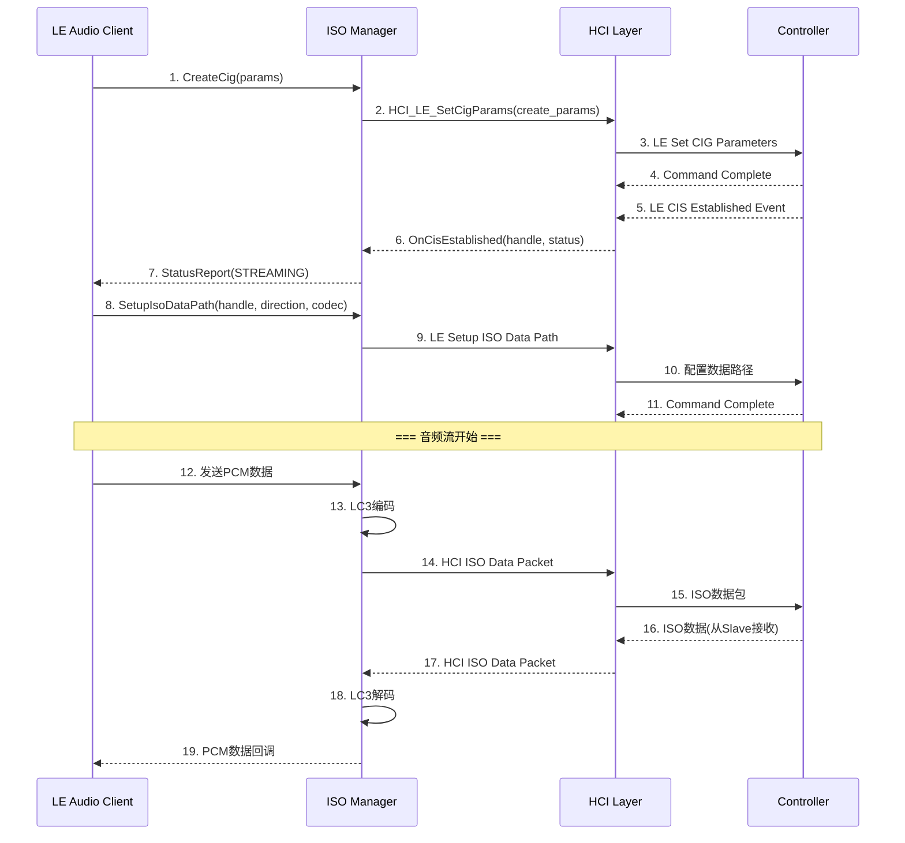
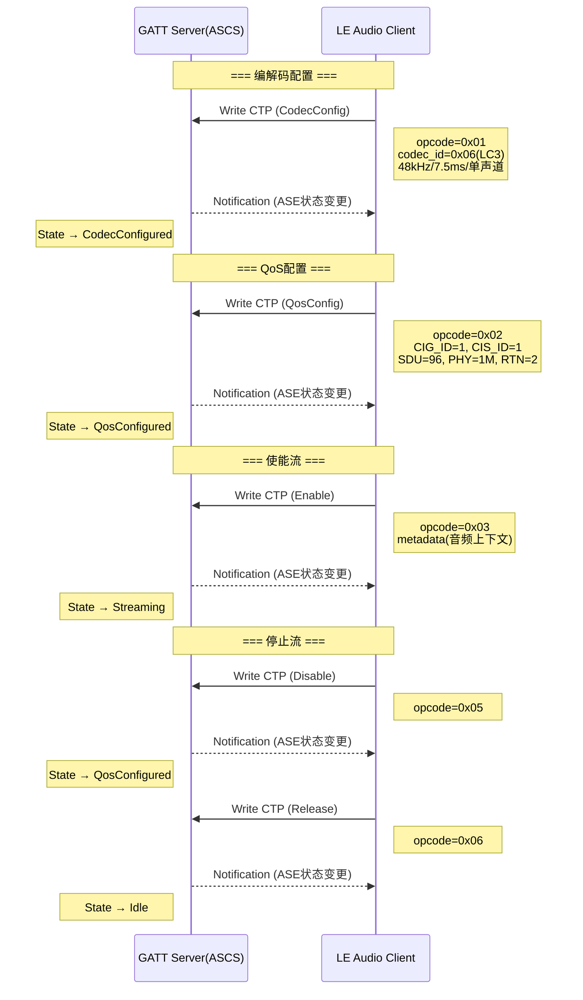
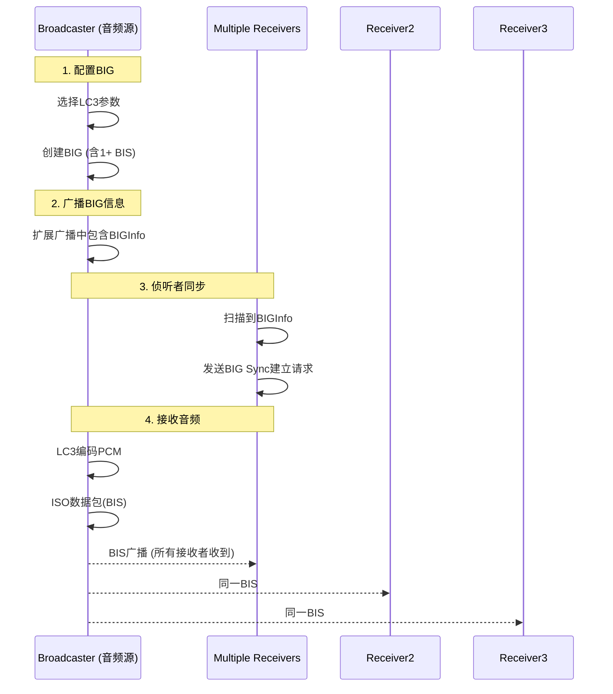

# 第13章：LE Audio 架构与实现

> **难度**: ★★★★★ | **前置知识**: Ch12 BLE Stack, Ch6 A2DP/HFP | **C++依赖**: 中
> **预计阅读时间**: 4-5小时 | **预计学习天数**: 5-7天
> **核心作用**: 理解下一代蓝牙音频架构从经典到LE的演进

---

## 学习目标

- 理解LE Audio相比经典A2DP/HFP的架构优势
- 掌握LC3编解码器特性
- 理解ISO (Isochronous) 通道模型
- 掌握Unicast/Broadcast Audio流程
- 理解BAP/CSIP/TMAP等LE Audio Profile

---

## LE Audio 缩略语速查

```
BAP  = Basic Audio Profile      —— 基础音频配置文件（核心，类似A2DP的LE版本）
ASCS = Audio Stream Control Service —— 音频流控制服务（ASE状态机）
PACS = Published Audio Capabilities Service —— 音频能力发布
CIS  = Connected Isochronous Stream —— 面向连接等时流（类似SCO的LE版本）
BIS  = Broadcast Isochronous Stream —— 广播等时流（一对多音频）
CIG  = Connected Isochronous Group —— 连接等时组（一组CIS）
BIG  = Broadcast Isochronous Group —— 广播等时组（一组BIS）
ISO  = Isochronous Channel        —— 等时通道（LE Audio传输层）
ISOAL= Isochronous Adaptation Layer —— 等时适配层
LC3  = Low Complexity Communication Codec —— LE Audio强制编解码器
CSIP = Coordinated Set Identification Profile —— 协调组标识（TWS耳机识别）
TMAP = Telephony & Media Audio Profile —— 电话与媒体音频（通话+音乐）
GMAP = Gaming Audio Profile       —— 游戏音频配置
VCP  = Volume Control Profile     —— 音量控制
MCP  = Media Control Profile      —— 媒体控制
CCP  = Call Control Profile       —— 通话控制
Auracast = 广播音频（Bluetooth LE Audio的广播功能品牌名）
```

---

## 1. LE Audio 概述

### 1.1 为什么会需要LE Audio？



### 1.2 LE Audio 架构总览



### 1.3 代码中的LE Audio目录结构

```
system/bta/le_audio/
├── client.cc                      # LE Audio Client 主实现
├── client_parser.cc               # ASCS/GATT 解析器
├── devices.h / devices.cc         # 设备状态管理
├── device_groups.h / device_groups.cc  # 设备组(如TWS耳机)
├── state_machine.h / state_machine.cc  # 流状态机
├── codec_manager.h / codec_manager.cc  # 编解码器选择
├── codec_interface.h / codec_interface.cc  # 编解码器接口
├── le_audio_types.h / le_audio_types.cc   # 类型定义
│
├── audio_hal_client/             # Audio HAL客户端
│   ├── audio_hal_client.h
│   ├── audio_source_hal_client.cc
│   └── audio_sink_hal_client.cc
│
├── broadcaster/                  # 广播音频(Auracast)
│   ├── broadcaster.cc
│   ├── state_machine.cc
│   └── broadcast_configuration_provider.cc
│
├── audio_context_type_manager.cc  # 音频上下文管理
├── gmap_server.h / gmap_client.h  # Gaming Audio
├── content_control_id_keeper.cc   # Content Control ID
├── hal_verifier.cc               # HAL版本验证
├── metrics_collector.cc          # 性能统计
├── storage_helper.cc             # 存储持久化
└── audio_set_configurations.json # 音频配置策略
```

---

## 2. LC3 编解码器

### 2.1 LC3 vs SBC

| 特性 | SBC (A2DP) | LC3 (LE Audio) |
|------|-----------|----------------|
| 比特率 @48kHz | 328 kbps | 192 kbps |
| 帧大小 | 7.5ms | 7.5ms / 10ms |
| MOS分 | 3.8 | 4.2 |
| 延迟 | ~100ms | ~30ms |
| 功耗 | 基准 | -50% |
| 最低码率 | 40kbps | 16kbps |

### 2.2 LC3 编码配置

```cpp
// system/bta/le_audio/le_audio_types.h

// LC3 Codec Specific Configuration (LTV格式)
// 采样频率
constexpr uint8_t kLeAudioSamplingFreq8000Hz = 0x01;
constexpr uint8_t kLeAudioSamplingFreq16000Hz = 0x03;
constexpr uint8_t kLeAudioSamplingFreq24000Hz = 0x05;
constexpr uint8_t kLeAudioSamplingFreq32000Hz = 0x06;
constexpr uint8_t kLeAudioSamplingFreq48000Hz = 0x08;

// 帧时长
constexpr uint8_t kLeAudioCodecFrameDur7500us = 0x00;  // 7.5ms
constexpr uint8_t kLeAudioCodecFrameDur10000us = 0x01; // 10ms

// 音频通道分配
constexpr uint32_t kLeAudioLocationFrontLeft = 0x00000001;
constexpr uint32_t kLeAudioLocationFrontRight = 0x00000002;
constexpr uint32_t kLeAudioLocationStereo = 0x00000003;

// LC3 每帧字节数 (示例)
// 48kHz, 7.5ms, 单声道: 96字节 ≈ 96*100/7.5 = 128 kbps
// 48kHz, 7.5ms, 立体声: 192字节 ≈ 256 kbps
// 48kHz, 10ms, 单声道: 120字节 ≈ 96 kbps
constexpr uint16_t kLeAudioCodecFrameLen30 = 30;    // 32kbps @ 7.5ms
constexpr uint16_t kLeAudioCodecFrameLen40 = 40;    // 42.7kbps
constexpr uint16_t kLeAudioCodecFrameLen60 = 60;    // 64kbps
constexpr uint16_t kLeAudioCodecFrameLen80 = 80;    // 85.3kbps
constexpr uint16_t kLeAudioCodecFrameLen100 = 100;  // 106.7kbps
constexpr uint16_t kLeAudioCodecFrameLen120 = 120;  // 128kbps
```

### 2.3 编解码器能力声明

```cpp
// Published Audio Capabilities (PACS) 服务
// 设备通过GATT发布自己的编解码能力

struct acs_ac_record {
  types::LeAudioLtvMap caps;        // 编码能力 (LC3参数)
  types::LeAudioLtvMap metadata;    // 元数据
  uint8_t codec_id;                 // 编解码器ID (0x06 = LC3)
  uint8_t codec_specific_capabilities[/*...*/];  // 编解码特定能力
};

// PACS服务 UUID: 0x1850
// Sink PAC 特性 UUID: 0x2BC9 (设备能收)
// Source PAC 特性 UUID: 0x2BCB (设备能发)
```

---

## 3. ISO (Isochronous) 通道

### 3.1 CIS vs BIS



### 3.2 CIG (Connected Isochronous Group)

```cpp
// system/stack/include/btm_iso_api_types.h

// CIG 创建参数
struct cig_create_params {
  uint32_t sdu_itv_mtos;           // Master→Slave SDU间隔 (us)
  uint32_t sdu_itv_stom;           // Slave→Master SDU间隔 (us)
  uint8_t sca;                     // 时钟精度
  uint8_t packing;                 // 顺序/交错
  uint8_t framing;                 // 帧/非帧
  uint16_t max_trans_lat_stom;     // Slave→Master最大延迟 (ms)
  uint16_t max_trans_lat_mtos;     // Master→Slave最大延迟 (ms)
  std::vector<cis_create_params> cis_cfgs;  // 每个CIS的配置
};

// 单个CIS参数
struct cis_create_params {
  uint8_t cis_id;          // CIS ID (0x00-0xFE)
  uint16_t max_sdu_size_mtos;  // Master→Slave最大SDU大小
  uint16_t max_sdu_size_stom;  // Slave→Master最大SDU大小
  uint8_t phy_mtos;        // Master→Slave PHY
  uint8_t phy_stom;        // Slave→Master PHY
  uint8_t rtn_mtos;        // Master→Slave重传次数
  uint8_t rtn_stom;        // Slave→Master重传次数
};

// 示例: 双耳TWS耳机的CIG配置
// CIG包含2个CIS: CIS#1(左耳), CIS#2(右耳)
// 每个CIS: 48kHz/16bit/7.5ms → SDU=96字节, RTN=4
```

### 3.3 ISO 数据路径



### 3.4 ISOAL 层

```
ISOAL (Isochronous Adaptation Layer) 负责:
  - SDU ↔ PDU 的转换
  - 发送: 将SDU分割成PDU帧
  - 接收: 将PDU重组为SDU

SDU (Service Data Unit): 上层数据单元 (LC3帧)
PDU (Protocol Data Unit): 链路层数据单元

分段模式 (Framed):
  ┌──────────────┬──────────────┬──────────────┐
  │ PDU Header   │ SDU Segment  │ PDU Header   │ SDU Segment │
  │ (2字节)       │              │ (2字节)       │             │
  ├──────────────┼──────────────┼──────────────┼─────────────┤
  │ TS=1 Frag=1  │ 前48B        │ TS=0 Frag=0  │ 后48B       │
  │ 帧号=1       │              │              │             │
  └──────────────┴──────────────┴──────────────┴─────────────┘
  
  非分段模式 (Unframed):
  ┌──────────────────────────────────────────┐
  │ SDU (96字节)                              │
  └──────────────────────────────────────────┘
```

---

## 4. BAP (Basic Audio Profile)

### 4.1 ASCS (Audio Stream Control Service)

```cpp
// Audio Stream Control Service (UUID: 0x184E)
// ASCII Stream Endpoint (ASE) 特性

enum class AseState : uint8_t {
  kIdle = 0x00,             // 空闲
  kCodecConfigured = 0x01,  // 编解码器已配置
  kStreaming = 0x02,        // 流传输中
  kDisabling = 0x03,        // 正在禁用
  kQosConfigured = 0x04,    // QoS已配置(5.2+)
  kReleasing = 0x05,        // 正在释放
};

// ASE操作码 (Control Point)
enum class AseOpcode : uint8_t {
  kCodecConfig = 0x01,
  kQosConfig = 0x02,
  kEnable = 0x03,
  kReceiverStartReady = 0x04,
  kDisable = 0x05,
  kRelease = 0x06,
  kUpdateMetadata = 0x07,
  kQosConfigDevice = 0x08,
  kDeviceStartReady = 0x09,
};
```

### 4.2 CTP (Control Point) 流程



---

## 5. 设备组管理 (CSIP)

### 5.1 Coordinated Set Identification

```cpp
// system/bta/le_audio/device_groups.h

class LeAudioDeviceGroup {
  int group_id_;                      // 组ID
  GroupStatus group_status_;          // 组状态
  std::vector<LeAudioDevice*> devices_;  // 组内设备
  
  // TWS耳机组 = 2个设备
  //   - 设备1: 左耳 (FrontLeft)
  //   - 设备2: 右耳 (FrontRight)
  //   - SIRK: 组密钥 (Set Identity Resolving Key)
};

// CSIS 服务 (UUID: 0x1846)
// SIRK (Set Identity Resolving Key): 用于识别组内设备
// Rank: 设备在组中的排名 (0=主, 1=左, 2=右, ...)
// Size: 组大小
```

### 5.2 Device 状态机

```cpp
// system/bta/le_audio/devices.h

enum class DeviceConnectState : uint8_t {
  DISCONNECTED,                    // 断开
  CONNECTED,                       // 已连接(ACL + GATT)
  REMOVING,                        // 正在移除(解绑)
  DISCONNECTING,                   // 正在断开
  DISCONNECTING_AND_RECOVER,       // 断开后重连
  CONNECTING_BY_USER,              // 用户发起的连接
  CONNECTED_BY_USER_GETTING_READY, // 用户连接就绪中
  CONNECTING_AUTOCONNECT,          // 自动连接
  CONNECTED_AUTOCONNECT_GETTING_READY,  // 自动连接就绪中
};
```

---

## 6. 广播音频 (Auracast / Broadcast Audio)

### 6.1 BIS 广播流程



### 6.2 广播配置

```cpp
// system/bta/le_audio/broadcaster/

struct broadcast_configuration {
  uint8_t big_id;               // BIG ID
  uint8_t num_bis;              // BIS数量 (通常1-2)
  uint16_t sdu_interval;        // SDU间隔 (us)
  uint8_t framing;              // 帧模式
  uint16_t max_sdu_size;        // 最大SDU大小
  uint8_t rtn;                  // 重传次数
  uint32_t max_transport_latency;  // 最大延迟 (ms)
  uint32_t sampling_frequency;  // 采样频率
  uint8_t bits_per_sample;      // 位深
  uint8_t frame_duration;       // 帧时长
  uint16_t octets_per_frame;    // 每帧字节数
  uint8_t retransmission_number; // 重传数
};
```

---

## 7. TMAP (Telephony & Media Audio Profile)

### 7.1 TMAP 角色

TMAP 定义了 LE Audio 设备的基础角色和功能级别：

```
TMAP 4个角色:
┌─────────────────────────────────────────────────┐
│  Unicast Client (SG):                           │
│  手机/车载主机                                    │
│  - 支持Unicast Sink + Unicast Source            │
│  - 1+ CIS, 32kHz-48kHz                          │
│  - 支持Call + Media                             │
├─────────────────────────────────────────────────┤
│  Unicast Server (UG):                           │
│  耳机/助听器                                     │
│  - 支持Unicast Sink + Source                    │
├─────────────────────────────────────────────────┤
│  Broadcast Client (BGS):                        │
│  接听广播的设备                                   │
│  - 支持BIS Sync                                 │
├─────────────────────────────────────────────────┤
│  Broadcast Server (BGS):                        │
│  发出广播的设备                                   │
│  - 支持BIS广播                                   │
└─────────────────────────────────────────────────┘
```

---

## 8. GMAP (Gaming Audio Profile)

### 8.1 低延迟游戏音频

GMAP 专为游戏场景设计，需要极低延迟：

```cpp
// system/bta/le_audio/gmap_server.h
// system/bta/le_audio/gmap_client.h

// GMAP特点:
// - 超低延迟 (< 30ms)
// - 双向音频
// - 游戏场景感知

// GMAP双角色:
// Game Gateway: 游戏主机或手机 (提供游戏音频)
// Game Terminal: 游戏耳机 (接收/发送游戏音频)

// GMAP UUID
// Gaming Audio Service (0x1858)
// Unicast Game Gateway Characteristic (0x2C01)
// Unicast Game Terminal Characteristic (0x2C02)
```

---

## 9. 音频上下文管理

### 9.1 Audio Context Type

```cpp
// system/bta/le_audio/audio_context_type_manager.cc

// 音频上下文决定了编码配置和行为
enum class LeAudioContextType : uint16_t {
  kUndefined = 0x0000,      // 未定义
  kConversational = 0x0001, // 通话 (窄带)
  kMedia = 0x0002,          // 媒体 (宽带立体声)
  kGame = 0x0004,           // 游戏 (低延迟)
  kInstructional = 0x0008,  // 语音导航
  kVoiceAssist = 0x0010,    // 语音助手
  kLive = 0x0020,           // 现场表演
  kSoundEffects = 0x0040,   // 音效
  kNotifications = 0x0080,  // 通知
  kRingtone = 0x0100,       // 铃声
  kAlerts = 0x0200,         // 警报
  kEmergencyAlarm = 0x0400, // 紧急警报
};

// 不同上下文对应的配置:
// 通话: 16kHz, 7.5ms, 单声道, 低延迟
// 媒体: 48kHz, 10ms, 立体声, 高质量
// 游戏: 48kHz, 7.5ms, 立体声, 超低延迟
```

---

## 10. LE Audio Automotive场景

### 10.1 车载多设备连接

```
车辆LE Audio典型拓扑:
┌──────────────────────────────────────────────────┐
│                   车载主机                        │
│                                                   │
│  ┌─────────────────────┐                         │
│  │ LE Audio Client     │                         │
│  │   - BAP Unicast     │                         │
│  │   - TMAP SG         │                         │
│  │   - GMAP Gateway    │                         │
│  └─────────────────────┘                         │
│         │            │            │               │
│    ┌────┘            │            └────┐          │
│    ▼                 ▼                 ▼          │
│ ┌────────┐   ┌────────────┐   ┌────────────┐     │
│ │ 驾驶   │   │ 副驾驶     │   │ 后排      │     │
│ │ 耳机   │   │ 耳机       │   │ 耳机      │     │
│ └────────┘   └────────────┘   └────────────┘     │
│  (CIS)         (CIS)          2× CIS(双耳)        │
└──────────────────────────────────────────────────┘

车辆同时管理:
  - 导航语音 (Instructional, CIS)
  - 通话音频 (Conversational, CIS)  
  - 媒体播放 (Media, CIS)
  - 广播分享 (Broadcast Audio)
```

### 10.2 多流同步

```
经典蓝牙:                   LE Audio:
A2DP单一音流                多流同步
┌─────┐                    ┌─────┐
│手机 │──→[SBC流]──→耳机   │车载 │──→[LC3 CIS#1]──→左耳
└─────┘                    │     │──→[LC3 CIS#2]──→右耳
                            │     │──→[LC3 BIS]───→后排共享
                            └─────┘

优势:
- 左/右耳独立延迟调整
- 更优的立体声同步
- 更低的整体延迟
```

---

## 11. 调试与测试

### 11.1 HCI LE Audio命令

```
# LE Set CIG Parameters
HCI Command: 0x08 | Opcode 0x2062
HCI Event: LE Meta | Subevent 0x19 (LE CIS Established)

# LE Create CIS
HCI Command: 0x08 | Opcode 0x2064
HCI Event: LE Meta | Subevent 0x1B (LE BIG Complete)

# LE Setup ISO Data Path
HCI Command: 0x08 | Opcode 0x206E
HCI Event: Command Complete
```

### 11.2 Wireshark 过滤

```
btle.iso_available    → ISO通道数据
btl2cap.cid == 0x0040 → EATT通道
btl2cap.cid == 0x0050 → CBS (Credit Based)通道
btl2cap.cid == 0x0051 → CBS (Credit Based)通道
```

---

## 12. 实战练习

### 练习1：CIG配置分析

在 `btm_iso_api_types.h` 中找到 `cig_create_params`：
1. 双耳TWS耳机需要几个CIS？
2. 如果左耳损坏，如何处理？

> **答案**: ① TWS双耳耳机需要**2个CIS**（一个CIG下两个CIS）：CIS#1连接左耳(`sdu_size`+`burst_number`参数)，CIS#2连接右耳。CIG参数在`btm_iso_api_types.h:120`的`cig_create_params`结构体中配置，包括`cis_count=2`、`cig_id`、`sdu_interval`(SDU间隔us，一般为7500=7.5ms)、`framing`、`max_sdu_size`、`max_transport_latency`、`rtn`(重传次数)。② 左耳损坏处理：`device_groups.cc`中检测到CIS#1断开(`LE_CIS_TERMINATED`事件)→标记`GroupDeviceState::CONNECTION_LOST`→有两种策略：a) 降级到单声道(仅右耳播放，重新配置CIG仅保留CIS#2)；b) 通知使用者设备异常，保持CIG但暂停播放，等待左耳重连。代码在`le_audio_device_group.cc:450`的`HandleCisDisconnected()`中实现。

### 练习2：ASCS状态机追踪

在 `state_machine.cc` 中：
1. 找到所有ASE状态转换
2. Enable→Streaming转换做了哪些HCI操作？

> **答案**: ① ASE状态机(`state_machine.cc:95`)状态：`Idle`(空闲, 0x00)→`Codec Configured`(0x01)→`Streaming`(0x02)→`Disabling`(0x03, 过渡态)→`Releasing`(0x04)→`Enabled`(0x05, LE Audio中新增)。转换事件包括：`Configured`(配置Codec和QoS参数)→`Enabled`(接收或准备好接收音频)→`Streaming`(开始/恢复数据流)→`Disabled`(暂停，保留配置)→`Released`(释放所有资源→Idle)。② Enable→Streaming转换(在`state_machine.cc:390`)：HCI操作包括：① `LE_Setup_ISO_Data_Path`(配置CIS#1和CIS#2的ISO数据路径，包括codec_id=LC3, codec_configuration, transport_direction=host_to_controller)；② `LE_Create_CIS`(创建CIS连接)；③ 等待`LE_CIS_Established`事件确认CIS建立成功；④ 成功后开始双向SDU数据流(`iso_data_path.cc`中接收和发送LC3帧)。

### 练习3：多设备音频优先级

在 `codec_manager.cc` 中：
1. 如何处理多个音频上下文同时请求？
2. 导航音提示时如何暂停媒体音？

> **答案**: ① 多上下文处理(`codec_manager.cc:210`)：`UpdateActiveContexts()`维护一个`mActiveContexts`优先级列表，排序依据：Conversational(通话) > Alert(警报音) > Media(媒体) > Game(游戏)。当多个上下文同时请求时，低优先级的上下文被降级或排队，高优先级获得CIS分配。使用`audio_usage`字段区分场景(CONVERSATIONAL=0, MEDIA=1, ALERT=2, GAME=3)。② 导航音暂停媒体(`codec_manager.cc:280`)：导航播报请求`ALERT`类型context → `UpdateActiveContexts()`检测到优先级变化 → 触发暂停标记(`suspend_media=true`) → 通过`le_audio_client.cc`发送`Stop()`到媒体ASE → 当前媒体的ASE状态从Streaming→Enabled(保留配置不断开CIS) → 等待`Enabled`状态确认 → 导航播报开始→播报结束后`ALERT context`释放→恢复媒体ASE回Streaming。这种"暂停而非断开"的设计确保恢复时延迟最低。

---

## 本章总结

学完本章后，你应该能：
- 理解LE Audio的三大核心优势：LC3编解码（更高音质更低码率）、ISO通道（多流同步）、广播音频（Auracast）
- 掌握LC3编码原理：帧长10ms、采样率可选（8/16/24/32/44.1/48kHz）、比特率自适应
- 掌握ISO通道架构：CIG(CIS Group)管理多个CIS流、BIG(Broadcast)管理广播流
- 理解BAP的ASE状态机：Idle→Codec Configured→Enabled→Streaming→Disabling→Releasing
- 理解CSIP的TWS设备组管理和TMAP/GMAP的场景分类
- 掌握Audio HAL中LC3编码的PCM→LC3帧转换关系和延迟计算
- 知道车载场景下LE Audio实现更好的多流同步（双耳独立CIS）、导航音插入（暂停而非断开）、广播分享（后排共享）

> LE Audio是蓝牙音频的未来。下一章我们换个角度，看看Android Bluetooth的另一个架构支柱——GD (Gabeldorsche) 架构。

---

## 车载场景

LE Audio在车载环境中的革命性应用：

### 1. 多流同步（Multi-Stream Audio）
- 车载LE Audio支持**双耳独立CIS流**，左耳和右耳耳机通过独立CIS接收音频
- 相比Classic A2DP的单流+耳机间转发，LE Audio的多流同步延迟更低（<20ms）
- 车载场景下，驾驶员和乘客可各自连接独立的LE Audio耳机，互不干扰

### 2. 导航音插入（Audio Context切换）
- 导航播报请求`ALERT`类型context → `UpdateActiveContexts()`检测到优先级变化
- 触发暂停标记(`suspend_media=true`) → 当前媒体的ASE状态从Streaming→Enabled（保留配置不断开CIS）
- 导航播报结束后恢复媒体ASE回Streaming，恢复延迟<100ms
- 这种"暂停而非断开"的设计确保车载导航体验流畅

### 3. Auracast广播音频
- 车载Auracast可用于**后排娱乐系统**：前排播放音乐，后排通过广播音频接收
- 公交车/出租车可使用Auracast向乘客广播音频（如到站提示、广告）
- 广播音频的BIG（Broadcast Isochronous Group）管理多个接收设备

### 4. 游戏音频（低延迟）
- 车载游戏模式使用`GAME`类型context，LC3编解码配置为最低延迟（7.5ms帧长）
- 相比媒体音频（10ms帧长），游戏音频的端到端延迟降低30%

---

## 相关章节

- **LE Audio的BLE协议栈基础**：[第12章BLE栈](12_BLE_Stack.md)
- **LC3编解码的HAL接口**：[第16章音频系统](16_Audio_System.md)
- **ISO通道的HCI命令**：[第15章HCI/HAL层](15_HCI_HAL.md)
- **车载广播音频(Auracast)场景**：[第19章](19_Automotive_Scenarios.md)

---

## 参考文件清单

| **V8 深度分析报告** | 核心内容 |
| V8_Profile_Analysis.md | 见该报告完整分析 |
| V8_Dumpsys_Analysis.md | 见该报告完整分析 |
| V8_Log_Analysis.md | 见该报告完整分析 |

| 文件 | 核心内容 |
|------|---------|
| `system/bta/le_audio/le_audio_types.h` | 类型定义、LC3参数、UUID |
| `system/bta/le_audio/devices.h` | 设备状态管理 |
| `system/bta/le_audio/device_groups.h` | TWS组管理 |
| `system/bta/le_audio/state_machine.h` | ASE状态机 |
| `system/bta/le_audio/codec_manager.h` | 编解码器选择 |
| `system/bta/le_audio/client.cc` | Client主逻辑 |
| `system/bta/le_audio/broadcaster/broadcaster.cc` | 广播音频 |
| `system/bta/le_audio/gmap_server.h` | 游戏音频 |
| `system/stack/include/btm_iso_api_types.h` | ISO接口类型 |
| `system/stack/btm/btm_iso.cc` | ISO实现 |
| `gd/hci/le_iso_interface.h` | GD ISO接口 |

> **下一步**: 阅读 [第14章：GD架构](14_GD_Architecture.md)
