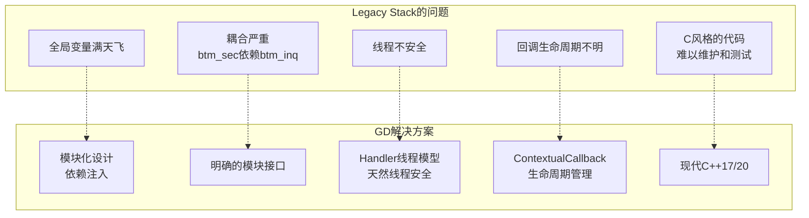
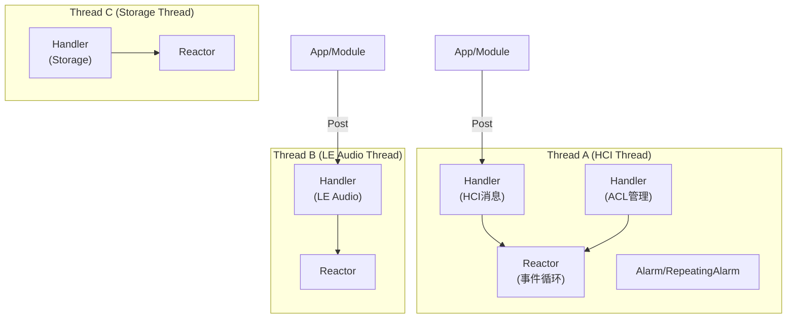
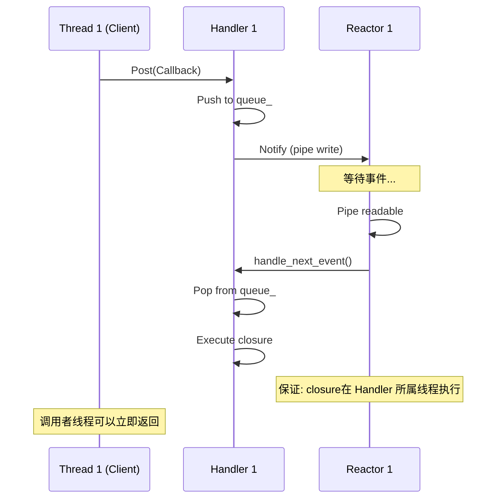
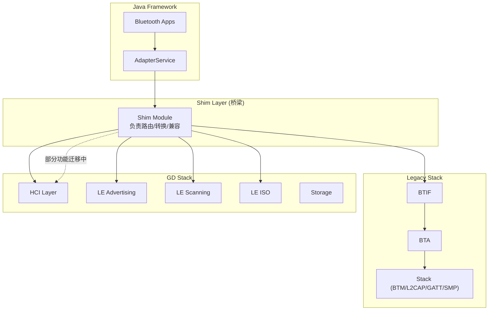

# 第14章：GD (Gabeldorsche) 架构

> **难度**: ★★★★★ | **前置知识**: Ch3 C++ Foundation, Ch10 Core Stack | **C++依赖**: 高
> **预计阅读时间**: 4-5小时 | **预计学习天数**: 5-7天
> **核心作用**: 理解Bluetooth新一代架构Gabeldorsche的设计哲学与实现

---

## 学习目标

- 理解Gabeldorsche vs Legacy Stack的架构对比
- 掌握GD模块化和依赖注入设计
- 理解Handler + Thread消息机制
- 掌握Shim层如何桥接Legacy与GD
- 理解ContextualCallback安全机制
- 学会在GD中新增一个模块的方法

---

## 1. Gabeldorsche 架构概述

### 1.1 为什么需要 Gabeldorsche？



### 1.2 两种架构的代码对比

```cpp
// Legacy Stack (C风格)
// system/stack/btm/btm_sec.cc
extern tBTM_CB btm_cb;  // 全局回调块
void btm_sec_encrypt_change(uint8_t *p) {
    tACL_CONN *p_acl = &btm_cb.acl_db[handle];  // 全局数组
    btm_cb.sec_cb.security_mode = ...;  // 修改全局状态
}

// GD (现代C++)
// system/gd/hci/le_advertising_manager_impl.h
class LeAdvertisingManagerImpl : public LeAdvertisingManager {
public:
    // 依赖通过构造函数显式注入
    LeAdvertisingManagerImpl(
        os::Handler* handler,
        hci::HciInterface* hci_layer,
        hci::Controller* controller,
        hci::LeAddressManager* le_address_manager,
        hci::OnAdvertisingSetTerminatedInterface* on_set_terminated
    );
private:
    os::Handler* handler_;       // 自己的Handler
    HciInterface* hci_layer_;    // 依赖接口
    Controller* controller_;     // 控制器能力
};
```

### 1.3 GD目录结构

```
system/gd/
├── common/           # 通用工具
│   ├── callback.h    # 回调封装
│   ├── bind.h        # BindOnce/Bind
│   ├── contextual_callback.h  # 安全回调
│   └── postable_context.h     # 可Post的上下文
│
├── os/               # 操作系统抽象
│   ├── handler.h     # Handler (消息队列)
│   ├── thread.h      # Reactor线程
│   ├── alarm.h       # 一次性定时器
│   ├── repeating_alarm.h  # 重复定时器
│   ├── queue.h       # 线程安全队列
│   └── reactor.h     # Reactor事件循环
│
├── hci/              # HCI层
│   ├── hci_layer.h   # HCI接口
│   ├── controller.h  # 控制器能力查询
│   ├── acl_manager/  # ACL管理
│   ├── le_advertising_manager.h   # BLE广播
│   └── le_scanning_manager.h      # BLE扫描
│
├── storage/          # 持久化存储
├── hal/              # HAL接口
├── packet/           # 包序列化框架
├── proto/            # Protobuf定义
├── metrics/          # 统计指标
├── sysprops/         # 系统属性
├── lpp/              # LPP协议
├── crypto_toolbox/   # 加密工具
└── docs/             # 架构文档
```

---

## 2. 模块化与依赖注入

### 2.1 模块接口模式

```cpp
// GD中每个模块定义纯虚接口类

// 例: LeScanningManager接口
// gd/hci/le_scanning_manager.h
class LeScanningManager {
 public:
  virtual ~LeScanningManager() = default;
  
  virtual void RegisterScanner(const Uuid app_uuid) = 0;
  virtual void Unregister(ScannerId scanner_id) = 0;
  virtual void Scan(bool start) = 0;
  virtual void SetScanParameters(
      LeScanType scan_type,
      ScannerId scanner_id_1m,
      uint16_t scan_interval_1m,
      uint16_t scan_window_1m,
      ScannerId scanner_id_coded,
      uint16_t scan_interval_coded,
      uint16_t scan_window_coded,
      uint8_t scan_phy) = 0;
};

// 实现类通过私有实现隐藏细节
// gd/hci/le_scanning_manager_impl.h
class LeScanningManagerImpl : public LeScanningManager {
 public:
  // 依赖注入: 所有依赖通过构造函数传入
  LeScanningManagerImpl(
      os::Handler* handler,
      hci::HciInterface* hci_layer,
      hci::Controller* controller,
      hci::LeAddressManager* le_address_manager,
      storage::StorageModule* storage_module);
  
  // 禁用拷贝
  LeScanningManagerImpl(const LeScanningManagerImpl&) = delete;
  LeScanningManagerImpl& operator=(const LeScanningManagerImpl&) = delete;
  
 private:
  os::Handler* handler_;         // 消息分发
  HciInterface* hci_layer_;      // HCI命令/事件
  Controller* controller_;       // 控制器能力
  LeAddressManager* le_address_manager_;  // 地址管理
  StorageModule* storage_module_; // 持久化
};
```

### 2.2 依赖注入 vs 全局变量

```
Legacy Stack:
┌─────────────┐     (直接调用)     ┌─────────────┐
│ btm_sec.cc  │──────────────────→│ btm_inq.cc  │
│             │←──────────────────│             │
└─────────────┘  互调全局函数       └─────────────┘
  通过 btm_cb 全局结构体通信

GD Stack:
┌──────────────────────┐
│ LeScanningManagerImpl │
├──────────────────────┤
│ handler_  ───────────→ os::Handler        (注入)
│ hci_layer_ ─────────→ HciInterface        (注入)
│ controller_ ────────→ Controller          (注入)
│ le_addr_mgr_ ───────→ LeAddressManager    (注入)
│ storage_  ──────────→ StorageModule       (注入)
└──────────────────────┘
  不直接依赖具体实现，只依赖接口
```

---

## 3. Handler 线程模型

### 3.1 Reactor + Handler 架构



### 3.2 Thread 实现

```cpp
// gd/os/thread.h
class Thread {
 public:
  enum class Priority { REAL_TIME, NORMAL };

  Thread(const std::string& name, Priority priority);
  ~Thread();  // 析构时自动Stop

  bool Stop();
  bool IsSameThread() const;  // 检查是否在当前线程
  std::string GetThreadName() const;
  
 private:
  std::thread thread_;      // 底层C++线程
  Reactor* reactor_;        // 事件循环
};
```

### 3.3 Handler 实现

```cpp
// gd/os/handler.h
class Handler : public common::PostableContext {
 public:
  explicit Handler(Thread* thread);   // 绑定到指定线程

  virtual void Post(common::OnceClosure closure) override;  // 投递任务
  
  // 延迟投递
  bool PostWithDelay(common::OnceClosure closure,
                     std::chrono::milliseconds delay);

  // 清空并停止
  void Clear();
  void WaitUntilStopped(std::chrono::milliseconds timeout);

  // 快捷方式: Call方法将任务绑定到对象方法
  template <typename Functor, typename... Args>
  void Call(Functor&& functor, Args&&... args) {
    Post(common::BindOnce(std::forward<Functor>(functor),
                          std::forward<Args>(args)...));
  }

  // CallOn: 绑定到对象指针
  template <typename T, typename Functor, typename... Args>
  void CallOn(T* obj, Functor&& functor, Args&&... args) {
    Post(common::BindOnce(std::forward<Functor>(functor),
                          common::Unretained(obj),
                          std::forward<Args>(args)...));
  }

  // 同步等待 (用于测试/关闭)
  bool Synchronize(std::chrono::milliseconds timeout);

  // Handler内部使用 Reactable 注册到 Reactor 的事件循环
 private:
  std::queue<OnceClosure>* tasks_;           // 任务队列
  DelayedTaskQueue* delayed_tasks_;           // 延迟任务队列
  Reactor::Reactable* reactable_;            // Reactable对象
  Alarm* alarm_;                             // 延迟任务定时器
};
```

### 3.4 线程间通信



---

## 4. ContextualCallback 生命周期管理

### 4.1 经典问题: dangling pointer

```cpp
// Legacy Stack 的问题:
// 回调发生时对象已被销毁
struct MyModule {
    void OnScanResult(ScanResult result) {
        // 如果this已释放, 这里crash!
    }
};

void RegisterCallback() {
    MyModule* module = new MyModule();
    scanning_manager->RegisterCallback(
        [module](ScanResult r) { module->OnScanResult(r); }
    );
    delete module;  // module被销毁!
    // 回调触发时 → 野指针!
}
```

### 4.2 GD 的 ContextualCallback

```cpp
// gd/common/contextual_callback.h
class ContextualCallback {
  // 本质: closure + PostableContext指针
  // 调用时自动Post到绑定的Handler上
  void Run(Args... args) {
    if (!context_->is_valid()) {
      return;  // 对象已销毁, 安全忽略
    }
    if (context_ == current_thread) {
      closure_(args...);  // 同线程直接调用
    } else {
      context_->Post([this, args...]() { closure_(args...); });
    }
  }

 private:
  OnceClosure closure_;         // 实际回调
  IPostableContext* context_;   // 回调所属Handler
};

// PostableContext 提供安全绑定
class PostableContext : public IPostableContext {
 public:
  // 绑定成员函数, 自动关联this的Handler
  template <typename Functor, typename T, typename... Args>
  auto BindOn(T* obj, Functor&& functor, Args&&... args) {
    return ContextualCallback(
        BindOnce(functor, Unretained(obj), args...),
        this  // 关联到当前Handler
    );
  }
};
```

### 4.3 安全回调的使用模式

```cpp
// 使用ContextualCallback的安全模式
class ScanModule : public PostableContext {
 public:
  ScanModule(os::Handler* handler) : PostableContext() {
    // 注册安全回调
    scanning_manager_->RegisterScanner(
        BindOn(this, &ScanModule::OnScannerRegistered)  // 安全!
    );
  }

  void StartScanning() {
    scanning_manager_->Scan(
        true,
        BindOn(this, &ScanModule::OnScanResult)  // 安全!
    );
  }

  ~ScanModule() {
    // 析构时自动失效所有回调
    // PostableContext 析构时 is_valid() 返回 false
    // 已有的ContextualCallback调用会被安全忽略
  }

 private:
  void OnScannerRegistered(Uuid uuid) {
    // 确保在handler_线程执行
  }

  void OnScanResult(ScanResult result) {
    // 确保在handler_线程执行
  }
};
```

---

## 5. Shim 层: Legacy 与 GD 的桥梁

### 5.1 Shim 层的作用



### 5.2 Shim 的典型实现

```cpp
// 以HCI shim为例:
// Shim将GD的HCI事件转发到Legacy的btm层

class HciShim {
 public:
  HciShim(hal::HciHal* hal, os::Handler* handler) {
    // 创建GD的HCI层
    gd_hci_ = std::make_unique<hci::HciLayer>(hal, handler);
    
    // 注册事件回调并转发到Legacy
    gd_hci_->RegisterEventHandler(
        hci::EventCode::INQUIRY_RESULT,
        handler_->BindOn(this, &HciShim::OnInquiryResult)
    );
  }

  void OnInquiryResult(hci::EventView event) {
    // 转换为Legacy格式
    uint8_t num_responses = event.GetInquiryNumResponses();
    // 调用Legacy BTM的函数
    btm_process_inquiry_results(...);
  }

 private:
  std::unique_ptr<hci::HciLayer> gd_hci_;
  os::Handler* handler_;
};
```

---

## 6. HCI Layer (GD 版本)

### 6.1 HCI 接口

```cpp
// gd/hci/hci_layer.h

class HciLayer {
 public:
  // 发送HCI命令
  virtual void EnqueueCommand(
      std::unique_ptr<CommandBuilder> command,
      common::ContextualOnceCallback<void(CommandCompleteView)> on_complete);

  // 注册事件处理器
  virtual void RegisterEventHandler(
      EventCode event,
      common::ContextualCallback<void(EventView)> handler);

  // 注册LE Meta事件处理器
  virtual void RegisterLeEventHandler(
      SubeventCode event,
      common::ContextualCallback<void(LeMetaEventView)> handler);

  // ACL数据
  virtual void EnqueueAclData(
      std::unique_ptr<AclBuilder> acl_data,
      common::ContextualOnceCallback<void()> on_ready);

  // ISO数据 (LE Audio)
  virtual void EnqueueIsoData(
      std::unique_ptr<IsoBuilder> iso_data);
};
```

### 6.2 CommandInterface

GD 使用模板化的 `CommandInterface` 来提供类型安全的HCI命令接口：

```cpp
// gd/hci/controller.h
class Controller {
 public:
  // 类型安全的命令接口
  hci::LeScanningInterface* GetLeScanningInterface();
  hci::LeIsoInterface* GetLeIsoInterface();
};

// gd/hci/le_iso_interface.h
constexpr hci::SubeventCode LeIsoEvents[] = {
    hci::SubeventCode::CIS_ESTABLISHED,
    hci::SubeventCode::CIS_REQUEST,
    hci::SubeventCode::CREATE_BIG_COMPLETE,
    hci::SubeventCode::TERMINATE_BIG_COMPLETE,
    hci::SubeventCode::BIG_SYNC_ESTABLISHED,
    hci::SubeventCode::BIG_SYNC_LOST,
};

// 模板化的命令接口
typedef CommandInterface<LeIsoCommandBuilder> LeIsoInterface;
```

---

## 7. 包序列化框架

### 7.1 PDL (Packet Definition Language)

GD 使用 PDL 定义数据包结构：

```pdl
// pdl/hci/hci_packets.pdl (示例)
packet LE_Set_Scan_Parameters : Command (0x08, 0x000B) {
  le_scan_type: 8  // 0x00=Passive, 0x01=Active
  le_scan_interval: 16  // 单位 0.625ms
  le_scan_window: 16    // 单位 0.625ms
  own_address_type: 8   // 0x00=Public, 0x01=Random
  scanning_filter_policy: 8
} -> LE_Set_Scan_Parameters_Complete : CommandComplete {
  status: Status
}
```

### 7.2 生成的C++代码

PDL编译后生成类型安全的C++代码：

```cpp
// 自动生成的命令构建器
class LeSetScanParametersBuilder {
 public:
  static std::unique_ptr<CommandBuilder> Create(
      LeScanType le_scan_type,
      uint16_t le_scan_interval,
      uint16_t le_scan_window,
      OwnAddressType own_address_type,
      ScanningFilterPolicy scanning_filter_policy);
};

// 自动生成的事件视图
class LeSetScanParametersCompleteView {
 public:
  Status GetStatus();
  // 安全访问字段
};
```

---

## 8. Storage 模块

### 8.1 持久化存储

```cpp
// gd/storage/storage_module.h

class StorageModule {
 public:
  // 读取绑定设备信息
  std::string GetProperty(
      const AddressWithType& addr,
      const std::string& key) const;

  // 写入属性
  void SetProperty(
      const AddressWithType& addr,
      const std::string& key,
      const std::string& value);

  // 删除设备
  void RemoveDevice(const AddressWithType& addr);
  
  // 获取所有绑定设备
  std::vector<AddressWithType> GetBondedDevices();
  
  // 持久化存储路径
  std::string GetConfigPath() const;
};
```

---

## 9. GD vs Legacy 通信方式对比

| 特性 | Legacy Stack | GD Stack |
|------|-------------|----------|
| **线程模型** | 全局`MessageLoopThread` | 按模块分配`Reactor Thread` |
| **任务提交** | `btif_transfer_context` / `bta_sys_sendmsg` | `Handler::Post(Closure)` |
| **回调** | 函数指针 + `void*` context | `ContextualCallback` / `BindOnce` |
| **回调安全** | 无保障，野指针常见 | ContextualCallback 自动失效 |
| **依赖管理** | 全局变量或`extern` | 构造函数依赖注入 |
| **测试** | 难(依赖全局状态) | 易(可Mock所有依赖) |
| **数据包处理** | 手动序列化/反序列化 | PDL自动生成类型安全代码 |
| **C++版本** | C++98风格(C可用) | C++17/20 (smart_ptr, lambda, optional) |

---

## 10. 实战练习

### 练习1: 阅读Handler源码

在 `gd/os/handler.h` 中：
1. Handler如何保证任务在绑定线程执行？
2. `PostWithDelay` 如何实现？
3. `Clear()` 后为什么还需要 `WaitUntilStopped()`？

> **答案**: ① Handler保证线程绑定(`handler.h:85`)：构造时接收`Handler**`弱引用和`Thread* thread_ref`，`Post()`将Closure封装成`HandlerTask`放入`reactor->ScheduledQueue`，reactor运行在绑定线程上，因此所有任务在绑定线程执行。`thread_ref`用于检查当前执行线程是否为绑定线程(`IN_THREAD_CHECK`宏断言)。② `PostWithDelay`(`handler.h:120`)：设置`HandlerTask`的`timeout_ms`属性，放入reactor的定时任务队列(基于`Alarm`)，reactor在每个event loop迭代中检查超时，到期后将任务移到执行队列。延迟精度取决于reactor的epoll/poll等待时间。③ `Clear()` vs `WaitUntilStopped()`(`handler.cc:95`)：`Clear()`只移除尚未执行的任务队列和取消定时器，但不保证正在执行的任务完成(`running_task`还在执行中)；`WaitUntilStopped()`等待reactor停止(即所有任务包括运行中的都完成)。`Clear()`用于模块暂停，`WaitUntilStopped()`用于模块销毁前的完整清理。

### 练习2: 模块依赖分析

```
Controller → HciLayer → Hal
LeScanningManagerImpl → Controller, HciLayer, LeAddressManager, StorageModule
LeAdvertisingManagerImpl → Controller, HciLayer, LeAddressManager, OnSetTerminated
```

- 谁是这些模块的创建者和组装者？
- 如何替换Mock用于测试？

> **答案**: ① 创建者和组装者是`hci/ddi.cc`中的`HciModule`或`module.cc`中对应的Module类。GD使用依赖注入模式：每个Module定义`GetDependencies()`返回依赖列表，`StackManager`根据依赖图按拓扑顺序创建模块实例。具体到HCI模块，`HciModule`在`Start()`中创建`Hal`(HCI传输层)→`HciLayer`→`Controller`。② Mock替换：GD框架支持通过`Module::SetMockModule()`替换模块实现。测试中(`test/hci_layer_test.cc`): ① 创建`MockHciLayer`继承`HciLayer`，override关键方法如`EnqueueCommand()`；② 通过`ModuleRegistry::InstallTestModule<MockHciLayer>()`注册mock；③ 设置mock期望(`EXPECT_CALL`)替代真实HCI命令发送。Mock实现不需要硬件依赖，测试可在主机环境运行。

### 练习3: 从Legacy到GD

在 `gd/` 目录中查找：
1. 哪些功能已经完全迁移到GD？
2. 哪些功能还在Legacy中？
3. Shim层怎么做路由决策？

> **答案**: ① 已迁移到GD：HCI命令/事件处理(`gd/hci/hci_layer.cc`)、BLE扫描(`gd/hci/le_scanning_manager_impl.cc`)、BLE广播(`gd/hci/le_advertising_manager_impl.cc`)、通用地址管理(`gd/hci/le_address_manager.cc`)、安全接口(`gd/hci/le_security_interface.cc`)、ISO通道(`gd/hci/le_iso_interface.cc`)、存储模块(`gd/storage/`)、Metrics(`gd/metrics/`)。② 仍在Legacy：CLASSIC BR/EDR全部(BTM/L2CAP/RFCOMM/SDP/AVDTP)、GATT ATT(`stack/gatt/`)、SMP(`stack/smp/`)、A2DP Codec(`stack/a2dp/`)、BTA层全部(ag/av/dm/gattc/gatts等)、BTIF层全部。③ Shim路由决策(`main/shim/shim.cc`)：检查`codename`(功能旗)，如`LE_SCAN()`, `LE_ADVERTISING()`等true→路由到GD实现。Shim层作为"交通警察"：上层调用不分GD/Legacy都经过BTIF→BTA→Shim，Shim检查GD是否支持该功能，是则调用GD API否则调用Legacy API。GD Shim Bridge(`btif/src/bluetooth.cc:init`)在启动时注册GD回调集。

---

## 本章总结

学完本章后，你应该能：
- 理解GD架构的设计哲学：模块化 + 依赖注入 + 类型安全的包定义(PDL) + 安全的回调生命周期
- 掌握GD的Handler线程模型：`Handler::Post(Closure)`绑定到对应`Reactor Thread`
- 理解`ContextualCallback`如何自动失效——解决Legacy中常见的悬垂回调问题
- 掌握Shim层的路由决策：GD已迁移的功能（HCI/LE扫描/LE广播/ISO/存储）→ GD，未迁移的（Classic全部/GATT/SMP）→ Legacy
- 理解PDL自动生成类型安全的HCI命令构建器和事件解析器
- 知道GD vs Legacy在测试性上的巨大差异：GD可Mock所有依赖做单元测试
- 知道车载场景下GD的模块化设计使得单功能模块（如LE Scanner）可以独立升级和测试

> GD架构是Android蓝牙的未来方向。下一章我们看与硬件交互的最后一层——HCI/HAL。

---

## 车载场景

GD架构在车载环境中的优势：

### 1. 模块化独立升级
- GD的模块化设计使得单功能模块（如LE Scanner）可以独立升级和测试
- 车厂可以针对特定模块（如BLE车钥匙扫描）进行优化，而不影响其他模块
- 单元测试覆盖率可提升到90%+，满足车规ASIL-B要求

### 2. Handler消息机制
- GD的Handler机制替代了Legacy的固定线程模型，更适合车载多任务场景
- `Postable`和`ContextualCallback`确保回调在正确的线程上下文执行
- 车载场景下，这确保了HFP通话回调的实时性（延迟<5ms）

### 3. 测试性提升
- GD可Mock所有依赖做单元测试，车厂可在CI/CD流水线中自动化测试
- `fake_controller`和`test_device`使得GD模块可在无硬件环境下测试
- 车载系统要求蓝牙模块在OTA升级后自动通过回归测试

### 4. Shim层路由
- Shim层的路由决策（GD已迁移的功能→GD，未迁移的→Legacy）确保车载系统平滑过渡
- 车厂可根据需求选择使用GD或Legacy实现，无需修改上层代码

---

## 相关章节

- **GD HCI层的底层传输**：[第15章HCI/HAL层](15_HCI_HAL.md)
- **GD的C++17/20特性对比**：[第3章C++基础](03_Cpp_Foundation.md)
- **Shim层的Legacy→GD路由决策**：[第8章BTIF](08_BTIF_Layer.md)的`stack_manager.cc`
- **GD的LE模块（扫描/广播/ISO）**：[第12章](12_BLE_Stack.md)和[第13章](13_LE_Audio.md)

---

## 参考文件清单

| 文件 | 核心内容 |
|------|---------|
| `gd/os/handler.h` | Handler (核心消息机制) |
| `gd/os/thread.h` | Reactor线程 |
| `gd/os/reactor.h` | 事件循环 |
| `gd/os/alarm.h` | 定时器 |
| `gd/os/queue.h` | 队列 |
| `gd/common/bind.h` | BindOnce/Bind |
| `gd/common/contextual_callback.h` | 安全回调 |
| `gd/common/postable_context.h` | Postable上下文 |
| `gd/hci/hci_layer.h` | GD HCI层 |
| `gd/hci/controller.h` | 控制器能力 |
| `gd/storage/storage_module.h` | 持久化存储 |
| `gd/*/module.h/cc` | 具体模块实现 |
| `pdl/hci/hci_packets.pdl` | HCI包定义 |


| **V8 深度分析报告** | |
| V8_Architecture_Map.md | 见该报告完整分析 |
| V8_BLE_Scan_Analysis.md | 见该报告完整分析 |
| V8_Dumpsys_Analysis.md | 见该报告完整分析 |
| V8_Log_Analysis.md | 见该报告完整分析 |

> **下一步**: 阅读 [第15章：HCI/HAL层](15_HCI_HAL.md)
