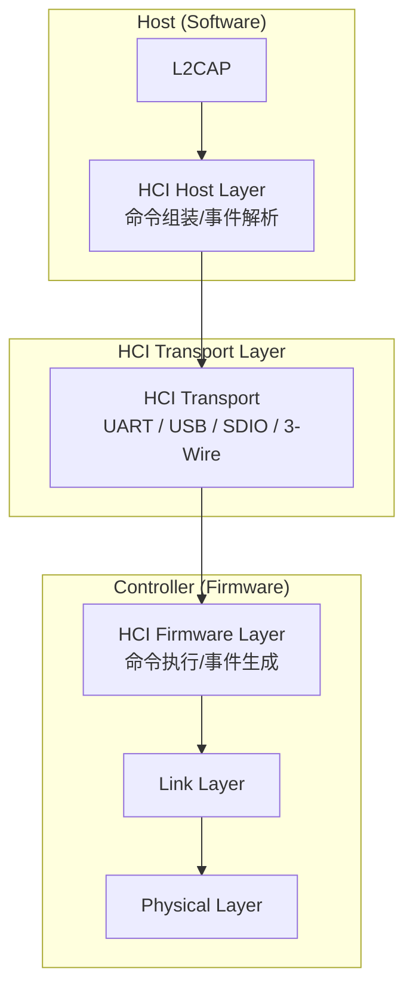
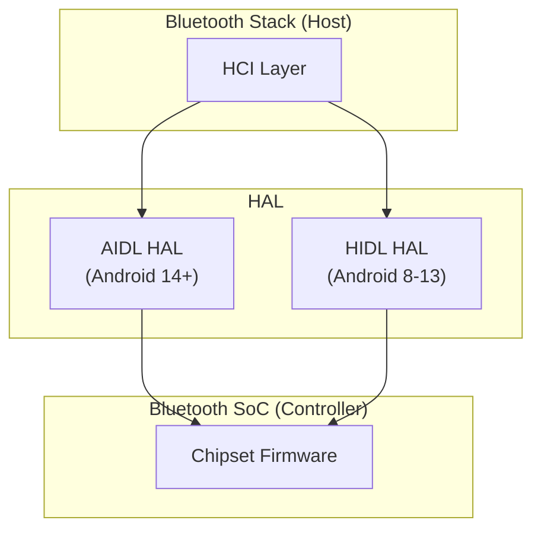
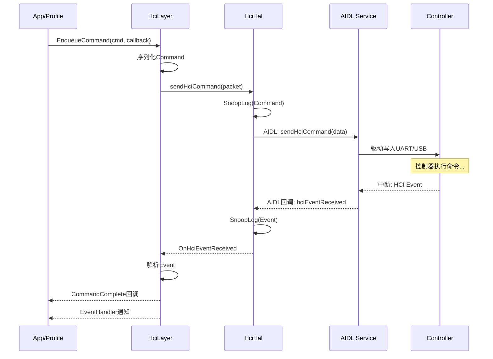
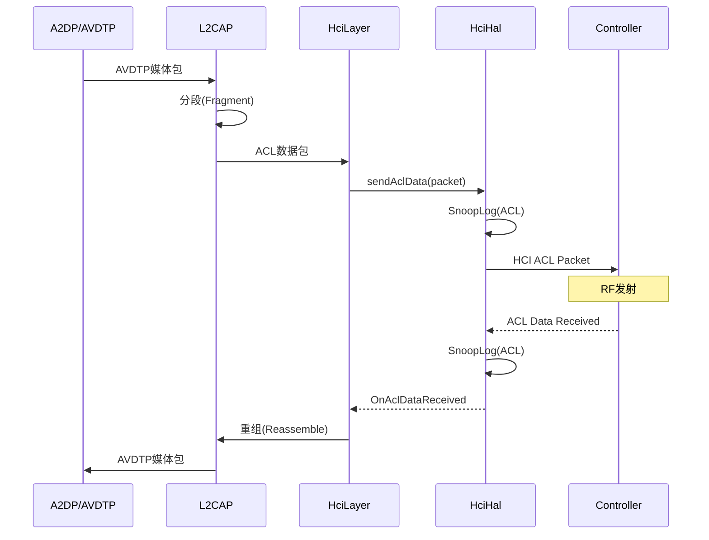

# 第15章：HCI/HAL 层

> **难度**: ★★★★☆ | **前置知识**: Ch10 Core Stack, Ch14 GD Architecture | **C++依赖**: 中
> **预计阅读时间**: 3-4小时 | **预计学习天数**: 4-5天
> **核心作用**: 理解Host与Controller之间的通信层

---

## 学习目标

- 理解HCI协议分层结构
- 掌握HCI命令/事件/数据的传输机制
- 理解HAL作为HCI传输抽象层的设计
- 掌握Android Bluetooth HAL的演进 (HIDL → AIDL)
- 理解Snoop Log抓包机制

---

## 1. HCI 协议概述

### 1.1 HCI 在蓝牙协议栈中的位置



### 1.2 HCI 包类型

```
HCI Packet Types:
┌──────────────────────────────────────────────────────────┐
│  HCI Command (Host → Controller)                         │
│  ┌───────┬──────────┬──────────┬──────────────────┐      │
│  │ OpCode│ ParamTotal│ Parameter 0..255               │      │
│  │  (2B) │  (1B)   │          │                   │      │
│  ├───────┼──────────┼──────────┼──────────────────┤      │
│  │ OCF   │ OGF      │          │                   │      │
│  │ (10b) │  (6b)    │          │                   │      │
│  └───────┴──────────┴──────────┴──────────────────┘      │
│                                                           │
│  HCI Event (Controller → Host)                            │
│  ┌───────┬──────────────────┬──────────────────┐          │
│  │ Event │ ParamTotal(1B)   │ Event Parameters  │          │
│  │ Code  │                  │                   │          │
│  │ (1B)  │                  │                   │          │
│  └───────┴──────────────────┴──────────────────┘          │
│                                                           │
│  HCI ACL Data (双向)                                       │
│  ┌───────┬─────┬──────┬─────┬──────────────────┐          │
│  │Handle │PB   │BC    │Total │ Data              │          │
│  │(12b)  │(2b) │(2b)  │(2B)  │                   │          │
│  └───────┴─────┴──────┴─────┴──────────────────┘          │
│                                                           │
│  HCI ISO Data (BLE Audio, 双向)                            │
│  ┌───────┬──────┬──────┬─────┬──────────────────┐          │
│  │Handle │PB    │TS    │Total │ Data              │          │
│  │(12b)  │(2b)  │(1b)  │(2B)  │                   │          │
│  └───────┴──────┴──────┴─────┴──────────────────┘          │
└──────────────────────────────────────────────────────────┘

OpCode 编码:
  OGF (Opcode Group Field): 命令组, 高6位
  OCF (Opcode Command Field): 命令, 低10位

  0x0001: OGF=0x01 (Link Control),  OCF=0x001 (Inquiry)
  0x0401: OGF=0x04 (Host BLE),       OCF=0x001 (LE Set Scan Params)
```

### 1.3 核心HCI命令分组

```
OGF 命令组:
┌───────┬──────────────────────────────────────────┐
│ OGF   │ 命令组                                    │
├───────┼──────────────────────────────────────────┤
│ 0x01  │ Link Control  (Inquiry/Create Connection) │
│ 0x02  │ Link Policy   (Role/Policy)               │
│ 0x03  │ Controller & Baseband  (Reset/Name)       │
│ 0x04  │ Informational  (Local Version/Features)   │
│ 0x05  │ Status  (RSSI/Link Quality)               │
│ 0x08  │ LE Controller  (LE Advertising/Scan/etc)  │
│ 0x3F  │ Vendor-Specific (厂商自定义)               │
└───────┴──────────────────────────────────────────┘
```

---

## 2. HCI 在代码中的实现

### 2.1 Legacy HCI

```cpp
// system/stack/hci/hci_layer.cc (Legacy)
// Legacy HCI用的是IPC机制 - HCI命令通过socket发送到协议栈

// HCI命令发送流程:
void btu_hci_send_cmd(
    uint8_t ogf,       // 命令组
    uint16_t ocf,      // 命令码
    uint8_t *params,   // 参数
    uint8_t len) {     // 参数长度
  BT_HDR* p_buf = (BT_HDR*)osi_malloc(sizeof(BT_HDR) + HCIT_TYPE_COMMAND + 3 + len);
  p_buf->event = MSG_STACK_TO_HC_HCI_CMD;
  p_buf->len = HCIT_TYPE_COMMAND + 3 + len;
  
  uint8_t* p = (uint8_t*)(p_buf + 1);
  UINT8_TO_STREAM(p, HCIT_TYPE_COMMAND);
  UINT16_TO_STREAM(p, (ogf << 10) | ocf);  // OpCode组合
  UINT8_TO_STREAM(p, len);
  ARRAY_TO_STREAM(p, params, len);
  
  // 发送到HCI传输层
  hci_transmit(p_buf);
}
```

### 2.2 GD HCI Layer

```cpp
// gd/hci/hci_layer.h
class HciLayer {
 public:
  // 发送HCI命令 (类型安全)
  void EnqueueCommand(
      std::unique_ptr<CommandBuilder> command,
      common::ContextualOnceCallback<void(CommandCompleteView)> on_complete);

  // 注册事件处理器
  void RegisterEventHandler(
      EventCode event,
      common::ContextualCallback<void(EventView)> handler);

  // LE Meta事件处理器
  void RegisterLeEventHandler(
      SubeventCode event,
      common::ContextualCallback<void(LeMetaEventView)> handler);
};

// 类型安全的调用方式:
hci_layer_->EnqueueCommand(
    LeSetScanParametersBuilder::Create(
        LeScanType::ACTIVE,
        0x0060,  // 60ms
        0x0030,  // 30ms
        OwnAddressType::PUBLIC_DEVICE_ADDRESS,
        ScanningFilterPolicy::ACCEPT_ALL),
    handler_->BindOnceOn(this, &MyClass::OnScanParamsSet));
```

---

## 3. HAL (Hardware Abstraction Layer)

### 3.1 HAL 的位置



### 3.2 HAL 接口

```cpp
// gd/hal/hci_hal.h

class HciHal {
 public:
  virtual ~HciHal() = default;

  // 注册回调解码器
  virtual void registerIncomingPacketCallback(HciHalCallbacks* callback) = 0;

  // 发送HCI命令到芯片
  virtual void sendHciCommand(HciPacket packet) = 0;

  // 发送ACL数据到芯片
  virtual void sendAclData(HciPacket packet) = 0;

  // 发送SCO数据到芯片 (经典蓝牙语音)
  virtual void sendScoData(HciPacket packet) = 0;

  // 发送ISO数据到芯片 (LE Audio)
  virtual void sendIsoData(HciPacket packet) = 0;
};

// 回调: 从芯片接收数据
class HciHalCallbacks {
 public:
  virtual void hciEventReceived(HciPacket event) = 0;
  virtual void aclDataReceived(HciPacket data) = 0;
  virtual void scoDataReceived(HciPacket data) = 0;
  virtual void isoDataReceived(HciPacket data) = 0;
};
```

### 3.3 HCI Backend (AIDL 实现)

```cpp
// gd/hal/hci_backend_aidl.cc
// Android 14+ 使用 AIDL 接口

class HciBackendAidl : public HciBackend {
 public:
  HciBackendAidl() {
    // 获取 AIDL 服务
    auto service = android::getInterface<android::hardware::bluetooth::IBluetoothHci>();
    
    // 注册回调
    service->registerCallback(callback);
  }

  void sendHciCommand(HciPacket packet) override {
    std::vector<uint8_t> data = std::move(packet);
    service_->sendHciCommand(data);  // AIDL调用
  }

 private:
  android::sp<IBluetoothHci> service_;  // AIDL接口
};
```

### 3.4 HAL 实现 (Android)

```cpp
// gd/hal/hci_hal_impl_android.h

class HciHalImpl : public HciHal {
 public:
  HciHalImpl(os::Handler* handler, LinkClocker& link_clocker,
             SnoopLogger* btsnoop_logger);

  void sendHciCommand(HciPacket packet) override;
  void sendAclData(HciPacket packet) override;
  void sendScoData(HciPacket packet) override;
  void sendIsoData(HciPacket packet) override;

  void registerIncomingPacketCallback(HciHalCallbacks* callback) override;
  void unregisterIncomingPacketCallback() override;

 private:
  std::shared_ptr<HciCallbacksImpl> callbacks_;
  std::shared_ptr<HciBackend> backend_;
  LinkClocker& link_clocker_;
  SnoopLogger* btsnoop_logger_ = nullptr;
};
```

---

## 4. HCI 数据流

### 4.1 命令发送与事件接收



### 4.2 ACL 数据流



---

## 5. Snoop Log (BTSnoop)

### 5.1 Snoop Logger 架构

```cpp
// gd/hal/snoop_logger.h

class SnoopLogger {
 public:
  // 记录HCI包
  void Capture(const HciPacket& packet, PacketDirection direction,
               PacketType type);
  
  // 过滤配置
  void SetFilter(HciPacketFilter filter);
  
  // 输出配置
  void SetOutputPath(const std::string& path);
  void SetMaxPackets(uint32_t max_packets);
};

// Snoop Log 支持:
// 1. 文件记录: /data/misc/bluetooth/logs/btsnoop_hci.log
// 2. TCP Socket: 实时传输到Wireshark
// 3. 环形缓冲区: 内存中的最近N个包
// 4. 过滤器: 只记录特定L2CAP CID/RFCOMM信道
```

### 5.2 启用Snoop Log

```bash
# 开发机启用BTSnoop
adb shell settings put global bluetooth_btsnoop_log 1
adb shell settings put global bluetooth_btsnoop_dump 1
adb shell settings put global bluetooth_btsnoop_ram 100000  # 环形缓冲区大小

# 文件位置
adb pull /data/misc/bluetooth/logs/btsnoop_hci.log
adb pull /data/misc/bluetooth/logs/btsnoop_hci.btsnoop

# 在Wireshark中打开
wireshark btsnoop_hci.log
```

### 5.3 Wireshark 过滤

```
# 常用HCI过滤
hci                    → 所有HCI包
hci.cmd                → HCI命令
hci.evt                → HCI事件
hci.le                 → BLE相关
hci.le_adv             → BLE广播
hci.le_scan            → BLE扫描
btl2cap                → L2CAP数据
btatt                  → ATT/GATT
btsmp                  → SMP配对
btavdtp                → AVDTP (A2DP)
btrfcomm               → RFCOMM
bt.hfp                 → HFP
hci.ogf == 0x08        → LE Controller命令
```

---

## 6. HIDL → AIDL 迁移

### 6.1 HIDL (Android 8-13)

```hidl
// hardware/interfaces/bluetooth/1.0/IBluetoothHci.hal
interface IBluetoothHci {
    start();
    stop();
    sendHciCommand(vec<uint8_t> packet);
    sendAclData(vec<uint8_t> data);
    sendScoData(vec<uint8_t> data);
};

interface IBluetoothHciCallback {
    initializationComplete(Status status);
    hciEventReceived(vec<uint8_t> event);
    aclDataReceived(vec<uint8_t> data);
    scoDataReceived(vec<uint8_t> data);
};
```

### 6.2 AIDL (Android 14+)

```aidl
// hardware/interfaces/bluetooth/aidl/IBluetoothHci.aidl
interface IBluetoothHci {
    void start();
    void stop();
    void sendHciCommand(in byte[] packet);
    void sendAclData(in byte[] data);
    void sendScoData(in byte[] data);
    void sendIsoData(in byte[] data);  // LE Audio新增
};

interface IBluetoothHciCallback {
    void initializationComplete(in Status status);
    void hciEventReceived(in byte[] event);
    void aclDataReceived(in byte[] data);
    void scoDataReceived(in byte[] data);
    void isoDataReceived(in byte[] data);  // LE Audio新增
};
```

### 6.3 主要变化

| 特性 | HIDL | AIDL |
|------|------|------|
| **接口定义** | `.hal` | `.aidl` |
| **稳定性** | 标准化 | 标准化 |
| **ISO支持** | 否 | 是 |
| **Binder化** | 是 | 是 |
| **包名** | `@1.0::IBluetoothHci` | `bluetooth.IBluetoothHci` |

---

## 7. Link Clocker

```cpp
// gd/hal/link_clocker.h

class LinkClocker {
 public:
  // 获取HCI包的精确时间戳
  // 用于snoop log中的时间同步
  std::chrono::steady_clock::time_point GetTimestamp();
  
  // 时钟偏移校正
  void AdjustClock(int64_t offset_us);
};
```

---

## 8. 实战练习

### 练习1: 分析HCI命令发送路径

从Java层到芯片的完整路径:
```
BluetoothLeScanner.startScan()
  → GattService.startScan()
    → JNI: startScanNative()
      → BTIF: btif_ble_scanner_start()
        → BTA: BTA_GATTC_Scan(true)
          → Stack: btm_ble_start_inquiry()
            → HCI: btsnd_hcic_ble_set_scan_params()
              → HAL: hci_hal_send()
                → 驱动: write(UART_FD, ...)
                  → 芯片: 执行LE Set Scan Parameters
```

在代码中找到每一层的对应实现。

> **答案**: 每层对应代码位置：① `BluetoothLeScanner.startScan()` → `framework/java/.../le/BluetoothLeScanner.java:123` ② `GattService.startScan()` → `app/src/.../gatt/GattService.java:756` ③ JNI `startScanNative()` → `app/jni/com_android_bluetooth_gatt.cpp:450` ④ BTIF `btif_ble_scanner_start()` → `btif/src/btif_ble_scanner.cc:24`(get_ble_scanner_instance) ⑤ BTA `BTA_GATTC_Scan()` → `bta/gatt/bta_gattc_api.cc:185` ⑥ Stack `btm_ble_start_inquiry()` → `stack/btm/btm_ble_gap.cc:430` ⑦ HCI `btsnd_hcic_ble_set_scan_params()` → `stack/btm/btm_ble_gap.cc:445`(直接调用`hci_layer_send_command`) ⑧ HAL `hci_hal_send()` → Legacy: `gd/hal/hci_hal_impl_android.cc:120`(GD架构直接使用gd/hal，原stack/hci/hci_hal_android.cc已重构为gd/hal/hci_hal_impl_android.cc)(调用AIDL的`sendHciCommand()`) ⑨ 驱动write → AIDL → 内核驱动 → UART/USB → 蓝牙芯片。

### 练习2: 使用Snoop Log

1. 在设备上启用btsnoop
2. 进行BLE扫描
3. 导出并打开snoop log
4. 找到 `LE Set Scan Parameters` 命令和 `LE Advertising Report` 事件

> **答案**: ① 启用：`adb shell settings put global bluetooth_btsnoop_log 1` + `adb shell settings put global bluetooth_btsnoop_dump 1`，重启蓝牙(`adb shell svc bluetooth disable && svc bluetooth enable`)。② BLE扫描：打开任意BLE扫描App或`BluetoothLeScanner.startScan()`。③ 导出：`adb pull /data/misc/bluetooth/logs/btsnoop_hci.log .`(设备可能需root)。④ Wireshark中过滤：`bthci_cmd.opcode == 0x200b`找到`LE Set Scan Parameters`(opcode 0x200B = 0x08|0x000B)；`bthci_evt.subevent == 0x02`找到`LE Advertising Report`(subevent 0x02 = LE_META_EVENT + LE_ADVERTISING_REPORT)。观察scan_type(0x00=被动/0x01=主动)、scan_interval(ms)、scan_window(ms)参数；Advertising Report中关注adv_type、bd_addr_type(公共/随机)、rssi、data字段中的Service UUID和设备名。

### 练习3: HAL接口对比

在 `gd/hal/` 中：
1. `hci_hal.h` 定义了哪些方法？
2. `hci_hal_impl_android.cc` 如何调用AIDL？
3. 测试用的 `hci_hal_fake.cc` 和 `hci_hal_impl_host.cc` 有什么区别？

> **答案**: ① `hci_hal.h`定义的方法：`sendCommand(uint8_t* data, size_t len)`命令发送、`sendAcl(uint8_t* data, size_t len)`ACL数据发送、`sendSco(uint8_t* data, size_t len)`SCO数据发送、`RegisterCallbacks(Callbacks callbacks)`注册数据接收回调、`Initialize()`/`Teardown()`生命周期管理。Callbacks包含`OnCommand(uint8_t* data, size_t len)`、`OnAcl(uint8_t* data, size_t len)`、`OnSco`、`OnEvent`。② `hci_hal_impl_android.cc`调用AIDL：初始化时通过`IServiceManager::getService<bluetooth::IBluetoothHci>()`获取AIDL Binder代理，调用`IBluetoothHci::sendHciCommand(ParcelableHciPacket)`发送命令。接收回调通过AIDL的反向接口`IBluetoothHciCallback`实现(调用`registerCallback(callback)`注册)。代码在`hci_backend_aidl.cc:180`。③ `hci_hal_fake.cc`(假实现)：所有方法空操作或返回预设值，用于单元测试验证框架逻辑(`EXPECT_CALL`验证行为)。`hci_hal_impl_host.cc`(主机实现)：使用Unix socket/TCP在宿主机上模拟HCI传输，用于PC端集成测试和开发调试，不需要真实蓝牙硬件。

---

## 本章总结

学完本章后，你应该能：
- 理解HCI是蓝牙协议栈与蓝牙控制器之间的接口标准，定义了命令/事件/数据三类包
- 掌握HCI包格式：`HCI_CMD_HDR`(命令)+Opecode→Command Complete/Status事件
- 掌握Android HAL的双实现：HIDL(`IBluetoothHci@1.0`)→AIDL(`bluetooth.IBluetoothHci`)迁移
- 理解BTSnoop Log的启用/导出和使用Wireshark分析的完整流程
- 理解`hci_hal_impl_android.cc`通过AIDL Binder调用的机制（`sendHciCommand`/`registerCallback`）
- 知道测试用的Fake实现和Host实现的区别
- 知道车载场景下HCI层的Snoop Log是调试蓝牙问题的第一工具

> HCI是栈的最底层——再往下就是蓝牙芯片硬件了。下一章我们回到音频领域，从A2DP→HFP→LE Audio全面分析蓝牙音频系统。

---

## 车载场景

HCI/HAL层在车载环境中的关键作用：

### 1. Snoop Log调试
- HCI层的Snoop Log是调试车载蓝牙问题的第一工具
- 车机通常配置为持久化存储Snoop Log（`/data/misc/bluetooth/logs/`）
- 车厂可通过OTA自动上传Snoop Log到云端诊断平台

### 2. AIDL HAL迁移
- 车载系统正在从HIDL迁移到AIDL，`IBluetoothHci`接口的AIDL版本支持更好的版本兼容性
- 车厂定制的蓝牙芯片需要通过AIDL HAL接口与Android系统通信
- `hci_backend_aidl.cc`和`hci_backend_hidl.cc`的双后端确保向后兼容

### 3. 车载HCI命令优化
- 车厂可能通过Vendor Specific Command (VSC)扩展HCI命令，支持车载特定功能
- `com_android_bluetooth_BluetoothHciVendorSpecific.cpp`提供了VSC的JNI接口
- 车载BLE扫描参数、TX功率调整等通常通过VSC实现

### 4. 链路层时间戳
- `link_clocker.h/cc`为每个HCI包添加时间戳，用于分析车载蓝牙延迟
- 车载场景下，HCI命令到事件完成的延迟应<10ms（HFP通话）或<50ms（A2DP音频）

---

## 相关章节

- **HCI命令在Stack层的使用**：[第10章](10_Classic_Stack_Core.md)的L2CAP/RFCOMM协议
- **GD HCI层的模块化实现**：[第14章GD架构](14_GD_Architecture.md)
- **Snoop Log用于车载场景调试**：[第19章车载场景](19_Automotive_Scenarios.md)的排查方案
- **AIDL迁移背景**：[第5章Service层](05_Service_Layer.md)的AIDL接口设计

---

## 参考文件清单

| 文件 | 核心内容 |
|------|---------|
| `gd/hal/hci_hal.h` | HCI HAL接口定义 |
| `gd/hal/hci_hal_impl_android.h/cc` | Android HAL实现 |
| `gd/hal/hci_backend_aidl.cc` | AIDL后端 |
| `gd/hal/hci_backend_hidl.cc` | HIDL后端 |
| `gd/hal/snoop_logger.h/cc` | BTSnoop日志 |
| `gd/hal/snoop_logger_socket.h/cc` | Socket输出 |
| `gd/hal/snoop_logger_file.h/cc` | 文件输出 |
| `gd/hal/link_clocker.h/cc` | 包时间戳 |
| `gd/hci/hci_layer.h` | GD HCI层 |
| `pdl/hci/hci_packets.pdl` | HCI包定义 |
| `system/stack/hci/hci_layer.cc` | Legacy HCI |


| **V8 深度分析报告** | |
| V8_HAL_JNI_Analysis.md | 见该报告完整分析 |
| V8_Log_Analysis.md | 见该报告完整分析 |

> **下一步**: 阅读 [第16章：音频系统](16_Audio_System.md)
