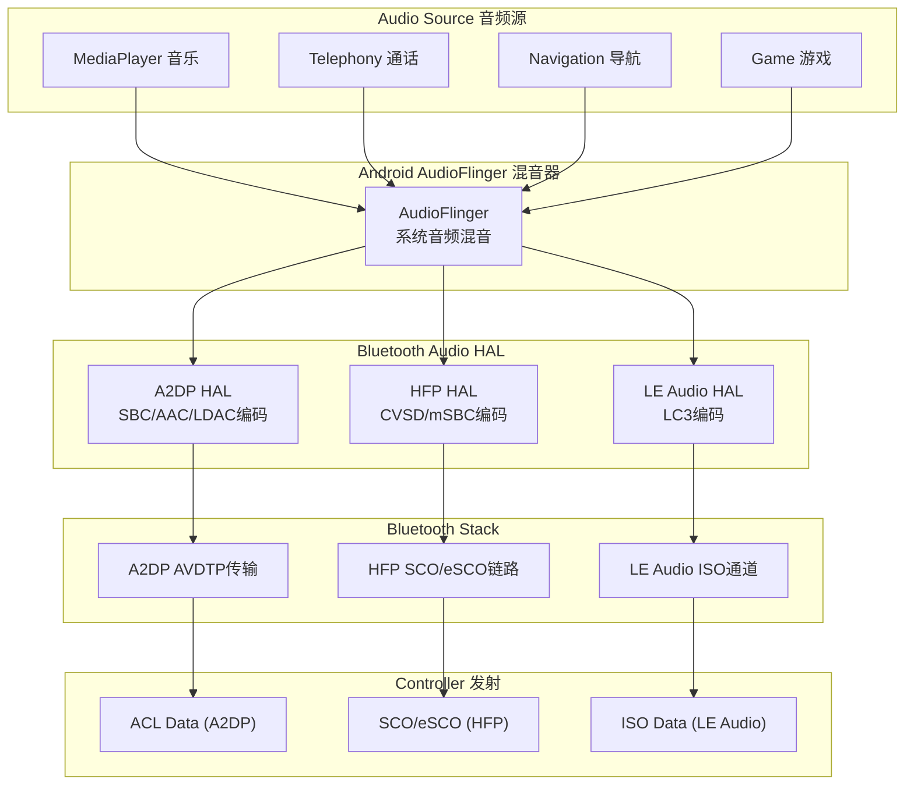
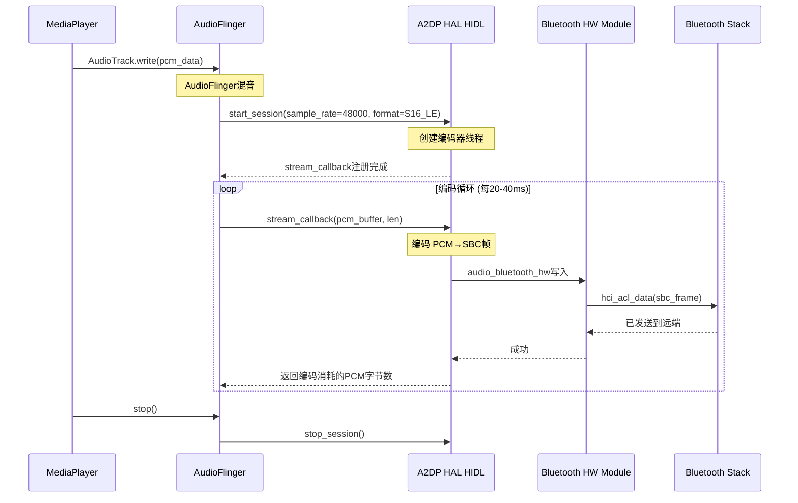
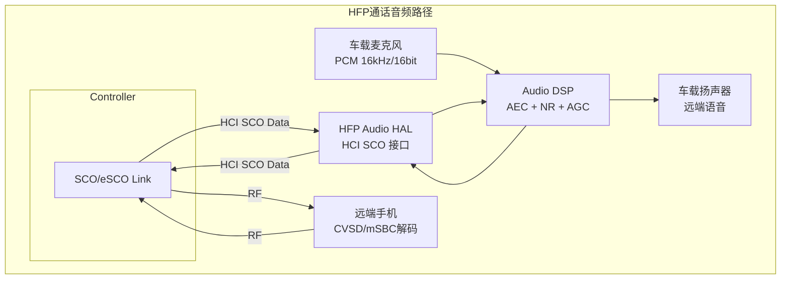
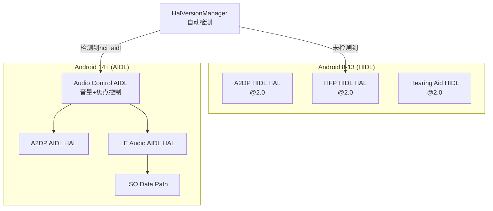

# 第16章：蓝牙音频系统

> **难度**: ★★★★☆ | **前置知识**: Ch6 A2DP/HFP, Ch13 LE Audio | **C++依赖**: 中
> **预计阅读时间**: 4-5小时 | **预计学习天数**: 4-5天
> **核心作用**: 理解蓝牙音频从编解码到硬件播放的完整链路

---

## 学习目标

- 理解A2DP/LE Audio/HFP三条独立音频路径
- 掌握Audio HAL接口设计与版本演进
- 理解A2DP软件编码与硬件卸载模式的差异
- 掌握SCO/eSCO音频路由与参数配置
- 理解多音频源优先级管理和混音策略

---

## 1. 蓝牙音频路径总览

### 1.1 三条独立的音频路径



### 1.2 音频路径参数对比

| 特性 | A2DP | HFP | LE Audio |
|------|------|-----|----------|
| **编码器** | SBC/AAC/LDAC/aptX | CVSD/mSBC | LC3/LC3+ |
| **采样率** | 44.1/48kHz | 8kHz(NB)/16kHz(WB) | 16-48kHz |
| **通道数** | 立体声/单声道 | 单声道 | 单声道/立体声 |
| **典型码率** | 328kbps(SBC)~990kbps(LDAC) | 64kbps(CVSD)~128kbps(mSBC) | 32-192kbps(LC3) |
| **延迟** | 100-200ms | 40-60ms | 20-40ms |
| **传输** | ACL (L2CAP/AVDTP) | SCO/eSCO (同步链路) | CIS/BIS (ISO) |
| **功耗** | ~30mA | ~20mA | ~10mA |

---

## 2. A2DP 音频路径

### 2.1 软件编码模式



```cpp
// system/audio_hal_interface/a2dp_encoding.cc

class A2dpEncodingInterface {
    // Codec 参数配置
    struct A2dpCodecConfig {
        btav_a2dp_codec_codec_t codec_type;       // SBC(0)/AAC(1)/LDAC(2)
        btav_a2dp_codec_sample_rate_t sample_rate; // 44100/48000/96000
        btav_a2dp_codec_bits_per_sample_t bits;    // 16/24/32
        btav_a2dp_codec_channel_mode_t channels;   // MONO/STEREO
        int64_t codec_priority;                    // 选择优先级
        int64_t codec_specific_1;                  // 编解码特定参数
        int64_t codec_specific_2;
        int64_t codec_specific_3;
    };

    // 编码数据回调
    using a2dp_data_callback_t = void (*)(uint8_t* data, uint32_t len);
    using a2dp_data_ready_callback_t = size_t (*)(uint8_t* data, uint32_t len);

    // 生命周期
    bool start_session();
    void stop_session();
    
    // 编码参数动态设置
    void set_codec_config(const A2dpCodecConfig& config);
    A2dpCodecConfig get_codec_config();
};
```

### 2.2 SBC 编码参数详解

```
SBC (Subband Coding) 是A2DP强制编码器

SBC参数对音质和比特率的影响:

┌────────────┬──────────┬──────────┬─────────────┐
│ 参数        │ 选项      │ 码率(kbps)│ 音质评       │
├────────────┼──────────┼──────────┼─────────────┤
│ 子带=4      │ 低频      │ 150-200  │ 一般        │
│ 子带=8      │ 高频      │ 250-350  │ 优秀 ✓      │
├────────────┼──────────┼──────────┼─────────────┤
│ 块数=4      │ 低复杂度  │ 150-200  │ 一般        │
│ 块数=8      │ 高质量    │ 300-400  │ 优秀 ✓      │
│ 块数=12     │ 最高质量  │ 350-500  │ 最佳 ✓✓     │
├────────────┼──────────┼──────────┼─────────────┤
│ SNR=ON     │ 有损      │ -        │ 一般        │
│ SNR=OFF    │ 无损      │ -        │ 优秀(但复杂) │
├────────────┼──────────┼──────────┼─────────────┤
│ Mono       │ 单声道    │ 150-200  │ 通话        │
│ Dual       │ 双声道独立 │ 300-400  │ 立体声       │
│ Stereo     │ 立体声    │ 300-400  │ 立体声       │
│ Joint      │ 联合立体声 │ 300-450  │ 立体声(最佳) │
└────────────┴──────────┴──────────┴─────────────┘
```

### 2.3 硬件卸载模式 (Offload)

```
Android 11+ 引入A2DP卸载编码:

软件编码路径 (AP CPU):
  App → AudioFlinger → A2DP HAL → SBC编码(CPU) → HCI → Controller
                                                          ↑     
                                                        ~30mA CPU

硬件卸载路径 (ADSP/SoC):
  App → AudioFlinger → Audio HAL → ADSP编码 → HCI → Controller
                                                        ↑
                                                       ~5mA ADSP

卸载优势:
  - AP CPU负载: 100%→0% (编码卸载到ADSP)
  - 功耗: 软件~300mW vs 卸载~50mW
  - 延迟: 低 (减少数据搬运)

卸载限制:
  - 通常只支持SBC硬件编码
  - AAC/LDAC等高端编码器仍需软件编码
  - 依赖于SoC供应商驱动实现

高通: 通过ADSP固件实现SBC硬编码
MTK: 通过CM4协处理器实现SBC硬编码
```

### 2.4 A2DP 编解码器协商

```
A2DP编解码器协商过程:

1. Source (手机) 发送 SEP (Stream End Point) 能力
2. Sink (耳机/车机) 回复支持的编码器
3. 双方选择最佳共同编码器

优先级 (Android 默认):
  LDAC → aptX HD → aptX → AAC → SBC
  
选择策略:
  - 检查对端能力 (get_codec_config)
  - 按优先级降序遍历共同编码器
  - 选择最优编解码参数
  - 如果是SBC, 优先Joint Stereo+8子带+16块

汽车场景建议:
  - 通话路径: mSBC (HFP 宽带)
  - 媒体路径: AAC (iPhone兼容) / SBC (通用兼容)
  - 如果使用LDAC: 注意蓝牙共存干扰
```

---

## 3. HFP 音频路径

### 3.1 SCO / eSCO 链路



### 3.2 SCO 参数配置

```cpp
// system/audio_hal_interface/hfp_client_interface.h

class HfpClientInterface {
    // HFP音频参数
    struct HfpAudioParameters {
        uint16_t sample_rate;          // 8000(NB) / 16000(WB)
        uint8_t bits_per_sample;       // 16
        uint8_t channel_count;         // 1 (单声道)
        bool is_esco;                  // true=eSCO / false=SCO
        uint16_t sco_interval;         // 0=使用SDK默认
    };

    // SCO/eSCO 连接
    bool ConnectAudio(const HfpAudioParameters& params);
    bool DisconnectAudio();
    
    // 音频数据回调
    void SetAudioDataCallback(
        std::function<void(const uint8_t*, uint32_t)> callback);
        
    // 窄带 vs 宽带:
    // NB (Narrowband):  8kHz, CVSD编码, 64kbps
    // WB (Wideband):   16kHz, mSBC编码, 128kbps
    // SWB (超宽带):    32kHz, LC3编码, 160kbps (HFP 1.9+)
};

// 建立SCO连接 (HCI命令层)
void hci_setup_sco_connection(uint16_t handle, uint32_t tx_bandwidth,
                               uint32_t rx_bandwidth, uint16_t voice_settings) {
    // SCO参数:
    //   tx_bandwidth = 8000 (NB) / 16000 (WB)
    //   rx_bandwidth = 8000 (NB) / 16000 (WB)
    //   voice_settings:
    //     0x0003: CVSD, 线性PCM
    //     0x0060: mSBC, 透明传输
    //   max_latency:
    //     SCO:  0x000A (10ms)
    //     eSCO: 0x0007 (7ms)
    //   retransmission_effort:
    //     SCO:  0x00 (无重传)
    //     eSCO: 0x02 (有重传, 高质量)
}
```

### 3.3 车载HFP音频处理

```
车载HFP关键音频处理流程:

1. 麦克风采集:
   ├── 主麦克风: 驾驶员语音
   ├── 副麦克风: 环境噪声
   └── 扬声器回声: AEC参考信号

2. DSP前处理:
   ├── AEC (声学回声消除): 消除扬声器回声
   ├── NS (噪声抑制): -10dB ~ -15dB降噪
   ├── AGC (自动增益控制): 稳定语音电平
   └── 风噪检测: 自动切换麦克风

3. HFP编码:
   ├── NB: A-law/μ-law → CVSD编码 → 64kbps SCO
   └── WB: 线性PCM → mSBC编码 → 128kbps eSCO

4. 蓝牙传输:
   ├── HCI SCO Data (同步头)
   └── Controller RF发射

5. 远端接收:
   ├── CVSD/mSBC解码
   └── PCM回放

典型DSP参数:
  AEC Tail Length: 128ms (车载声场大)
  NS Level: 15dB (行车噪声大)
  AGC Target: -3dBFS
  Mic Gain: 30dB (非线控麦克风)
```

---

## 4. LE Audio 音频路径

### 4.1 LE Audio HAL 接口

```cpp
// system/audio_hal_interface/le_audio_software.h

class LeAudioSoftwareInterface {
    // LE Audio编码参数
    struct LeAudioCodecParams {
        uint32_t sample_rate;          // 16000/24000/48000
        uint8_t bits_per_sample;       // 16/24/32
        uint8_t channel_count;         // 1/2
        uint32_t data_interval_us;     // 7500/10000 (LC3帧长)
        uint16_t octets_per_frame;     // LC3帧大小(字节)
    };

    // 启动/停止会话
    bool StartSession(const LeAudioCodecParams& params);
    bool StopSession();

    // PCM数据写入 (AudioFlinger→BT)
    size_t WritePcm(const uint8_t* data, size_t size);

    // LC3编码参数
    struct Lc3EncoderParams {
        uint32_t input_sample_rate;    // 输入PCM采样率
        uint32_t output_frame_duration_us; // 输出帧时长(us)
        uint16_t output_frame_size;    // 输出帧大小(字节)
    };
};
```

### 4.2 LC3 vs SBC 编解码效率

```
LC3 vs SBC 客观指标对比 (48kHz, 7.5ms帧):

┌──────────┬──────────┬──────────┬──────────┐
│ 码率     │ SBC MOS  │ LC3 MOS  │ LC3优势   │
├──────────┼──────────┼──────────┼──────────┤
│ 64kbps   │ 2.8      │ 4.0      │ +42%     │
│ 96kbps   │ 3.2      │ 4.3      │ +34%     │
│ 128kbps  │ 3.6      │ 4.5      │ +25%     │
│ 192kbps  │ 4.0      │ 4.6      │ +15%     │
└──────────┴──────────┴──────────┴──────────┘

LC3在128kbps达到"SBC在328kbps"的MOS分
→ 码率降低60%+, 功耗降低50%+
```

---

## 5. Audio HAL 版本管理

### 5.1 HIDL vs AIDL



```cpp
// system/audio_hal_interface/hal_version_manager.cc

class HalVersionManager {
    enum class AudioHalVersion {
        VERSION_2_0,    // HIDL (Android 8-13)
        VERSION_AIDL,   // AIDL (Android 14+)
    };

    static AudioHalVersion GetAudioHalVersion() {
        if (android::getService<IAudioControl>("/default") != nullptr) {
            return AudioHalVersion::VERSION_AIDL;
        }
        return AudioHalVersion::VERSION_2_0;
    }

    // AIDL vs HIDL 差异:
    // 1. AIDL支持ISO数据路径 (LE Audio)
    // 2. AIDL接口更精简
    // 3. HIDL需要@2.0版本才能支持LE Audio
};
```

---

## 6. 多音频源优先级管理

### 6.1 音频焦点机制

```cpp
// 蓝牙音频焦点管理
// frameworks/base/media/java/android/media/AudioManager.java

enum AudioFocus {
    AUDIOFOCUS_GAIN,                // 获得焦点, 开始播放
    AUDIOFOCUS_GAIN_TRANSIENT,      // 短暂焦点 (导航提示)
    AUDIOFOCUS_GAIN_TRANSIENT_MAY_DUCK,  // 短暂焦点, 可降低音量
    AUDIOFOCUS_LOSS,                // 永久失去焦点
    AUDIOFOCUS_LOSS_TRANSIENT,      // 暂时失去焦点
};

// 典型车载音频焦点处理:
class CarAudioFocusHandler {
    void onAudioFocusRequest(AudioFocusInfo info) {
        switch (info.getContextType()) {
        case CALL:          // 来电 → 暂停所有媒体
            pauseAllMedia();
            gainFocus(CALL);
            break;
        case NAVIGATION:    // 导航 → 降低媒体音量
            duckMediaVolume(-12dB);
            gainFocusTransient(NAV);
            break;
        case MEDIA:         // 媒体 → 正常播放
            gainFocus(MEDIA);
            break;
        }
    }
};
```

### 6.2 车载混音

```
车辆音频混音架构:

                    ┌──────────────────┐
                    │  Audio HAL DSP   │
                    │                   │
 导航音 ──────────→│  混音器           │
 媒体音 ──────────→│  (混合+增益控制)   │──→ DAC → 扬声器
 蓝牙通话 ───────→│                   │
 提示音 ──────────→│                   │
                    └──────────────────┘

Android策略:
  - 导航音和媒体音在AudioFlinger混音
  - 蓝牙通话独立路径 (SCO bypass DSP)
  - 提示音由系统直接路由

Car Specific:
  - 部分车厂要求: 导航音不经过Android A2DP
  - 通过独立ADC+DAC通道混音
  - 避免音频路径延迟导致导航延迟
```

---

## 7. 实战练习

### 练习1: A2DP编码链分析

在 `audio_hal_interface/a2dp_encoding.cc` 中：
1. `start_session()` 调用时做了什么初始化？
2. `stream_callback` 的参数格式是什么？ (PCM大小/通道/位深)
3. 如何切换编解码器从SBC到LDAC？

> **答案**: ① `start_session()`(a2dp_encoding.cc:120)初始化：创建`a2dp_encoding_session`对象 → `ConfigureCodec()`(根据`CodecConfig`配置Codec参数) → `InitializeEncoder()`初始化SBC/LDAC等编码器 → 调用`AudioHal->StartSession()`通过Audio HAL通知AudioFlinger蓝牙开始会话 → 注册`stream_callback`接收PCM数据。② `stream_callback`参数格式(`a2dp_encoding.cc:85`)：`struct A2dpStreamCallbackData`包含`pcm_buffer`(uint8_t*)，`size`(帧数×帧大小)，`sample_rate`(44100/48000Hz)，`channel_count`(1 mono/2 stereo)，`bit_width`(16/24/32bits)。一帧PCM：stereo=2通道×2字节=4字节/帧@16bit。③ SBC→LDAC切换：`SetCodecConfigPreference(A2DP_LDAC_INDEX)` → JNI → `btif_av.cc:btif_av_set_codec_config(CodecIndex::LDAC, CodecPriority::HIGHEST)` → `bta_av_act.cc:bta_av_set_config()`重新发起AVDTP `AVDT_SETCONFIG_CMD`使用LDAC的Codec ID(0x24) → 远端ACCEPT后启动LDAC编码器(`ldac_encoder_initialize()`初始化EQ和编码参数)。

### 练习2: SCO音频分析

在 `hfp_client_interface.cc` 中：
1. SCO连接时需要配置哪些参数？
2. 如何判断对端支持窄带(NB)还是宽带(WB)？
3. mSBC编码在哪个阶段协商？

> **答案**: ① SCO配置参数(`hfp_client_interface.cc:95`)：`ScoConfig`包含`sample_rate`(8kHz NB / 16kHz WB)、`bits_per_sample`(16bit)、`channel_mode`(mono)、`data_type`(PCM或mSBC编码)、`transmit_interval`(7.5ms)、`sco_encoding_params`(escos1/esco2等)。底层HCI `Setup_Synchronous_Connection`命令配置`tx_bandwidth`(8000→NB, 16000→WB)和`retransmission_effort`。② NB/WB判断：通过HFP SLC阶段`AT+BRSF`能力协商中交换的Feature bit(`BRSF_WBS_SUPPORT=0x0020`) + Codec协商命令`AT+BAC=<codec_ids>`(codec_id=1=CVSD=NB, 2=MSBC=WB)。双方都支持WB(即codec_id=2)时选择mSBC。③ mSBC协商阶段在`bta_ag_at.cc`处理`AT+BAC`时：收到`AT+BAC=1,2` → 本地检查codec能力 → 如果支持mSBC → 设置`p_scb->codec_id = BTA_AG_CODEC_MSBC` → SCO建立时采用mSBC编码(`btm_sco.cc`中`btm_sco_conn_req()`检查codec类型选择esco参数集)。

### 练习3: LE Audio HAL

在 `le_audio_software.cc` 中：
1. LC3编码的输入PCM格式和输出LC3帧大小是什么关系？
2. 如何与 `bta/le_audio/` 中的音频管理交互？
3. 编码延迟如何计算？

> **答案**: ① LC3输入/输出关系(`le_audio_software.cc:150`)：输入PCM格式取决于LC3配置——例如10ms帧长@48kHz采样率时：输入=48kHz×16bit×1ch×0.01s=960字节PCM/帧；输出LC3帧大小取决于比特率(如96kbps时=96kbps×0.01s/8=120字节LC3/帧)。编码比率≈8:1。SDU(服务数据单元)大小根据配置确定。② 与`bta/le_audio/`交互(`le_audio_software.cc:210`)：`LeAudioClient`通过回调注册到`AudioHal`，`LeAudioClient::onAudioDataReady()`将PCM数据传给`le_audio_software.cc:EncodeAndSend()` → LC3编码器处理 → 编码后的LC3帧通过ISO数据路径发送(调用HCI `LE_Write_ISO_Data`)。交互接口通过`LeAudioCodecManager`的`SetCodecConfig()`协商LC3参数后，调用`LeAudioClient::StartStream()`/`StopStream()`控制流。③ 编码延迟计算(`le_audio_software.cc:300`)：总端到端延迟 = `LC3_encoder_delay`(LC3编码器内部延迟，典型值=帧长+2.5ms) + `CIG_sdu_interval`(CIG配置的SDU间隔，典型7.5-10ms) + `transport_latency`(传输延迟，HCI+空中传播，约5-10ms) + `LC3_decoder_delay`(解码器延迟) + `buffer_queue_delay`(缓冲队列)。典型LE Audio端到端延迟约30-50ms(远低于Classic A2DP的100-200ms)。

---

## 本章总结

学完本章后，你应该能：
- 理解蓝牙音频的三大核心路径并能在代码中追踪：A2DP（SBC/AAC/LDAC编码→AVDTP→AudioFlinger）、HFP（CVSD/mSBC→SCO→DSP bypass）、LE Audio（LC3→ISO→AudioHal）
- 掌握A2DP编码链：`PCM→A2dpCodec(SBC/AAC/LDAC)→AVDTP→AudioFlinger→Audio HAL→DAC`
- 掌握HFP SCO配置参数和mSBC等宽带音频协商流程
- 理解LE Audio LC3编码的输入输出尺寸关系和端到端延迟计算
- 理解Audio HAL的双版本：HIDL(legacy) + AIDL(new)共存，由`HalVersionManager`管理
- 知道车载场景下：部分车厂要求导航音不经过A2DP（独立DAC通道），避免延迟

> 音频系统涉及蓝牙栈中最多的跨模块协同。下一章我们关注蓝牙的另一个关键维度——电源管理。

---

## 车载场景

蓝牙音频系统在车载环境中的特殊设计：

### 1. 导航音独立通道
- 部分车厂要求导航音不经过A2DP（独立DAC通道），避免A2DP编码延迟
- 导航音通过车载Audio HAL直接输出到功放，延迟<10ms
- A2DP媒体播放时，导航音可"混音"插入，而非暂停媒体

### 2. HFP双麦克风消噪
- 车载HFP需要支持双麦克风（驾驶员+副驾驶），通过两路SCO链路传输音频
- 车载DSP的AEC（回声消除）和NR（降噪）必须启用，确保通话质量
- `hfp_client_interface.cc`的SCO配置参数需要适配车载麦克风的采样率（通常16kHz mSBC）

### 3. LE Audio多流同步
- 车载LE Audio支持驾驶员和乘客各自连接独立的LE Audio耳机
- 多流同步延迟<20ms，确保车内多人音频体验一致
- `le_audio_software_aidl.cc`的LC3编码需要适配车载功放的音频格式

### 4. 音频优先级管理
- 车载音频优先级：通话(HFP) > 导航音 > 媒体(A2DP) > 游戏音
- `HalVersionManager`管理HIDL/AIDL双版本HAL，确保车载音频系统兼容性
- 音频路由决策由`PhonePolicy`和`ActiveDeviceManager`共同管理

---

## 相关章节

- **A2DP/HFP的Profile服务层**：[第6章](06_Profile_Services.md)
- **A2DP/HFP的BTA实现**：[第9章BTA层](09_BTA_Layer.md)
- **SCO/eSCO音频的HCI协议**：[第15章](15_HCI_HAL.md)
- **LE Audio的完整架构**：[第13章LE Audio](13_LE_Audio.md)
- **车载音频路径策略**：[第19章](19_Automotive_Scenarios.md)的音频优先方案

---

## 参考文件清单

| **V8 深度分析报告** | 核心内容 |
| V8_HAL_JNI_Analysis.md | 见该报告完整分析 |
| V8_Profile_Analysis.md | 见该报告完整分析 |
| V8_Log_Analysis.md | 见该报告完整分析 |

| 文件 | 核心内容 |
|------|---------|
| `audio_hal_interface/a2dp_encoding.h/cc` | A2DP编码接口 |
| `audio_hal_interface/hfp_client_interface.h/cc` | HFP SCO音频 |
| `audio_hal_interface/le_audio_software.h/cc` | LE Audio软件 |
| `audio_hal_interface/hal_version_manager.h/cc` | HAL版本管理 |
| `audio_hal_interface/aidl/a2dp/a2dp_encoding_aidl.cc` | A2DP AIDL实现 |
| `audio_hal_interface/aidl/le_audio_software_aidl.cc` | LE Audio AIDL |
| `audio_bluetooth_hw/audio_bluetooth_hw.cc` | 蓝牙Audio硬件模块 |
| `audio_bluetooth_hw/device_port_proxy.cc` | 端口代理 |

> **下一步**: 阅读 [第17章：电源管理](17_Power_Management.md)
