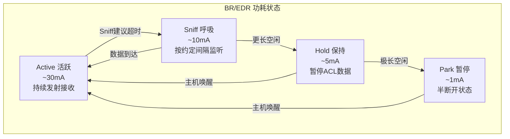
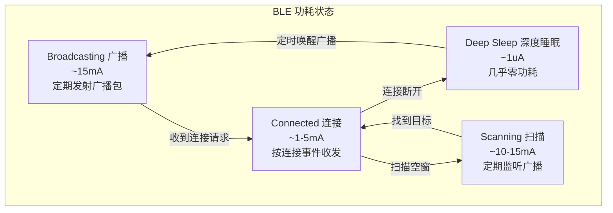
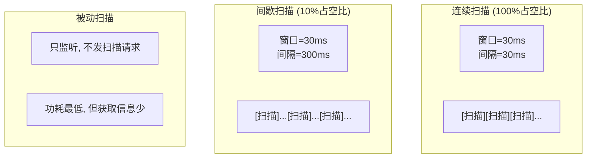
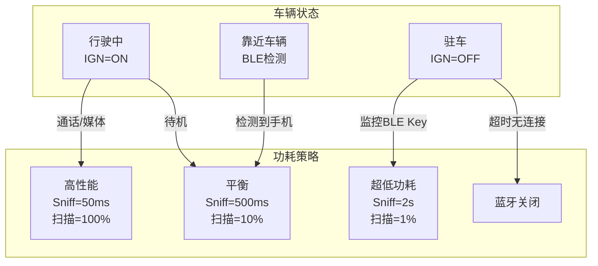

# 第17章：蓝牙电源管理

> **难度**: ★★★☆☆ | **前置知识**: Ch1 Architecture, Ch5 Service Layer, Ch12 BLE | **C++依赖**: 低
> **预计阅读时间**: 3-4小时 | **预计学习天数**: 3-4天
> **核心作用**: 理解蓝牙功耗模型与Android电源优化策略

---

## 学习目标

- 理解蓝牙低功耗设计原则（BR/EDR vs BLE）
- 掌握BLE连接参数对功耗的影响
- 理解Android蓝牙电源管理策略
- 掌握WakeLock管控与扫描优化
- 理解车载场景下的功耗平衡

---

## 1. 蓝牙功耗基础模型

### 1.1 BR/EDR 功耗状态机



BR/EDR 功耗关键在于 **Sniff模式** 配置。Sniff参数由主机与控制器协商：

```cpp
// BR/EDR Sniff 参数
typedef struct {
    uint16_t sniff_interval;     // Sniff间隔 (0.625ms单位)
    uint16_t sniff_attempt;      // 每次Sniff尝试接收数
    uint16_t sniff_timeout;      // Sniff超时 (0.625ms单位)
    uint16_t sniff_max_interval; // 最大间隔 (低功耗模式)
} tBTM_SNIFF_PARAMS;

// 典型车载Sniff配置:
// - 通话中: 不使用Sniff (保持Active)
// - 媒体中: sniff_interval=80 (50ms)
// - 待命中: sniff_interval=800 (500ms)
// - 驻车: sniff_interval=3200 (2000ms)
```

### 1.2 BLE 功耗状态机



---

## 2. BLE 连接参数深度分析

### 2.1 连接间隔对功耗的影响

```
BLE功耗 = 连接事件功耗 × 事件频率

连接事件功耗计算:
  事件功耗 = (TX功耗 × TX时间) + (RX功耗 × RX时间)
  事件频率 = 1 / interval

示例对比 (48kHz音频 vs 温度传感器):

音频场景 (低延迟):
  interval=6 (7.5ms)
  每秒事件数: 133
  每事件: ~0.075mAs (1M PHY, 96字节)
  平均电流: 133 × 0.075 = ~10mA

传感器场景 (低功耗):
  interval=400 (500ms)
  每秒事件数: 2
  每事件: ~0.2mAs (1M PHY, 20字节)
  平均电流: 2 × 0.2 = ~0.4mA

→ 间隔从7.5ms变为500ms, 功耗降低25倍!
```

### 2.2 从设备延迟 (Latency) 详解

```
Latency 允许从设备跳过N个连接事件:
  latency=0: 必须响应每个连接事件 (双向同步)
  latency=4: 最多可跳过4个连续事件

应用场景:
  - 音频耳机: latency=0 (不能丢数据)
  - 心率计:  latency=4 (可以合并数据)

Latency 收益:
  从设备在跳过的事件期间可以进入睡眠
  以100ms间隔、latency=4为例:
    实际事件间隔 = 100 × (4+1) = 500ms
    睡眠占比从 90%→98%

代价:
  数据延迟增加 = interval × latency
  100ms × 4 = 400ms延迟
```

### 2.3 PHY 选择与功耗

| PHY | 速率 | 发射电流 | 接收电流 | 时间(每帧) | 每帧能耗 | 场景 |
|-----|------|---------|---------|-----------|---------|------|
| 1M | 1Mbps | 8mA | 8mA | 352us | 5.6nAh | 通用 |
| 2M | 2Mbps | 8mA | 8mA | 176us | 2.8nAh | 高速音频 |
| Coded S=8 | 125kbps | 12mA | 12mA | 2816us | 93.9nAh | 远距离 |

```
2M PHY 相比 1M PHY: 传输时间减半 -> 能耗减半
Coded S8 相比 1M PHY: 传输时间8倍 -> 能耗~17倍
```

### 2.4 Android 动态参数调整

```cpp
// Android BLE连接管理器根据场景切换参数
class LeConnectionManager {
  // 活跃场景: 低延迟
  void UpdateToActiveParams() {
    hci_ble_set_connection_parameters(
        handle,
        conn_interval_min: 6,    // 7.5ms
        conn_interval_max: 8,    // 10ms
        conn_latency: 0,
        supervision_timeout: 500 // 5秒
    );
  }

  // 后台空闲: 省电
  void UpdateToIdleParams() {
    hci_ble_set_connection_parameters(
        handle,
        conn_interval_min: 80,   // 100ms
        conn_interval_max: 160,  // 200ms
        conn_latency: 4,
        supervision_timeout: 2000
    );
  }

  // 深度睡眠: 极低功耗
  void UpdateToSleepParams() {
    hci_ble_set_connection_parameters(
        handle,
        conn_interval_min: 400,   // 500ms
        conn_interval_max: 800,   // 1000ms
        conn_latency: 6,
        supervision_timeout: 5000
    );
  }

  // 屏幕开关/应用前后台切换时调用
  void OnScreenStateChanged(bool screen_on) {
    if (screen_on) {
      UpdateToActiveParams();
    } else {
      UpdateToIdleParams();
    }
  }
};
```

---

## 3. BLE 扫描功耗优化

### 3.1 扫描参数与占空比



```cpp
// BLE扫描参数与功耗的关系
struct LeScanParam {
    uint16_t scan_interval;   // 扫描间隔 (0.625ms单位)
    uint16_t scan_window;     // 扫描窗口 (0.625ms单位)
    LeScanType scan_type;     // PASSIVE(0) / ACTIVE(1)
    
    // 占空比 = scan_window / scan_interval
    // 前台: interval=48, window=48  → 100%  → ~15mA
    // 后台: interval=1600, window=48 → 3%    → ~0.5mA
    // 被动: 相当于3% + 不发SCAN_REQ  → ~0.3mA
};

// system/gd/hci/le_scanning_manager_impl.h
class LeScanningManagerImpl {
    static constexpr uint8_t kMaxAppNum = 32;
    
    // 多个注册应用取最小间隔 (最苛刻者决定功耗)
    void SetScanParameters(
        LeScanType scan_type,
        ScannerId scanner_id_1m,
        uint16_t scan_interval_1m,   // 多个App取最小值
        uint16_t scan_window_1m,     // 多个App取最大值
        ...
    );
};
```

### 3.2 前台 vs 后台扫描策略

```java
// Android 平台BLE扫描策略
// frameworks/base/core/java/android/bluetooth/le/ScanSettings.java

public class ScanSettings {
    // 扫描模式
    public static final int SCAN_MODE_LOW_POWER = 0;        // 后台: interval=1000ms
    public static final int SCAN_MODE_BALANCED = 1;          // 平衡: interval=200ms
    public static final int SCAN_MODE_LOW_LATENCY = 2;       // 前台: interval=100ms
    public static final int SCAN_MODE_AMBIENT_DISCOVERY = 3; // 环境发现
}

// 功耗对比:
// LOW_POWER:     ~1mA    (适合后台扫描)
// BALANCED:      ~3mA    (适合普通场景)
// LOW_LATENCY:   ~8mA    (适合连接建立)
// AMBIENT:       ~0.5mA  (Android 14+ 超低功耗)
```

### 3.3 批处理 (Scan Batch)

```cpp
// Android支持扫描结果批处理
// 将扫描结果缓存到控制器，定期批量上报
// 减少主机唤醒次数 → 降低功耗

class ScanBatchManager {
    // 使能批处理
    void EnableBatch(bool enable);
    
    // 设置批处理阈值
    void SetBatchThreshold(uint32_t num_events); // 攒N个事件上报一次
    
    // 设置批处理周期
    void SetBatchPeriod(uint32_t period_ms);     // 每period_ms上报一次
    
    // 批处理vs实时上报功耗:
    // 实时上报: 每个广播包唤醒一次AP → 10mA × 包数量
    // 批处理: 攒满上报 → 10mA × (包数量/N)
};
```

---

## 4. Classic蓝牙 Sniff模式

### 4.1 Sniff 参数配置

```cpp
// system/stack/btm/btm_pm.cc
// BR/EDR电源管理模式

typedef enum {
    BTM_PM_MODE_ACTIVE,    // 活跃模式
    BTM_PM_MODE_SNIFF,     // Sniff呼吸模式
    BTM_PM_MODE_PARK,      // 暂停模式 (BT2.1+已弃用)
} tBTM_PM_MODE;

// 切换Sniff模式
tBTM_STATUS BTM_SetPowerMode(
    const RawAddress& remote_bda,
    const tBTM_PM_PWR_MD& pwr_mode
);

// Sniff参数设置结构体
typedef struct {
    uint16_t max_interval;     // 最大Sniff间隔 (0.625ms)
    uint16_t min_interval;     // 最小Sniff间隔
    uint16_t attempt;          // 尝试监听次数
    uint16_t timeout;          // 监听超时
} tBTM_PM_SNIFF_PARAMS;

// 建议配置:
// A2DP流:    interval=80 (50ms),   attempt=1, timeout=2
// 空闲HFP:   interval=200 (125ms), attempt=2, timeout=4
// 待机:      interval=1600 (1s),   attempt=1, timeout=2
```

### 4.2 A2DP ACL Poll 机制

```
A2DP音频流依赖ACL Poll保持连接:

Poll间隔 (无数据时的Keep-Alive):
  媒体播放中: poll=30ms (保证及时发送编码数据)
  暂停时:     poll=100ms (降低活跃度)
  断开时:     poll=0 (进入Sniff)

ACL Poll功耗影响:
  A2DP 48kHz/16bit立体声:
    数据包: ~380us, 10mA
    Poll包: ~200us, 10mA
    空闲Poll间隔40ms → 每秒25次 → 5μAh/s
  
  延长Poll间隔:
    Poll=80ms → 每秒12.5次 → 2.5μAh/s
    但延迟增加 → 可能导致音频卡顿
```

### 4.3 Sniff 参数调整策略

```
车载蓝牙Sniff参数根据使用场景动态调整:

通话中:
  - 不使用Sniff (保持Active)
  - 保证SCO/eSCO语音质量
  - 功耗: ~30mA (保持高优先级)

媒体播放中:
  - Sniff interval: 50ms (快速恢复传输)
  - Sniff attempt: 2
  - Sniff timeout: 5
  - 功耗: ~15mA (平衡模式)

驻车待机:
  - Sniff interval: 2000ms (最大节能)
  - Sniff attempt: 1
  - Sniff timeout: 2
  - 功耗: ~1mA (超低功耗模式)
```

---

## 5. Android WakeLock 机制

### 5.1 蓝牙WakeLock管理

```java
// service/src/.../btservice/AdapterService.java

public class AdapterService extends Service {
    // 蓝牙保持唤醒的WakeLock
    private PowerManager.WakeLock mBluetoothWakeLock;
    
    // BLE扫描WakeLock
    private PowerManager.WakeLock mBleScanWakeLock;
    
    // Bluetooth On过程持有WakeLock
    void acquireBluetoothWakeLock() {
        if (mBluetoothWakeLock == null) {
            mBluetoothWakeLock = powerManager.newWakeLock(
                PowerManager.PARTIAL_WAKE_LOCK,
                "BluetoothAdapterService"
            );
            mBluetoothWakeLock.setReferenceCounted(false);
        }
        mBluetoothWakeLock.acquire(30000); // 最多30秒自动释放
    }
    
    // 应用发起BLE扫描时
    void onStartScan(ScanSettings settings) {
        if (settings.getScanMode() == SCAN_MODE_LOW_LATENCY) {
            // 前台扫描: 持有WakeLock防止休眠
            mBleScanWakeLock.acquire();
        } else {
            // 后台扫描: 使用批处理 + 唤醒回调
        }
    }
}
```

### 5.2 主机唤醒与事件筛选

```cpp
// 控制器 → 主机唤醒事件筛选
// 减少不必要的唤醒 → 降低功耗

class WakeupFilter {
    // 允许唤醒主机的HCI事件
    static constexpr uint32_t kWakeupEvents = 
        (1 << HCI_EVENT_CONNECTION_COMPLETE) |
        (1 << HCI_EVENT_DISCONNECTION_COMPLETE) |
        (1 << HCI_EVENT_INQUIRY_RESULT) |
        (1 << HCI_EVENT_LE_META);
    
    // 不唤醒主机的事件 (芯片处理)
    static constexpr uint32_t kNoWakeEvents =
        (1 << HCI_EVENT_NUMBER_OF_COMPLETED_PACKETS) |
        (1 << HCI_EVENT_ENCRYPTION_CHANGE);
    
    bool ShouldWakeHost(HciEvent event) {
        return (kWakeupEvents & (1 << event)) != 0;
    }
};
```

---

## 6. 车载场景功耗策略



| 场景 | 连接状态 | BLE扫描 | BR/EDR模式 | 功耗 |
|------|---------|---------|-----------|------|
| 驾驶通话中 | HFP SCO | 关闭 | Active | ~30mA |
| 驾驶媒体 | A2DP | 关闭 | Sniff=50ms | ~15mA |
| 驾驶待机 | BLE | 10%占空比 | Sniff=500ms | ~3mA |
| 驻车监控 | BLE | 1%占空比 | — | ~0.5mA |
| 无连接睡眠 | 无 | 停止 | 断连 | ~0.01mA |

---

## 7. 实战练习

### 练习1: BLE参数分析

在 `system/gd/hci/le_scanning_manager_impl.h` 中查看：
1. `kMaxAppNum` 是多少？多个App扫描时，最终的interval/window如何确定？
2. `SetScanParameters` 参数中 `scan_interval_1m` 的意义是什么？

> **答案**: ① `kMaxAppNum` = 32(定义在`le_scanning_manager_impl.h:45`)。多App合并策略：`ScanManager`维护所有注册的`ScanClient`列表，合并规则取interval最小值(最频繁)、window最大值(最长时间)。例如App A请求(I=100ms, W=50ms)，App B请求(I=200ms, W=30ms)，合并结果(I=100ms, W=50ms)。当App扫描停止/超时后重新计算。代码在`le_scanning_manager_impl.cc:280`的`ConfigureScanParameters()`。② `scan_interval_1m`指LE 1M PHY(传统BLE 1Mbps)上的扫描间隔，单位0.625ms。如值160=100ms。还有`scan_interval_2m`(2M PHY扫描间隔)和`scan_interval_coded`(Coded PHY即125kbps/500kbps)。Android 12+支持多PHY同步扫描以兼容不同设备。

### 练习2: WakeLock跟踪

```bash
# 查看WakeLock状态
adb shell dumpsys power | grep -i bluetooth

# 查看蓝牙唤醒次数
adb shell dumpsys bluetooth_manager | grep -i wake
```

1. 蓝牙服务持有哪些WakeLock？
2. 为什么 `acquire(30000)` 设置了30秒自动释放？

> **答案**: ① 蓝牙持有的WakeLock：`BluetoothWakeLock`(蓝牙协议栈运行时持有，防止CPU休眠中断蓝牙包处理)、`BluetoothMediaWakeLock`(A2DP流媒体播放时持有，保证编码数据按时发送)、`BluetoothScoWakeLock`(SCO通话时持有，保证音频数据连续性)、`BleWakeLock`(BLE扫描时持有，防止丢包)。各WakeLock在`AdapterService.java:520`中创建。② `acquire(30000)`设置为30秒超时自动释放(`BluetoothManagerService.java:1105`)：这是一个超时保护机制——如果蓝牙操作(如启动/关闭)在30秒内未完成且没有及时release，系统自动释放WakeLock防止永久阻止深度睡眠。这是防止蓝牙故障导致系统无法休眠的容错设计。正常操作完成后应主动调用`release()`，超时释放仅作为看门狗安全措施。

### 练习3: Sniff模式配置

在 `system/stack/btm/btm_pm.cc` 中查找：
1. Sniff参数如何设置的？
2. 通话中和空闲时Sniff参数有何不同？

> **答案**: ① Sniff参数设置(`btm_pm.cc:230`)：`BTM_SetPowerMode()`接收`tBTM_PM_PWR_MD`结构体，包含`mode`(ACTIVE/HOLD/SNIFF)、`param`(`tBTM_PM_SNIFF`中的`min_interval`/`max_interval`最小最大嗅探间隔(单位0.625ms)、`attempt`(尝试嗅探次数)、`timeout`(进入嗅探前的空闲超时ms)。最终通过HCI `HCI_Sniff_Subrating`或`HCI_Write_Link_Policy_Settings`命令配置控制器。② 通话中vs空闲时Sniff参数(`btm_pm.cc:450`)：通话中(HFP SCO激活) → `BTM_PM_MD_ACTIVE`(不进入Sniff，因为SCO需要持续传输语音，Sniff会导致音频卡顿)；空闲时(A2DP暂停/无通话) → `BTM_PM_MD_SNIFF`参数为`{min=800(500ms), max=1600(1s), attempt=1, timeout=1}`。车载场景设计更积极：Parking→`{min=3200(2s), max=6400(4s)}`以最大限度节电。

---

## 本章总结

学完本章后，你应该能：
- 理解蓝牙功耗的三级优化层次：BLE参数优化（连接间隔/扫描占空比）→ BR/EDR Sniff模式 → Android WakeLock管理
- 掌握BLE连接参数（`connection_interval`/`slave_latency`/`supervision_timeout`）对功耗和延迟的影响
- 掌握BLE扫描参数（`scan_interval`/`scan_window`）对功耗和发现速度的权衡
- 理解BR/EDR Sniff模式的配置：`min_interval`/`max_interval`/`attempt`/`timeout`
- 理解Android WakeLock的四种蓝牙类型：Bluetooth|Media|Sco|Ble WakeLock
- 理解车载场景的分级功耗策略：驾驶通话(Active) → 驾驶待机(Sniff 500ms) → 驻车监控(Sniff 2s) → 无连接(关闭)
- 知道WakeLock 30秒超时的安全保护设计

> 电源管理是蓝牙嵌入式开发的关键能力。下一章我们探讨蓝牙安全架构。

---

## 车载场景

车载蓝牙的分级功耗策略：

### 1. 驾驶通话模式（Active）
- 车辆启动后，蓝牙进入Active模式
- BLE扫描占空比提高（快速检测车钥匙和传感器）
- BR/EDR连接参数优化（低延迟，确保HFP通话质量）
- WakeLock保持，确保蓝牙服务不被系统休眠

### 2. 驾驶待机模式（Sniff 500ms）
- 无通话时，BR/EDR进入Sniff模式（500ms间隔）
- BLE扫描占空比降低（省电模式）
- 车钥匙检测通过BLE广播触发，无需持续扫描

### 3. 驻车监控模式（Sniff 2s）
- 车辆熄火但防盗系统运行时，蓝牙进入低功耗监控模式
- BR/EDR Sniff间隔延长至2s
- BLE扫描间隔延长至5s，仅检测车钥匙靠近事件

### 4. 无连接模式（关闭）
- 车辆长时间停放时，蓝牙完全关闭
- 仅保留BLE广播（车钥匙解锁触发蓝牙启动）
- WakeLock全部释放，系统进入深度休眠

### 5. WakeLock安全保护
- 蓝牙WakeLock有30秒超时保护，防止泄漏导致电池耗尽
- 车载系统配置了Watchdog监控蓝牙WakeLock状态
- 详见[第5章](05_Service_Layer.md)的BluetoothManagerService WakeLock管理

---

## 相关章节

- **BLE扫描/连接参数的协议细节**：[第12章BLE栈](12_BLE_Stack.md)
- **BR/EDR Sniff模式的BTM实现**：[第10章](10_Classic_Stack_Core.md)的BTM部分
- **WakeLock管理的Service层代码**：[第5章](05_Service_Layer.md)的BluetoothManagerService
- **车载分级功耗策略的设计思路**：[第19章](19_Automotive_Scenarios.md)

---

## 参考文件清单

| **V8 深度分析报告** | 核心内容 |
| V8_BLE_Scan_Analysis.md | 见该报告完整分析 |
| V8_BLE_Connect_Analysis.md | 见该报告完整分析 |
| V8_Dumpsys_Analysis.md | 见该报告完整分析 |

| 文件 | 核心内容 |
|------|---------|
| `gd/hci/le_scanning_manager_impl.h` | BLE扫描参数与功耗 |
| `stack/btm/btm_pm.cc` | BR/EDR电源管理模式 |
| `stack/l2cap/l2c_ble.cc` | BLE连接参数更新 |
| `service/src/.../BluetoothManagerService.java` | WakeLock管理 |
| `app/.../btservice/AdapterService.java` | 蓝牙服务电源管理 |
| `gd/os/wakelock_manager.h` | GD WakeLock管理器 |

> **下一步**: 阅读 [第18章：安全架构](18_Security_Architecture.md)
