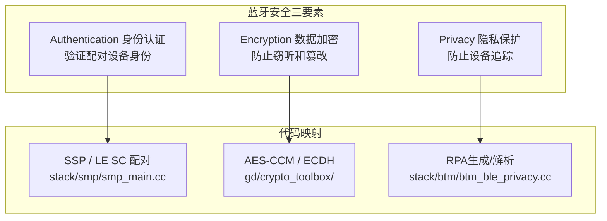
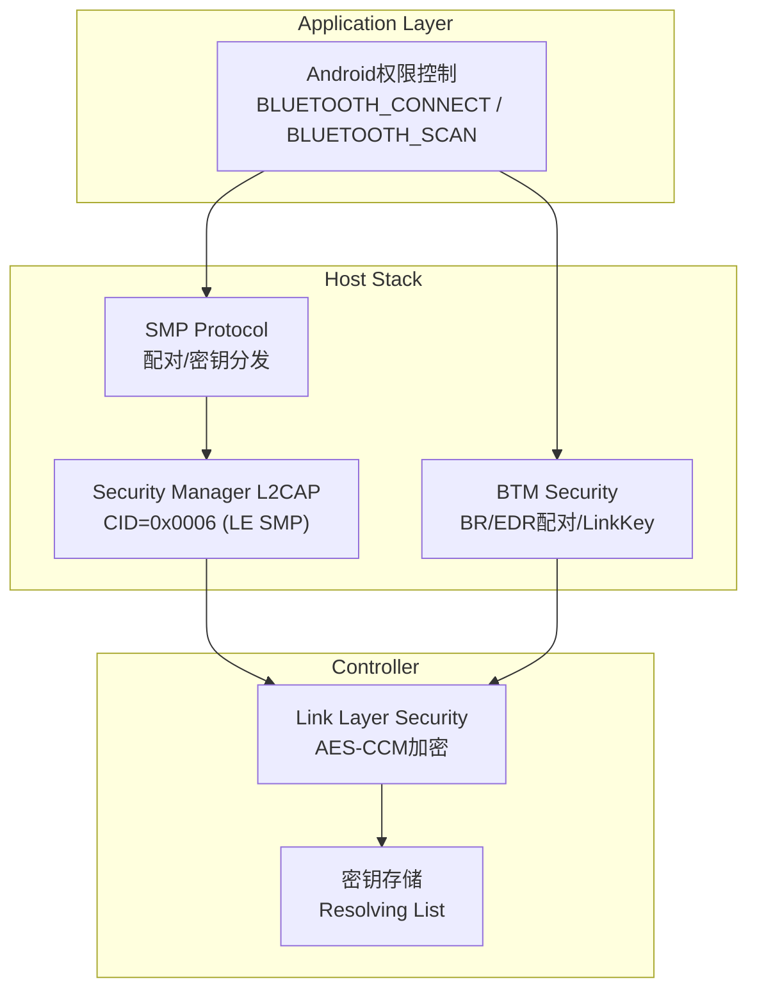
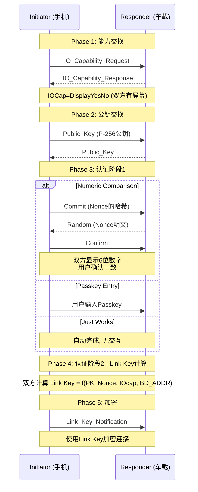
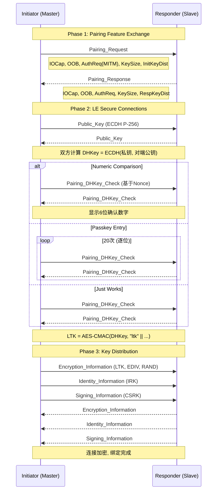

# 第18章：蓝牙安全架构

> **难度**: ★★★★☆ | **前置知识**: Ch10 Core Stack, Ch12 BLE Stack | **C++依赖**: 中
> **预计阅读时间**: 4-5小时 | **预计学习天数**: 4-5天
> **核心作用**: 理解蓝牙全链路安全机制：认证 + 加密 + 隐私 + 权限

---

## 学习目标

- 理解蓝牙安全模型三要素
- 掌握BR/EDR SSP配对流程和链路密钥管理
- 掌握BLE LE Secure Connections配对流程
- 理解BLE隐私机制（RPA/IRK/Resolving List）
- 掌握SMP状态机与加密算法体系
- 理解Android蓝牙权限模型演变

---

## 1. 蓝牙安全模型

### 1.1 安全三要素



### 1.2 安全架构分层



---

## 2. 经典蓝牙安全 (BR/EDR)

### 2.1 SSP (Secure Simple Pairing) 流程



### 2.2 Link Key 类型

```cpp
// system/stack/btm/btm_sec.h

// Link Key 类型
#define BTM_LKEY_TYPE_COMB             0  // 组合密钥 (SSP)
#define BTM_LKEY_TYPE_DEBUG_COMB       1  // 调试组合密钥
#define BTM_LKEY_TYPE_UNAUTH_COMB      2  // 未认证组合 (Just Works)
#define BTM_LKEY_TYPE_AUTH_COMB        3  // 已认证组合 (NC/Passkey)
#define BTM_LKEY_TYPE_CHANGED_COMB     4  // 变更组合密钥

// 密钥存储结构
typedef struct {
    RawAddress bd_addr;           // 蓝牙地址
    Octet16 link_key;             // 16字节链路密钥
    tBTM_SEC_DEV_TYPE sec_type;   // 安全类型
    tBTM_IO_CAP io_cap;           // IO能力
    uint8_t key_type;             // 密钥类型 (组合/调试/未认证/已认证)
    bool link_key_known;          // 是否已有密钥
    uint32_t pin_length;          // PIN长度 (Legacy配对)
    tBTM_LE_KEY_TYPE le_keys;     // LE密钥 (双模设备)
} tBTM_SEC_BOND;

// 密钥持久化路径: /data/misc/bluetooth/config.conf
// Link Key 存储格式:
// [设备MAC].LinkKey = 0xABCD... (32位十六进制)
// [设备MAC].KeyType = 3
// [设备MAC].PinLength = 0
```

### 2.3 SSP 关联模型选择

```
IOCap组合 → 关联模型 → 安全级别

                        显示.无输入
                        (如: 车载)
                        │
┌──────────┐    ┌───────┴───────┐    ┌──────────┐
│ 键盘.有屏│──→│ 数字比较 (NC)  │←──│ 仅显示屏 │
│ (手机)   │   │ MITM保护 ✓    │   │ (耳机)   │
└────┬─────┘   └───────────────┘   └────┬─────┘
     │                                   │
     │          ┌───────────────┐         │
     └────────→│  Passkey Entry │←────────┘
                │ MITM保护 ✓    │
                └───────┬───────┘
                        │
               ┌────────┴────────┐
               │  Just Works     │
               │ 无MITM保护 ✗    │
               │ (无IOCap设备)   │
               └─────────────────┘
```

---

### 2.4 经典安全深度参考（V8）

**BR/EDR createBond 完整调用链**：

| 步骤 | 代码位置 | 线程 |
|------|---------|------|
| `BluetoothDevice.createBond()` | `BluetoothDevice.java:2050` | App 任意线程 |
| Binder IPC `IAdapter.createBond()` | — | Binder 线程池 |
| `AdapterServiceBinder.createBond()` | `AdapterServiceBinder.java:388` | `mHandler` 线程 |
| JNI `bondNative()` | `com_android_bluetooth_adapter.cpp` | BT Main Thread |
| `btif_dm_create_bond()` | `btif_dm.cc:2774` | BT Main Thread |
| `btif_dm_create_bond_le()` (LE) | `btif_dm.cc:2793` | BT Main Thread |
| `btm_sec_execute_procedure()` | `btm_sec.cc:104` | BTU Task |

**BTM_SEC 状态机核心状态**（`btm_sec.cc` 5280 行）：

| 状态 | 说明 |
|------|------|
| `BTA_SEC_OPENING` | 发起连接/配对中 |
| `BTA_SEC_AUTHENTICATING` | SSP 认证阶段 1-4 |
| `BTA_SEC_ENCRYPTING` | 链路加密阶段 |
| `BTA_SEC_OPENED` | 配对完成，连接加密 |

**IO Capability → 关联模型矩阵**（`btif_dm_proc_io_req()` → `btif_dm.cc:3271`）：

| 发起方 IOCap | 响应方 IOCap | 关联模型 | MITM |
|-------------|-------------|---------|------|
| NoInputNoOutput | 任意 | Just Works | ✗ |
| DisplayYesNo | DisplayYesNo | Numeric Comparison | ✓ |
| DisplayYesNo | KeyboardOnly | Passkey Entry | ✓ |
| KeyboardOnly | DisplayOnly | Just Works | ✗ |

**配对失败错误码**：

| 错误码 | HCI 事件 | 含义 |
|--------|---------|------|
| 0x3E | `HCI_SIMPLE_PAIRING_COMPLETE_EVT` | SSP 配对失败 |
| 0x05 | `HCI_AUTHENTICATION_COMP_EVT` | 认证失败 |
| 0x08 | — | Link Key 不匹配 |

> 完整分析见 [V8_Pairing_Analysis.md](V8_Pairing_Analysis.md)（325 行）

---

### 3.1 LE Secure Connections vs Legacy Pairing

| 特性 | LE Legacy (4.0/4.1) | LE SC (4.2+) |
|------|-------------------|-------------|
| 密钥交换 | AES-128 (TK→STK) | ECDH P-256 (LTK) |
| MITM保护 | 仅Passkey | NC/Passkey/OOB |
| 密钥强度 | 128bit (STK) | 128bit (LTK, 更强) |
| 性能 | 快 (AES硬件) | 慢 (ECC计算) |
| 代码路径 | `stack/smp/smp_act.cc` | `stack/smp/smp_act.cc` |

### 3.2 LE SC 配对流程



### 3.3 SMP 状态机

```cpp
// system/stack/smp/smp_main.cc

// SMP 状态机状态
enum tSMP_STATE {
    SMP_ST_IDLE,                // 空闲
    SMP_ST_WAIT_APP_RSP,        // 等待应用层回复配对请求
    SMP_ST_WAIT_CMD,            // 等待对端命令
    SMP_ST_SEC_REQ_PENDING,     // 安全请求待处理
    SMP_ST_PAIR_REQ,            // 配对请求已发送
    SMP_ST_WAIT_PIN,            // 等待PIN输入
    SMP_ST_STK_ENCRYPT,         // STK加密中 (Legacy)
    SMP_ST_ENC_PENDING,         // 加密待确认
    SMP_ST_BOND_PENDING,        // 绑定信息待存储
    SMP_ST_DONE,                // 完成
};

// SMP 状态动作表
void smp_sm_event(tSMP_CB* p_cb, tSMP_EVENT event, void* p_data) {
    switch (p_cb->state) {
    case SMP_ST_PAIR_REQ:
        switch (event) {
        case SMP_PAIR_REQ_EVT:       // 收到配对请求
            smp_process_pair_request(...);
            smp_send_pair_response(...);
            // 进入 Phase 2
            if (p_cb->le_secure) {
                smp_send_public_key(...);  // LE SC: 发送公钥
            } else {
                smp_send_commit(...);      // Legacy: 发送确认
            }
            break;
        case SMP_PAIR_FAIL_EVT:      // 配对失败
            smp_pairing_cancel(...);
            smp_set_state(SMP_ST_IDLE);
            break;
        }
        break;
    // ... 其他状态
    }
}
```

### 3.4 BLE 隐私机制

```cpp
// 可解析私有地址 (RPA) 生成与解析

// RPA结构 (48位):
//  高24位 = hash = AES-CMAC(IRK, prand || 0x00) 取高24位
//  低24位 = prand (随机数, 高2位=11)

// IRK (Identity Resolving Key): 128位身份密钥
//   - 配对时由每个设备生成
//   - 存储在Resolving List中

// RPA生成代码 (gd/crypto_toolbox/):
class LePrivacyManager {
    // 生成RPA地址
    AddressWithType GenerateRpa(const Octet16& irk) {
        prand = RandomGenerator::GetInstance().GetRandom24Bits();
        prand |= 0xC00000;  // high 2 bits = 11
        
        std::vector<uint8_t> input(16, 0);
        memcpy(input.data(), &prand, 3);  // prand || 0...
        
        Octet16 hash = aes_cmac(irk, input);
        // 取hash前3字节
        
        Address rpa;
        memcpy(rpa.data(), hash.data(), 3);     // 高24位 = hash
        memcpy(rpa.data() + 3, &prand, 3);      // 低24位 = prand
        return AddressWithType(rpa, AddressType::RANDOM_DEVICE_ADDRESS);
    }

    // 解析RPA: 遍历Resolving List
    bool ResolveAddress(const Address& rpa) {
        for (auto& entry : resolving_list_) {
            // 从RPA提取prand
            uint32_t prand = (rpa[3] << 16) | (rpa[4] << 8) | rpa[5];
            prand &= 0x3FFFFF;  // 清除sign bits
            
            // 计算期望hash
            std::vector<uint8_t> input(16, 0);
            memcpy(input.data(), &prand, 3);
            Octet16 expected_hash = aes_cmac(entry.irk, input);
            
            // 比较hash
            if (memcmp(expected_hash.data(), rpa.data(), 3) == 0) {
                return true;  // 匹配 → 识别设备
            }
        }
        return false;  // 无法解析
    }

    // RPA轮换定时器 (默认15分钟)
    void StartAddressRotation() {
        repeating_alarm_->Schedule(
            Bind([this]() { RotateRpa(); }),
            std::chrono::minutes(15));
    }
};
```

**IRK分发与Resolving List管理**：
- IRK在SMP Phase 3密钥分发阶段传输（见[第12章BLE栈](12_BLE_Stack.md)的SMP配对流程）
- 配对的双方各自生成自己的IRK，并交换给对方
- 收到对端IRK后存入`bt_config.xml`的`<resolving_list>`节点
- 蓝牙启动时从持久化存储加载IRK到控制器侧Resolving List（`LE_Add_Device_To_Resolving_List` HCI命令）
- **车载关键**: Resolving List条目数受控制器硬件限制（高通WCN3990约32条）。超过上限时，新增设备会导致最早配对的设备被踢出Resolving List——此时该设备的RPA无法被控制器自动解析，需要Host侧软件解析作为回退（但增加延迟约50ms）

### 3.5 BLE 安全深度参考（V8）

**BLE 配对调用链**（`btif_dm_create_bond_le` → `btif_dm.cc:2793`）：

| 步骤 | 代码位置 | 线程 |
|------|---------|------|
| `createBond()` 带 BLE 传输参数 | `BluetoothDevice.java:2050` | App 任意线程 |
| Binder IPC | — | Binder 线程池 |
| `btif_dm_create_bond_le()` | `btif_dm.cc:2793` | BT Main Thread |
| SMP 状态机 | `smp_main.cc` | BTU Task |

**SMP 完整状态表**（`smp_main.cc`）：

| 状态 | 说明 |
|------|------|
| `SMP_ST_IDLE` | 空闲，等待配对请求 |
| `SMP_ST_WAIT_APP_RSP` | 等待应用层回复配对请求 |
| `SMP_ST_SEC_REQ_PENDING` | 安全请求待处理 |
| `SMP_ST_PAIR_REQ` | 配对请求已发送 |
| `SMP_ST_PAIR_CONFIG` | 配对参数配置中 |
| `SMP_ST_WAIT_CONFIRM` | 等待对端确认值 |
| `SMP_ST_CONFIRM` | 本地确认已发送 |
| `SMP_ST_WAIT_RAND` | 等待对端随机数 |
| `SMP_ST_RAND` | 本地随机已发送 |
| `SMP_ST_ENCRYPT_PENDING` | 加密待确认 |
| `SMP_ST_BOND_PENDING` | 绑定信息待存储 |
| `SMP_ST_DONE` | 配对完成 |

> 完整分析见 [V8_Pairing_Analysis.md](V8_Pairing_Analysis.md)（325 行）

---

---

## 4. 加密算法工具箱

```cpp
// gd/crypto_toolbox/crypto_toolbox.h

class CryptoToolbox {
    // AES-CMAC: 用于RPA生成/SMP认证
    // 输入: key (128bit), message (可变长)
    // 输出: mac (128bit)
    static Octet16 aes_cmac(const Octet16& key, 
                            const std::vector<uint8_t>& message);

    // AES-CCM: 用于BLE Link Layer加密
    // 输入: key, nonce, plaintext, aad
    // 输出: ciphertext + mic
    static std::vector<uint8_t> aes_ccm_encrypt(
        const Octet16& key,
        const std::array<uint8_t, 13>& nonce,
        const std::vector<uint8_t>& plaintext,
        const std::vector<uint8_t>& aad);

    // ECDH P-256: 用于LE SC密钥交换
    // 生成密钥对
    static std::pair<Octet16, Octet16> generate_p256_key_pair();
    // 计算共享密钥
    static Octet16 generate_p256_dhkey(
        const Octet16& private_key,
        const Octet16& peer_public_key);

    // f4/f5/f6: SMP加密函数 (BT Spec Vol 3, Part H, 2.3.5.6)
    static Octet16 f4(const Octet16& u, const Octet16& v,
                      const Octet16& x, uint8_t z);
    static Octet16 f5(const Octet16& dhkey, const Octet16& n1,
                      const Octet16& n2, Address a1, Address a2);
};
```

---

## 5. Android 蓝牙权限模型

### 5.1 权限演进

```java
// Android 12+ 精细化蓝牙权限

<!-- AndroidManifest.xml 声明 -->
<!-- Android 12+ 必需 -->
<uses-permission android:name="android.permission.BLUETOOTH_SCAN" />
<uses-permission android:name="android.permission.BLUETOOTH_ADVERTISE" />
<uses-permission android:name="android.permission.BLUETOOTH_CONNECT" />

<!-- Android 11及以下 需要位置权限 -->
<uses-permission android:name="android.permission.ACCESS_FINE_LOCATION" />

// 运行时权限申请 (Android 12+)
if (Build.VERSION.SDK_INT >= Build.VERSION_CODES.S) {
    requestPermissions(new String[]{
        BLUETOOTH_SCAN,     // 扫描BLE设备
        BLUETOOTH_CONNECT,  // 连接设备
        BLUETOOTH_ADVERTISE // 广播自身
    }, REQUEST_CODE);
} else {
    requestPermissions(new String[]{
        ACCESS_FINE_LOCATION
    }, REQUEST_CODE);
}
```

### 5.2 权限检查流程

```java
// service/src/.../BluetoothManagerService.java

public class BluetoothManagerService {
    // 权限检查
    private void enforceBluetoothPermission(IBinder token) {
        // 1. 检查 BLUETOOTH_CONNECT 权限
        if (checkCallingOrSelfPermission(
                BLUETOOTH_CONNECT) != PERMISSION_GRANTED) {
            // 2. 降级检查 BLUETOOTH (旧权限)
            if (checkCallingOrSelfPermission(
                    BLUETOOTH) != PERMISSION_GRANTED) {
                throw new SecurityException("Need BLUETOOTH_CONNECT");
            }
        }
        
        // 3. 检查Profile特定的权限
        if (profile == PROFILE_A2DP && 
            checkCallingOrSelfPermission(
                BLUETOOTH_PRIVILEGED) != PERMISSION_GRANTED) {
            throw new SecurityException("Need BLUETOOTH_PRIVILEGED");
        }
        
        // 4. 检查调用方包名是否在允许列表中
        if (!isCallerAllowedToManageBluetooth()) {
            throw new SecurityException("Not allowed");
        }
    }
}
```

### 5.3 权限深度参考（V8）

**API → 权限映射表**（Android 12+）：

| API | 所需权限 | 所在文件 |
|-----|---------|---------|
| `startScan()` | `BLUETOOTH_SCAN` + `ACCESS_FINE_LOCATION` | `BluetoothLeScanner.java` |
| `startAdvertising()` | `BLUETOOTH_ADVERTISE` | `BluetoothLeAdvertiser.java` |
| `connectGatt()` | `BLUETOOTH_CONNECT` | `BluetoothDevice.java` |
| `createBond()` | `BLUETOOTH_CONNECT` | `BluetoothDevice.java` |
| `getConnectedDevices()` | `BLUETOOTH_CONNECT` | `BluetoothManager.java` |
| `getBondedDevices()` | `BLUETOOTH_CONNECT` | `BluetoothAdapter.java` |
| `listenUsingRfcomm()` | `BLUETOOTH_CONNECT` | `BluetoothAdapter.java` |
| `enable()` | `BLUETOOTH_CONNECT` | `BluetoothAdapter.java` |

**常见权限失败模式**：

| 现象 | 原因 | logcat 关键字 |
|------|------|-------------|
| `SecurityException: Need BLUETOOTH_CONNECT` | 未声明 `BLUETOOTH_CONNECT` | `SecurityException` |
| 扫描返回空列表 | 未授予 `ACCESS_FINE_LOCATION` | `Permission denial` |
| 系统 API 调用失败 | 非系统应用用了 `@SystemApi` 方法 | `BLUETOOTH_PRIVILEGED` |

> 完整分析见 [V8_Permission_Analysis.md](V8_Permission_Analysis.md)（145 行）

---

## 6. 安全相关代码文件导航

```
安全相关代码结构:
system/
├── stack/
│   ├── btm/
│   │   ├── btm_sec.cc        → BR/EDR安全状态机核心
│   │   ├── btm_devctl.cc     → 设备控制命令
│   │   └── btm_ble.cc        → BLE安全相关
│   │
│   ├── smp/
│   │   ├── smp_main.cc       → SMP主状态机
│   │   ├── smp_act.cc        → SMP动作函数
│   │   ├── smp_keys.cc       → 密钥生成/分发
│   │   ├── smp_l2c.cc        → SMP L2CAP传输
│   │   └── smp_api.cc        → SMP API
│   │
│   └── include/
│       └── bt_sec.h          → 安全类型定义
│
├── gd/
│   ├── crypto_toolbox/
│   │   ├── crypto_toolbox.cc → AES-CMAC, ECDH, f4/f5/f6
│   │   └── aes.cc            → AES核心算法
│   │
│   └── hci/
│       └── le_security_interface.h → LE安全HCI命令
│
service/src/.../btservice/
    └── BluetoothManagerService.java → 权限检查
```

---

## 7. 实战练习

### 练习1: SSP配对流程

在 `stack/btm/btm_sec.cc` 中：
1. 找到 `btm_sec_connect()` 函数，查看配对初始化流程
2. Link Key 存储的位置在哪里？如何读取？
3. 配对失败时如何恢复？

> **答案**: ① `btm_sec_connect()`(btm_sec.cc:450)初始化流程：创建或获取`tBTM_SEC_DEV_REC`安全设备记录 → 设置需要的security level → `btm_sec_execute()`启动安全流程 → 如果需要配对则调用`BTM_SecBond()` → 触发底层HCI `Authentication_Requested`发起PIN/SSP配对。过程中通过`btm_sec_state_tbl`状态机管理(从`BTA_SEC_OPENING`→`BTA_SEC_AUTHENTICATING`→`BTA_SEC_ENCRYPTING`→`BTA_SEC_OPENED`)。② Link Key存储(`btm_sec.cc:800`)：存储在`btm_sec_dev_rec[]`数组的`tBTM_SEC_DEV_REC.link_key`字段，持久化到`bt_config.xml`(路径`/data/misc/bluedroid/bt_config.xml`)。读取通过`BTM_SecReadDevRec()`或`btm_find_dev()`从内存数组查找，存储通过`btm_sec_save_hci_link_key()`→写入bt_config.xml。③ 配对失败恢复(`btm_sec.cc:1100`)：失败触发`btm_sec_collision()`或`btm_sec_disconnected()`→调用`BTM_SecDeleteDev()`删除安全记录(含link_key) → 通知上层`BTA_DM_BOND_CBACK(BTA_DM_BOND_NONE)` → 应用层可以重新发起`createBond()`从头开始完整配对流程。超时情况由`btm_sec_bond_timer_cback()`在30秒无响应时自动清理。

### 练习2: SMP状态机

在 `stack/smp/smp_main.cc` 中：
1. 找到 `smp_sm_event()` 主状态处理
2. Legacy Pairing和Secure Connections在代码中的分支点是什么？
3. 配对超时如何处理？

> **答案**: ① `smp_sm_event()`(smp_main.cc:300)：输入`SMP_Event`(如SMP_SEC_REQUEST_EVT, SMP_PAIRING_REQ_EVT等)和当前state → 在二维`sm_state_tbl[state][event]`中查找处理函数 → 执行动作函数(如`smp_send_pair_req()`, `smp_send_confirm()`等)。② Legacy vs SC分支点(smp_main.cc:670的`smp_proc_pair_cmd()`)：检查`p_cb->peer_io_caps.pairing_options`的`SC_PAIRING_SUPPORT`位——双方都支持SC → `p_cb->le_secure_enabled = true`，后续使用ECDH+Numeric Comparison；否则Legacy pairing使用STK(aes-128加密临时密钥) + Just Works或Passkey Entry。③ 配对超时处理(smp_main.cc:200的`smp_pair_timeout()`)：`p_cb->timer`触发60秒超时 → `smp_sm_event(SMP_TIMEOUT_EVT, nullptr)` → `smp_proc_pairing_cmpl()`设置`SMP_PAIR_FAIL_TIMEOUT` → 停止所有加密操作(清除p_cb中的密钥材料) → 回调通知上层(SMP_PAIR_FAIL_TIMEOUT) → `smp_remove_l2cap_channel()`关闭连接 → 状态回到`SMP_ST_IDLE`。

### 练习3: 加密算法

在 `gd/crypto_toolbox/crypto_toolbox.cc` 中：
1. `aes_cmac()` 如何计算？
2. ECDH P-256密钥对在哪里生成？
3. 找到 `f4()`, `f5()`, `f6()` 函数的实现，它们分别在SMP的哪个阶段使用？

> **答案**: ① `aes_cmac()`(crypto_toolbox.cc:120)：基于NIST SP 800-38B的AES-CMAC算法：使用AES-128加密 → 计算子密钥K1/K2 → 如果最后一个数据块完整则用K1异或后再加密，否则使用10*填充后用K2异或后再加密 → 返回加密结果(16字节MAC)。BLE LE Secure Connections中用其计算确认值。② ECDH P-256密钥对生成(crypto_toolbox.cc:45)：调用`crypto_toolbox::GenerateECDHKeyPair()`→内部使用OpenSSL库的`EC_KEY_new_by_curve_name(NID_X9_62_prime256v1)`或BoringSSL等效实现→`EC_KEY_generate_key()`生成公私钥对。私钥保存在临时的`smp_cb`中不持久化。③ `f4()`(SMP阶段2认证)：`f4(U, V, X, Z)`计算确认值，输入远端公钥+自公钥+随机数+配对者标识，输出16字节确认值，用于Numeric Comparison中展示给用户的6位数验证。`f5()`(SMP阶段2密钥派生)：`f5(W, N1, N2, A1, A2)`派生LTK(长期密钥)和MacKey，输入DH共享密钥+双方随机数+双方地址，基于AES-CMAC扩展派生。`f6()`(SMP阶段2DHCheck)：`f6(N1, N2, R, IOcap, A1, A2)`计算DH Check值，用于验证双方确实使用相同的配对参数完成ECDH过程。

---

## 本章总结

学完本章后，你应该能：
- 理解蓝牙安全的三层模型：链路层安全（BR/EDR SSP + BLE SMP）+ 加密算法层（AES-CMAC/ECDH/f4/f5/f6）+ 应用层权限（Android BLUETOOTH_CONNECT/SCAN/ADVERTISE）
- 掌握BR/EDR SSP的四个配对模型：Numeric Comparison、Passkey Entry、Just Works、Out of Band
- 掌握BLE SMP的Legacy vs Secure Connections流程差异（STK vs ECDH公钥交换）
- 理解RPA（Resolvable Private Address）的地址解析机制
- 理解Android 12+的细粒度蓝牙权限模型变化
- 理解加密算法：AES-CMAC、ECDH P-256、BLE SC的f4/f5/f6函数在配对各阶段的用途
- 知道车载场景下BluetoothManagerService的权限检查、多用户隔离（前台用户唯一权限）

> 安全架构涉及BR/EDR + BLE + Android三层安全模型。最后一章我们将所有知识汇聚到车载场景——多设备并发、HFP通话、A2DP多音源、BLE车钥匙等实战场景。

---

## 车载场景

车载蓝牙安全的特殊要求：

### 1. 快速配对（Quick Pair）
- 车机需要支持Google Fast Pair和车厂特定的快速配对流程
- 驾驶员上车时，手机通过NFC或二维码与车机快速配对
- 配对过程使用LE Secure Connections (LE SC)，确保密钥交换安全

### 2. RPA隐私保护
- 车载BLE车钥匙使用RPA（Resolvable Private Address）保护用户隐私
- 车机通过IRK（Identity Resolving Key）解析RPA，确认钥匙身份
- Resolving List容量限制（通常10-20个条目）影响可绑定的车钥匙数量

### 3. 多用户隔离
- Android Automotive支持多用户（驾驶员、乘客、访客）
- 蓝牙绑定设备与用户关联，切换用户时需切换蓝牙配置
- `BluetoothManagerService`的权限检查确保前台用户唯一拥有蓝牙控制权

### 4. 车厂安全认证
- 车厂通常要求蓝牙模块通过特定的安全认证（如CC EAL4+）
- 蓝牙密钥（LTK、IRK）存储需要使用车载HSM（Hardware Security Module）
- 配对信息持久化需要加密存储，防止物理提取

---

## 相关章节

- **BR/EDR SSP配对的BTM实现**：[第10章](10_Classic_Stack_Core.md)的BTM_SEC部分
- **BLE SMP协议细节**：[第12章BLE栈](12_BLE_Stack.md)的SMP节
- **Android权限模型的Framework定义**：[第4章](04_Public_API_Framework.md)
- **车载配对场景（快速配对、RPA隐私）**：[第19章](19_Automotive_Scenarios.md)

---

## 参考文件清单

| 文件 | 核心内容 |
|------|---------|
| `stack/btm/btm_sec.h/cc` | BR/EDR安全状态机 |
| `stack/smp/smp_main.h/cc` | SMP状态机 |
| `stack/smp/smp_act.cc` | SMP动作实现 |
| `stack/smp/smp_keys.cc` | 密钥生成分发 |
| `gd/crypto_toolbox/crypto_toolbox.h/cc` | 加密算法 |
| `gd/hci/le_security_interface.h` | LE安全HCI命令 |
| `service/src/.../BluetoothManagerService.java` | Android权限检查 |
| `system/btif/src/btif_dm.cc` | BTIF 设备管理（createBond 入口） |
| `android/app/.../btservice/AdapterServiceBinder.java` | IAdapter Binder 实现 |
| **V8 深度分析报告** | |
| `V8_Pairing_Analysis.md` | BR/EDR + BLE 配对完整调用链 + BTM_SEC 状态机 |
| `V8_Permission_Analysis.md` | Android 12+ 细粒度权限映射表 + 失败模式 |

> **下一步**: 阅读 [第19章：车载场景](19_Automotive_Scenarios.md)
