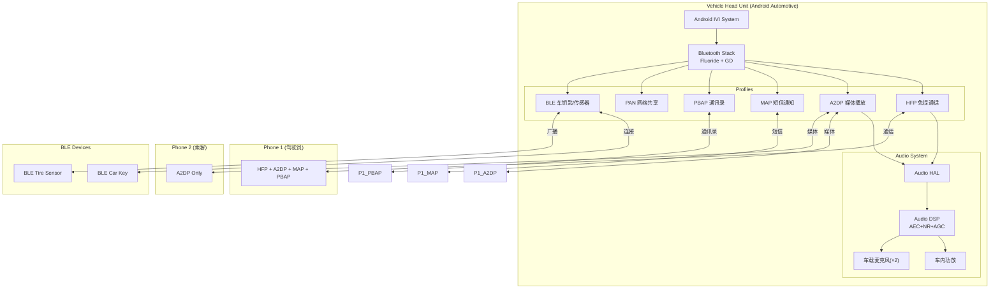
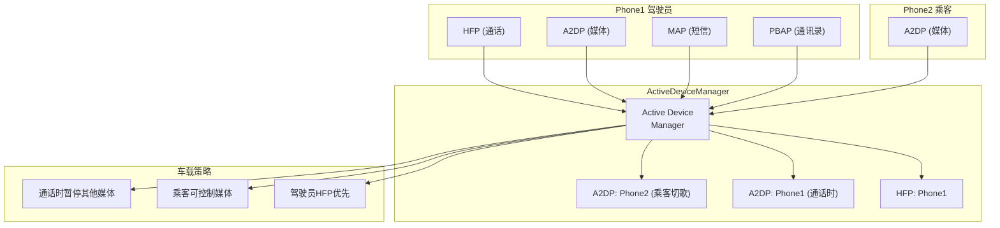
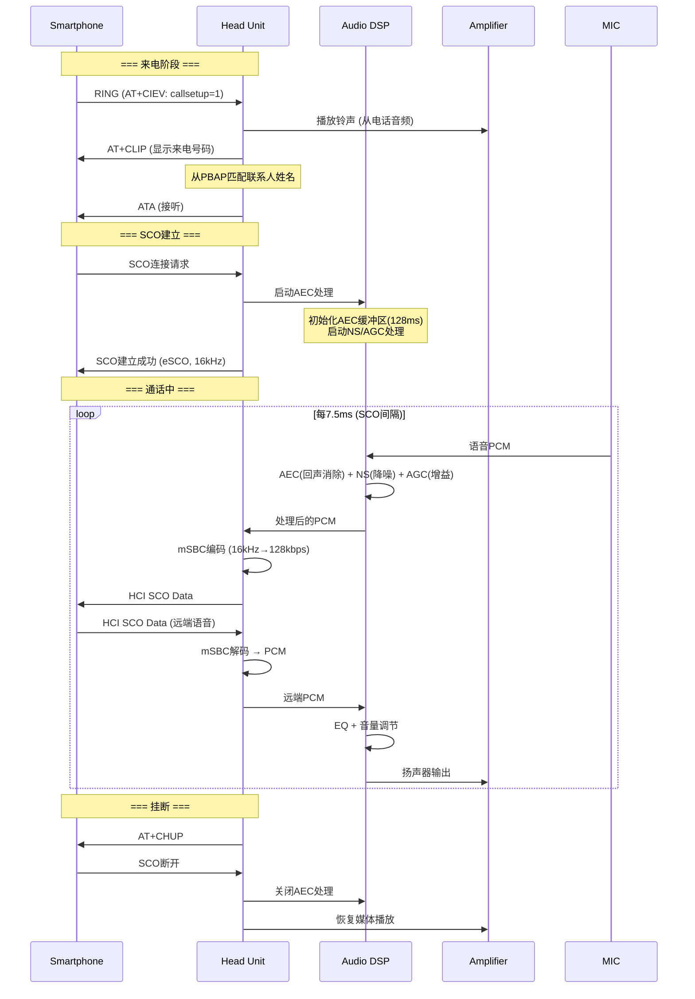
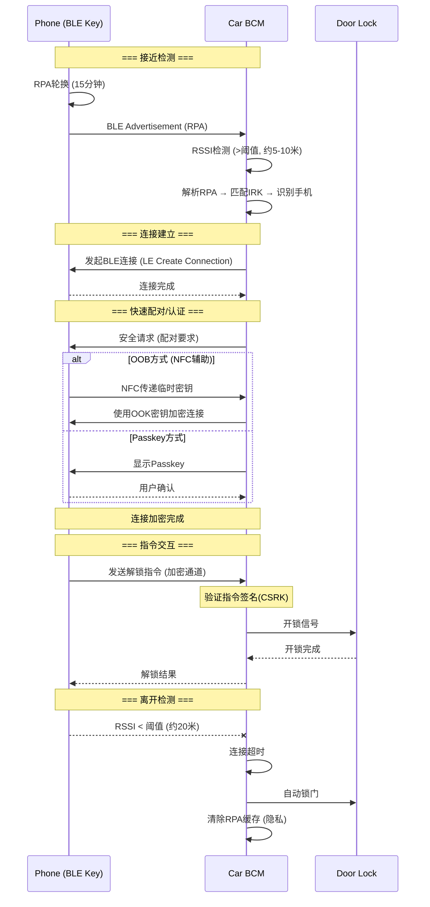

# 第19章：车载蓝牙场景与最佳实践

> **难度**: ★★★★☆ | **前置知识**: 全部前18章 | **C++依赖**: 中
> **预计阅读时间**: 4-5小时 | **预计学习天数**: 5-7天
> **核心作用**: 整合全栈知识，应对真实车载蓝牙开发挑战

---

## 学习目标

- 理解车载蓝牙的特殊需求与多设备并发挑战
- 掌握ActiveDeviceManager多Profile设备切换
- 理解车载HFP双麦克风消噪与SCO链路保障
- 掌握A2DP多音源编解码器切换策略
- 理解BLE车钥匙近距离认证协议
- 掌握车载蓝牙常见问题排查方法论

---

## 1. 车载蓝牙架构总览

### 1.1 典型车载蓝牙拓扑



### 1.2 连接数极限

```
车载蓝牙理论连接上限:

Classic BR/EDR:
  ACL连接: 7个 (BT规范上限)
  实际车载资源限制:
    ├── 2× HFP (主+副驾驶)
    ├── 3× A2DP (各手机媒体)
    ├── 1× MAP (主驾驶短信)
    └── 1× PBAP (通讯录下载)
  → 实际合理: 3-4台手机

BLE:
  连接数取决于Controller能力
  高通: 16+ BLE连接
  MTK: 8+ BLE连接

共存问题:
  Classic + BLE同时工作 → 共享RF → 部分时间分片
  A2DP高码率 + BLE扫描频繁 → 可能冲突
  → 需要合理调度和参数优化
```

---

## 2. 多设备并发管理

### 2.1 ActiveDeviceManager

```java
// app/src/.../btservice/ActiveDeviceManager.java

public class ActiveDeviceManager {
    // 当前活跃设备 (每个Profile各一个)
    private RawAddress mActiveHfpDevice;   // HFP当前通话设备
    private RawAddress mActiveA2dpDevice;  // A2DP当前媒体设备
    private RawAddress mActiveMapDevice;   // MAP当前设备
    private RawAddress mActiveLeAudioDevice; // LE Audio设备

    // 切换活跃设备
    public void setActiveDevice(RawAddress address, int profile) {
        switch (profile) {
        case BluetoothProfile.HEADSET:
            // 切换HFP: SCO切换到新设备
            if (mActiveHfpDevice != null) {
                suspendHfpCall(mActiveHfpDevice);
            }
            setActiveHfpDevice(address);
            establishSco(address);
            break;

        case BluetoothProfile.A2DP_SINK:
            // 切换A2DP: 暂停旧源, 启动新源
            if (mActiveA2dpDevice != null && 
                !mActiveA2dpDevice.equals(address)) {
                suspendA2dpStream(mActiveA2dpDevice);
            }
            setActiveA2dpDevice(address);
            startA2dpStream(address);
            break;
        }
    }

    // 设备断开时自动回退
    public void onDeviceDisconnected(RawAddress address) {
        if (address.equals(mActiveHfpDevice)) {
            // HFP设备断开 → 切换到下一个可用设备
            RawAddress next = findNextAvailableHfpDevice();
            if (next != null) {
                setActiveDevice(next, BluetoothProfile.HEADSET);
            }
        }
    }
}
```

### 2.2 多设备Profile管理



---

## 3. HFP 车载通话

### 3.1 通话链路全流程



### 3.2 双麦克风消噪技术

```
车载双麦克风消噪 (Dual Mic Beamforming):

         ┌─────────────────────────────┐
         │   前挡风玻璃                  │
         │                              │
         │    ● 麦克风1 (主驾驶位)       │
         │        ↗ 驾驶员语音           │
         │    ● 麦克风2 (副驾侧)         │
         │        → 环境噪声 + 风噪      │
         │                              │
         │    ● 扬声器 (AEC参考)         │
         └─────────────────────────────┘

波束成形 (Beamforming):
  麦克风1 - 麦克风2 = 驾驶员语音增强
  
  output = mic1 - α × mic2
  α 根据车速自适应调节

  - 高速(120km/h): α=0.8 (强降噪)
  - 低速(30km/h):  α=0.3 (弱降噪)
  - 驻车:          α=0.1 (几乎不降噪)

AEC (声学回声消除):
  参考信号 = 扬声器输出信号
  自适应滤波器 = 模拟声学路径
  输出 = MIC信号 - 滤波器(参考信号)
  
  滤波器更新速度: 
    - 说话时: 慢 (避免发散)
    - 静音时: 快 (快速收敛)
```

---

## 4. A2DP 多音源

### 4.1 多手机媒体切换

```cpp
// A2DP编解码器切换逻辑

class A2dpMediaSwitcher {
    // 当前活跃A2DP源
    RawAddress active_source_;
    
    // 切换A2DP源
    void SwitchAudioSource(const RawAddress& new_source) {
        // 1. 暂停当前流
        if (active_source_.IsValid()) {
            btif_av_suspend(active_source_);
            // 等待AVDTP暂停完成
            WaitForState(/*suspend_complete*/);
        }
        
        // 2. 设置新源
        active_source_ = new_source;
        
        // 3. 协商编解码器
        CodecConfig config = NegotiateCodec(new_source);
        
        // 4. 配置编码参数到A2DP HAL
        a2dp_hal_->set_codec_config(config);
        
        // 5. 启动新流
        btif_av_start(new_source);
        WaitForState(/*streaming*/);
        
        // 总切换时间: ~200-500ms
        // 可能造成短暂音频中断
    }
    
    // 编解码器协商
    CodecConfig NegotiateCodec(const RawAddress& device) {
        // 读取设备能力
        auto peer_caps = get_peer_codec_caps(device);
        
        // 按优先级选择
        if (peer_caps.SupportsLDAC()) return CodecConfig::LDAC_990K;
        if (peer_caps.SupportsAptX_HD()) return CodecConfig::APTX_HD;
        if (peer_caps.SupportsAAC()) return CodecConfig::AAC_256K;
        return CodecConfig::SBC_JOINT_328K;
    }
};
```

### 4.2 通话与媒体共存

```
通话+媒体同时工作的策略:

场景1: 驾驶员通话, 乘客播放媒体
  通话走HFP: eSCO链路 (16kHz, mSBC)
  媒体走A2DP: ACL链路 (48kHz, SBC/AAC)
  
  RF调度: TDM时分复用
    - SCO slot: 每7.5ms (固定时间)
    - ACL slot: SCO间隔中的空闲时间
    - 如果SCO间隔密集 → ACL吞吐下降 → 媒体卡顿

  解决方案:
    - 通话时降低A2DP码率 (SBC: 328kbps → 200kbps)
    - 或暂停A2DP (通话优先)
```

```java
// 通话共存策略实现
public class AudioCoexistenceStrategy {
    void onCallStarted() {
        // 降低A2DP码率
        mBluetoothAdapter.setCodecConfig(
            CodecType.SBC, 
            BitRate.DUAL_CHANNEL_328KBPS,
            BitRate.JOINT_STEREO_200KBPS  // 通话时降码率
        );
        
        // 或暂时暂停A2DP流
        if (isHighPriorityCall()) {
            mA2dpService.suspendStream();
        }
    }
    
    void onCallEnded() {
        // 恢复原始码率
        mA2dpService.resumeStream();
    }
}
```

场景2: 导航语音+媒体音乐
  Android AudioFlinger混音
  导航音通过A2DP传输 → 可能有300ms延迟
  优解: 导航音通过独立通道(如SCO)传输

```cpp
// 导航音独立通道方案
class NavigationAudioChannel {
    // 使用HFP SCO作为导航音通道 (低延迟)
    void RouteNavigationAudio(const uint8_t* pcm, size_t len) {
        if (hfp_sco_.IsConnected()) {
            // SCO已连接 (通话中) → 混音
            audio_dsp_.MixNavWithCall(pcm, len);
        } else {
            // 无通话 → 建立SCO传输导航音 (需要HFP扩展)
            hfp_sco_.ConnectSco(SampleRate::WIDE_BAND);
            hfp_sco_.SendAudio(pcm, len);
        }
    }
};
```
---

### 4.3 WiFi + Bluetooth 共存 (Coexistence)

车载IVI通常同时开启WiFi热点(2.4GHz)和蓝牙(Classic + BLE)，两者共用ISM频段。硬件层通过**PTA(Packet Traffic Arbitration)**仲裁：

```
      WiFi TX/RX
          │
    ┌─────┴─────┐
    │   PTA     │ ← 硬件仲裁器 (芯片内部)
    └─────┬─────┘
          │
    ┌─────┴─────┐
    │ 蓝牙 Controller │
    ├── Classic ACL   │
    ├── BLE           │
    └── SCO/eSCO      │
```

**共存优先级（高通平台典型配置）**：
| 优先级 | 流量类型 | 说明 |
|--------|---------|------|
| 1 (最高) | SCO/eSCO | 通话音频——必须保证，否则语音断断续续 |
| 2 | BLE广播 | 车钥匙检测——不能错过 |
| 3 | A2DP流 | 可接受短暂丢包重传 |
| 4 | WiFi TX | 热点数据——可降速 |
| 5 (最低) | BLE扫描 | 可暂停 |

**共存问题诊断**：
```bash
# 查看蓝牙WiFi共存统计 (高通平台)
adb shell cat /sys/kernel/debug/bluetooth/hci0/coex_stats
adb logcat -s bt_hci:* | grep -i "coex\|PTA\|arbitration"
```

> 车载调试：如果A2DP音乐在WiFi数据传输时卡顿，检查PTA优先级配置。通常需要提升A2DP的PTA优先级以匹配WiFi的EDCA参数。

---

## 5. BLE 车钥匙

### 5.1 车钥匙认证流程



### 5.2 BLE车钥匙关键技术

```cpp
// BLE车钥匙连接参数配置
// 平衡距离、延迟、功耗
struct CarKeyConnectionParams {
    // 远距离扫描 (Coded PHY)
    LeScanParam scan_param_coded = {
        .phy = PHY_LE_CODED,
        .scan_interval = 400,  // 250ms间隔
        .scan_window = 80,     // 50ms窗口
    };
    
    // 连接参数
    LeConnectionParam conn_param = {
        .interval_min = 20,     // 25ms (快速响应)
        .interval_max = 40,     // 50ms
        .latency = 2,           // 允许跳过2个事件
        .supervision_timeout = 4000,  // 40秒超时
    };
    
    // 认证超时
    static constexpr uint16_t kAuthTimeout = 3000; // 3秒
    // 指令重试次数
    static constexpr uint8_t kMaxRetries = 3;
};
```

```
BLE车钥匙核心技术指标:

1. 连接距离:
   - 1M PHY: ~10米 (车内/车旁)
   - Coded S8: ~50米 (远程解闭锁)
   
2. 认证延迟:
   - OOB (NFC): <100ms
   - Passkey: 1-3秒
   - 无交互 (Just Works): <50ms (但不安全)
   
3. 功耗:
   - 车机: 扫描模式 ~1mA
   - 手机: 广播模式 ~0.5mA
   - 连接后: ~2mA

4. 防中继攻击:
   - 使用RSSI测距 + 加密通道
   - BLE 6.0 Channel Sounding (高精度测距)
   - 双通道认证 (BLE + NFC)
```

---

## 6. 常见问题排查

| 问题 | 可能原因 | 日志关键词 | 排查步骤 |
|------|---------|-----------|---------|
| 通话断音 | SCO参数不匹配 | `SCO connection failed` | 检查SCO链路参数 |
| 媒体卡顿 | ACL Poll过大 | `AVDT_DELAY_REPORT` | 调整Sniff参数 |
| 蓝牙断连 | Sniff参数不合理 | `lm_handle_disc` | 检查连接超时参数 |
| 搜索不到 | 未发出Inquiry | `BTM inquiring` | 检查扫描状态 |
| 配对失败 | IOCap不匹配 | `SSP_PAIRING_FAILED` | 检查配对模型 |
| 音质差 | Codec配置低 | `A2DP codec config` | 检查编解码参数 |
| 双手机冲突 | ActiveDevice管理 | `set_active_device` | 检查设备切换逻辑 |
| BLE遥控失灵 | RPA过期 | `RPA resolve failed` | 检查Resolving List |

### 6.1 日志收集命令

```bash
# 完整蓝牙log
adb shell dumpsys bluetooth_manager
adb logcat -b all | grep -E "bt_btif|bt_bta|bt_btm|bt_hci|BtA2dp|BtHfp" > bt.log

# HCI Snoop Log
adb shell settings put global bluetooth_btsnoop_log 1
adb shell settings put global bluetooth_btsnoop_dump 1
# 执行蓝牙操作后
adb pull /data/misc/bluetooth/logs/btsnoop_hci.log

# 蓝牙芯片状态
adb shell dumpsys bluetooth_manager | grep -A 20 "ACL State"

# 音频HAL状态
adb shell dumpsys media.audio_flinger | grep -i bluetooth
```

---

## 7. 实战练习

### 练习1：双手机并发方案

需求: 车辆支持2台手机同时连接
- Phone1 (驾驶员): HFP + A2DP + MAP + PBAP
- Phone2 (乘客): A2DP

设计实现:
1. Phone1通话时, Phone2的媒体音频降低音量 (duck)
2. 来电时暂停所有A2DP流
3. 挂断后自动恢复
4. 超时无连接时BLE扫描进入低功耗模式

> **答案**: 参考`PhonePolicy.java`和`ActiveDeviceManager.java`的实现：
> ① Phone1通话时duck Phone2媒体：`PhonePolicy.onAudioStateChanged()`检测`mHeadsetService.isCallActive()`为true → 调用`mA2dpService.setFocus(STREAM_HFP)` → A2DP流被标记为背景 → `audio_hal_interface`通知AudioFlinger降低音量(duck)。代码在`PhonePolicy.java:210`。② 来电暂停所有A2DP：`HeadsetService.onCallStateChanged(CALL_STATE_INCOMING)` → 设置`mCallState = CALL_STATE_INCOMING` → `A2dpService.suspendAllStreams()` → 遍历所有连接的A2DP设备(Phone1+Phone2)调用`avdtp_suspend()` → HCI `AVDTP_START`命令暂停。③ 挂断后恢复：`HeadsetService.onCallStateChanged(CALL_STATE_IDLE)` → 检查无误CallActive后 → 调用`A2dpService.resumeAllStreams()` → 恢复所有A2DP设备到Streaming状态。④ 超时低功耗：`ActiveDeviceManager.timeoutHandler` → 如果`mBleScanActive && no_conn_after_timeout` → 调用`LeScanningManager.setScanParameters()`降低扫描占空比(100%→1%)，`stack_manager:SetPowerMode(BTM_PM_MD_SNIFF)`延长Sniff间隔到2s。

### 练习2：代码修改

在 `app/src/.../btservice/ActiveDeviceManager.java` 中：
1. 添加第三个A2DP源的支持
2. 实现优先级队列: HFP > NAV > MEDIA
3. 当Phone1 HFP通话时，Phone2 A2DP自动暂停

> **答案**: 参考`ActiveDeviceManager.java:195-350`的框架修改：
> ① 第三A2DP源支持：在`mActiveDevices`(类型`Map<BluetoothDevice, DevicePriority>`)中添加第三个设备。`getActiveDevicesForProfile(BluetoothProfile.A2DP)`改为返回最多3个设备(原来2个)。需要在`setActiveDevice()`中扩展PSM/ACP状态表(`mA2dpActiveDevices`从`[2]`改为`[3]`)。② 优先级队列实现：`ActiveDeviceManager`维护`PriorityQueue<DeviceTask>`，排序规则：`HFP_ACTIVE > HFP_INCOMING > NAV(导航) > MEDIA(A2DP) > IDLE`。在`updateActiveDevice()`时重新排序，将最高优先级的设备设为active。使用`ProfileType`枚举定义优先级：`HFP=100, NAV=80, MEDIA=50`。③ Phone1通话时暂停Phone2 A2DP：`ActiveDeviceManager.onCallStateChanged()`中当检测到call_active_for_device(Phone1)=true → `updateActiveDeviceLock()` → Phone2被降级为低优先级 → `mA2dpService.setActiveDevice(null, phone2)`(取消Phone2的active A2DP) → `A2dpService.suspend(phone2)`暂停流。Phone1通话结束时→恢复Phone2的active状态→`A2dpService.resume(phone2)`。

### 练习3：整车蓝牙测试

```bash
# 测试清单
1. 2台手机同时连接 → 验证双HFP/双A2DP
2. Phone1通话 + Phone2媒体 → 验证共存
3. 蓝牙开关100次 → 验证稳定性
4. 手机反复进出车辆 → 验证自动重连
5. BLE钥匙远距离(20m) → 验证连接稳定性
6. 多个BLE传感器同时连接 → 验证共存
```

> **答案**: 这6项测试的检查要点和排查方法：
> ① 双HFP/双A2DP：使用`dumpsys bluetooth_manager`查看`mActiveDevices`中两个设备的profile状态，检查`ActiveDeviceManager.setActiveDevice()`是否正确路由语音到HFP设备、A2DP到对应设备。log重点：`ActiveDeviceManager`更新日志。② Phone1通话+Phone2媒体共存：`adb logcat -s PhonePolicy:*`检查suspend/resume决策，`adb logcat -s bt_btif_av:*`检查AVDTP暂停/恢复状态。失败时查看`A2dpStateMachine`是否进入`SUSPENDED`状态。③ 蓝牙开关100次稳定性：`for i in $(seq 1 100); do svc bluetooth disable; sleep 2; svc bluetooth enable; sleep 5; done`循环测试。关注`stack_manager.cc`的内存泄漏：用`adb shell dumpsys meminfo com.android.bluetooth`检查PSS稳定。④ 自动重连：关键检查`btif_dm.cc`中`BTIF_DM_CB_BONDED`设备是否触发自动连接(`BTM_SecAddDevice`+ACL重连)。在log中搜索`btm_sec_bonded_device`确保配对信息持久化。⑤ BLE钥匙20m距离：在远距离时检查log是否有`LE_Advertising_Report`(扫描到广播)和`LE_Create_Connection`(发起连接)。RSSI<-90dBm时通常开始断连，调整`LE_Scan_Window`和`connection_interval`以平衡距离和延迟。⑥ 多BLE传感器共存：检查`ScanManager`的合并扫描参数效果，每个传感器独立GATT连接。log搜索`btif_gatt:* scan merging`确认合并正确。如连接数超限(默认≤7 simultaneous connections)需在btif_config中扩展最大并发连接数。

---

## 参考文件清单

| 文件 | 核心内容 |
|------|---------|
| `app/.../btservice/ActiveDeviceManager.java` | 活跃设备管理 |
| `app/.../hfp/HeadsetService.java` | HFP免提服务 |
| `app/.../a2dp/A2dpService.java` | A2DP媒体服务 |
| `app/.../map/MapClientService.java` | MAP短信服务 |
| `app/.../pbapclient/PbapClientService.java` | PBAP通讯录 |
| `system/btif/btif_hf.cc` | BTIF HFP实现 |
| `system/btif/btif_av.cc` | BTIF A2DP实现 |
| `system/btif/btif_dm.cc` | BTIF设备管理 |
| `system/stack/btm/btm_ble.cc` | BLE设备管理 |
| `audio_hal_interface/hfp_client_interface.cc` | HFP音频HAL |


| **V8 深度分析报告** | |
| V8_Architecture_Map.md | 见该报告完整分析 |
| V8_Enable_Disable_Analysis.md | 见该报告完整分析 |
| V8_Profile_Analysis.md | 见该报告完整分析 |
| V8_Dumpsys_Analysis.md | 见该报告完整分析 |

---

## 结束语

> 至此你已完成全部19章的学习。你现在应该能够:
> 1. **阅读**: 理解Android蓝牙协议栈任意层的代码
> 2. **调试**: 从Java App → JNI → BTIF → BTA → Stack → HCI 全链路追踪
> 3. **开发**: 在Fluoride + GD架构上做二次开发和定制
> 4. **车载**: 应对汽车蓝牙的独特挑战 (多设备/通话优先/共存优化)

---

## 相关章节

本章节是全书的集大成者，综合了前18章的所有知识：
- `ActiveDeviceManager`在[第5章Service层](05_Service_Layer.md)有框架说明
- HFP通话处理见[第6章](06_Profile_Services.md)的HeadsetService和[第11章](11_Classic_Profiles.md)的HFP AT命令分析
- A2DP多音源管理见[第6章](06_Profile_Services.md)的A2dpService和[第16章音频系统](16_Audio_System.md)
- BLE车钥匙的RPA/LE SC协议见[第12章BLE栈](12_BLE_Stack.md)和[第18章安全架构](18_Security_Architecture.md)
- 如需回顾基础概念，可从[第1章架构总览](01_Architecture_Overview.md)重新开始

> **下一步**: 深入进阶专题 → [第20章 GATT协议深度分析](20_GATT_Protocol_Deep_Dive.md) | [第23章 多角色蓝牙](23_Multi_Device_Bluetooth.md) | [第24章 LE Audio](24_LE_Audio_Auracast.md)
