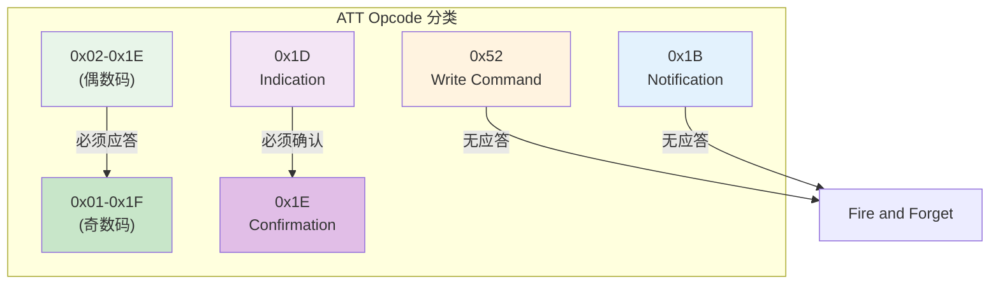
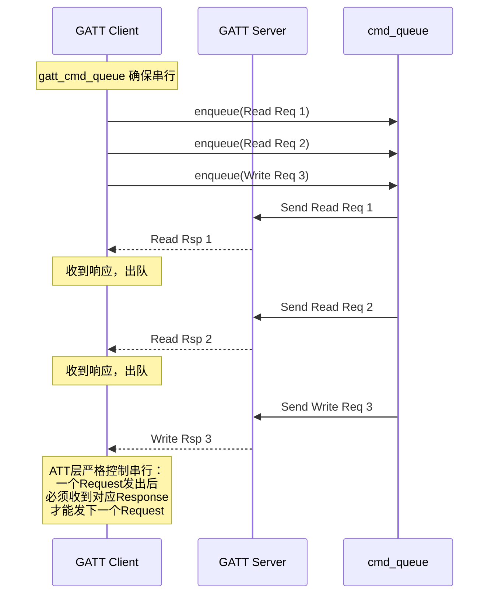
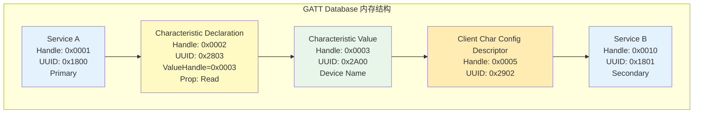
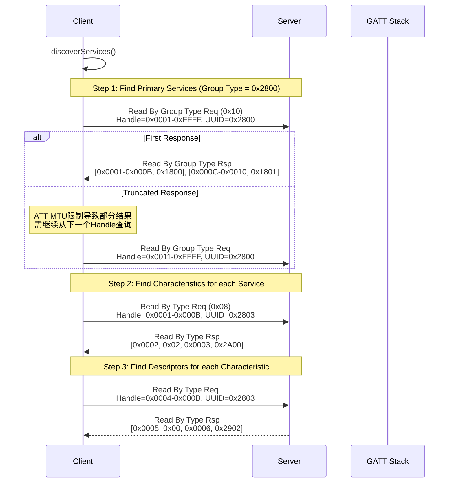
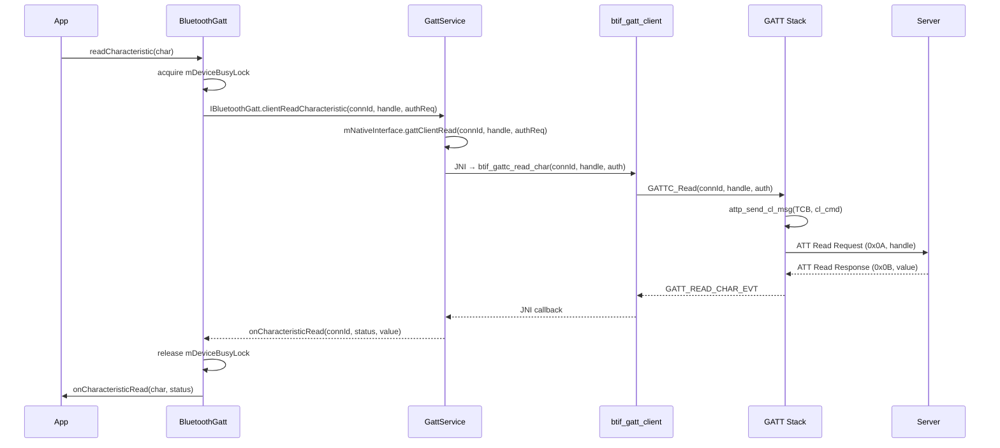
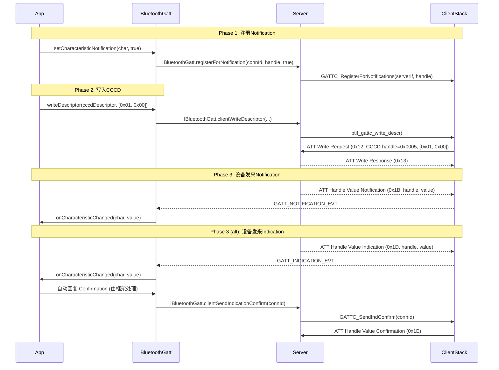
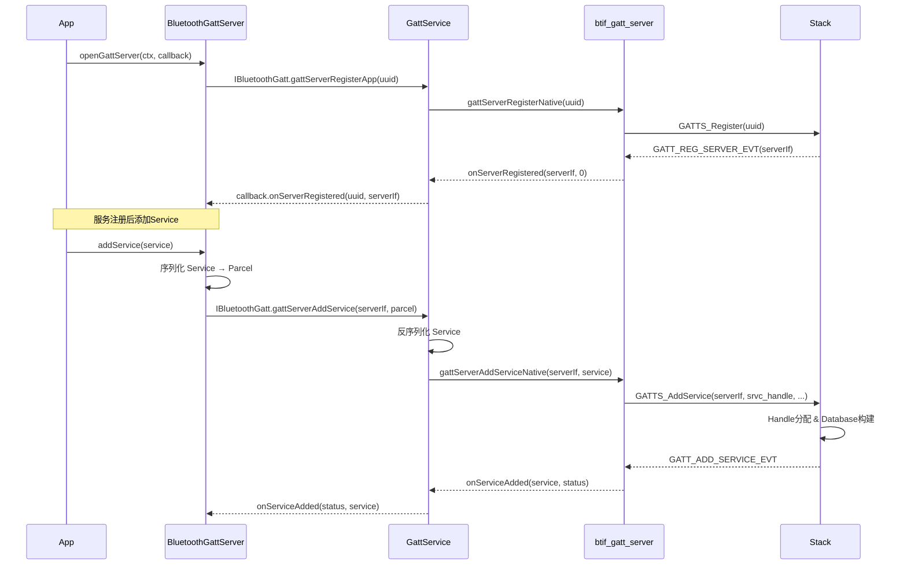
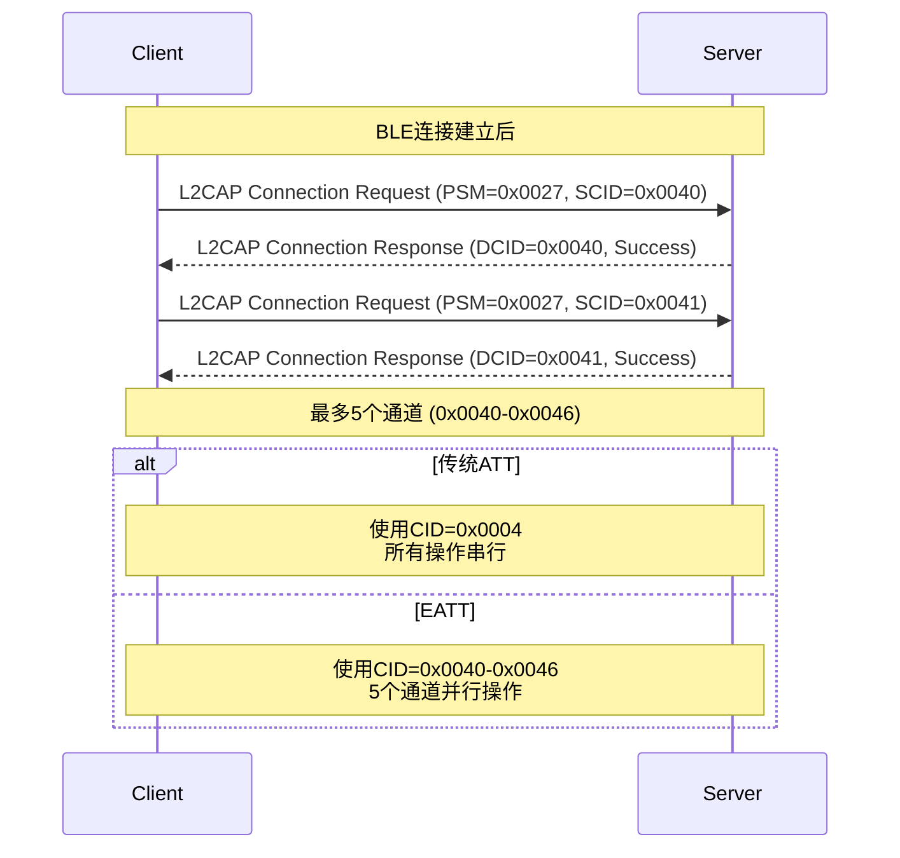
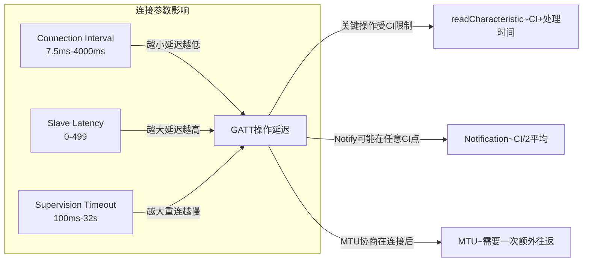
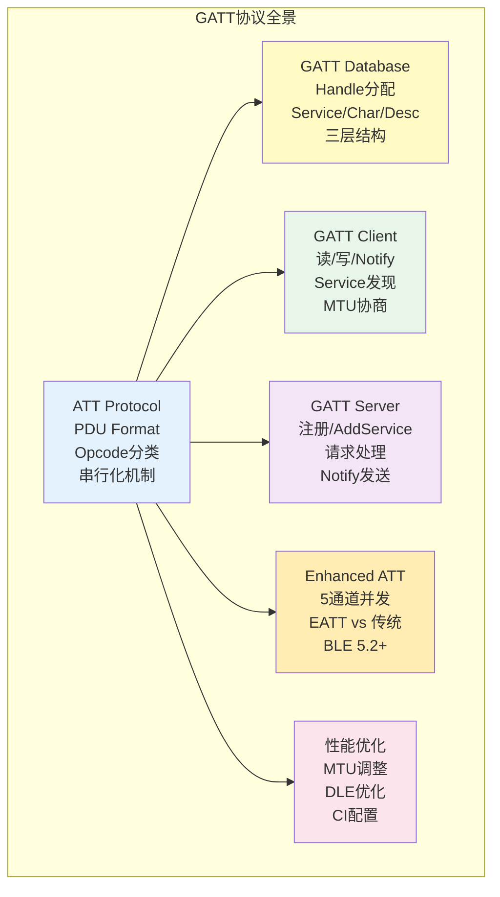

# 第20章：GATT协议深度分析

> **难度**: ★★★★★ | **前置知识**: Ch12 BLE Stack, Ch6 Profile Services
> **预计阅读时间**: 4-5小时 | **预计学习天数**: 4-6天
> **核心作用**: 深入理解ATT/GATT协议的完整实现，从PDU格式到性能调优

---

## 学习目标

- 理解ATT协议PDU格式和操作分类
- 掌握GATT Client和Server的完整操作流程
- 理解EATT（Enhanced ATT）的多通道并发模型
- 掌握GATT数据库在内存中的表示和Handle分配机制
- 理解MTU协商、DLE和吞吐量的关系
- 学会使用HCI Snoop Log分析ATT PDU
- 了解车载场景下GATT的典型应用

---

## 1. ATT协议详解

### 1.1 ATT PDU格式

ATT协议在BLE L2CAP之上运行，每个ATT PDU的基本格式为：

```
BLE L2CAP Header (4 bytes)  |  ATT PDU (variable)
Length(2) | CID=0x0004(2)   |  Opcode(1) | Parameters(variable)
```

ATT操作码（Opcode）由两部分组成：

```cpp
// stack/gatt/gatt_int.h
#define GATT_REQ_MASK           0x40    // Request/Response 位
#define GATT_CMD_MASK           0x80    // Command/Notification 位
#define GATT_AUTH_SIGN_MASK     0x80    // 认证签名位（仅Command类）
```

Opcode bit layout:
```
Bit 7 (0x80): Command/Notification → Method flag
Bit 6 (0x40): Request/Response     → Method flag
Bit 5 (0x20): Authentication Signature (for Write Command)
Bits 4-0:     Opcode Method
```

### 1.2 ATT操作分类



关键ATT操作码（`att_protocol.cc` 定义）：

| Opcode | 名称 | 类型 | 描述 |
|--------|------|------|------|
| 0x02 | MTU Request | Request | MTU协商请求 |
| 0x03 | MTU Response | Response | MTU协商响应 |
| 0x08 | Read By Type Request | Request | 按类型读取 |
| 0x09 | Read By Type Response | Response | 按类型读取响应 |
| 0x0A | Read Request | Request | 按Handle读取 |
| 0x0B | Read Response | Response | 按Handle读取响应 |
| 0x0C | Read Blob Request | Request | 长读取（带偏移） |
| 0x0D | Read Blob Response | Response | 长读取响应 |
| 0x0E | Read Multiple Request | Request | 多Handle读取 |
| 0x0F | Read Multiple Response | Response | 多Handle读取响应 |
| 0x12 | Write Request | Request | 写（等待确认） |
| 0x13 | Write Response | Response | 写确认 |
| 0x52 | Write Command | Command | 写（无确认） |
| 0x16 | Prepare Write Request | Request | 准备写（长写） |
| 0x18 | Execute Write Request | Request | 执行写（长写提交） |
| 0x1B | Handle Value Notification | Notification | 通知 |
| 0x1D | Handle Value Indication | Indication | 指示（需确认） |
| 0x1E | Handle Value Confirmation | Confirmation | 指示确认 |

### 1.3 ATT操作串行化



队列实现在 `gatt_main.cc`:

```cpp
// gatt_main.cc - GATT command queue
tGATT_TCB::gatt_cmd_queue  // 每个连接有一个命令队列
// 串行规则:
// 1. Channel 0 (传统ATT): 一次只能有一个未完成的 Request
// 2. EATT Channels (0x0040-0x0046): 每个通道独立串行
// 3. Write Command (0x52) 和 Notification 不受队列限制
```

### 1.4 MTU协商实现

```cpp
// att_protocol.cc - MTU请求构建
static BT_HDR* attp_build_mtu_cmd(uint8_t op_code, uint16_t rx_mtu) {
  uint8_t* p;
  BT_HDR* p_buf = (BT_HDR*)osi_malloc(
      sizeof(BT_HDR) + GATT_HDR_SIZE + L2CAP_MIN_OFFSET);

  p = (uint8_t*)(p_buf + 1) + L2CAP_MIN_OFFSET;
  UINT8_TO_STREAM(p, op_code);     // ATT_MTU_REQ (0x02) 或 ATT_MTU_RSP (0x03)
  UINT16_TO_STREAM(p, rx_mtu);     // 本端接收MTU

  p_buf->offset = L2CAP_MIN_OFFSET;
  p_buf->len = GATT_HDR_SIZE;     // 1 byte opcode + 2 bytes MTU
  return p_buf;
}
```

MTU协商结果 = `min(client_rx_mtu, server_rx_mtu)`，协商结果存储在：

```cpp
// gatt_int.h
typedef struct {
    uint16_t att_mtu;         // 协商后的ATT MTU
    uint16_t payload_size;    // payload = att_mtu - 1 (opcode)
} tGATT_TCB;
```

> **关键**: 默认ATT MTU=23字节（payload=22）。协商后Android通常使用517字节（512 payload）。MTU协商一次后在整个连接生命周期内保持不变。

---

## 2. GATT Database结构

### 2.1 Handle分配机制



Handle分配规则：

```cpp
// gatt_api.cc - GATTS_AddService
uint16_t GATTS_AddService(tGATT_IF gatt_if, btgatt_srvc_id_t* srvc_id,
                           uint8_t num_handles) {
  tGATT_SRVC_DB* db = ...;
  // num_handles 指定该服务需要多少个连续的Handle
  // 框架计算: base handle + include service handles
  //           + characteristic declaration handles
  //           + value handles + descriptor handles
  // GATT database 总Handle数上限: 512 (GATT_MAX_SRVC_DB_ENTRIES)
}
```

### 2.2 Service/Characteristic/Descriptor三层结构

```cpp
// gatt_int.h - GATT database entry
typedef struct {
    uint16_t          handle;         // 句柄
    uint8_t           type;           // 入口类型
    uint16_t          uuid16;         // 16-bit UUID
    bluetooth::Uuid   uuid128;        // 128-bit UUID
    tGATT_ATTR_VAL    attr_value;     // 属性值
    uint8_t           permissions;    // 权限
    uint16_t          characteristic_properties;  // Characteristic属性
} tGATT_SRVC_DB_ENTRY;

typedef struct {
    uint16_t            next_handle;          // 下一个可用Handle
    tGATT_SRVC_DB_ENTRY database[GATT_MAX_SRVC_DB_ENTRIES]; // 512
    uint16_t            entries_count;        // 当前条目数
} tGATT_SRVC_DB;
```

### 2.3 Characteristic Declaration格式

```cpp
// Characteristic Declaration Value (handle = X, UUID = 0x2803)
// 3 + 2/16 bytes:
// +--------+--------+--------+--------+--------+
// | Props  | Value Handle (2 bytes) | UUID ... |
// +--------+--------+--------+--------+--------+
// Props: bitmask of GATT_CHAR_PROP_*
#define GATT_CHAR_PROP_BIT_BROADCAST       0x01
#define GATT_CHAR_PROP_BIT_READ            0x02
#define GATT_CHAR_PROP_BIT_WRITE_NR        0x04  // Write Without Response
#define GATT_CHAR_PROP_BIT_WRITE           0x08
#define GATT_CHAR_PROP_BIT_NOTIFY          0x10
#define GATT_CHAR_PROP_BIT_INDICATE        0x20
#define GATT_CHAR_PROP_BIT_AUTH_SIGN_WRITE 0x40  // Signed Write
#define GATT_CHAR_PROP_BIT_EXT_PROP        0x80  // Extended Properties
```

### 2.4 Include Service

当一个Service包含另一个Service时（例如GATT GAP Service），使用Include定义：

```
Include Definition (handle = X, UUID = 0x2802):
+--------+--------+--------+--------+--------+
| Included Handle (2B) | End Handle (2B) | UUID... |
+--------+--------+--------+--------+--------+
```

---

## 3. GATT Client操作深入

### 3.1 Service发现流程



### 3.2 Characteristic读取内部实现



### 3.3 Notification/Indication全流程



### 3.4 长数据读写 (Long Read/Write)

当Characteristic值超过ATT MTU时，使用Long Read/Write：

```cpp
// att_protocol.cc - Long Read
// BluetoothGatt 自动处理分片:
// 1. readCharacteristic(value_handle) → 触发标准 Read Request
// 2. 如果响应码为 Read Response，且响应中包含完整数据 → OK
// 3. 如果值 > (ATT_MTU - 1)，框架自动发起 Read Blob Request
//    Read Blob Req (0x0C, handle, offset=0)
//    Read Blob Rsp (0x0D, value[0..MTU-2])
//    Read Blob Req (0x0C, handle, offset=MTU-1)
//    Read Blob Rsp (0x0D, value[MTU-1..2*MTU-3])
//    ...直到响应长度 < MTU-1

// Long Write 使用 Prepare Write + Execute Write:
// 1. Prepare Write Req (0x16, handle, offset=0, partial data)
//    Prepare Write Rsp (0x17, handle, offset=0, data)
// 2. Prepare Write Req (0x16, handle, offset=M, partial data)
//    Prepare Write Rsp (0x17, handle, offset=M, data)
// 3. Execute Write Req (0x18, flag=0x01=立即执行)
//    Execute Write Rsp (0x19)
```

### 3.5 并发读取约束

```cpp
// BluetoothGatt.java
// mDeviceBusyLock - GATT操作互斥锁
// mStateLock - 连接状态互斥锁

// 规则:
// 1. 一个操作未完成前，不能发起下一个操作（除Write Command外）
// 2. EATT提供5个独立通道，每个通道独立串行
// 3. Write Command (0x52) 和 Notification 可以在任何时间接收
// 4. Indication发送后必须等待Confirmation才能继续该通道
```

---

## 4. GATT Server操作深入

### 4.1 Server注册与Service添加



### 4.2 Handle分配算法

```cpp
// gatt_api.cc - GATTS_AddService handle allocation
uint16_t GATTS_AddService(tGATT_IF gatt_if, btgatt_srvc_id_t* srvc_id,
                           uint8_t num_handles) {
  tGATT_SRVC_DB* db = &gatt_cb.srvc_db[gatt_if];

  // 1. 检查Database剩余空间
  if (db->entries_count + num_handles > GATT_MAX_SRVC_DB_ENTRIES) {
    return 0;  // GATT_DB_FULL
  }

  // 2. Handle: 每个GATT_IF独立分配，从0x0001开始
  uint16_t start_handle = db->next_handle;  // 当前可用handle

  // 3. 依次添加 Include → Characteristic Decl → Value → Descriptor
  for (each include service)
    GATTS_AddIncludeSrvc(..., &db->database[db->entries_count]);

  for (each characteristic) {
    GATTS_AddChar(...);    // Declaration handle
    db->entries_count++;
    GATTS_AddCharValue(...); // Value handle
    db->entries_count++;
    for (each descriptor)
      GATTS_AddDesc(...);  // Descriptor handle
      db->entries_count++;
  }

  // 4. 更新next_handle
  db->next_handle = start_handle + num_handles;
  return start_handle;
}
```

### 4.3 读写请求处理

```cpp
// btif_gatt_server.cc - 处理读写请求
static void bta_gatts_cback(tBTA_GATTS_EVT event, tBTA_GATTS* p_data) {
  switch (event) {
    case BTA_GATTS_READ_REQ_EVT: {
      // 收到客户端读取请求
      tBTA_GATTS* p = &p_data;
      // 透传给JNI → GattService → App
      do_in_jni_thread(FROM_HERE, base::BindOnce(
          &gattServerOnCharacteristicReadRequest,
          p->req_data.conn_id, p->req_data.trans_id,
          p->req_data.p_data, ...));
      break;
    }

    case BTA_GATTS_WRITE_REQ_EVT: {
      // 收到客户端写入请求
      // 需要App调用 sendResponse() 回复
      // 对于 Write Without Response, 框架自动回复
      break;
    }
  }
}
```

### 4.4 Notify/Indicate发送

```cpp
// BluetoothGattServer.java
public boolean notifyCharacteristicChanged(BluetoothDevice device,
                                            BluetoothGattCharacteristic characteristic,
                                            boolean confirm) {
  // confirm=true  → Indication (需确认)
  // confirm=false → Notification (无确认)

  // GattService处理:
  // gattServerNotifyCharacteristicChanged(serverIf, device, handle, confirm, value)
  //  → btif_gatts_send_indication()
  //    → BTA_GATTS_HandleValueIndication(connId, handle, value, need_confirm)
}
```

---

## 5. EATT（Enhanced ATT）

### 5.1 EATT通道建立



### 5.2 EATT源码分析

```cpp
// stack/eatt/eatt_channel.h
class EattChannel {
public:
    static constexpr uint16_t kEattMinCid = 0x0040;
    static constexpr uint16_t kEattMaxCid = 0x0046;
    static constexpr uint8_t kEattMaxChannels = 5;

    // 每个通道独立维护:
    uint16_t local_cid_;      // 本地CID
    uint16_t remote_cid_;     // 远端CID
    bool configured_;          // 通道是否配置完成
    bool in_use_;             // 通道是否正在使用

    // 发送队列 - 每个通道独立
    std::queue<BT_HDR*> pending_queue_;
};

// gatt_int.h - EATT通道与TCB的关系
typedef struct {
    // 传统ATT
    uint16_t att_mtu;                         // 协商MTU
    BT_HDR* pending_cl_req;                    // 当前未完成的Request

    // EATT
    EattChannel eatt_channel[kEattMaxChannels]; // 最多5个通道
    uint8_t eatt_channel_count;               // 已建立的通道数
} tGATT_TCB;
```

### 5.3 EATT vs 传统ATT

| 特性 | 传统ATT (CID=0x0004) | EATT (CID=0x0040-0x0046) |
|------|---------------------|--------------------------|
| 通道数 | 1 | 最多5 |
| 并发操作 | 否（串行） | 是（每通道独立串行） |
| PDU限制 | 同通道 | 不限 |
| MTU | 单MTU | 每通道独立MTU |
| 安全性 | 同连接 | 需要加密连接 |
| Android支持 | Android 4.4+ | Android 13+ (BLE 5.2) |

---

## 6. 吞吐量与性能

### 6.1 MTU对吞吐量的影响

```
公式: Throughput = (ATT_MTU - 1) × packets_per_connection_interval
                   ──────────────────────────────────────────────
                    connection_interval

示例 (Connection Interval = 7.5ms, 1 packet per interval):
  MTU=23:   Throughput = 22 × (1000/7.5) ≈ 2,933 bytes/s
  MTU=517:  Throughput = 512 × (1000/7.5) ≈ 68,267 bytes/s
  MTU=517+DataLength256: ≈ 178,000 bytes/s
```

### 6.2 Connection Interval与GATT延迟



### 6.3 Data Length Extension (DLE)

```cpp
// BLE 4.2+ Data Length Extension
// 默认: 发送27字节, 接收27字节
// DLE协商后: 最大251字节

// 对GATT的影响 - MTU vs DLE:
// 发送数据时: min(ATT_MTU-1, DLE_TX_octets-4)
// 实际PDU大小受两者中较小者限制

// 最优配置:
// ATT_MTU = 517 (Android默认)
// DLE_TX = 251
// Connection Interval = 7.5ms
// → 一个连接间隔可传输 247 bytes payload
// → 大MTU需要多个连接间隔分片

// stack/l2cap/l2c_ble.cc - DLE协商
void l2c_ble_process_data_length_change_event(...) {
  // 自动协商发送和接收Data Length
  // 协商结果存储在 L2CAP_TCB 中
}
```

### 6.4 性能优化建议

```cpp
// 1. 增加ATT MTU: 在连接后立即 requestMtu(517)
// 2. 使用BLE 4.2 DLE: 自动协商，无需手动配置
// 3. 优化Connection Interval:
//    BLE 5.0+ 支持 Connection Subrating
//    动态调整连接间隔（快速读取时缩小，空闲时放大）
// 4. 使用EATT (BLE 5.2+): 并行ATT通道
// 5. 避免频繁认证/加密操作: 每次加密会消耗~50ms
```

---

## 7. ATT PDU实战分析

### 7.1 HCI Snoop Log抓取

```bash
# 方法1: Developer Options
# 设置 → 开发者选项 → 开启 Bluetooth HCI Snoop Log
# 文件位置: /data/misc/bluetooth/logs/btsnoop_hci.log

# 方法2: 命令行开启
adb shell svc bluetooth disable
adb shell setprop persist.bluetooth.btsnoopenable true
adb shell svc bluetooth enable

# 抓取后导出
adb pull /data/misc/bluetooth/logs/btsnoop_hci.log .
# 使用 Wireshark 打开分析
```

### 7.2 ATT PDU逐包分析

```
Frame 1: ATT MTU Exchange
  Opcode: 0x02 (MTU Request)
  Client RX MTU: 517

Frame 2: ATT MTU Response
  Opcode: 0x03 (MTU Response)
  Server RX MTU: 517
  → 协商MTU = 517

Frame 3: Read By Group Type Request
  Opcode: 0x10
  Starting Handle: 0x0001
  Ending Handle: 0xFFFF
  UUID: 0x2800 (Primary Service)

Frame 4: Read By Group Type Response
  Opcode: 0x11
  Length: 6 (每组数据长度)
  Data:
    [Handle 0x0001-0x000B, UUID 0x1800 (Generic Access)]
    [Handle 0x000C-0x0010, UUID 0x1801 (Generic Attribute)]

Frame 5: Read By Type Request
  Opcode: 0x08
  Starting Handle: 0x0001
  Ending Handle: 0x000B
  UUID: 0x2803 (Characteristic Declaration)

Frame 6: Read By Type Response
  Opcode: 0x09
  Length: 7
  [Handle 0x0002, Props=0x02, ValueHandle=0x0003, UUID=0x2A00 (Device Name)]

Frame 7: Read Request
  Opcode: 0x0A
  Handle: 0x0003

Frame 8: Read Response
  Opcode: 0x0B
  Value: 0x4E6F6465203120 (ASCII: "Nexus 5")
```

### 7.3 常见错误码

```cpp
// gatt_api.h
enum tGATT_STATUS : uint8_t {
    GATT_SUCCESS                 = 0x00,
    GATT_INVALID_HANDLE          = 0x01,  // Handle超出范围
    GATT_READ_NOT_PERMIT         = 0x02,  // 属性无读权限
    GATT_WRITE_NOT_PERMIT        = 0x03,  // 属性无写权限
    GATT_INVALID_PDU             = 0x04,  // PDU格式错误
    GATT_INSUFFICIENT_AUTHENTICATION = 0x05, // 需要配对
    GATT_REQUEST_NOT_SUPPORTED   = 0x06,  // 不支持的操作
    GATT_INVALID_OFFSET          = 0x07,  // 偏移量非法
    GATT_INSUFFICIENT_AUTHORIZATION  = 0x08, // 需要授权
    GATT_PREPARE_QUEUE_FULL      = 0x09,  // 准备写队列满
    GATT_ATTR_NOT_LONG           = 0x0B,  // 不支持长读/写
    GATT_INSUFFICIENT_ENCRYPTION = 0x0C,  // 需要加密
    GATT_INVALID_ATTR_LEN        = 0x0D,  // 属性长度非法
    GATT_UNLIKELY_ERROR          = 0x0E,  // 意外错误
    GATT_INSUFFICIENT_ENCRYPTION_KEY_SIZE = 0x0F, // 密钥强度不足
    GATT_CCCD_CFG_ERR            = 0x80,  // CCCD配置错误
    GATT_PRC_IN_PROGRESS         = 0xFE,  // 操作处理中
};
```

---

## 8. 车载GATT场景

### 8.1 OBD-II GATT Service

车载诊断系统常用OBD-II Profile通过BLE传输车辆数据：

```
OBD-II Service UUID: 0xFFF0
  └─ OBD-II Data Characteristic (UUID: 0xFFF1)
       └─ 属性: Read + Notify
       └─ 值: ISO 15765-4 CAN 协议报文
  └─ OBD-II Control Characteristic (UUID: 0xFFF2)
       └─ 属性: Write
       └─ 写入OBD-II请求 (PID查询)
```

典型读取流程：
1. App通过OBD-II Service的Write Characteristic发送PID请求（如 `010D` = 车速）
2. 车机GATT Server收到Write Request，透传给CAN总线
3. CAN返回数据后，Server通过Notification推送结果
4. App收到Notification，解析车辆数据

### 8.2 数字钥匙 (CCC Digital Key)

Car Connectivity Consortium (CCC) 数字钥匙使用LE Secure Connections:

```
CCC Digital Key Service UUID: 0xFD0E
  └─ DK Configuration Characteristic
  └─ DK Session Characteristic
  └─ DK Data Characteristic
```

GATT要求：
- 必须使用LE Secure Connections配对
- MTU ≥ 512（大密钥交换数据）
- 必须在短时间内完成多步认证（Driver Distraction限制）
- EATT推荐用于并发握手

### 8.3 多传感器并发读取优化

车载中常见多个BLE传感器同时读取（胎压、门窗、电池）：

```
问题场景:
- 4个胎压传感器 + 1个电池管理系统 + 1个门锁状态
- 传统ATT: 串行读取6个特征，总耗时 = 6 × (CI+处理时间)
- 如 CI=30ms: 总耗时 ~200ms (可接受)
- 如 CI=100ms: 总耗时 ~700ms (延迟过高)

优化方案:
1. 使用EATT 5通道并行读取 → 耗时降低 ~80%
2. 使用Notification替代Read → 无需轮询
3. 优化Connection Interval: 高数据需求时缩小CI
4. 使用Connection Subrating (BLE 5.0+) 动态CI调整
```

---

## 9. 实战练习

### 练习1: GATT操作抓包分析

使用Android手机和Wireshark分析实际GATT流量：

```bash
# 步骤1: 开启HCI Snoop Log
adb shell setprop persist.bluetooth.btsnoopenable true
adb reboot

# 步骤2: 执行GATT操作（扫描并连接BLE设备，读写Characteristic）
# 可使用 nRF Connect App 或 LightBlue

# 步骤3: 导出Snoop Log
adb pull /data/misc/bluetooth/logs/btsnoop_hci.log .

# 步骤4: Wireshark中过滤ATT协议
btsnoop_hci.log → 过滤: btatt
```

**问题**:
1. 找出MTU协商请求和响应帧，计算使用的MTU
2. 找出Service发现过程的Read By Group Type帧，列出发现的Primary Service
3. 找出Characteristic读写的ATT帧，分析操作码和参数
4. 识别Notification和Indication帧的区别

### 练习2: GATT MTU对吞吐量的影响

```bash
# 使用 Android GATT API 测试不同MTU下的吞吐量
# 连接BLE设备后，分别使用MTU=23和MTU=517传输相同数据

adb logcat -s GattService:* bt_btif_gattc:*
# 观察: "att_mtu" 日志观察协商结果
# 观察: "onCharacteristicWrite" 耗时
```

**问题**:
1. 在MTU=23时写入500字节数据，需要多少个ATT Write操作？
2. 在MTU=517时写入500字节数据，需要多少个操作？
3. 填写下表（估算）：

| MTU | 每包有效载荷 | 500字节所需包数 | 单包延迟 | 总延迟 |
|-----|-------------|---------------|---------|-------|
| 23 | 22 | 23包 | ~7.5ms | ~172ms |
| 100 | 99 | 6包 | ~7.5ms | ~45ms |
| 517 | 512 | 1包 | ~7.5ms | ~7.5ms |

### 练习3: 实现一个简单的GATT Server

```java
// 伪代码: 车机端暴露车辆状态
BluetoothGattServer server = bluetoothManager.openGattServer(context, callback);

BluetoothGattService vehicleService = new BluetoothGattService(
    VEHICLE_SERVICE_UUID, SERVICE_TYPE_PRIMARY);

BluetoothGattCharacteristic doorStatus = new BluetoothGattCharacteristic(
    DOOR_STATUS_UUID,
    PROPERTY_READ | PROPERTY_NOTIFY,
    PERMISSION_READ);

// 添加特征到服务
vehicleService.addCharacteristic(doorStatus);

// 注册服务
server.addService(vehicleService);

// 车门状态变化时通知
server.notifyCharacteristicChanged(device, doorStatus, false);
```

**问题**:
1. 上述代码中，`notifyCharacteristicChanged` 的 `confirm=false` 代表什么？
2. 如果要确保客户端确认收到，应设置什么？
3. 添加一个Write特性的温控指令，APP可以通过写入来调节车内温度

### 练习4: EATT启用检测

```bash
# 检查设备是否支持EATT
adb shell dumpsys bluetooth | grep -i eatt

# Android 13+ 默认启用EATT
# 检查GattService日志中的EATT通道建立
adb logcat -s GattService:* | grep -i eatt
```

**问题**:
1. 如何判断对端设备是否支持EATT？
2. EATT与传统ATT在HCI Snoop Log中的CID区别是什么？
3. 什么情况下不应使用EATT？

---

## 本章总结



---

## 参考文件清单

| 文件 | 行数 | 关键内容 |
|------|------|---------|
| `system/stack/gatt/att_protocol.cc` | 658 | ATT PDU构建和解析 |
| `system/stack/gatt/gatt_api.cc` | 1,701 | GATT API实现 |
| `system/stack/gatt/gatt_main.cc` | - | GATT主控和命令队列 |
| `system/stack/include/gatt_int.h` | - | GATT内部数据结构定义 |
| `stack/eatt/eatt_channel.h` | - | EATT通道类定义 |
| `system/btif/src/btif_gatt_client.cc` | 881 | GATT Client Native实现 |
| `system/btif/src/btif_gatt_server.cc` | 468 | GATT Server Native实现 |
| `framework/.../BluetoothGatt.java` | 2,145 | GATT Client API |
| `framework/.../BluetoothGattServer.java` | - | GATT Server API |
| `android/app/.../gatt/GattService.java` | 2,810 | GATT Service层实现 |
| **V8 深度分析报告** | | |
| `V8_GATT_Client_Analysis.md` | 293 | GATT Client全链路分析 |
| `V8_GATT_Server_Analysis.md` | 229 | GATT Server全链路分析 |
| `V8_BLE_Connect_Analysis.md` | - | BLE连接建立流程 |

---

## 相关章节

- **第12章 BLE Stack**：[12_BLE_Stack.md](12_BLE_Stack.md)
- **第6章 Profile Services**：[06_Profile_Services.md](06_Profile_Services.md)
- **第18章 Security Architecture**：[18_Security_Architecture.md](18_Security_Architecture.md)
- **第21章 Pairing & Security**：[21_Pairing_Security.md](21_Pairing_Security.md)
- **第22章 Debugging & Diagnostics**：[22_Debugging_Diagnostics.md](22_Debugging_Diagnostics.md)

## 车载场景

GATT协议是车载蓝牙应用的核心。OBD-II诊断使用Read/Notify模式，数字钥匙(CCC)要求LE Secure Connections + 大MTU密钥交换。车载多传感器场景下EATT的5通道并发读取可大幅降低延迟。GATT操作的时序管理（addService等待onServiceAdded、discoverServices完成后才能读写）在车机7x24运行中需要特别注意。

> **下一步**: 阅读 [第21章 蓝牙配对与安全架构](21_Pairing_Security.md)
