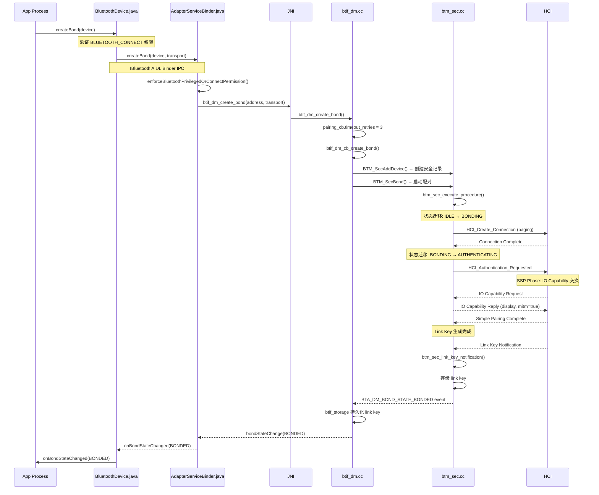
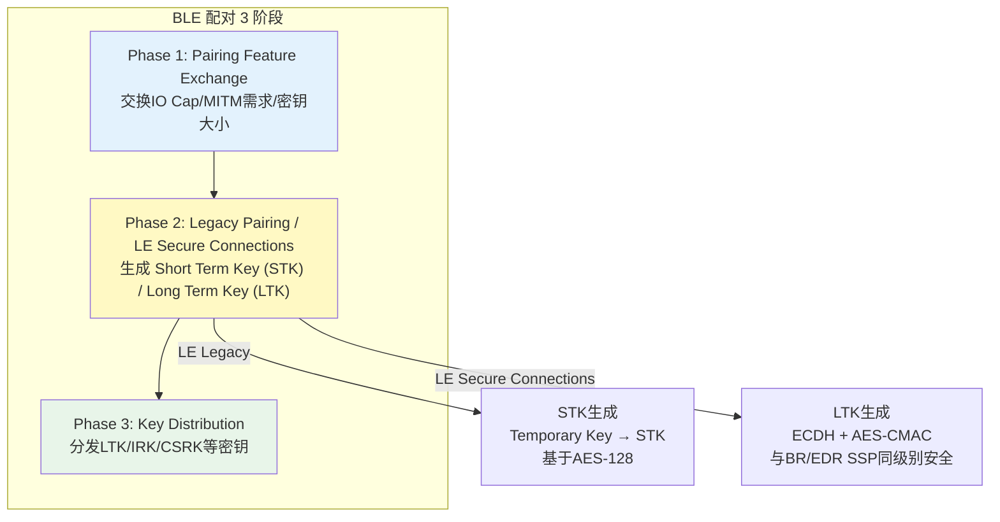
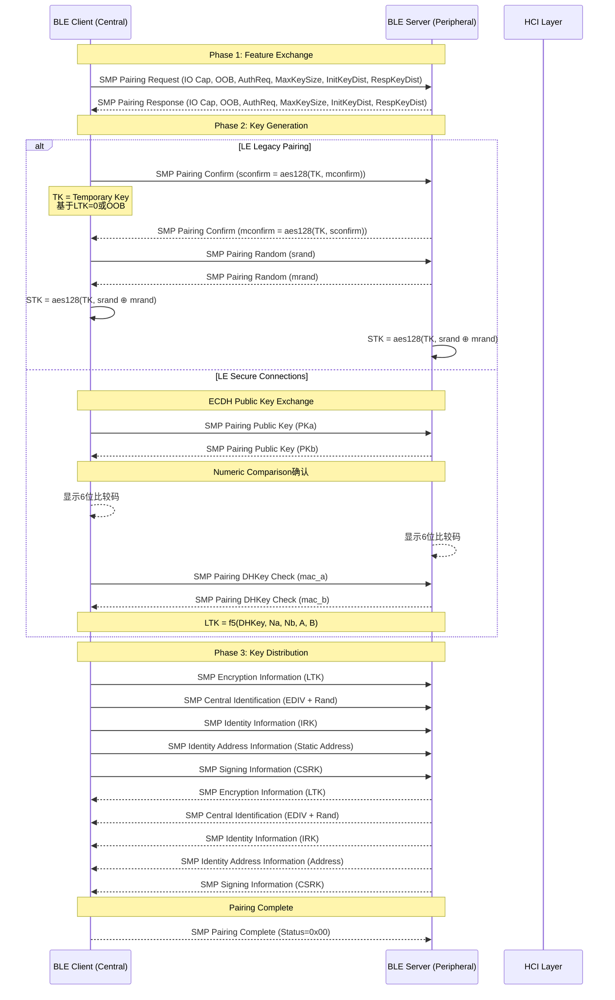
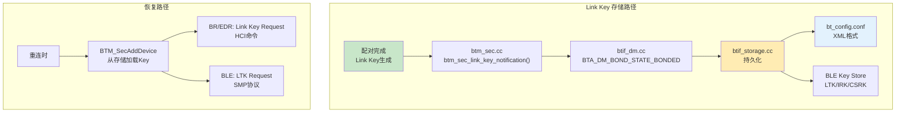
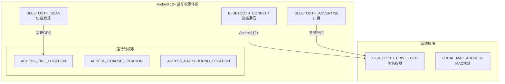
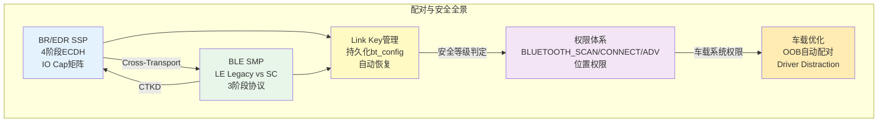

# 第21章：蓝牙配对与安全架构

> **难度**: ★★★★★ | **前置知识**: Ch18 Security Architecture, Ch10 Classic Stack Core, Ch12 BLE Stack
> **预计阅读时间**: 4-5小时 | **预计学习天数**: 4-6天
> **核心作用**: 深入理解配对/绑定流程的完整实现，以及Android权限模型的演变

---

## 学习目标

- 理解BR/EDR SSP（Secure Simple Pairing）的完整流程
- 掌握BLE SMP（Security Manager Protocol）的配对机制
- 理解IO Capability如何决定配对算法
- 掌握Android 12+细粒度权限模型的变化
- 理解Link Key的生成、存储和恢复机制
- 掌握配对调试和故障排查方法
- 了解车载场景下的配对优化策略

---

## 1. BR/EDR配对深入

### 1.1 完整配对调用链



### 1.2 SSP配对算法矩阵

Secure Simple Pairing (SSP) 通过IO Capability的排列组合确定配对方式：

```cpp
// btm_sec.cc - IO Capability 定义
#define BTM_IO_CAP_OUT             0     // DisplayOnly
#define BTM_IO_CAP_IO              1     // DisplayYesNo
#define BTM_IO_CAP_IN              2     // KeyboardOnly
#define BTM_IO_CAP_KBDISP          3     // KeyboardDisplay
#define BTM_IO_CAP_NONE            0xFF  // NoInputNoOutput
```

```
配对算法选择矩阵（Initiator →, Responder ↓）：

              DisplayOnly  DisplayYesNo  KeyboardOnly  NoInputNoOutput
───────────  ───────────  ────────────  ────────────  ──────────────
DisplayOnly   Just Works   Numeric Cmp   Passkey Entry Just Works
DisplayYesNo  Numeric Cmp  Numeric Cmp   Passkey Entry Just Works
KeyboardOnly  Passkey Ent  Passkey Ent   Passkey Entry Just Works
NoInputNoOut  Just Works   Just Works    Just Works    Just Works
```

### 1.3 SSP协议细节

SSP使用四阶段协议（E21或E22规范的椭圆曲线DH交换）：

```
Phase 1: Public Key Exchange
  Host A ── PKa ──→ Host B
  Host A ←─ PKb ──  Host B

Phase 2: Authentication Stage 1
  IO Cap = Numeric Comparison:
    双方计算 Va = f(PKa, PKb, Na, Nb)
    显示前6位数字比较
  IO Cap = Passkey Entry:
    双方计算 Va = f(PKa, PKb, Na, Nb, passkey_bit)
    20轮逐位确认
  IO Cap = Just Works:
    同Numeric Comparison但不显示

Phase 3: Authentication Stage 2
  双方验证MAC值确认DH密钥正确

Phase 4: Link Key Calculation
  双方独立计算 Link Key = h(Na, Nb, DHKey)
```

### 1.4 HCI配对事件流

以Numeric Comparison为例的HCI事件序列：

```
→ HCI_IO_Capability_Request
← HCI_IO_Capability_Reply (IO_CAP_IO, OOB=0, MITM=1)
→ HCI_IO_Capability_Response (IO_CAP_IO, OOB=0, MITM=1)

→ HCI_User_Confirmation_Request (Numeric Value: 123456)
← HCI_User_Confirmation_Request_Reply

→ HCI_Simple_Pairing_Complete (Status=0x00)
→ HCI_Link_Key_Notification (Key Type: 0x06=Authenticated)
→ HCI_Link_Key_Request
← HCI_Link_Key_Request_Reply
```

---

## 2. BLE配对（SMP）

### 2.1 BLE配对层级



### 2.2 SMP完整流程



### 2.3 BLE SMP状态机

```cpp
// stack/smp/smp_int.h - SMP 状态定义
enum tSMP_STATE : uint8_t {
    SMP_STATE_IDLE,                   // 空闲
    SMP_STATE_PAIRING_SETUP,          // 配对参数协商
    SMP_STATE_WAIT_FOR_APP_RSP_I,     // 等待App确认(发起方)
    SMP_STATE_WAIT_FOR_APP_RSP_R,     // 等待App确认(响应方)
    SMP_STATE_WAIT_FOR_SEC_REQ,       // 等待安全请求
    SMP_STATE_WAIT_FOR_PAIR_RSP,      // 等待配对响应
    SMP_STATE_SEC_START_ENCRYPT,      // 开始加密
    SMP_STATE_ENCRYPTION_PENDING,     // 加密进行中
    SMP_STATE_BONDING_PENDING,        // 绑定进行中
    SMP_STATE_RELEASE_DELAYED,        // 延迟释放
};

// SMP超时: 30秒 (BT_DEFAULT_SM_TIMEOUT)
```

### 2.4 LE Secure Connections vs Legacy

| 特性 | LE Legacy | LE Secure Connections |
|------|-----------|----------------------|
| 协议 | BLE 4.0/4.1 | BLE 4.2+ |
| 密钥生成 | AES-128 + STK | ECDH + AES-CMAC |
| MITM保护 | 弱 | 强（与BR/EDR SSP同级） |
| 相比BR/EDR | 独立实现 | 共用DH密钥 |
| 交叉传输Key | 不支持 | 支持（Cross-Transport Key Derivation） |
| 破解难度 | 离线TK可碰撞 | ECDH不可离线破解 |

### 2.5 交叉传输密钥派生 (CTKD)

LE Secure Connections的核心优势之一：

```
BR/EDR Link Key = f(DHKey, Na_br, Nb_br, A, B)
BLE LTK         = f(DHKey, Na_le, Nb_le, A, B)
    ↑ 基于同一 DHKey，节省一次配对
    ↑ 需双方都支持 Secure Connections
```

```cpp
// stack/smp/smp_sc_main.cc - LE SC配对完成后派生BR/EDR Key
static void smp_sc_pairing_complete(tSMP_CB* p_cb, tSMP_INT_DATA* p_data) {
  // 检查是否支持Cross-Transport Key Derivation
  if (p_cb->le_secure_connections_supported &&
      BTM_IsSecureConnectionsSupported()) {
    // 派生BR/EDR Link Key
    btm_sec_link_key_notification(..., BTM_LTK_TYPE_SC_AND_BREDR);
    // 同时设置：
    // BTM_LTK_KEY_TYPE → BTM_CTKD_ENCRYPT_LINK (跨传输加密)
  }
}
```

---

## 3. Link Key管理与持久化

### 3.1 Link Key类型

```cpp
// stack/include/btm_sec.h
// BR/EDR Link Key 类型
#define BTM_LKEY_TYPE_COMBINATION        0x00  // 组合Key (旧版配对)
#define BTM_LKEY_TYPE_LOCAL_UNIT         0x01  // 本地单元Key
#define BTM_LKEY_TYPE_REMOTE_UNIT        0x02  // 远端单元Key
#define BTM_LKEY_TYPE_UART_PEER          0x03  // UART Peer模式
#define BTM_LKEY_TYPE_UART_LOCAL         0x04  // UART Local模式
#define BTM_LKEY_TYPE_AUTH_COMB          0x05  // 认证组合Key (SSP)
#define BTM_LKEY_TYPE_AUTH_COMB_P256     0x06  // 认证P-256 Key (SC)

// BLE Key 类型
#define BTM_BLE_KEY_TYPE_ID              1     // IRK (Identity Resolving Key)
#define BTM_BLE_KEY_TYPE_PENC            2     // LTK + EDIV + Rand (加密)
#define BTM_BLE_KEY_TYPE_PID             3     // IRK + Identity Address
#define BTM_BLE_KEY_TYPE_PCSRK           4     // CSRK (签名)
#define BTM_BLE_KEY_TYPE_LENC            5     // 对端LTK
#define BTM_BLE_KEY_TYPE_LCSRK           6     // 对端CSRK
#define BTM_BLE_KEY_TYPE_GATT            7     // GATT认证
```

### 3.2 Key存储架构



```cpp
// btif_storage.cc - Link Key持久化
void btif_storage_add_bonded_device(const RawAddress& remote_bd_addr,
                                     const LinkKey& link_key,
                                     uint8_t key_type,
                                     uint8_t pin_length) {
  // 1. 写入 bt_config.conf
  // 格式: {DeviceAddress}.link_key = hex(link_key)
  //       {DeviceAddress}.link_key_type = key_type

  // 2. 写入 BLE key store (如果存在)
  BTM_SecAddBleKey(remote_bd_addr, &ble_key, BTM_BLE_KEY_TYPE_PENC);
  BTM_SecAddBleKey(remote_bd_addr, &ble_key, BTM_BLE_KEY_TYPE_PID);
}
```

### 3.3 自动配对恢复

```cpp
// btm_sec.cc - 重连时自动配对流程
tBTM_STATUS btm_sec_execute_procedure(tBTM_SEC_DEV_REC* p_dev_rec) {
  // 1. 检查是否已有Link Key
  if (p_dev_rec->sec_rec.link_key.key_type != BTM_LKEY_TYPE_NONE) {
    // 已有Key → 直接加密
    btm_sec_start_encryption(p_dev_rec);
    return BTM_SUCCESS;
  }

  // 2. 无Key → 发起配对
  if (p_dev_rec->sec_rec.is_originator) {
    btm_sec_send_hci_command(HCI_AUTHENTICATION_REQUESTED);
  } else {
    // 作为响应方等待对端发起
  }
}
```

---

## 4. 配对中断和异常处理

### 4.1 配对超时

```cpp
// BTM配对超时: bt_stack_cfg.h
#define BT_DEFAULT_BTM_SEC_TIMEOUT 120  // 120 秒 (BR/EDR SSP)

// SMP超时: 30 秒
#define BT_DEFAULT_SM_TIMEOUT 30

// btif_dm.cc - 配对重试
struct {
  uint8_t timeout_retries;     // 当前重试次数
  uint8_t max_retries;         // 最大重试: 3
  uint64_t bond_start_time;    // 配对开始时间戳
} pairing_cb;
```

### 4.2 常见失败码

```cpp
// BTA_DM_BOND_RESULT 定义
#define BTA_DM_BOND_SUCCESS                    0x00
#define BTA_DM_BOND_FAILED_AUTH                0x01  // 认证失败
#define BTA_DM_BOND_FAILED_REMOTE              0x02  // 对端拒绝
#define BTA_DM_BOND_FAILED_DEVICE_DOWN          0x03  // 设备断开
#define BTA_DM_BOND_FAILED_NO_PAIRING          0x04  // 设备禁止配对
#define BTA_DM_BOND_FAILED_NON_AUTH            0x05  // 非认证配对
#define BTA_DM_BOND_FAILED_CONNECT_TIMEOUT     0x06  // 连接超时
#define BTA_DM_BOND_FAILED_SC_COMPARE_FAILED   0x07  // SC比较失败
#define BTA_DM_BOND_FAILED_AUTHENTICATION_TIMEOUT 0x08 // 认证超时

// GATT 安全相关错误
#define GATT_INSUFFICIENT_AUTHENTICATION  0x05  // 需要配对
#define GATT_INSUFFICIENT_ENCRYPTION      0x0F  // 需要加密
```

### 4.3 配对失败模式分析

| 现象 | 可能原因 | 排查方法 |
|------|---------|---------|
| `createBond` 返回 false | 权限不足/蓝牙未开启 | 检查 `BLUETOOTH_CONNECT` 权限 |
| 配对弹窗不显示 | 非UI线程调用 | 需Activity上下文 |
| 配对中自动断开 | 设备距离太远/干扰 | 检查HCI Disconnection Complete |
| "配对失败" 无原因 | PIN码不匹配 | 检查 `bt_btif_dm` 日志 |
| BLE配对30秒超时 | SMP阶段卡住 | 检查 `bt_smp` 日志 |
| 重连需重新配对 | Link Key丢失 | 检查 `btif_storage` 写入 |
| LE Legacy配对慢 | 多步密钥分发 | 升级到 LE Secure Connections |
| 同一设备需配两次 | 跨传输Key未同步 | 确认双方都支持CTKD |

---

## 5. Android 12+权限模型

### 5.1 权限体系架构



### 5.2 各API权限映射

```kotlin
// service/src/PermissionChecker.kt
class PermissionChecker {
    fun checkScanResultPermission(source: AttributionSource): Boolean {
        // 扫描结果需要:
        // BLUETOOTH_SCAN (manifest)
        // + ACCESS_FINE_LOCATION 或 ACCESS_COARSE_LOCATION (runtime)
        // + (后台扫描时) ACCESS_BACKGROUND_LOCATION
        if (!hasBluetoothScanPermission(source)) return false
        if (!hasLocationPermission(source)) return false
        return true
    }

    fun checkConnectPermission(source: AttributionSource): Boolean {
        // 连接需要:
        // BLUETOOTH_CONNECT (manifest)
        // 系统应用可凭 BLUETOOTH_PRIVILEGED 绕过
        return hasBluetoothConnectPermission(source) ||
               hasBluetoothPrivilegedPermission(source)
    }
}
```

### 5.3 权限兼容性

| Target API | 需要的权限 | 兼容旧权限 |
|-----------|-----------|-----------|
| Android 12 (S) | `BLUETOOTH_SCAN` | `BLUETOOTH` (自动授予) |
| Android 12 (S) | `BLUETOOTH_CONNECT` | `BLUETOOTH_ADMIN` (自动授予) |
| Android 12 (S) | `BLUETOOTH_ADVERTISE` | `BLUETOOTH` (自动授予) |
| Android 12 (S) | `ACCESS_FINE_LOCATION` | `ACCESS_COARSE_LOCATION` |
| Android 10+ | `ACCESS_BACKGROUND_LOCATION` | 需单独申请 |

### 5.4 车载系统App的特殊权限

```xml
<!-- AndroidManifest.xml - 车载系统蓝牙应用 -->
<uses-permission android:name="android.permission.BLUETOOTH_CONNECT" />

<!-- 系统App特权权限（需相同签名） -->
<uses-permission android:name="android.permission.BLUETOOTH_PRIVILEGED" />

<!-- 无需位置权限的场景： -->
<!-- 车厂可通过 DevicePolicyManager 或系统签名 -->
<!-- 绕过 ACCESS_FINE_LOCATION 要求 -->
```

---

## 6. 车载配对优化

### 6.1 自动配对（Out-of-Band）

```cpp
// btif_dm.cc - OOB配对
bt_status_t btif_dm_create_bond_out_of_bond(const RawAddress& bd_addr,
                                             const bt_oob_data_t& oob_data) {
  // OOB数据包含：
  // - P-256 Public Key (LE SC)
  // - Random Value (用于Hash确认)
  // - Confirm Value (Hash验证)

  // 优势：
  // - 无需用户交互（UI free）
  // - 自动信任
  // - 可用于 Android Automotive
  BTM_SecBondByTransport(bd_addr, BT_TRANSPORT_LE, 0, &oob_data);
}
```

### 6.2 Driver Distraction缓解

```
欧洲法规 UN-R79 / ISO 26022 要求:
- 配对交互 ≤ 3秒
- 视觉分心 ≤ 1.5秒
- 总操作步骤 ≤ 3步

优化策略:
1. 使用 OOB 配对 → 无UI弹窗
2. 预设IO Capability (DisplayYesNo → 自动确认)
3. 使用BLE SC跨传输Key → 一次配对同时覆盖BR/EDR和BLE
4. 延迟Link Key存储确认 → 缩短UI交互时间
```

### 6.3 多设备配对策略

| 场景 | 策略 | 实现要点 |
|------|------|---------|
| 主手机连接 | 自动配对(OOB) | 车机预置OOB数据 |
| 备用手机连接 | 标准SSP | Numeric Comparison，UI确认 |
| 钥匙/传感器 | Just Works | NoInputNoOutput，后台配对 |
| 维修诊断设备 | 临时配对 | 连接完成后自动取消配对 |

### 6.4 配对安全建议

```cpp
// 车载蓝牙安全配置
// system/btif/src/btif_dm.cc
void btif_dm_set_security_level() {
  // 1. 强制 MITM 保护
  btm_sec_set_io_capabilities(IO_CAP_IO);  // DisplayYesNo

  // 2. 拒绝 Just Works 配对
  ssp.cfg_accept_just_works = false;

  // 3. 强制 LE Secure Connections
  smp.force_le_sc_only = true;

  // 4. 最小密钥大小 ≥ 16字节 (128-bit)
  smp.min_key_size = 16;

  // 5. 限制配对时间
  pairing_cb.max_retries = 3;  // 最多3次重试
}
```

---

## 7. 实战练习

### 练习1: 配对流程HCI分析

```bash
# 抓取配对过程的HCI Snoop Log
adb shell setprop persist.bluetooth.btsnoopenable true
adb reboot

# 执行配对操作
# 导出log
adb pull /data/misc/bluetooth/logs/btsnoop_hci.log .

# Wireshark 分析
# 过滤: btatt 或 bthci_acl
```

**问题**:
1. 找出IO Capability交换的HCI事件，双方IO Cap分别是什么？
2. 配对算法是Numeric Comparison还是Just Works？为什么？
3. 找出Link Key Notification中的Key Type值，代表什么含义？
4. BLE配对：找出SMP Pairing Request/Response中的参数

### 练习2: 权限检查跟踪

```bash
# 跟踪权限检查日志
adb logcat -s PermissionChecker:* AdapterServiceBinder:* BluetoothGatt:*

# 触发权限错误
adb shell am start -a android.bluetooth.adapter.action.REQUEST_ENABLE
```

**问题**:
1. 运行一个没有 `BLUETOOTH_CONNECT` 权限的App，调用 `createBond()`，观察日志
2. 权限检查在哪个类抛出 `SecurityException`？
3. 车载系统App如何绕过权限检查？

### 练习3: BLE配对算法切换

```java
// 通过修改IO Capability切换配对算法
// 文件: system/stack/btm/btm_sec.cc

// 修改前: DisplayYesNo
btm_cb.io_cap = BTM_IO_CAP_IO;

// 修改后: NoInputNoOutput (Just Works)
btm_cb.io_cap = BTM_IO_CAP_NONE;
```

**问题**:
1. 修改后配对时会出现什么变化？
2. Just Works配对的安全风险是什么？
3. 车载场景中哪些设备应该使用Just Works？

### 练习4: 存储的Link Key检查

```bash
# 查看已配对设备
adb shell dumpsys bluetooth | grep -A 30 "BondedDevices"

# 检查bt_config.conf (需root)
adb shell cat /data/misc/bluetooth/bt_config.conf
# 搜索: [RemoteDevice] 段 → LinkKey字段

# 清除特定设备的配对
adb shell am broadcast -a android.bluetooth.device.action.UNPAIR \
    --es device "XX:XX:XX:XX:XX:XX"
```

**问题**:
1. 已配对设备的Link Key以什么格式存储？
2. 清除App数据后Link Key是否还在？为什么？
3. 如何通过代码判断设备是否已配对？

---

## 本章总结



---

## 参考文件清单

| 文件 | 行数 | 关键内容 |
|------|------|---------|
| `system/btif/src/btif_dm.cc` | 4,423 | 配对管理入口 |
| `system/stack/btm/btm_sec.cc` | 5,280 | 安全引擎核心 |
| `system/stack/btm/btm_ble_sec.cc` | - | BLE SMP实现 |
| `system/stack/smp/smp_sc_main.cc` | - | LE Secure Connections |
| `system/btif/src/btif_storage.cc` | - | Link Key持久化 |
| `service/src/PermissionChecker.kt` | - | 权限检查核心 |
| `framework/.../BluetoothDevice.java` | 4,141 | `createBond()` API |
| **V8 深度分析报告** | | |
| `V8_Pairing_Analysis.md` | 304 | 配对全链路分析 |
| `V8_Permission_Analysis.md` | 158 | 权限体系分析 |
| `V8_Security_Path.md` | - | 安全路径分析 |

---

## 相关章节

- **第18章 Security Architecture**：[18_Security_Architecture.md](18_Security_Architecture.md)
- **第10章 Classic Stack Core**：[10_Classic_Stack_Core.md](10_Classic_Stack_Core.md)
- **第4章 Public API Framework**：[04_Public_API_Framework.md](04_Public_API_Framework.md)
- **第20章 GATT Deep Dive**：[20_GATT_Protocol_Deep_Dive.md](20_GATT_Protocol_Deep_Dive.md)

## 车载场景

配对是车载蓝牙最频繁的操作之一。OOB自动配对可减少用户交互（符合Driver Distraction法规），LE Secure Connections CTKD可一次配对同时覆盖BR/EDR和BLE。车机应配置MITM保护优先级、拒绝Just Works配对、设置最小密钥大小128-bit。Link Key持久化失败（存储空间满/config损坏）是OTA升级后配对丢失的主要原因。

> **下一步**: 阅读 [第22章 蓝牙调试与诊断](22_Debugging_Diagnostics.md)
