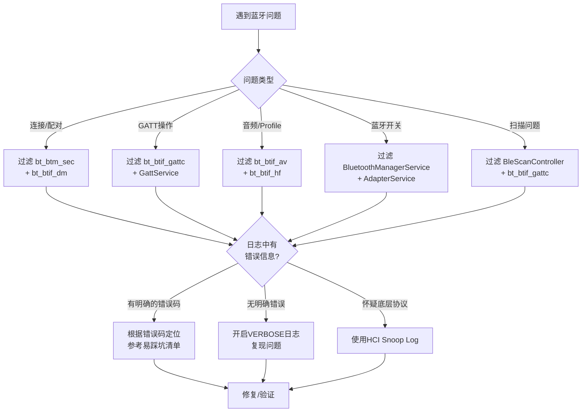
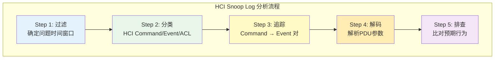
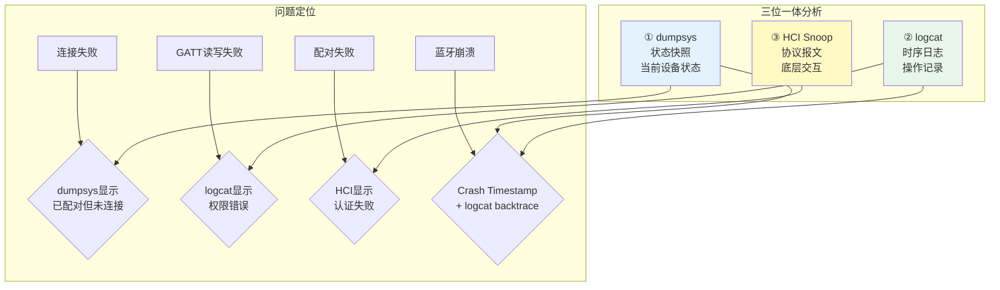
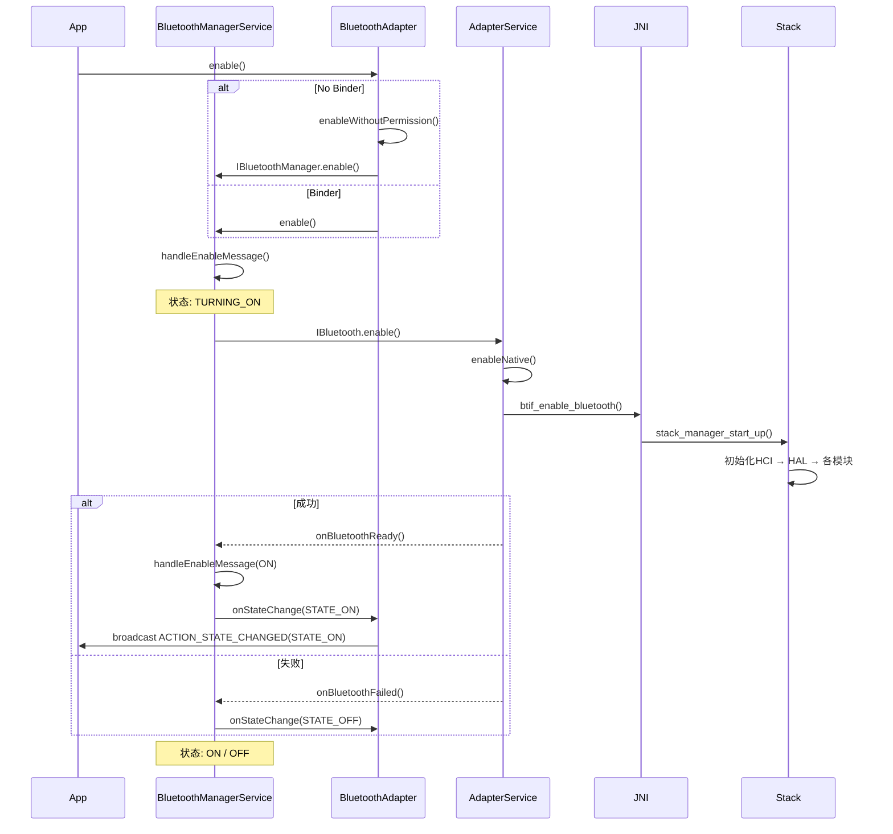
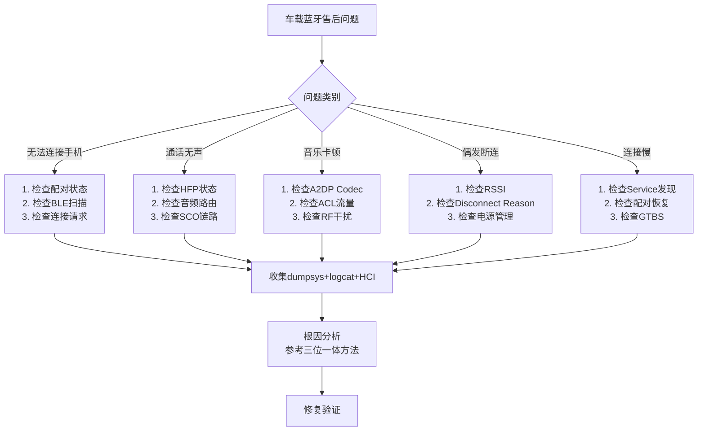
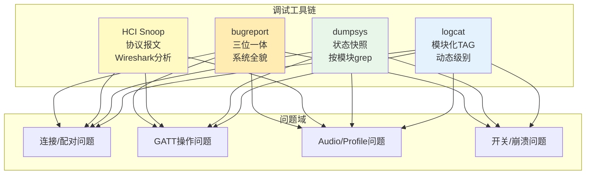

# 第22章：蓝牙调试与诊断

> **难度**: ★★★★☆ | **前置知识**: Ch2 Environment Setup, Ch1 Architecture Overview
> **预计阅读时间**: 4-5小时 | **预计学习天数**: 3-5天
> **核心作用**: 掌握蓝牙问题调试的全套方法论和工具链，从日志分析到HCI抓包

---

## 学习目标

- 掌握logcat模块化过滤和LOG_TAG体系
- 精通dumpsys蓝牙状态诊断
- 学会使用HCI Snoop Log分析协议问题
- 理解bugreport的三位一体分析流程
- 掌握常见蓝牙问题的根本原因分析
- 了解车载蓝牙售后问题的系统化排查方法

---

## 1. 日志系统（Logcat）

### 1.1 LOG_TAG体系

Android蓝牙使用模块化的LOG_TAG设计，每个组件有独立的日志标签：

```cpp
// 各模块 LOG_TAG 定义
#define LOG_TAG "bt_btif_dm"      // btif_dm.cc - 设备管理/配对
#define LOG_TAG "bt_btif_gattc"   // btif_gatt_client.cc - GATT Client
#define LOG_TAG "bt_btif_gatts"   // btif_gatt_server.cc - GATT Server
#define LOG_TAG "bt_btif_av"      // btif_av.cc - A2DP
#define LOG_TAG "bt_btif_hf"      // btif_hf.cc - HFP
#define LOG_TAG "bt_btm_sec"      // btm_sec.cc - 安全引擎
#define LOG_TAG "bt_btm_ble"      // btm_ble*.cc - BLE
#define LOG_TAG "bt_shim_hci"     // hci shim层
#define LOG_TAG "bt_hci"          // HCI协议
#define LOG_TAG "bt_smp"          // SMP配对
#define LOG_TAG "bt_gatt_api"     // gatt_api.cc
#define LOG_TAG "bt_l2cap"        // L2CAP
#define LOG_TAG "bt_rfcomm"       // RFCOMM
#define LOG_TAG "bt_avrcp"        // AVRCP

// Java层 TAG
#define TAG "BluetoothGatt"       // BluetoothGatt.java
#define TAG "GattService"         // GattService.java
#define TAG "AdapterService"      // AdapterService.java
#define TAG "BluetoothManagerService" // BluetoothManagerService.java
#define TAG "BleScanController"   // ScanController.java
```

### 1.2 过滤策略

```bash
# 按模块过滤
adb logcat -s bt_btif_gattc:* GattService:*

# 多模块组合（蓝牙开关流程）
adb logcat -s bt_shim_hci:* bt_btif_core:* BluetoothManagerService:* AdapterService:*

# 时间戳过滤（定位特定操作）
adb logcat -v time -s bt_btm_sec:* | grep "BOND"

# PID过滤
adb logcat --pid=$(adb shell pidof com.android.bluetooth) -v threadtime

# 优先级过滤
adb logcat -s bt_btif_dm:V   # VERBOSE = 全部
adb logcat -s bt_btif_dm:D   # DEBUG 及以上
adb logcat -s bt_btif_dm:E   # ERROR 仅错误

# 输出到文件（长流程）
adb logcat -s bt_btif_gattc:* GattService:* > gatt_trace.log
```

### 1.3 日志级别动态调整

```bash
# 通过属性动态设置日志级别
adb shell setprop log.tag.bt_btif_dm VERBOSE
adb shell setprop log.tag.bt_btm_sec DEBUG
adb shell setprop log.tag.GattService VERBOSE

# 重启蓝牙使属性生效
adb shell svc bluetooth disable
adb shell svc bluetooth enable

# 查看当前日志级别
adb shell getprop | grep log.tag.bt
```

### 1.4 典型的调试流程



---

## 2. dumpsys蓝牙诊断

### 2.1 dumpsys命令体系

```bash
# 完整蓝牙状态
adb shell dumpsys bluetooth

# 主蓝牙服务
adb shell dumpsys bluetooth_manager

# 分模块查看（grep过滤）
adb shell dumpsys bluetooth | grep -A 5 "State:"
adb shell dumpsys bluetooth | grep -A 20 "BondedDevices"
adb shell dumpsys bluetooth | grep -A 30 "GattService"
adb shell dumpsys bluetooth | grep -A 20 "ScanController"
adb shell dumpsys bluetooth | grep -i "error\|fail\|timeout"
```

### 2.2 bluetooth_manager关键字段

```
// adb shell dumpsys bluetooth_manager 输出示例:
// 重点关注:

  State: ON                          // 蓝牙状态: ON/OFF/TURNING_ON/TURNING_OFF
  Enabled: true                      // 是否启用
  IsDiscovering: false               // 是否正在发现
  StateChangeTime: 2026-05-17 10:30  // 状态变更时间
  
  // Crash Timestamp - 上次蓝牙进程崩溃时间
  Crash Timestamp: 2026-05-17 09:15
  
  // 绑定设备数
  Bonded Devices: 5
    [1] Device: AA:BB:CC:DD:EE:FF (Name: "Pixel 9")
        Type: BR_EDR + BLE
    [2] Device: 11:22:33:44:55:66 (Name: "Ford Mustang")
        Type: BR_EDR only

  // 活动设备
  Active Device: AA:BB:CC:DD:EE:FF
    Profile State:
      HFP: CONNECTED
      A2DP: CONNECTED
      MAP: DISCONNECTED
```

### 2.3 bluetooth模块诊断

```bash
# Profile连接状态
adb shell dumpsys bluetooth | grep -A 10 "HeadsetService\|A2dpService\|HidService"

# BLE扫描状态
adb shell dumpsys bluetooth | grep -A 30 "ScanController" | head -40

# GATT服务注册
adb shell dumpsys bluetooth | grep -A 30 "GattService" | head -40

# 活动连接
adb shell dumpsys bluetooth | grep -A 10 "ConnectionState"

# 待处理操作
adb shell dumpsys bluetooth | grep -i "pending\|queue\|wait"

# 内存使用
adb shell dumpsys meminfo com.android.bluetooth
```

### 2.4 车载专用诊断

```bash
# 汽车场景专项检查
# 1. 检查多设备连接状态
adb shell dumpsys bluetooth | grep -A 5 "ActiveDeviceManager"
adb shell dumpsys bluetooth | grep -A 20 "ConnectedDevices"

# 2. 检查音频路由
adb shell dumpsys bluetooth | grep -A 15 "AudioManager\|BtAudio"

# 3. 检查配对历史
adb shell dumpsys bluetooth | grep -c "BondedDevices"
adb shell dumpsys bluetooth | grep "BondedDevices" -A 100 | grep "Device:"

# 4. 检查电源/空口状态
adb shell dumpsys bluetooth | grep -i "scan\|inquiry\|discover\|sleep\|wake"

# 5. 一键诊断脚本
@echo off
echo === 蓝牙诊断报告 %DATE% %TIME% === > bt_diag.txt
adb shell dumpsys bluetooth_manager >> bt_diag.txt
echo ==================== >> bt_diag.txt
adb shell dumpsys bluetooth | grep -A 10 "State:" >> bt_diag.txt
adb shell dumpsys bluetooth | grep -i "error\|fail" >> bt_diag.txt
adb shell dumpsys bluetooth | grep -A 5 "ActiveDeviceManager" >> bt_diag.txt
adb logcat -s bt_btif_dm:* bt_btm_sec:* bt_hci:* -d | tail -100 >> bt_diag.txt
```

---

## 3. HCI Snoop Log

### 3.1 抓取与配置

```bash
# 方法1: Developer Options (推荐)
# 设置 → 开发者选项 → 开启 Bluetooth HCI Snoop Log

# 方法2: adb命令
adb shell setprop persist.bluetooth.btsnoopenable true
adb reboot  # 重启后生效

# 方法3: 仅抓取本次会话
adb shell setprop bluetooth.btsnoop.enabled true
adb shell svc bluetooth restart

# 日志位置
adb shell ls -la /data/misc/bluetooth/logs/
# btsnoop_hci.log  - 标准Snoop格式
# btsnoop_hci.log.last - 上次的日志

# 导出
adb pull /data/misc/bluetooth/logs/btsnoop_hci.log .

# 使用Wireshark打开
wireshark btsnoop_hci.log
```

### 3.2 HCI日志分析模式



### 3.3 Wireshark过滤技巧

```bash
# 蓝牙专用过滤
btatt                                      # ATT协议
btatt.opcode == 0x12                        # ATT Write Request
btrfcomm                                   # RFCOMM
bthci_evt                                  # HCI Events
bthci_cmd                                  # HCI Commands
bthci_acl                                  # ACL数据
btl2cap                                    # L2CAP

# ATT操作过滤
btatt.opcode == 0x02                        # MTU Request
btatt.opcode == 0x0A                        # Read Request
btatt.opcode == 0x0B                        # Read Response
btatt.opcode == 0x12                        # Write Request
btatt.opcode == 0x1B                        # Notification

# 配对相关
bthci_evt.code == 0x15                      # IO Capability Request
bthci_evt.code == 0x1B                      # Simple Pairing Complete
bthci_evt.code == 0x36                      # LE Connection Complete

# L2CAP
btl2cap.cid == 0x0004                       # ATT (传统)
btl2cap.cid >= 0x0040 && btl2cap.cid <= 0x0046  # EATT

# 错误分析
btatt.status != 0                           # ATT错误响应
bthci_evt.status != 0                       # HCI错误事件
```

### 3.4 常见HCI事件分析

```cpp
// HCI Event Code 对照表
// 0x02  - Inquiry Complete
// 0x05  - Disconnection Complete
// 0x0E  - Command Complete
// 0x0F  - Command Status
// 0x13  - Number of Completed Packets
// 0x15  - IO Capability Request
// 0x17  - User Confirmation Request
// 0x1B  - Simple Pairing Complete
// 0x1C  - Link Key Notification
// 0x24  - Link Key Request
// 0x2F  - Read Remote Extended Features Complete
// 0x36  - LE Connection Complete
// 0x3E  - LE Meta Event
//    └─ 0x01 - LE Connection Complete
//    └─ 0x02 - LE Advertising Report
//    └─ 0x05 - LE Long Term Key Request
//    └─ 0x0A - LE Data Length Change
//    └─ 0x0C - LE Read Remote Features Complete
//    └─ 0x14 - LE Extended Advertising Report
```

---

## 4. Bugreport三位一体分析

### 4.1 Bugreport完整流程

```bash
# 生成bugreport
adb bugreport bt_issue_$(date +%Y%m%d).zip

# 解压
unzip bt_issue_*.zip
cd FS/  # 文件系统目录

# 核心文件
# bugreport-*.txt          - 汇总（含dumpsys）
# logcat.txt               - 完整logcat
# dumpstate_board.txt      - 板级状态
# kernel.log               - 内核日志
# FS/data/misc/bluetooth/  - 蓝牙配置文件
```

### 4.2 三位一体分析



### 4.3 常见问题模式

| 问题 | dumpsys特征 | logcat特征 | HCI特征 |
|------|-------------|-----------|---------|
| 蓝牙无法打开 | `State: TURNING_ON` 卡住 | `BluetoothManagerService: enable timeout` | 无 |
| 配对失败 | `BondedDevices` 无新增 | `bt_btm_sec: auth fail (0x05)` | `Simple Pairing Complete (Status=0x05)` |
| 连接频繁断连 | `ConnectionState: DISCONNECTED` | `bt_hci: Disconnection Complete` | `Disconnection Complete (Reason=0x08)` |
| GATT操作无响应 | `GattService: pending operations` | `bt_btif_gattc: timeout` | 无ATT Response |
| A2DP无声 | `A2dpService: SUSPENDED` | `bt_btif_av: stream suspend` | ACL流量异常 |
| 扫描无结果 | `ScanController: scan not started` | `PermissionChecker: denied` | 无Advertising Report |

### 4.4 自动化诊断脚本

```bash
# 诊断脚本: bt_diag.sh
#!/bin/bash
echo "=== 蓝牙诊断报告 ==="
echo "时间: $(date)"
echo ""

echo "--- 蓝牙状态 ---"
adb shell dumpsys bluetooth_manager | grep -E "State:|Enabled:|Crash|Bonded"

echo ""
echo "--- Profile状态 ---"
adb shell dumpsys bluetooth | grep -A 5 -E "HeadsetService:|A2dpService:|HidService:|PanService:"

echo ""
echo "--- 活动连接 ---"
adb shell dumpsys bluetooth | grep -A 10 "ActiveDevice"

echo ""
echo "--- 最近的错误 ---"
adb logcat -d -s bt_btif_dm:E bt_btm_sec:E bt_hci:E bt_btif_gattc:E GattService:E AdapterService:E

echo ""
echo "--- HCI日志信息 ---"
adb shell ls -la /data/misc/bluetooth/logs/

echo ""
echo "--- 系统属性 ---"
adb shell getprop | grep bluetooth
```

---

## 5. Enable/Disable流程调试

### 5.1 蓝牙开关调用链



### 5.2 超时与卡住分析

```cpp
// BluetoothManagerService.java - 启用超时
// 启用默认超时: ENABLE_TIMEOUT_DELAY = 30000 (30秒)
// 禁用默认超时: DISABLE_TIMEOUT_DELAY = 30000 (30秒)

// 超时原因分析:
// 1. HAL层卡住 → HCI接口无响应
// 2. Firmware加载失败 → 文件缺失/损坏
// 3. Controller初始化失败 → 硬件异常
// 4. Stack初始化死锁 → 线程竞争

// 调试命令:
adb shell dumpsys bluetooth_manager | grep -E "State:|Enabled:|Crash"
// 检查:
// - State=TURNING_ON 超过30秒 → enable超时
// - State=TURNING_OFF 超过30秒 → disable超时
// - Crash Timestamp 不为空 → 蓝牙进程曾崩溃
```

### 5.3 蓝牙进程崩溃诊断

```bash
# 检查是否发生蓝牙崩溃
adb shell dumpsys bluetooth_manager | grep "Crash"

# 查看崩溃堆栈
adb bugreport
# 搜索: "FATAL EXCEPTION" + "com.android.bluetooth"
# 搜索: "native crash" + "libbluetooth"

# 典型崩溃原因
# 1. NullPointerException (Java层)
# 2. SIGSEGV (Native层)
# 3. Binder Transaction Too Large
# 4. OutOfMemoryError

# 崩溃后自动恢复
# BluetoothManagerService 自动重启蓝牙进程
# 需要检查 Crash Timestamp 判断是否频繁崩溃
```

---

## 6. 车载售后问题排查

### 6.1 系统化排查流程



### 6.2 现场数据收集清单

```bash
# 售后问题数据收集（在问题车辆上执行）

# 1. 蓝牙状态快照
adb shell dumpsys bluetooth_manager > bt_manager_state.txt
adb shell dumpsys bluetooth > bt_state.txt

# 2. 设备信息
adb shell getprop ro.build.fingerprint > vehicle_info.txt
adb shell getprop | grep bluetooth >> vehicle_info.txt

# 3. 日志（含历史）
adb logcat -b all -d -v threadtime > full_log.txt

# 4. HCI日志（如有）
adb pull /data/misc/bluetooth/logs/btsnoop_hci.log .

# 5. 配置信息
adb pull /data/misc/bluetooth/bt_config.conf .

# 6. GPS/时间戳关联（用于分析时序）
adb shell date
adb shell uptime
```

### 6.3 常见车载问题根因

| 问题 | 根因 | 排查方法 | 解决方案 |
|------|------|---------|---------|
| 手机连不上车机 | BLE扫描未启动 | `ScanController: scan not running` | 检查扫描策略 |
| 配对上秒断 | IO Cap不匹配 | HCI IO Capability = NoInputNoOutput | 车机设DisplayYesNo |
| 通话无声 | SCO路由未配置 | `bt_btif_hf: sco not opened` | 配置音频路由 |
| 音乐卡顿 | BLE+BR/EDR共存干扰 | HCI ACL数据包间隔不均 | 调整共存策略 |
| 连接慢 (~5秒) | GTBS服务发现超时 | `GattService: discoverServices timeout` | 优化GATT DB |
| 关机重开后配对丟失 | Link Key存储失败 | `btif_storage: write failed` | 检查存储空间 |
| 多手机切换慢 | ActiveDeviceManager策略 | `ActiveDeviceManager: switch delayed` | 优化切换阈值 |
| 每天首次连接失败 | Power Mgmt未唤醒 | HCI无连接请求 | Disable BLE sleep |

---

## 7. 实战练习

### 练习1: 构建诊断流水线

```bash
# 创建一个蓝牙诊断脚本 bt_check.sh
# 要求:
# 1. 输出蓝牙开关状态
# 2. 列出已配对设备
# 3. 检查当前活动连接
# 4. 显示最近的5个错误日志
# 5. 检查HCI Snoop Log状态

# 参考实现:
echo "=== Bluetooth Quick Check ==="
echo "1. Status:"
adb shell dumpsys bluetooth_manager | grep "State:"
echo ""
echo "2. Bonded:"
adb shell dumpsys bluetooth | grep "BondedDevices" -A 10 | head -12
echo ""
echo "3. Active:"
adb shell dumpsys bluetooth | grep -A 5 "ActiveDevice"
echo ""
echo "4. Recent Errors:"
adb logcat -d -s bt_btif_dm:E bt_btm_sec:E bt_hci:E -t 10
echo ""
echo "5. HCI Log:"
adb shell ls -lh /data/misc/bluetooth/logs/
```

### 练习2: HCI Snoop Log实战分析

```bash
# 步骤1: 开启HCI Log并执行配对操作
adb shell setprop persist.bluetooth.btsnoopenable true
adb reboot
# 打开设置 → 蓝牙 → 配对一台设备

# 步骤2: 导出
adb pull /data/misc/bluetooth/logs/btsnoop_hci.log .

# 步骤3: Wireshark分析
# 过滤: bthci_evt.code == 0x1B  (Simple Pairing Complete)
# 过滤: bthci_evt.code == 0x1C  (Link Key Notification)
# 过滤: bthci_evt.code == 0x17  (User Confirmation)
```

**问题**:
1. 从HCI Log中找出配对开始到完成的时间
2. 识别配对算法（Numeric Comparison / Just Works / Passkey Entry）
3. 找出Link Key的类型（0x05=AUTH_COMB / 0x06=AUTH_COMB_P256）
4. BLE配对：找出SMP Pairing Request/Response的IO Capability值

### 练习3: GATT读写问题定位

```bash
# 场景: App调用writeCharacteristic无回调

# 1. 检查权限
adb logcat -s PermissionChecker:*

# 2. 检查GATT状态
adb shell dumpsys bluetooth | grep -A 20 "GattService"

# 3. 检查Native日志
adb logcat -s bt_btif_gattc:* GattService:*

# 4. HCI抓包验证ATT层
adb shell setprop bluetooth.btsnoop.enabled true
adb shell svc bluetooth restart
```

**问题**:
1. `onCharacteristicWrite` 不触发的最可能原因是什么？
2. 如何区分是权限问题、连接问题还是对端设备问题？
3. dumpsys中什么字段能反映GATT操作卡住？

### 练习4: 蓝牙开关超时分析

```bash
# 场景: enable() 30秒后返回false

# 1. 检查耗时
adb logcat -s BluetoothManagerService:* -v time

# 2. 检查AdapterService初始化
adb logcat -s AdapterService:* -v time

# 3. 检查Native层
adb logcat -s bt_btif_core:* bt_shim_hci:*
```

**问题**:
1. 各阶段正常耗时是多少？异常时有什么区别？
2. 如果卡在 `btif_enable_bluetooth()`，可能是什么原因？
3. HAL层无响应时logcat中能看到什么关键字？

---

## 本章总结



---

## 参考文件清单

| 文件 | 说明 |
|------|------|
| `system/btif/src/btif_dm.cc` | 配对日志来源 |
| `system/btif/src/btif_gatt_client.cc` | GATT Client日志 |
| `system/stack/btm/btm_sec.cc` | 安全引擎日志 |
| `android/app/.../btservice/AdapterService.java` | Service层日志 |
| `android/app/.../gatt/GattService.java` | GATT Service日志 |
| `service/java/.../BluetoothManagerService.java` | 蓝牙开关管理 |
| **V8 深度分析报告** | |
| `V8_Dumpsys_Analysis.md` | dumpsys诊断全解 |
| `V8_Log_Analysis.md` | 日志分析体系 |
| `V8_Enable_Disable_Analysis.md` | 启停流程诊断 |
| `V8_HAL_JNI_Analysis.md` | HAL/JNI边界调试 |
| `V8_BLE_Scan_Analysis.md` | BLE扫描调试 |

---

## 相关章节

- **第2章 Environment Setup**：[02_Environment_Setup.md](02_Environment_Setup.md)
- **第1章 Architecture Overview**：[01_Architecture_Overview.md](01_Architecture_Overview.md)
- **第20章 GATT Deep Dive**：[20_GATT_Protocol_Deep_Dive.md](20_GATT_Protocol_Deep_Dive.md)
- **第21章 Pairing & Security**：[21_Pairing_Security.md](21_Pairing_Security.md)

## 车载场景

车载蓝牙售后问题排查的核心是系统化的数据收集和三位一体分析。dumpsys快照反映问题时刻的设备状态，logcat提供了时序操作记录，HCI Snoop Log展现了底层协议交互。建议车厂建立标准诊断脚本（一键收集dumpsys+logcat+HCI+配置），并在OTA更新后主动比对Link Key存储和连接成功率的变化。

> **下一步**: 阅读 [第23章 多角色蓝牙与车载场景](23_Multi_Device_Bluetooth.md)
