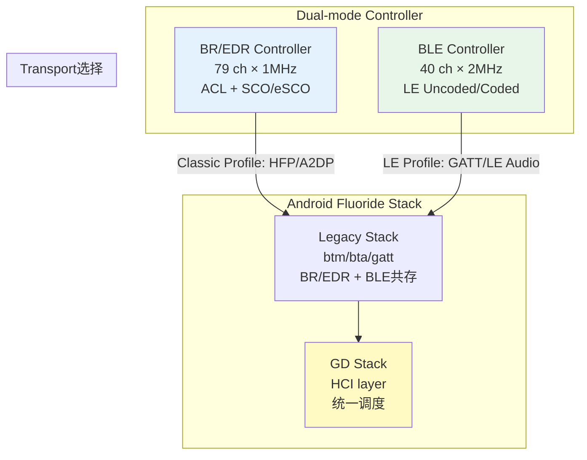
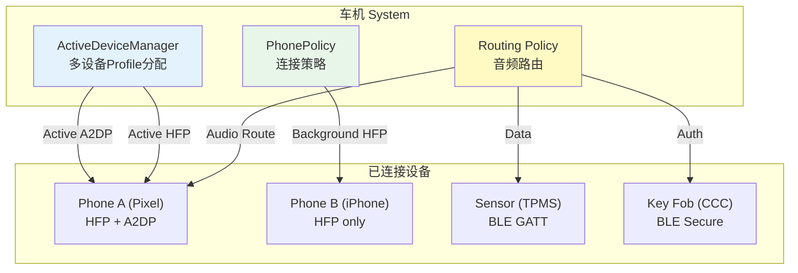
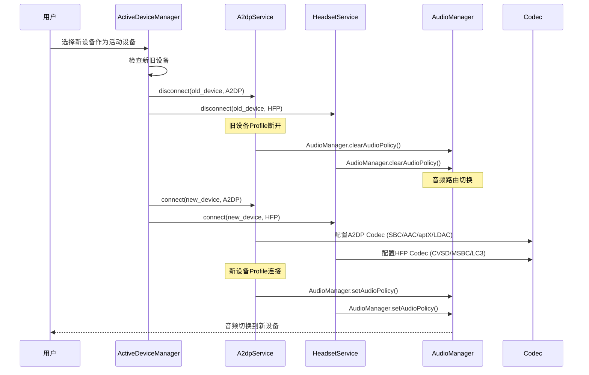
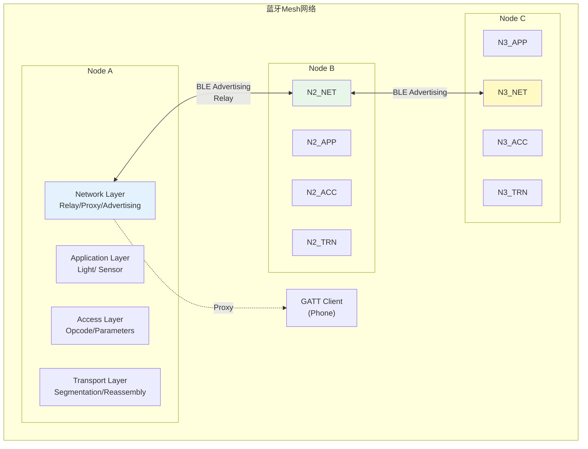
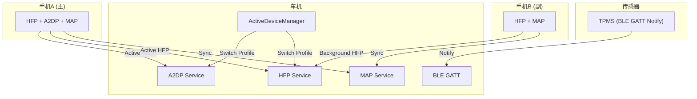
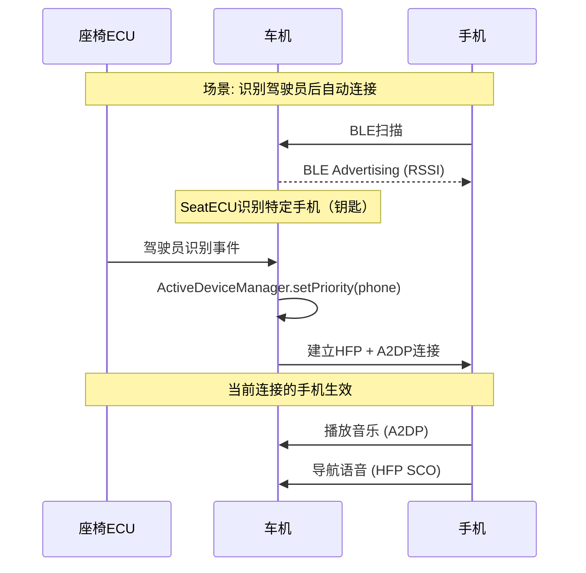
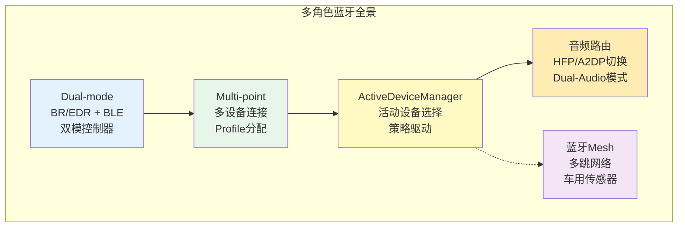

# 第23章：多角色蓝牙与车载场景

> **难度**: ★★★★☆ | **前置知识**: Ch6 Profile Services, Ch11 Classic Profiles, Ch12 BLE Stack
> **预计阅读时间**: 4-5小时 | **预计学习天数**: 4-6天
> **核心作用**: 理解多角色蓝牙（Dual-mode + Multi-point）的实现机制及车载多设备场景

---

## 学习目标

- 理解Dual-mode（BR/EDR + BLE）的工作机制
- 掌握Multi-point多设备连接的Profile分配策略
- 理解ActiveDeviceManager的源码实现
- 掌握多设备音频路由切换策略
- 了解蓝牙Mesh的架构和适用场景
- 理解车载多设备场景的典型问题与优化

---

## 1. Dual-mode架构

### 1.1 双模控制器架构



### 1.2 双模设备类型识别

```java
// BluetoothDevice.java
// 通过Type字段区分设备支持的能力
public static final int DEVICE_TYPE_CLASSIC = 0x01;   // BR/EDR only
public static final int DEVICE_TYPE_LE      = 0x02;   // BLE only
public static final int DEVICE_TYPE_DUAL    = 0x03;   // BR/EDR + BLE

// RemoteDevices.java
public class RemoteDevices {
    // 设备能力缓存
    private final HashMap<String, DeviceProperties> mDevices;

    public int getDeviceType(BluetoothDevice device) {
        DeviceProperties props = mDevices.get(device);
        return (props != null) ? props.mDeviceType : BluetoothDevice.DEVICE_TYPE_CLASSIC;
    }
}
```

### 1.3 双模音频模式

```java
// Utils.java - 双模音频控制
public class Utils {
    // 系统属性: persist.bluetooth.enable_dual_mode_audio
    // true  → 优先使用LE Audio (BLE传输音频)
    // false → 使用Classic Audio (BR/EDR A2DP/HFP)

    public static boolean isDualModeAudioEnabled() {
        return SystemProperties.getBoolean(
            "persist.bluetooth.enable_dual_mode_audio", false);
    }

    public static boolean isDualModeAudioSinkDevice(BluetoothDevice device) {
        // 检查设备是否支持Dual Mode Audio
        // 1. 设备必须支持BLE Audio (LC3 codec)
        // 2. 设备已配对且支持LE Audio Profile
        // 3. return true 时切换LE Audio
    }
}
```

### 1.4 双模配对Key共享

```cpp
// btm_sec.cc - Cross-Transport Key Derivation (CTKD)
// 通过LE Secure Connections派生BR/EDR Link Key

// BLE配对完成后：
void btm_sec_link_key_notification(const RawAddress& p_bda,
                                    const Octet16& link_key,
                                    uint8_t key_type) {
  if (key_type == BTM_LKEY_TYPE_AUTH_COMB_P256) {
    // LE Secure Connections 配对
    // 自动派生BR/EDR Link Key → 双设备只用配一次
    btm_sec_update_key(p_bda, link_key, BTM_LKEY_TYPE_AUTH_COMB_P256);
  }
}

// 双模设备配对状态管理:
// 设备显示为配对一次，但内部维护两个Link Key:
// tBTM_SEC_DEV_REC::device_type → BT_DEVICE_TYPE_DUAL
// tBTM_SEC_DEV_REC::link_key    → BR/EDR Key
// tBTM_SEC_DEV_REC::ble_keys    → BLE Keys (LTK/IRK/CSRK)
```

---

## 2. Multi-point连接管理

### 2.1 多设备连接架构



### 2.2 ActiveDeviceManager源码分析

```java
// ActiveDeviceManager.java - 核心职责

/**
 * The active device manager is responsible for keeping track of the
 * connected A2DP/HFP/AVRCP/HearingAid/LE audio devices and select
 * which device is active for each profile.
 *
 * Current Policy:
 * 1) 单个设备连接 → 自动设为活动设备
 * 2) A2DP活动设备同时控制AVRCP
 * 3) HFP活动设备独立于A2DP
 * 4) HearingAid活动时A2DP/HFP/LE Audio必须为null
 * 5) 最后活动的设备优先
 */

public class ActiveDeviceManager {
    // 活动设备缓存
    @GuardedBy("mDeviceCacheLock")
    private BluetoothDevice mA2dpActiveDevice;    // A2DP活动设备
    @GuardedBy("mDeviceCacheLock")
    private BluetoothDevice mHfpActiveDevice;     // HFP活动设备
    @GuardedBy("mDeviceCacheLock")
    private BluetoothDevice mHearingAidActiveDevice;  // HearingAid
    @GuardedBy("mDeviceCacheLock")
    private BluetoothDevice mLeAudioActiveDevice;     // LE Audio

    // 设备切换逻辑
    public void deviceConnected(BluetoothDevice device, int profile) {
        synchronized (mDeviceCacheLock) {
            if (profile == BluetoothProfile.A2DP) {
                // A2DP连接 - 加入A2DP候选列表
                mA2dpConnectedDevices.add(device);
                // 如果当前无活动A2DP设备，自动选择
                if (mA2dpActiveDevice == null) {
                    setActiveDevice(device, BluetoothProfile.A2DP);
                }
            }
            // 类似逻辑处理HFP/LE Audio/HearingAid
        }
    }

    // 主动设备切换
    public void setActiveDevice(BluetoothDevice device, int profiles) {
        // profiles: bitmask of A2DP/HFP/LE_AUDIO
        // 1. 检查HearingAid冲突
        // 2. 设置设备为活动
        // 3. 通知各Profile Service切换
        // 4. 触发音频路由切换
    }
}
```

### 2.3 PhonePolicy策略

```java
// PhonePolicy.java - 电话策略
public class PhonePolicy {
    public static final String TAG = "PhonePolicy";

    // 多手机连接策略:
    // 1. 最新连接的手机优先设为HFP活动设备
    // 2. 当前通话中的手机保持HFP活动
    // 3. 通话结束后回到默认策略

    public void onHfpConnection(BluetoothDevice device, int state) {
        switch (state) {
            case BluetoothProfile.STATE_CONNECTED:
                // 记录连接时间戳
                mConnectionOrder.addTimestamp(device);
                break;

            case BluetoothProfile.STATE_DISCONNECTED:
                // 移除设备，回退到上一个连接的设备
                mConnectionOrder.remove(device);
                fallbackToPreviousDevice();
                break;
        }
    }

    public void onCallStateChanged(int callState) {
        if (callState == TelephonyManager.CALL_STATE_OFFHOOK) {
            // 通话中 → 锁定当前HFP设备
            lockActiveHfpDevice();
        } else {
            // 通话结束 → 按时间顺序选择
            unlockActiveHfpDevice();
        }
    }
}
```

### 2.4 多Profile连接容量

| Profile | 最大连接数 | 活动设备数 | 说明 |
|---------|-----------|-----------|------|
| HFP | 2+ | 1 | 多个连接但只一个活动通话 |
| A2DP | 2+ | 1 | 多个连接但只一个播放 |
| AVRCP | 2+ | 1 | 与A2DP活动设备绑定 |
| MAP | 2+ | 0 | 邮件访问，后台同步 |
| PBAP | 2+ | 0 | 电话簿访问 |
| GATT | 6+ | N/A | BLE连接数取决于Controller |
| LE Audio | 4+ | 1 | Broadcast接收不限 |

---

## 3. 音频路由切换策略

### 3.1 切换触发条件



### 3.2 音频策略与路由

```java
// ActiveDeviceManager - DualModeAudio切换
private void setActiveDeviceInternal(BluetoothDevice device, int profiles) {
    // Dual Mode Audio: 系统属性控制
    boolean dualModeAudio = Utils.isDualModeAudioEnabled();

    if (dualModeAudio && Utils.isDualModeAudioSinkDevice(device)) {
        // 优先使用LE Audio
        // LE Audio使用LC3 codec，支持多流
        profileGroup = BluetoothProfile.LE_AUDIO;
    } else {
        // 传统模式: A2DP + HFP
        if ((profiles & BluetoothProfile.A2DP) != 0) {
            // 切换A2DP
            // 发送命令到btif_av.cc → AVRC/AVDTP
        }
        if ((profiles & BluetoothProfile.HFP) != 0) {
            // 切换HFP
            // 发送命令到btif_hf.cc → BTA AG/HF
        }
    }
}
```

### 3.3 切换延迟分析

| 场景 | 延迟 | 主要耗时项 |
|------|------|-----------|
| 纯HFP切换 | ~200ms | HCI连接重建 |
| 纯A2DP切换 | ~500ms | ACL重建 + Codec协商 |
| A2DP+HFP同时切换 | ~800ms | 两项叠加 |
| LE Audio切换 | ~300ms | CIS建立 + LC3配置 |
| HearingAid切换 | ~100ms | 无需重建连接 |

---

## 4. 蓝牙Mesh简介

### 4.1 Mesh架构



### 4.2 Mesh vs Point-to-Point

| 特性 | BLE Point-to-Point | BLE Mesh |
|------|-------------------|----------|
| 拓扑 | 星型 | 网络型 |
| 通信范围 | ~10m (Controller限制) | ~200m (多跳) |
| 设备数 | 6+ (GATT连接) | ~32,000 (网络) |
| 延迟 | ~3ms (连接) | ~10-50ms/跳 |
| 功耗 | 低 (连接后) | 中 (需Relay) |
| 适用场景 | 手机→设备 | 照明/传感器/楼宇控制 |
| 车载适用 | 连接手机/钥匙 | 车内传感网络/DAS |

### 4.3 Mesh在车载的潜在应用

```cpp
// 车载Mesh应用场景
// 1. 车内传感器网络
//    - 胎压传感器 (每个轮胎一个Node)
//    - 门窗传感器 (每个车门一个Node)
//    - 温度/光照传感器

// 2. 分布式音频系统 (Auracast + Mesh)
//    - 多房间/多区域音频
//    - 前后排独立音区

// 3. 车辆状态广播 (Beacon + Mesh)
//    - 车门状态通过GATT Proxy传给手机
//    - 充电状态广播给附近设备
```

> **注意**: Android Fluoride不包含Mesh协议栈实现。车载Mesh通常通过独立MCU + Nordic/Zephyr SDK实现。

---

## 5. 车载多设备典型场景

### 5.1 多手机同时连接



**典型交互流程**:

```
1. 手机A (主) 连接:
   - A2DP: 活动设备 (播放音乐)
   - HFP: 活动设备 (通话优先)
   - MAP: 消息同步
   - PBAP: 电话簿下载

2. 手机B (副) 连接:
   - HFP: 非活动 (可接听但默认用A)
   - MAP: 消息同步

3. 手机B来电:
   - PhonePolicy检测到B来电
   - HFP活动设备切换到B
   - 通话结束后回退到A

4. 手机A断开:
   - ActiveDeviceManager自动回退到B
   - A2DP切换到B
   - HFP切换到B
```

### 5.2 OTA升级后配对保留

```cpp
// btif_storage.cc - Link Key持久化路径
// /data/misc/bluetooth/bt_config.conf
// 配置格式:
// [RemoteDevice]
// Address = AA:BB:CC:DD:EE:FF
// Name = Phone A
// LinkKey = A1B2C3D4... (hex)
// LinkKeyType = 6
// ServiceList = 0x000001C0
// DevType = 3 (DUAL)

// OTA升级关键:
// 1. bt_config.conf 存储在 persist 分区
// 2. OTA不应清除 /data/misc/bluetooth/
// 3. 车厂需确保升级脚本保留该目录
```

### 5.3 座椅/方向盘联动



---

## 6. 实战练习

### 练习1: ActiveDeviceManager状态跟踪

```bash
# 跟踪多设备连接状态
adb logcat -s ActiveDeviceManager:* PhonePolicy:*

# 检查活动设备
adb shell dumpsys bluetooth | grep -A 10 "ActiveDevice"

# 检查连接设备列表
adb shell dumpsys bluetooth | grep "ConnectedDevices" -A 30
```

**问题**:
1. 连接两台手机后，ActiveDeviceManager如何决定哪个是A2DP活动设备？
2. 第二台手机连接HFP时，logcat显示什么？
3. 断开主手机后，ActiveDeviceManager的自动回退会怎么处理？

### 练习2: Dual-mode音频切换实验

```bash
# 开启/关闭Dual-mode Audio
adb shell setprop persist.bluetooth.enable_dual_mode_audio true
adb reboot

# 连接LE Audio耳机
# 检查是否使用LE Audio而不是Classic A2DP

# 日志检查
adb logcat -s ActiveDeviceManager:* LeAudioService:* A2dpService:*
```

**问题**:
1. Dual-mode Audio开启后，连接支持LE Audio的设备时logcat中的Profile选择是什么？
2. 同一设备在Dual-mode开启和关闭时，音频质量有什么区别？
3. 车载场景下建议开启还是关闭Dual-mode Audio？为什么？

### 练习3: 多设备切换延迟测量

```bash
# 编写切换延迟测量脚本
# 使用 adb logcat -v time 测量
# 从触发 setActiveDevice 到 Profile连接完成的耗时

# 1. 记录切换开始时间
adb logcat -v time -s ActiveDeviceManager:* | grep "setActiveDevice"

# 2. 记录Profile连接完成
adb logcat -v time -s A2dpService:* | grep "stateConnected"
adb logcat -v time -s HeadsetService:* | grep "stateConnected"

# 3. 计算时间差
```

**问题**:
1. A2DP和HFP切换的延迟各是多少？
2. 什么因素会导致切换延迟增加？
3. 如何优化切换延迟？

### 练习4: 查看bt_config.conf中的多设备配置

```bash
# 查看已配对设备配置（需root）
adb shell cat /data/misc/bluetooth/bt_config.conf

# 检查每个设备的:
# - DevType: 1=Classic, 2=BLE, 3=Dual
# - LinkKeyType: 0x05=AUTH_COMB, 0x06=AUTH_COMB_P256
# - ServiceList: bitmask of supported profiles

# 修改测试（备份后）
adb shell cp /data/misc/bluetooth/bt_config.conf /data/misc/bluetooth/bt_config.conf.bak
```

---

## 本章总结



---

## 参考文件清单

| 文件 | 行数 | 关键内容 |
|------|------|---------|
| `android/app/.../btservice/ActiveDeviceManager.java` | 1,604 | 多设备活动管理 |
| `android/app/.../btservice/PhonePolicy.java` | 932 | 电话策略 |
| `android/app/.../btservice/RemoteDevices.java` | 2,270 | 设备属性管理 |
| `android/app/.../btservice/AdapterService.java` | 4,458 | Service层多设备管理 |
| `system/stack/btm/btm_sec.cc` | 5,280 | CTKD跨传输Key派生 |
| `system/btif/src/btif_av.cc` | 3,664 | A2DP多设备支持 |
| `android/app/.../a2dp/A2dpService.java` | 1,191 | A2DP Service |
| `android/app/.../hfp/HeadsetService.java` | 2,520 | HFP Service |
| **V8 深度分析报告** | | |
| `V8_Profile_Analysis.md` | - | Profile多设备支持 |
| `V8_Pairing_Analysis.md` | 304 | 双模配对/CTKD |
| `V8_Enable_Disable_Analysis.md` | - | 启停多设备影响 |

---

## 相关章节

- **第6章 Profile Services**：[06_Profile_Services.md](06_Profile_Services.md)
- **第11章 Classic Profiles**：[11_Classic_Profiles.md](11_Classic_Profiles.md)
- **第16章 Audio System**：[16_Audio_System.md](16_Audio_System.md)
- **第19章 Automotive Scenarios**：[19_Automotive_Scenarios.md](19_Automotive_Scenarios.md)
- **第21章 Pairing & Security**：[21_Pairing_Security.md](21_Pairing_Security.md)

## 车载场景

多设备管理是车载蓝牙区别于消费电子蓝牙的核心特征。ActiveDeviceManager的活动设备选择策略直接影响驾驶体验。Dual-mode Audio（LE Audio + Classic Audio）正在逐步成为车载标配。OTA升级后配对丢失是车厂售后Top问题，需确保Link Key持久化。跨传输Key派生（CTKD）可让BR/EDR和BLE一次配对同时完成，减少用户操作。

> **下一步**: 阅读 [第24章 LE Audio与Auracast](24_LE_Audio_Auracast.md)
