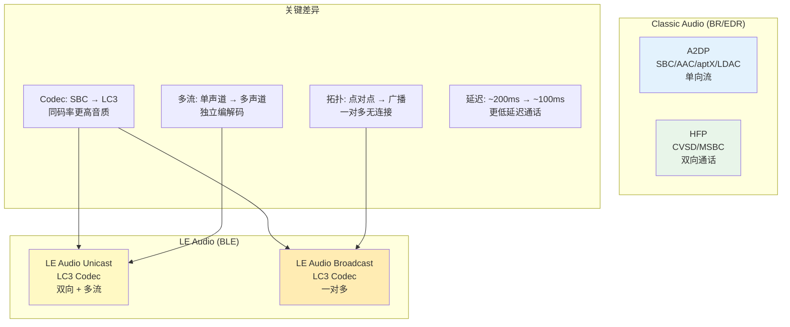
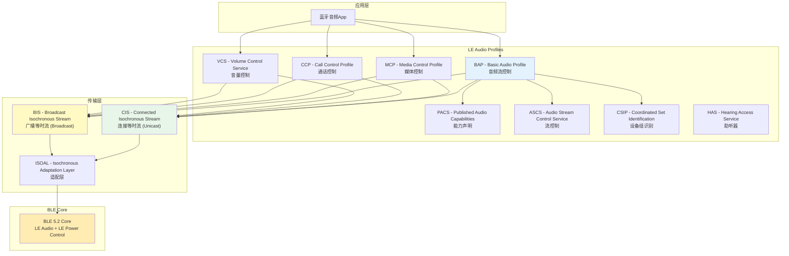
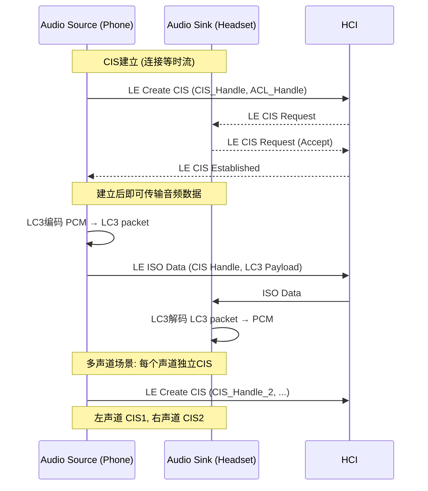
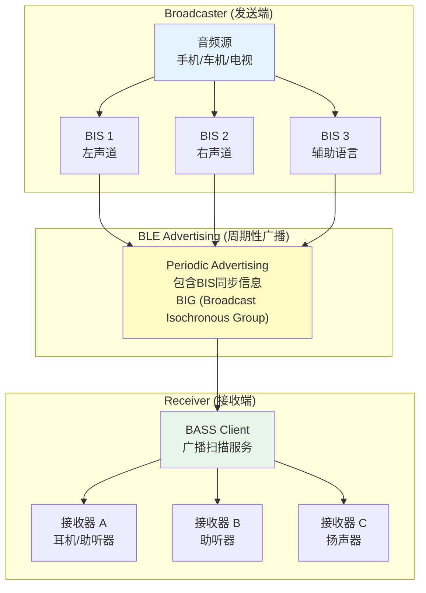
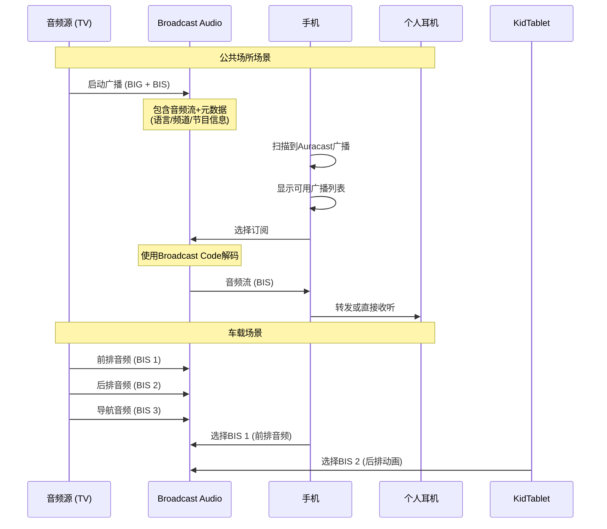
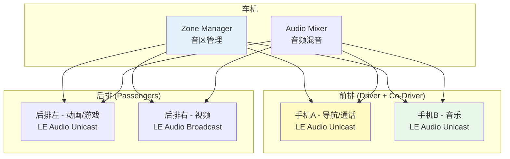
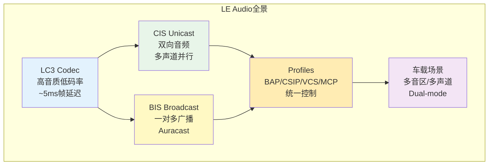

# 第24章：LE Audio与Auracast

> **难度**: ★★★★☆ | **前置知识**: Ch12 BLE Stack, Ch16 Audio System, Ch11 Classic Profiles
> **预计阅读时间**: 3-4小时 | **预计学习天数**: 3-5天
> **核心作用**: 理解LE Audio架构和Auracast广播音频，掌握车载多声道音频场景

---

## 学习目标

- 理解LE Audio的架构和核心概念
- 掌握LC3编解码器的工作原理
- 理解Unicast和Broadcast两种音频流模式
- 掌握Auracast广播音频的应用场景
- 了解LE Audio Profiles体系（BAP/PACS/ASCS）
- 理解车载LE Audio的多声道音频应用

---

## 1. LE Audio概述

### 1.1 LE Audio vs Classic Audio



| 特性 | Classic Audio (A2DP/HFP) | LE Audio |
|------|------------------------|----------|
| 物理层 | BR/EDR (79ch × 1MHz) | BLE (40ch × 2MHz) |
| 编解码器 | SBC/AAC/aptX/LDAC | LC3 (强制) |
| 音频流 | 单方向（A2DP Source→Sink） | 双向 + 多流 |
| 拓扑 | 点对点 | 点对点 + 广播 |
| 延迟 | A2DP ~150-300ms | ~20-100ms |
| 功耗 | ~30mA | ~10mA |
| 多声道 | 需要额外设定 | 原生支持 |
| 标准 | Bluetooth 3.0+ | Bluetooth 5.2+ |
| Android支持 | Android 2.2+ | Android 13+ |

### 1.2 LE Audio协议栈



---

## 2. LC3编解码器

### 2.1 LC3技术参数

```
LC3 (Low Complexity Communication Codec):

采样率:   8kHz / 16kHz / 24kHz / 32kHz / 48kHz
比特率:   16kbps - 345kbps (单声道)
帧长:     7.5ms / 10ms
复杂度:   极低 (适合嵌入式)
延迟:     2.5ms (编码) + 2.5ms (解码) = 5ms (帧)

相比SBC:
- 同码率: 音质提升 ~30%
- 同音质: 码率降低 ~50%
- 延迟:   降低 ~50%
```

### 2.2 HFP LC3编码器

```cpp
// system/stack/include/hfp_lc3_encoder.h
// HFP使用LC3作为Super Wideband (SWB) 编解码器

// 编码器接口:
// 输入: PCM 16-bit samples (32kHz)
// 输出: LC3 packet
size_t hfp_lc3_encode(int16_t* input, size_t input_size,
                       uint8_t* output, size_t output_size);

// HFP Codec选择:
// CVSD  → Narrowband (8kHz)  - BLE不支持
// mSBC  → Wideband (16kHz)   - 传统HFP
// LC3   → Super Wideband (32kHz) - HFP 1.9 + LE Audio
```

### 2.3 LC3 vs 其他Codec

| Codec | 最小码率 | 典型码率 | 延迟 | 复杂度 | 强制要求 |
|-------|---------|---------|------|--------|---------|
| SBC | 128kbps | 328kbps | ~30ms | 低 | A2DP强制 |
| AAC | 96kbps | 250kbps | ~40ms | 中 | 可选 |
| aptX | 352kbps | 352kbps | ~30ms | 低 | Qualcomm |
| LDAC | 330kbps | 990kbps | ~30ms | 高 | Sony |
| LC3 | 16kbps | 192kbps | ~5ms | 极低 | LE Audio强制 |
| LC3plus | 16kbps | 500kbps | ~2.5ms | 低 | 可选扩展 |

---

## 3. Connected Isochronous Stream (CIS)

### 3.1 CIS建立流程



### 3.2 ISO数据传输

```cpp
// system/bta/le_audio/client.cc - ISO数据传输
// LE Audio的音频数据通过ISO (Isochronous) 层传输
// 使用CIS (Connected Isochronous Stream) 承载

// ISO数据包结构:
// +──────────+────────────+─────────────────────────────+
// | ISO Header | CIS Data  | LC3 Frame (可伸缩)          |
// +──────────+────────────+─────────────────────────────+
//   LB + CIE   SDU Length   LC3 encoded audio payload

// 多声道配置示例 (Stereo):
// CIS 1: [LC3 Left Channel] ← ISO Interval = 10ms
// CIS 2: [LC3 Right Channel] ← ISO Interval = 10ms
// 两个CIS可并行传输，延迟同步

// CIS参数配置:
struct le_audio_cis_params {
    uint16_t sdu_interval;          // SDU间隔 (微秒)
    uint8_t framing;                // 0=未帧, 1=帧
    uint16_t max_sdu;              // 最大SDU大小
    uint8_t retransmission_number;  // 重传次数
    uint16_t max_transport_latency; // 最大传输延迟 (毫秒)
};
```

---

## 4. Broadcast Audio (Auracast)

### 4.1 Auracast架构



### 4.2 Broadcast vs Unicast

| 特性 | Unicast (CIS) | Broadcast (BIS) |
|------|--------------|-----------------|
| 连接 | 需要连接 | 无连接 |
| 方向 | 双向 | 单向 |
| 设备数 | 1对1 | 1对多 (无上限) |
| 加密 | 连接加密 | Broadcast Code |
| 延迟 | ~20-50ms | ~50-100ms |
| 同步 | 精确同步 | 周期同步 |
| 应用 | 通话/音乐 | 公共场所音频分享 |
| 车载 | 手机→车机 | 车内多区广播 |

### 4.3 Broadcast加密

```cpp
// system/bta/le_audio/broadcaster/broadcaster.cc
// Broadcast Audio可以使用Broadcast Code加密

// Broadcast Code作用:
// 1. 控制哪些接收端可以解码音频
// 2. 通过BASS (Broadcast Audio Scan Service) 分发
// 3. QR code或NFC分享给接收端

// BIG加密参数:
struct BIG_Encryption {
    uint8_t encryption;      // 0=不加密, 1=加密
    uint8_t broadcast_code[16]; // 128-bit Broadcast Code
    uint8_t b_ir[16];        // Broadcast IR (加密随机数)
    uint8_t b_irk[16];       // Broadcast IRK (加密派生密钥)
};

// 广播扫描服务 (BassClientService.java):
// 接收端通过BASS发现附近的Broadcast来源
// QR Code中包含Broadcast Code → NFC/蓝牙配置
```

### 4.4 Auracast场景



---

## 5. LE Audio Profiles简介

### 5.1 BAP (Basic Audio Profile)

```java
// BluetoothLeAudio.java - LE Audio Profile API
public class BluetoothLeAudio implements BluetoothProfile {
    // BAP控制:
    // - 建立/断开音频流
    // - 配置Codec参数 (采样率/比特率/帧长)
    // - 多声道管理

    // Connection Policy
    public static final int CONNECTION_POLICY_ALLOWED = 0;
    public static final int CONNECTION_POLICY_FORBIDDEN = 1;

    // Codec配置
    public void setCodecConfigPreferences(
            @NonNull List<BluetoothLeAudioCodecConfig> codecConfigs) {
        // 设置优先Codec配置列表
        // LC3_32KBPS_10MS, LC3_64KBPS_10MS, LC3_128KBPS_10MS ...
    }

    // 多流控制
    public boolean setActiveDevice(@Nullable BluetoothDevice device) {
        // 设置活动LE Audio设备
        // 调用ActiveDeviceManager切换
    }
}
```

### 5.2 CSIP (Coordinated Set Identification)

```cpp
// system/bta/csis/csis_client.cc
// CSIP用于管理一组设备（如一对TWS耳机）

// CSIP核心功能:
// 1. SIRK (Set Identity Resolving Key) - 组标识
// 2. 组成员自动发现
// 3. 同步操作 (同步音量/同步播放)

struct csis_set_member {
    RawAddress address;       // 设备地址
    uint8_t sirk[16];         // Set Identity Resolving Key
    uint8_t rank;             // 组内排名 (0=主, 1+=从)
    bool is_locked;           // 组锁定状态
    bool has_voice;           // 是否支持语音
};
```

### 5.3 VCS (Volume Control Service)

```cpp
// system/bta/vc/vc.cc
// VCS提供统一的音量控制接口

// 音量控制特性:
// - Volume State (当前音量 0-255)
// - Volume Flags (静音/步进)
// - Audio Input State (输入音量)

struct volume_state {
    uint8_t volume_setting;    // 音量 0-255
    uint8_t mute;              // 0=不静音, 1=静音
    uint8_t step_size;         // 步进大小
    int8_t volume_instant;     // 即时音量变化
};
```

---

## 6. 车载LE Audio场景

### 6.1 多声道音频系统

```
车载LE Audio典型配置
────────────────────
车机 (LE Audio Unicast Server + Broadcast Source)

  ├── 多声道Unicast:
  │     CIS 1: 左前声道 (LC3 128kbps, 48kHz)
  │     CIS 2: 右前声道 (LC3 128kbps, 48kHz)
  │     CIS 3: 左后声道 (LC3 64kbps, 48kHz)
  │     CIS 4: 右后声道 (LC3 64kbps, 48kHz)
  │     CIS 5: 低音声道 (LC3 64kbps, 48kHz)
  │
  ├── 前排通话/Broadcast:
  │     BIS 1: 驾驶位音频
  │     BIS 2: 副驾驶位音频
  │
  └── 导航Broadcast:
        BIS 3: 导航提示 (低延迟)
```

### 6.2 多音区独立控制



### 6.3 LE Audio与Classic Audio共存策略

```java
// ActiveDeviceManager.java - Dual-mode Audio
// LE Audio兼容模式

// 系统属性: persist.bluetooth.enable_dual_mode_audio
// 设备通过BAP + PACS声明能力

// 回退策略:
// 1. 首选: LE Audio (手机+耳机都支持)
// 2. 回退: A2DP + HFP (传统模式)
// 3. 混合: LE Audio呼叫 + A2DP音乐

boolean isDualMode = Utils.isDualModeAudioEnabled();
boolean deviceSupportsLeAudio = (leAudioDevice != null);

if (isDualMode && deviceSupportsLeAudio) {
    // 使用LE Audio
    setActiveDevice(device, BluetoothProfile.LE_AUDIO);
} else {
    // 使用Classic A2DP + HFP
    setActiveDevice(device, BluetoothProfile.A2DP | BluetoothProfile.HFP);
}
```

---

## 7. 实战练习

### 练习1: LE Audio设备发现

```bash
# 检查设备LE Audio能力
adb shell dumpsys bluetooth | grep -A 20 "LeAudioService"

# 检查已配对的LE Audio设备
adb shell dumpsys bluetooth | grep -A 5 "LeAudio"

# 检查CSIP组
adb shell dumpsys bluetooth | grep -i "csip\|sirk\|group"

# LE Audio日志跟踪
adb logcat -s LeAudioService:* LeAudioStateMachine:*
```

**问题**:
1. 连接LE Audio耳机后，LeAudioService日志显示哪些信息？
2. 如何判断耳机是单声道还是立体声？
3. 如果耳机是TWS，CSIP日志中显示什么？

### 练习2: Broadcast Audio扫描

```bash
# 检查BASS服务状态
adb shell dumpsys bluetooth | grep -A 10 "BassClient"

# 扫描广播音频
adb logcat -s BassClientService:* LeAudioBroadcasterNativeInterface:*

# 查看广播配置
adb shell dumpsys bluetooth | grep -A 20 "Broadcast"
```

**问题**:
1. BASS扫描到广播音频源时日志显示什么？
2. Broadcast Audio和普通BLE广播在扫描结果中有什么区别？
3. 如何通过代码加入一个加密的Broadcast？

### 练习3: LC3 Codec配置

```bash
# 查看当前Codec配置
adb shell dumpsys bluetooth | grep -A 30 "LeAudioCodec"

# 切换Codec优先级
# 通过BluetoothLeAudio.setCodecConfigPreferences()
# 观察Codec切换日志
```

**问题**:
1. LE Audio连接时默认使用什么Codec配置？
2. 改变Codec配置会影响音频质量还是延迟？
3. LC3 LC3plus和LC3有什么区别？

### 练习4: LE Audio延迟测量

```bash
# 使用LE Audio通话时测量延迟
# 方法: 同时录音播放端和接收端，对比时间差

# 查看ISO传输参数
adb shell dumpsys bluetooth | grep -A 20 "ISO\|CIS\|BIS"

# 查看SDU间隔和传输延迟
adb logcat -s bt_le_audio:* | grep -i "sdu\|latency\|interval"
```

**问题**:
1. LE Audio的典型端到端延迟是多少？
2. CIS的SDU间隔对延迟有什么影响？
3. 车载LE Audio需要什么额外的延迟优化？

---

## 本章总结



---

## 参考文件清单

| 文件 | 行数 | 说明 |
|------|------|------|
| `framework/.../BluetoothLeAudio.java` | 1,470 | LE Audio API |
| `android/app/.../le_audio/LeAudioService.java` | 5,819 | LE Audio Service实现 |
| `android/app/.../le_audio/LeAudioStateMachine.java` | 598 | LE Audio状态机 |
| `system/bta/le_audio/client.cc` | 7,861 | LE Audio客户端Native |
| `system/bta/le_audio/broadcaster/broadcaster.cc` | 1,465 | Broadcast实现 |
| `system/bta/le_audio/broadcaster/broadcaster_types.h` | 393 | Broadcast类型定义 |
| `android/app/.../bass_client/BassClientService.java` | 4,903 | BASS广播扫描 |
| `system/stack/include/hfp_lc3_encoder.h` | 36 | LC3编码器接口 |
| `system/stack/btm/hfp_lc3_encoder.cc` | 70 | LC3编码实现 |
| `system/bta/csis/csis_client.cc` | 2,448 | CSIP设备组 |
| `system/bta/vc/vc.cc` | 1,918 | 音量控制 |
| `system/bta/le_audio/le_audio_types.h` | 1,460 | LE Audio类型定义 |
| **V8 深度分析报告** | | |
| `V8_Profile_Analysis.md` | - | Profile分析 |

---

## 相关章节

- **第12章 BLE Stack**：[12_BLE_Stack.md](12_BLE_Stack.md)
- **第16章 Audio System**：[16_Audio_System.md](16_Audio_System.md)
- **第11章 Classic Profiles**：[11_Classic_Profiles.md](11_Classic_Profiles.md)
- **第23章 Multi-Device**：[23_Multi_Device_Bluetooth.md](23_Multi_Device_Bluetooth.md)

## 车载场景

LE Audio是车载音频的未来。LC3编解码器在同样码率下比SBC音质提升30%，适合车载多声道系统。CIS支持每个座位独立音频通道，BIS(Auracast)让车内多区广播成为可能。目前车载LE Audio处于Dual-mode阶段（LE Audio + Classic Audio共存），建议车厂同时支持两种模式以确保兼容性。

> **下一步**: 阅读 [第25章 蓝牙认证与BQB流程](25_Certification_Compliance.md)
