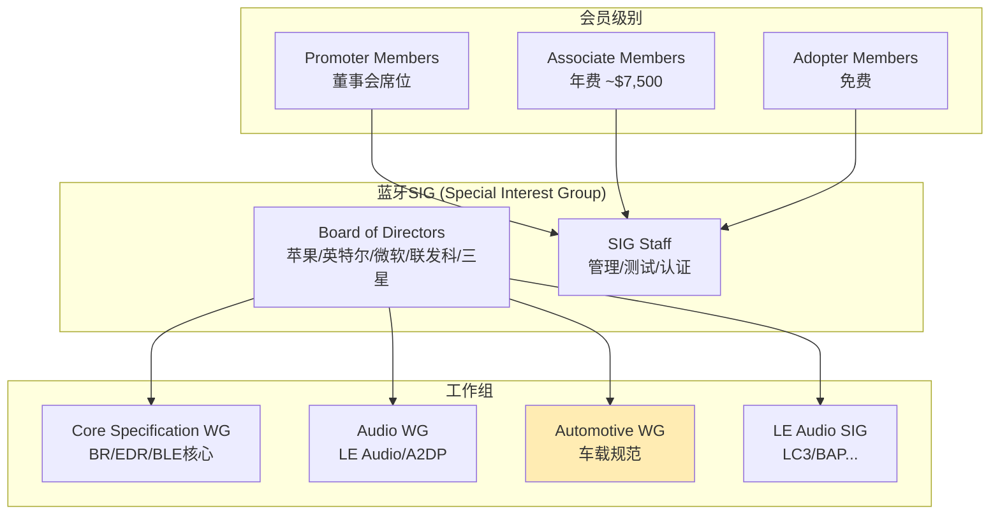
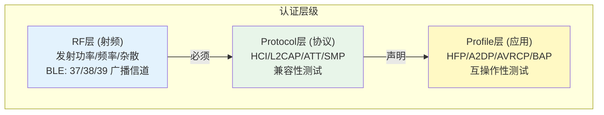
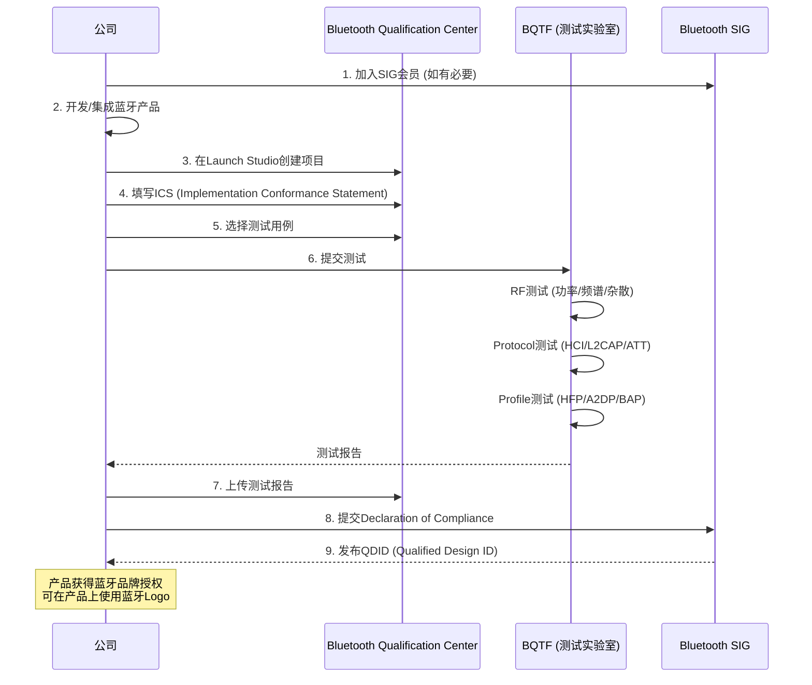
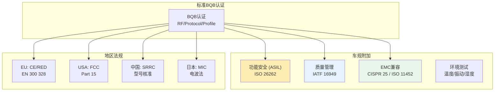
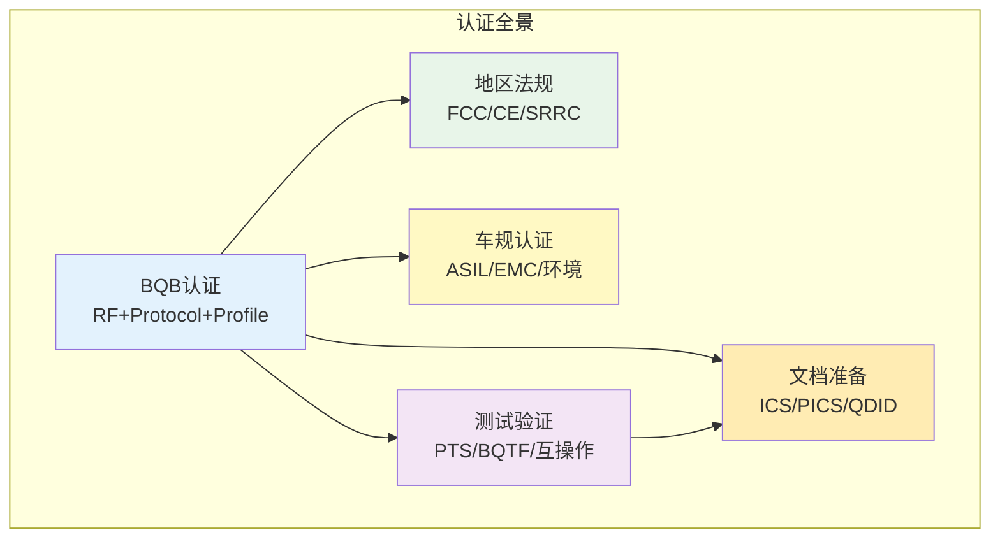

# 第25章：蓝牙认证与BQB流程

> **难度**: ★★★☆☆ | **前置知识**: 全书基础知识
> **预计阅读时间**: 3-4小时 | **预计学习天数**: 2-3天
> **核心作用**: 理解蓝牙认证流程和BQB测试，掌握车规级蓝牙认证要求

---

## 学习目标

- 理解蓝牙SIG组织结构和认证体系
- 掌握BQB认证的完整流程
- 理解射频、协议和Profile的测试要点
- 了解车规蓝牙认证的附加要求
- 掌握合规文档的准备工作
- 了解认证失败常见原因和对策

---

## 1. 蓝牙SIG与认证体系

### 1.1 蓝牙SIG组织



### 1.2 认证层级



### 1.3 认证类型

| 类型 | 说明 | 适用场景 |
|------|------|---------|
| End Product | 最终产品（手机/耳机/车机） | 大多数情况 |
| Component | 组件（蓝牙芯片/模组） | 芯片厂商 |
| Host-SubSystem | 主从组合（Host+Controller） | 分离式设计 |
| Profile Tuning Suite | Profile参数调优 | 功能复杂时 |

---

## 2. BQB认证流程

### 2.1 认证全流程



### 2.2 关键术语

```
BQB  - Bluetooth Qualification Body (蓝牙认证机构)
BQTF - Bluetooth Qualification Testing Facility (测试实验室)
QDID - Qualified Design ID (认证设计ID)
ICS  - Implementation Conformance Statement (实现一致性声明)
PICS - Profile Implementation Conformance Statement (Profile实现声明)
TPG  - Test Plan Generator (测试用例生成器)
RF   - Radio Frequency (射频测试)
ERP  - Equivalent Radiated Power (等效辐射功率)
```

### 2.3 测试类型和费用

| 测试类别 | 测试项数 | 费用范围 (USD) | 说明 |
|---------|---------|---------------|------|
| RF (射频) | 20-50 | $5,000-15,000 | BLE/BR/EDR/LE Audio |
| Protocol | 100-300 | $3,000-8,000 | HCI/L2CAP/ATT/SMP |
| Profile | 50-200 | $2,000-10,000 | 视Profile数量而定 |
| 总费用 | - | $10,000-30,000 | 含BQTF费用+SIG费用 |

---

## 3. 射频测试要点

### 3.1 BLE射频测试

```
BLE射频测试项 (基于RF-PHY.TS):

TX测试:
1. Output Power (发射功率)    - 上限+10dBm (BLE)
2. Modulation Characteristics - 调制质量
3. Carrier Frequency Offset   - 载波频率偏移
4. Carrier Frequency Drift    - 载波频率漂移
5. In-band Emissions          - 带内杂散

RX测试:
1. Receiver Sensitivity       - 接收灵敏度 (-70dBm to 0dBm)
2. Interference Performance   - 抗干扰性能
3. Maximum Input Level        - 最大输入电平
4. PER (Packet Error Rate)    - 丢包率 (≤30.8%)

BLE Coded PHY (125kbps/500kbps) 附加测试:
- S=2 (500kbps) 和 S=8 (125kbps) 模式下
- Sensitivity = -95dBm (S=8) 优于 -70dBm (1M)
```

### 3.2 BR/EDR射频测试

```
BR/EDR射频测试项:
1. 发射功率: Class1(+20dBm) / Class2(+4dBm) / Class3(0dBm)
2. 功率密度: 最大100mW/100kHz
3. 频率范围: 2402-2480MHz (79通道)
4. 信道间隔: 1MHz
5. 跳频: 1600hops/s
6. 调制: GFSK (BR), π/4-DQPSK (EDR 2M), 8DPSK (EDR 3M)
```

---

## 4. Protocol和Profile测试

### 4.1 常见Profile测试项

| Profile | 测试项数 | 关键测试点 |
|---------|---------|-----------|
| HFP 1.9 | ~150 | 免提控制/三方通话/AT命令 |
| A2DP 1.4 | ~80 | 编解码器/SBC强制/流控制 |
| AVRCP 1.6 | ~120 | 媒体信息/播放控制/绝对音量 |
| PBAP 1.2 | ~50 | 电话簿下载 |
| MAP 1.4 | ~60 | 消息通知/邮件同步 |
| BAP (LE Audio) | ~200 | CIS/BIS建立/Codec切换 |
| CSIP | ~50 | 设备组/同步操作 |

### 4.2 测试失败常见原因

```cpp
// 测试失败模式示例

// 1. GATT Service不符合规范
// a. Service UUID使用私有而非标准UUID
// b. CCCD遗漏或配置错误
// c. Handle范围超过GATT_MAX_SRVC_DB_ENTRIES

// 2. HCI命令序列错误
// a. 在连接建立前发送数据
// b. 未正确处理Command Complete/Command Status
// c. LE Connection Complete后未开启Encryption

// 3. Profile规范违规
// a. HFP AT命令格式不符合/GSM 07.07
// b. A2DP SDP record缺少强制属性
// c. AVRCP绝对音量支持不完整

// 4. Timer超时
// a. ATT response超过30秒
// b. SMP配对超过30秒
// c. HCI命令响应超时
```

### 4.3 自动化测试工具

```bash
# 蓝牙SIG官方工具
# 1. PTS (Profile Tuning Suite) - 官方测试工具
# 下载: https://www.bluetooth.com/develop-with-bluetooth/specifications/test-requirements/
# 运行:
./PTS_Runner --profile HFP --controller hci0

# 2. 开源测试工具
# BLE测试
gatttool -b AA:BB:CC:DD:EE:FF --primary  # 服务发现
gatttool -b AA:BB:CC:DD:EE:FF --char-desc  # 特征发现

# HCI测试
hcitool cmd 0x08 0x0013  # LETest End (结束测试模式)

# 3. Android测试框架
atest bluetooth_test  # 运行蓝牙测试
```

---

## 5. 车规认证要求

### 5.1 车规级蓝牙认证额外要求



### 5.2 车载蓝牙认证清单

```
车载蓝牙认证清单:
─────────────────────────────────────────────

1. 蓝牙SIG认证 (BQB)
   [ ] RF测试 - BR/EDR + BLE
   [ ] Protocol测试 - HCI/L2CAP/ATT/SMP
   [ ] Profile测试 - HFP/A2DP/AVRCP/PBAP/MAP
   [ ] LE Audio测试 (可选) - BAP/CSIP/VCS

2. 地区法规认证
   [ ] FCC Part 15 (美国)
   [ ] CE RED 2014/53/EU (欧洲)
   [ ] SRRC (中国)
   [ ] MIC (日本)
   [ ] KC (韩国)
   [ ] RCM (澳大利亚)

3. 车规认证
   [ ] ISO 26262 ASIL-B (功能安全)
   [ ] IATF 16949 (质量体系)
   [ ] CISPR 25 (电磁兼容)
   [ ] ISO 11452 (电磁抗扰)
   [ ] ISO 16750-4 (环境/温度)
   [ ] ISO 16750-3 (机械/振动)

4. 运营商认证
   [ ] GCF (Global Certification Forum)
   [ ] PTCRB (北美运营商)
   [ ] 本地运营商测试 (中国移动/联通/电信)

5. 附加测试
   [ ] 天线性能 (TRP/TIS)
   [ ] SAR测试 (射频暴露)
   [ ] OTA性能 (Over-The-Air)
   [ ] 蓝牙共存测试 (Wi-Fi + BLE同频)
```

### 5.3 功能安全 (ASIL)

```cpp
// ISO 26262 ASIL-B 对蓝牙模块的要求

// 1. 监控机制:
//   - HCI Watchdog: 监视HCI命令响应超时
//   - Stack健康检查: 定时检测BTU Task状态
//   - 连接质量监控: 监控RSSI/Packet Error Rate

// 2. 故障处理:
//   - 蓝牙崩溃: 自动重启 (确认重启次数限制)
//   - 连接丢失: 自动重连 (有重试限制)
//   - 天线异常: 检测VSWR/PA温度

// 3. 安全状态:
//   - 蓝牙故障 → 恢复到安全状态
//   - 音频中断 → 切换到本地扬声器
//   - 连接丢失 → 保持上次已知状态

// 4. 诊断覆盖:
//   - 安全相关路径的FMEA文档
//   - 故障注入测试
//   - 覆盖率 ≥ 90%
```

### 5.4 车载认证常见问题

| 问题 | 原因 | 解决方案 |
|------|------|---------|
| BLE扫描不灵敏 | 天线设计不佳 | 天线带宽优化 |
| HFP回声 | 声学设计/Codec配置 | 回声消除算法调优 |
| A2DP卡顿 | Wi-Fi/BLE共存 | 共存调度优化 |
| 配对失败 | IO Cap不匹配 | 配置DisplayYesNo |
| 射频指标差 | 供电/阻抗 | Layout优化 |
| 温度漂移 | 高温断连 | 温度补偿算法 |

---

## 6. 合规文档准备

### 6.1 文档清单

```
合规文档包:
──────────────────

1. SIG认证文档:
   [ ] QDID (已认证的蓝牙设计)
   [ ] Declaration ID
   [ ] ICS (Implementation Conformance Statement)
   [ ] PICS (Profile ICS)
   [ ] 测试报告 (来自BQTF)
   [ ] 合规声明

2. 地区法规文档:
   [ ] FCC ID / DoC
   [ ] CE RED Declaration
   [ ] SRRC证书
   [ ] MIC认证

3. 研发文档:
   [ ] 蓝牙规格文档
   [ ] 测试计划
   [ ] 射频测试报告
   [ ] 互操作测试报告
   [ ] ESD/EMC测试报告

4. 质量文档:
   [ ] DFMEA (蓝牙子系统)
   [ ] DVP&R (测试验证)
   [ ] 认证跟踪矩阵
```

### 6.2 QDID使用说明

```bash
# QDID查询
# 1. 在 Launch Studio 中查询
#    https://launchstudio.bluetooth.com

# 2. 搜索已认证的蓝牙芯片
#    芯片厂商 (高通/联发科/Broadcom/Nordic/TI)
#    模块厂商 (村田/环旭)

# 3. QDID层级
#    - Controller QDID: 蓝牙射频+基带
#    - Host QDID: 蓝牙协议栈
#    - End Product QDID: 最终产品

# 4. QDID有效期
#    - Controller QDID: 无过期 (需符合Core Spec版本)
#    - Host QDID: 与协议栈版本绑定
#    - End Product QDID: 产品生命周期
```

---

## 7. 实战练习

### 练习1: PTS测试环境搭建

```bash
# 准备PTS测试环境:
# 1. 下载PTS
#    https://www.bluetooth.com/develop-with-bluetooth/specifications/test-requirements/

# 2. 硬件需求:
#    - 一台Windows PC (运行PTS)
#    - 一个蓝牙测试仪 (如Frontline/EL/BlueSoleil)
#    - 被测设备 (车机/手机)

# 3. 测试Profile示例 (HFP):
./PTS_Runner --profile HFP --controller hci0 --device AA:BB:CC:DD:EE:FF
```

**问题**:
1. PTS测试中HFP需要哪些测试用例？
2. 测试失败后如何定位问题？（Software/Hardware/Spec）

### 练习2: RF测试基础

```bash
# 使用hcitool检查蓝牙射频参数
hcitool cmd 0x03 0x0005  # Read RSSI
hcitool cmd 0x03 0x0007  # Read Transmit Power Level

# BLE专用
hcitool lecc AA:BB:CC:DD:EE:FF  # BLE连接
hcitool lewlclr                  # 清除白名单
```

**问题**:
1. 如何检查蓝牙发射功率是否在合规范围内？
2. 中国SRRC认证对BLE发射功率有什么限制？

### 练习3: 合规文档审核

```bash
# 检查设备蓝牙合规信息
# Android
adb shell dumpsys bluetooth_manager | grep -i "version\|qualifier"

# Linux
hciconfig -a
# 查看: HCI Version, LMP Version, Manufacturer

# Mac
system_profiler SPBluetoothDataType
```

**问题**:
1. 如何判断设备使用的蓝牙芯片厂商？
2. 固件版本更新后是否需要重新认证？

### 练习4: 认证失败分析

```bash
# 模拟认证失败场景
# 1. 修改GATT Service UUID为非标值 → PTS测试失败
# 2. 关闭LE Secure Connections → SMP测试失败
# 3. 修改SDP Record → Profile发现测试失败

# 使用PTS回放测试日志分析
./PTS_Runner --profile GATT --replay failed_test.log
```

**问题**:
1. PTS测试失败后如何定位到具体代码行？
2. 修改蓝牙协议栈代码后需要重新认证哪些部分？

---

## 本章总结



---

## 参考文件清单

| 文件 | 说明 |
|------|------|
| `system/include/hardware/bluetooth.h` | 蓝牙版本定义 |
| `system/stack/include/bt_target.h` | Stack配置参数 |
| `system/btif/src/btif_dm.cc` | 配对安全管理 |
| `system/stack/gatt/gatt_api.cc` | GATT API实现 |
| **SIG资源** | |
| [Launch Studio](https://launchstudio.bluetooth.com) | 认证项目管理 |
| [PTS下载](https://www.bluetooth.com/develop-with-bluetooth/specifications/test-requirements/) | 官方测试工具 |
| [SIG Specification](https://www.bluetooth.com/specifications/specs/) | 规范文档 |

---

## 相关章节

- **第1章 Architecture Overview**：[01_Architecture_Overview.md](01_Architecture_Overview.md)
- **第15章 HCI HAL**：[15_HCI_HAL.md](15_HCI_HAL.md)
- **第18章 Security Architecture**：[18_Security_Architecture.md](18_Security_Architecture.md)
- **第19章 Automotive Scenarios**：[19_Automotive_Scenarios.md](19_Automotive_Scenarios.md)
- **第24章 LE Audio & Auracast**：[24_LE_Audio_Auracast.md](24_LE_Audio_Auracast.md)

## 车载场景

车载蓝牙认证比消费电子更复杂。除BQB认证外，还需满足地区法规（FCC/CE/SRRC）、车规认证（ISO 26262 ASIL-B）和运营商认证。建议芯片供应商已有QDID（如高通QCA系列），可加速认证。功能安全ASIL-B要求蓝牙模块在故障时进入安全状态，自动重连应有次数限制以防死循环。

> **下一步**: 阅读 [V8_Architecture_Map.md](V8_Architecture_Map.md) — 框架架构全景图（复习）或在本文件中练习认证测试
