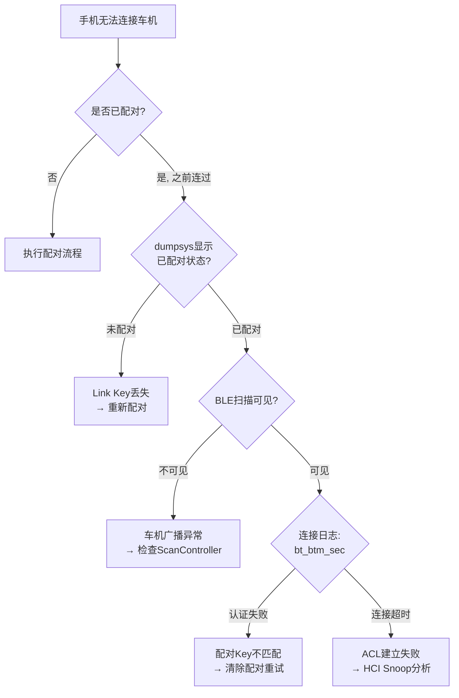
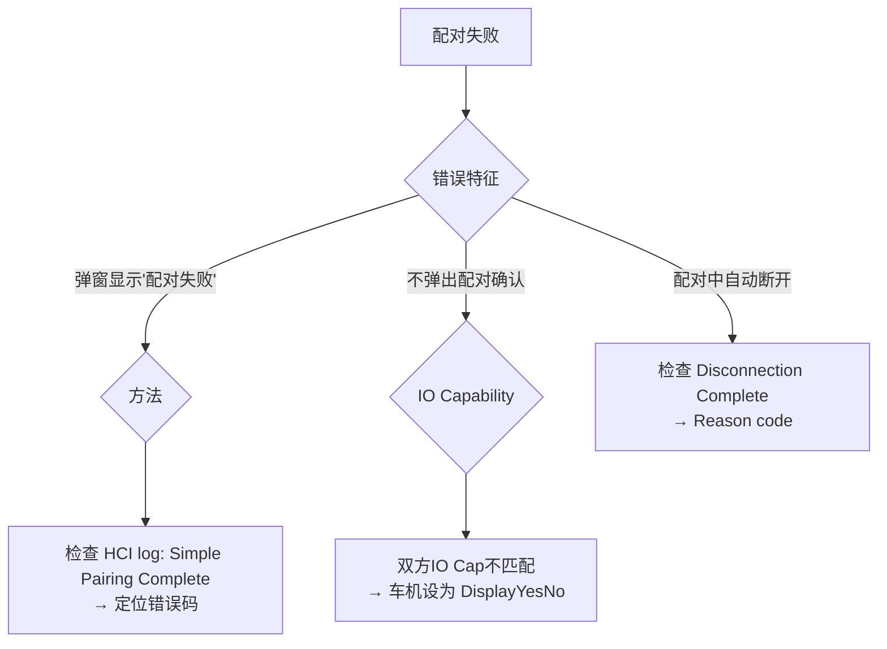

# 车载蓝牙问题排查手册 (SOP)

> 基于 Android 16 Fluoride | 适用: 售后/QA/集成工程师
> 参考: Ch19 Automotive, Ch22 Debugging, Ch23 Multi-Device

---

## 快速索引

| 问题 | 排查页 |
|------|--------|
| 📱 手机连不上车机 | [§1.1 连接失败](#11-手机连不上车机) |
| 🔑 配不上对 / 闪断 | [§1.2 配对失败](#12-配对失败) |
| 📞 通话无声 / 断音 | [§1.3 HFP通话异常](#13-hfp通话异常) |
| 🎵 音乐卡顿 / 无声音 | [§1.4 A2DP音频异常](#14-a2dp音频异常) |
| ⚡ 蓝牙打不开 | [§1.5 Enable/Disable失败](#15-enabledisable失败) |
| 📡 BLE扫描无结果 | [§1.6 BLE扫描异常](#16-ble扫描异常) |
| 🔄 多手机切换慢 | [§1.7 多设备切换异常](#17-多设备切换异常) |
| 💥 蓝牙进程崩溃 | [§1.8 进程崩溃](#18-进程崩溃) |
| 🔋 第二天首次连不上 | [§1.9 唤醒/电源问题](#19-休眠唤醒后蓝牙异常) |

---

## 通用数据收集

在所有排查前，先执行**一键诊断**：

```bash
@echo off
set DATE_TIME=%DATE% %TIME%
echo === 蓝牙诊断报告 %DATE_TIME% === > bt_diag.txt
echo. >> bt_diag.txt

echo --- 1. 蓝牙开关状态 --- >> bt_diag.txt
adb shell dumpsys bluetooth_manager | findstr "State: Enabled: Crash" >> bt_diag.txt
echo. >> bt_diag.txt

echo --- 2. 已配对设备 --- >> bt_diag.txt
adb shell dumpsys bluetooth | findstr /R /C:"BondedDevices" /C:"Device:" >> bt_diag.txt
echo. >> bt_diag.txt

echo --- 3. 活动连接 --- >> bt_diag.txt
adb shell dumpsys bluetooth | findstr /R /C:"ActiveDevice" /C:"ConnectionState" /C:"ConnectedDevices" >> bt_diag.txt
echo. >> bt_diag.txt

echo --- 4. 日志错误 --- >> bt_diag.txt
adb logcat -d -s bt_btif_dm:E bt_btm_sec:E bt_hci:E bt_btif_gattc:E GattService:E AdapterService:E >> bt_diag.txt
echo. >> bt_diag.txt

echo --- 5. HCI日志 --- >> bt_diag.txt
adb shell dir /data/misc/bluetooth/logs/ >> bt_diag.txt
echo. >> bt_diag.txt

echo --- 6. 系统属性 --- >> bt_diag.txt
adb shell getprop | findstr bluetooth >> bt_diag.txt
echo. >> bt_diag.txt

echo === 诊断完成 === >> bt_diag.txt
```

---

## 1. 场景化排查流程

### 1.1 手机连不上车机



**排查命令**:
```bash
# 1. 检查配对状态
adb shell dumpsys bluetooth | grep -A 20 "BondedDevices"

# 2. 检查BLE扫描
adb logcat -s BleScanController:* bt_btif_gattc:*

# 3. 检查连接请求
adb logcat -s bt_btm_sec:* bt_btif_dm:*

# 4. HCI抓包分析连接过程
adb shell setprop persist.bluetooth.btsnoopenable true
# 复现问题后:
adb pull /data/misc/bluetooth/logs/btsnoop_hci.log .
# Wireshark: 过滤 bthci_evt.code == 0x05 (Disconnection Complete)
```

**根因速查表**:

| dumpsys特征 | logcat特征 | 根因 | 解决 |
|-------------|-----------|------|------|
| 未配对 | `btif_storage: read failed` | Link Key存储损坏 | 重新配对 |
| 已配对但连接失败 | `btm_sec: auth fail (0x05)` | 配对Key不匹配 | 清除配对→重配 |
| 已配对但无ACL | `bt_hci: Connection Timeout` | 设备距离远/干扰 | 确认RF环境 |
| 已配对且ACL OK但Profile断 | `HeadsetService: connect fail` | Profile注册异常 | 检查Profile Service |

---

### 1.2 配对失败



**排查命令**:
```bash
# HCI配对过程跟踪
adb logcat -s bt_btm_sec:* bt_btif_dm:* bt_smp:*

# 配对失败常见HCI错误码:
# 0x05 = Authentication Failure
# 0x06 = Pin or Key Missing
# 0x08 = Connection Timeout
# 0x22 = LMP Response Timeout
# 0x28 = Instant Passed

# BLE配对超时检查
adb logcat -s bt_smp:* | grep "SMP_TIMEOUT"
```

**根因速查表**:

| 错误表现 | HCI/Log特征 | 根因 | 解决 |
|---------|-------------|------|------|
| 弹窗提示PIN错误 | `Simple Pairing Complete (0x05)` | Passkey输入不匹配 | 重新确认PIN |
| 不弹窗自动失败 | `IO Cap = NoInputNoOutput` | 双方都无法显示/输入 | 车机设DisplayYesNo |
| 配了秒断 | `Disconnection Complete (0x08)` | 连接超时 | 检查RF链路 |
| BLE 30秒超时 | `SMP: SMP_TIMEOUT` | SMP协商卡住 | 检查BLE连接稳定性 |
| 第一次行第二次不行 | Link Key冲突 | 跨传输CTKD问题 | 升级固件支持SC |

---

### 1.3 HFP通话异常

**排查命令**:
```bash
# 1. 检查HFP连接状态
adb shell dumpsys bluetooth | grep -A 15 "HeadsetService"

# 2. 检查SCO链路
adb logcat -s bt_btif_hf:* bt_hci:* | grep -i "sco\|voice"

# 3. 检查音频路由
adb shell dumpsys audio | grep -A 10 "Bluetooth"

# 4. HCI Snoop: 检查 SCO/eSCO 建立
# Wireshark: bthci_evt.code == 0x2c (SCO Connection Complete)
```

**根因速查表**:

| 问题 | 现象 | 根因 |
|------|------|------|
| 通话无声 | SCO连接失败 | HFP Codec协商失败(MSBC/CVSD) |
| 通话断音 | SCO频繁断连 | RF干扰导致SCO链路不稳 |
| 对方听不到 | 麦克风未路由 | 音频输入路径配置错误 |
| 回声 | 通话中有自己声音 | 声学回声消除(AEC)未生效 |
| 延迟大 | 通话不同步 | eSCO参数配置不佳 |

---

### 1.4 A2DP音频异常

**排查命令**:
```bash
# 1. 检查A2DP状态
adb shell dumpsys bluetooth | grep -A 15 "A2dpService"

# 2. 检查Codec
adb shell dumpsys bluetooth | grep -A 10 "Codec"

# 3. 检查AVDTP流
adb logcat -s bt_btif_av:* | grep -i "stream\|start\|suspend\|codec"

# 4. HCI分析ACL流
# Wireshark: btl2cap 分析 AVDTP 包间隔
```

**根因速查表**:

| 问题 | 根因 | 排查 |
|------|------|------|
| 音乐卡顿 | BLE+BR/EDR共存干扰 | 检查ACL包间隔不均匀 |
| 播放无声 | A2DP Codec协商失败 | 检查SBC Codec是否强制支持 |
| 有声音但音质差 | Codec降级(SBC←AAC) | 检查Codec优先级配置 |
| 播放中断 | AVDTP Suspend | 检查对端Suspend原因 |

---

### 1.5 Enable/Disable失败

```bash
# 检查状态卡住
adb shell dumpsys bluetooth_manager | grep "State:"
# TURNING_ON 超过30秒 → enable超时
# TURNING_OFF 超过30秒 → disable超时

# 排查启用过程
adb logcat -s BluetoothManagerService:* AdapterService:* bt_btif_core:* -v time

# 检查HAL初始化
adb logcat -s bt_shim_hci:* | grep -i "init\|start\|fail"
```

**根因**:
1. `TURNING_ON`卡住 → HAL/Firmware初始化失败 → 检查HCI接口
2. `TURNING_OFF`卡住 → Profile断开超时 → 检查各Profile Service
3. 反复开关机崩溃 → Crash Timestamp频繁更新 → 重启循环

---

### 1.6 BLE扫描异常

```bash
# 检查扫描状态
adb shell dumpsys bluetooth | grep -A 20 "ScanController"

# 检查权限
adb logcat -s PermissionChecker:* | grep "scan"

# BLE扫描日志
adb logcat -s BleScanController:* bt_btif_gattc:* bt_shim_hci:*

# HCI: 检查 LE Advertising Report
# Wireshark: btle 过滤 Advertising Data
```

---

### 1.7 多设备切换异常

```bash
# 检查ActiveDeviceManager
adb shell dumpsys bluetooth | grep -A 30 "ActiveDeviceManager"

# 切换日志
adb logcat -s ActiveDeviceManager:* PhonePolicy:*

# 检查连接顺序
adb shell dumpsys bluetooth | grep "ConnectedDevices" -A 20
```

**切换慢解决**:
- 检查 `ActiveDeviceManager.setActiveDevice()` 调用耗时
- 优化A2DP Codec重新协商时间
- 使用LE Audio切换(LC3比SBC协商更快)

---

### 1.8 进程崩溃

```bash
# 检查崩溃记录
adb shell dumpsys bluetooth_manager | grep "Crash"

# 最近崩溃堆栈
adb bugreport
# 搜索: "FATAL EXCEPTION" + "com.android.bluetooth"
# 搜索: "native crash" + "libbluetooth"

# 典型崩溃原因:
# 1. NullPointerException (Java层)
# 2. SIGSEGV (Native层)
# 3. Binder Transaction Too Large
# 4. OutOfMemoryError
```

---

### 1.9 休眠唤醒后蓝牙异常

```bash
# 唤醒后检查状态
adb shell dumpsys bluetooth_manager | grep "State:"

# 检查电源管理
adb logcat -s bt_btif_core:* | grep -i "sleep\|wake\|suspend\|resume"

# HCI唤醒跟踪
adb logcat -s bt_hci:* | grep -i "wake\|sleep"
```

**常见根因**:
1. 蓝牙Controller未正确唤醒 → HCI Reset后丢失配置
2. Link Key在休眠期间被清除 → 存储空间问题
3. ACL连接超时后未自动重连 → 重连策略配置

---

## 2. 日志分析快速定位

### 2.1 日志关键字表

| 关键字 | 模块 | 含义 | 严重程度 |
|--------|------|------|---------|
| `FATAL EXCEPTION` | Java | Java崩溃 | 致命 |
| `SIGSEGV` | Native | Native崩溃 | 致命 |
| `CRASH` | BMS | 蓝牙进程崩溃 | 致命 |
| `ERROR` | 任意 | 操作错误 | 错误 |
| `auth fail` | bt_btm_sec | 认证失败 | 错误 |
| `timeout` | 任意 | 操作超时 | 警告 |
| `SMP_TIMEOUT` | bt_smp | BLE配对超时 | 错误 |
| `reject` | 任意 | 对端拒绝 | 信息 |
| `disconnect` | bt_hci | 连接断开 | 信息 |
| `bond state` | bt_btif_dm | 配对状态变更 | 信息 |

### 2.2 dumpsys字段速查

| dumpsys字段 | 正常值 | 异常值 |
|-------------|--------|--------|
| `State:` | `ON` | `TURNING_ON`, `TURNING_OFF` |
| `Enabled:` | `true` | `false` |
| `Crash Timestamp` | 不显示 | 有日期 (进程崩溃过) |
| `BondedDevices` | ≥1 | 0 (配对丢失) |
| `ActiveDevice` | 设备地址 | `null` (无活动设备) |

---

## 3. 快速修复尝试

在深入排查前，可先尝试以下快速修复：

```bash
# Fix 1: 重启蓝牙
adb shell svc bluetooth disable
timeout /t 2
adb shell svc bluetooth enable

# Fix 2: 清除配对并重试
adb shell am broadcast -a android.bluetooth.device.action.UNPAIR \
    --es device "XX:XX:XX:XX:XX:XX"

# Fix 3: 清除蓝牙缓存 (不会清除配对)
adb shell am broadcast -a android.bluetooth.adapter.action.STATE_CHANGED

# Fix 4: 重置蓝牙 (需root)
adb shell rm /data/misc/bluetooth/bt_config.conf
adb reboot

# Fix 5: 开/关飞行模式
adb shell settings put global airplane_mode_on 1
adb shell am broadcast -a android.intent.action.AIRPLANE_MODE --ez state true
timeout /t 3
adb shell settings put global airplane_mode_on 0
adb shell am broadcast -a android.intent.action.AIRPLANE_MODE --ez state false
```

---

## 参考文档

- 手册来源：[Ch22 Debugging & Diagnostics](22_Debugging_Diagnostics.md)
- 车载场景：[Ch19 Automotive Scenarios](19_Automotive_Scenarios.md)
- 多设备：[Ch23 Multi-Device Bluetooth](23_Multi_Device_Bluetooth.md)
- V8 Dumpsys分析：[V8_Dumpsys_Analysis.md](V8_Dumpsys_Analysis.md)
- V8 Log分析：[V8_Log_Analysis.md](V8_Log_Analysis.md)
