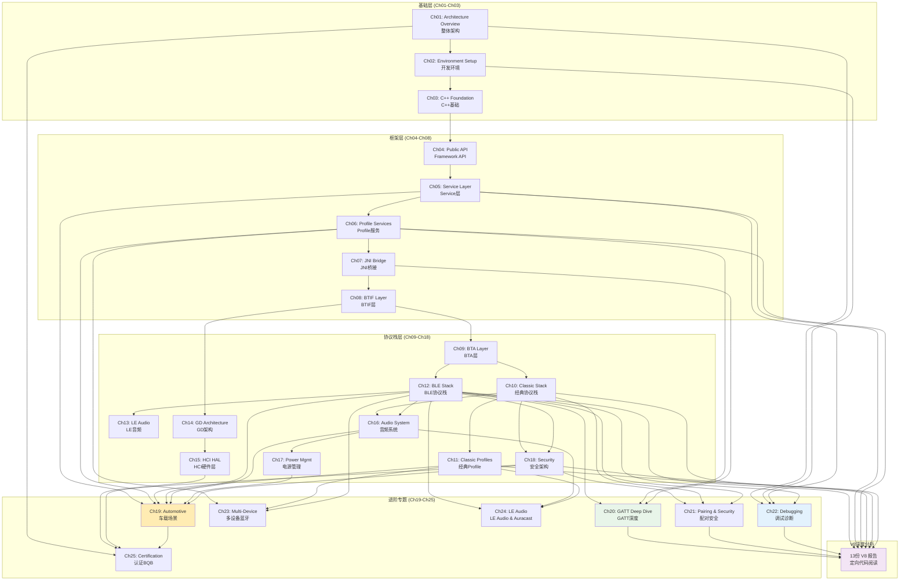

# 全球索引 — Android 16 Bluetooth Framework & Protocol Stack 学习文档

> 25章内容 + 13份V8深度分析报告 | ~23K行 | 所有Mermaid通过语法验证

---

## 如何使用本文档

| 角色 | 推荐路径 |
|------|---------|
| **新手**（无蓝牙经验） | Ch01 → Ch02 → Ch03 → Ch04 → Ch05 → Ch06 → ...（顺序阅读） |
| **Android开发者** | Ch04 → Ch06 → Ch07 → Ch08 → Ch12 → Ch20 |
| **嵌入式/C++开发者** | Ch03 → Ch09 → Ch10 → Ch14 → Ch15 |
| **车载工程师** | Ch19 → Ch22 → Ch23 → Ch24 → Ch25 |
| **问题排查** | Ch22 → 对应V8报告 → V8_Dumpsys_Analysis |
| **只想读V8** | V8_Architecture_Map → 按优先级1-12依次阅读 |

---

## 知识图谱

---

## 内容矩阵

| 章 | 标题 | 难度 | 行数 | Mermaid | 代码块 | V8引用 | 源码引用 |
|----|------|------|------|---------|--------|--------|---------|
| 01 | Architecture Overview | ★★★★☆ | 769 | 5 | 30 | 10 | 15 |
| 02 | Environment Setup | ★★★☆☆ | 724 | 4 | 40 | 2 | 13 |
| 03 | C++ Foundation | ★★★☆☆ | 1,302 | 5 | 71 | 4 | 5 |
| 04 | Public API Framework | ★★★☆☆ | 641 | 6 | 22 | 3 | 4 |
| 05 | Service Layer | ★★★★☆ | 721 | 7 | 25 | 7 | 26 |
| 06 | Profile Services | ★★★★☆ | 742 | 8 | 27 | 3 | 9 |
| 07 | JNI Bridge | ★★★★☆ | 887 | 6 | 30 | 6 | 6 |
| 08 | BTIF Layer | ★★★★☆ | 724 | 4 | 20 | 2 | 10 |
| 09 | BTA Layer | ★★★★☆ | 713 | 4 | 24 | 2 | 7 |
| 10 | Classic Stack Core | ★★★★★ | 912 | 12 | 34 | 3 | 7 |
| 11 | Classic Profiles | ★★★★☆ | 665 | 5 | 31 | 10 | 5 |
| 12 | BLE Stack | ★★★★★ | 934 | 9 | 38 | 18 | 33 |
| 13 | LE Audio | ★★★★☆ | 777 | 6 | 31 | 3 | 6 |
| 14 | GD Architecture | ★★★★★ | 759 | 4 | 23 | 4 | 4 |
| 15 | HCI HAL | ★★★★☆ | 599 | 4 | 22 | 2 | 8 |
| 16 | Audio System | ★★★★★ | 612 | 4 | 21 | 3 | 9 |
| 17 | Power Management | ★★★★☆ | 575 | 4 | 23 | 3 | 6 |
| 18 | Security Architecture | ★★★★★ | 685 | 4 | 14 | 8 | 17 |
| 19 | Automotive Scenarios | ★★★★★ | 678 | 4 | 22 | 4 | 2 |
| 20 | GATT Protocol Deep Dive | ★★★★★ | 970 | 10 | 47 | 3 | 0 |
| 21 | Pairing & Security | ★★★★★ | 705 | 6 | 32 | 3 | 0 |
| 22 | Debugging & Diagnostics | ★★★★☆ | 740 | 6 | 26 | 5 | 0 |
| 23 | Multi-Device Bluetooth | ★★★★☆ | 652 | 7 | 21 | 3 | 0 |
| 24 | LE Audio & Auracast | ★★★★☆ | 612 | 7 | 22 | 1 | 0 |
| 25 | Certification & Compliance | ★★★☆☆ | 537 | 5 | 23 | 2 | 0 |

---

## V8深度分析报告

| 优先级 | 报告 | 行数 | Mermaid | 覆盖源码 |
|--------|------|------|---------|---------|
| 0 | Architecture Map | 957 | 9 | 25个关键文件 |
| 1 | BLE Scan Analysis | 553 | 5 | 广播/扫描扫描全链路 |
| 2 | BLE Connect Analysis | 296 | 2 | 连接建立8层调用链 |
| 3 | Pairing Analysis | 305 | 3 | SSP/BLE配对状态机 |
| 4 | GATT Client Analysis | 294 | 2 | GATT客户端操作 |
| 5 | Enable/Disable Analysis | 308 | 3 | 蓝牙启停状态机 |
| 6 | Profile Analysis | 295 | 3 | 关键Profile注册 |
| 7 | HAL/JNI Analysis | 286 | 4 | JNI线程/CallbackEnv |
| 8 | Permission Analysis | 159 | 2 | 权限体系 |
| 9 | GATT Server Analysis | 230 | 2 | GATT服务端操作 |
| 10 | Discovery Analysis | 162 | 1 | Classic发现流程 |
| 11 | Dumpsys Analysis | 173 | 1 | dumpsys诊断 |
| 12 | Log Analysis | 229 | 2 | 日志分析体系 |

> **提示**: V8报告按优先级排序，建议从Architecture Map入手，依次阅读。

---

## 主题速查

### 按协议层

| 想了解 | 章节 |
|--------|------|
| Framework API (App层) | Ch04, Ch06 |
| Binder/Service层 | Ch05, Ch06 |
| JNI边界 | Ch07, V8_HAL_JNI |
| BTIF/C++适配层 | Ch08, Ch09 |
| Classic BR/EDR协议栈 | Ch10, Ch11 |
| BLE协议栈 | Ch12, Ch20 |
| LE Audio | Ch13, Ch24 |
| GD架构 | Ch14 |
| HCI/HAL硬件接口 | Ch15 |
| 安全/配对 | Ch18, Ch21 |

### 按功能

| 想解决 | 章节 |
|--------|------|
| 蓝牙打不开 | Ch17, Ch22, V8_Enable_Disable |
| 配不上对 | Ch18, Ch21, V8_Pairing |
| GATT读写失败 | Ch20, V8_GATT_Client, V8_GATT_Server |
| 扫描没结果 | Ch12, V8_BLE_Scan, V8_Permission |
| 音频卡顿/无声 | Ch16, Ch24, V8_Profile |
| 多设备切换慢 | Ch23, V8_Profile |
| 崩溃/异常 | Ch22, V8_Dumpsys, V8_Log |
| BQB认证失败 | Ch25 |

### 按源码文件

| 源码文件 | 对应章节 |
|---------|---------|
| `framework/.../BluetoothGatt.java` | Ch04, Ch20 |
| `service/.../gatt/GattService.java` | Ch05, Ch20 |
| `android/app/.../btservice/AdapterService.java` | Ch05, Ch22 |
| `system/btif/src/btif_dm.cc` | Ch08, Ch21 |
| `system/btif/src/btif_gatt_client.cc` | Ch08, Ch20 |
| `system/stack/btm/btm_sec.cc` | Ch10, Ch18, Ch21 |
| `system/stack/gatt/gatt_api.cc` | Ch12, Ch20 |
| `system/gd/...` | Ch14, Ch15 |
| `android/app/.../btservice/ActiveDeviceManager.java` | Ch23 |
| `android/app/.../le_audio/LeAudioService.java` | Ch24 |

---

## 学习建议

1. **顺序阅读**: 如果你是从零开始的初学者，强烈建议从Ch01开始顺序读到Ch19，再选择感兴趣的进阶专题
2. **V8配合阅读**: 每章末尾的"参考文件清单"中都列出了对应的V8报告，建议读完该章后立即阅读对应V8报告
3. **动手验证**: 每章的"实战练习"都基于真实源码和adb命令，建议在模拟器或真机上操作
4. **车载聚焦**: 如果你关注车载蓝牙，优先阅读Ch19，然后根据具体问题跳转到Ch20-Ch25
5. **源码参考**: 侧重的源码行号基于Android 16 Fluoride，如有代码变更可通过grep重新定位
