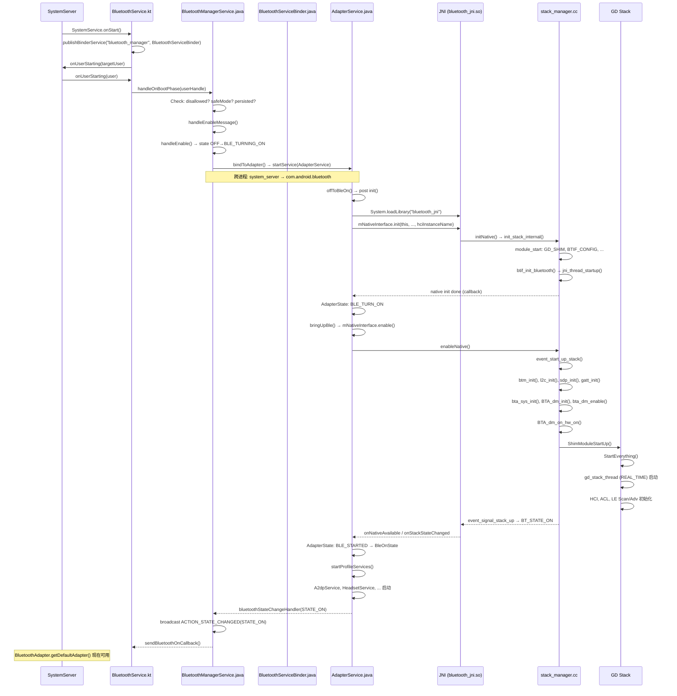
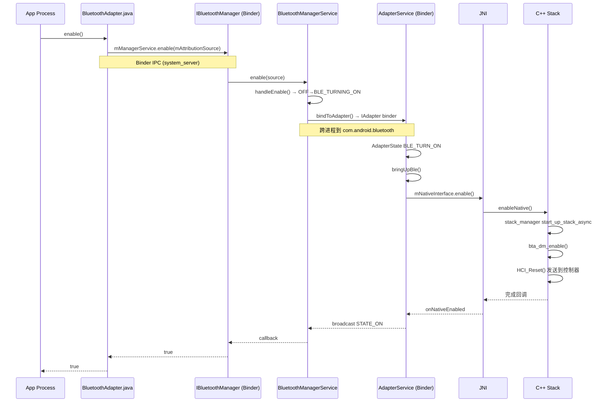
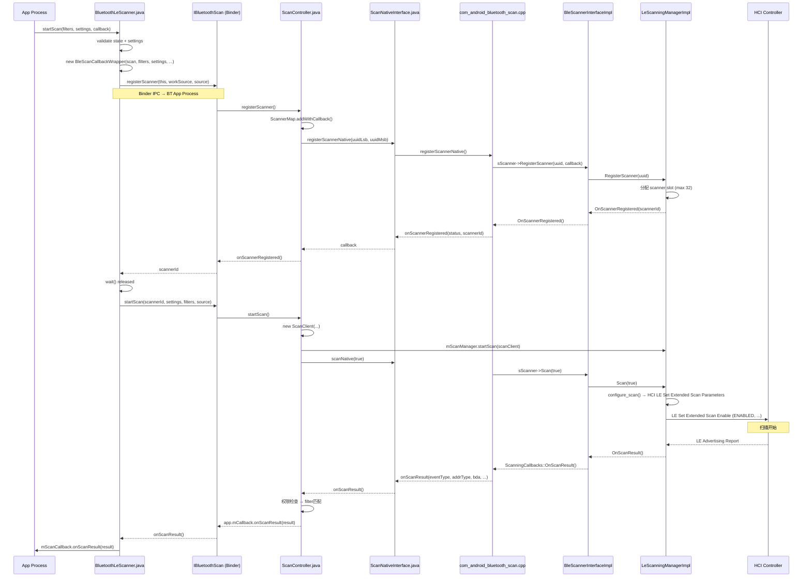
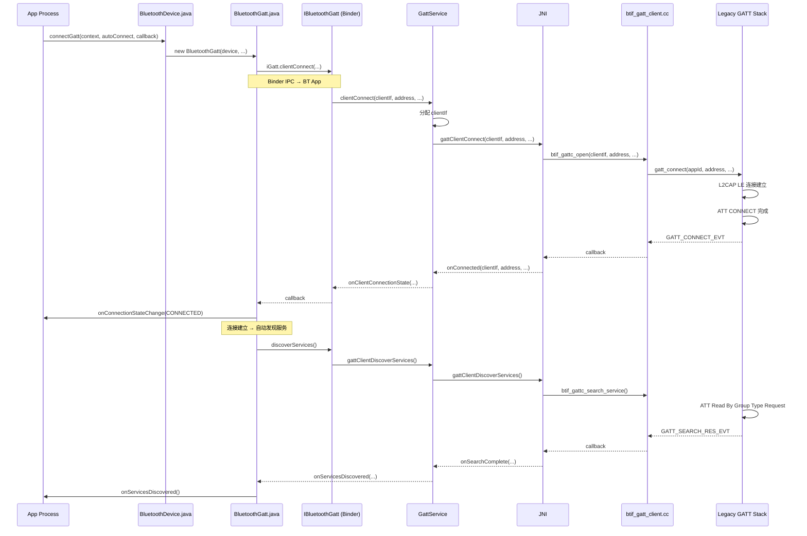
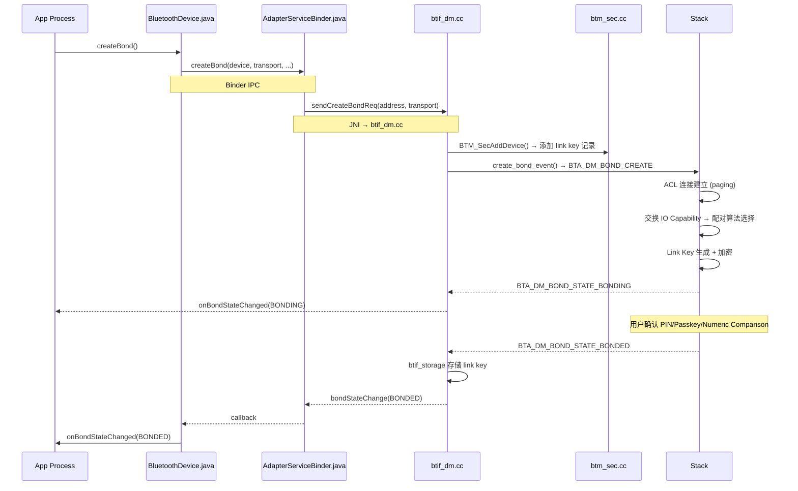
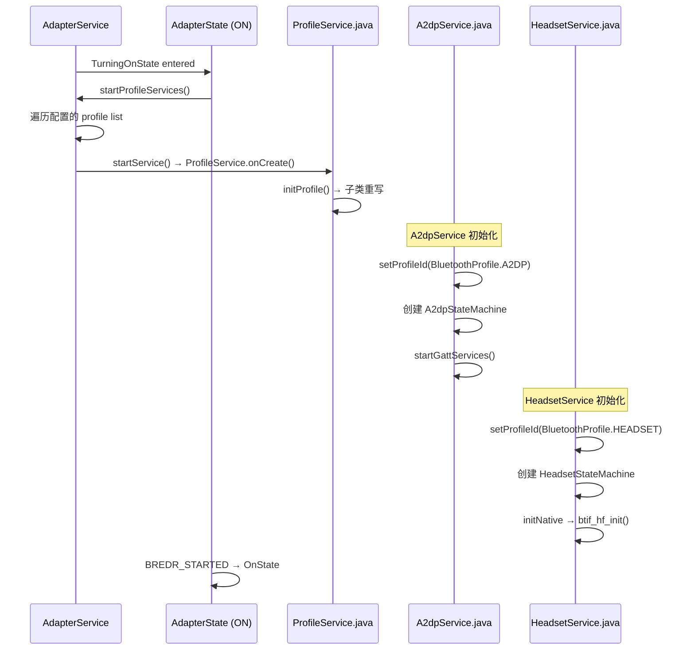
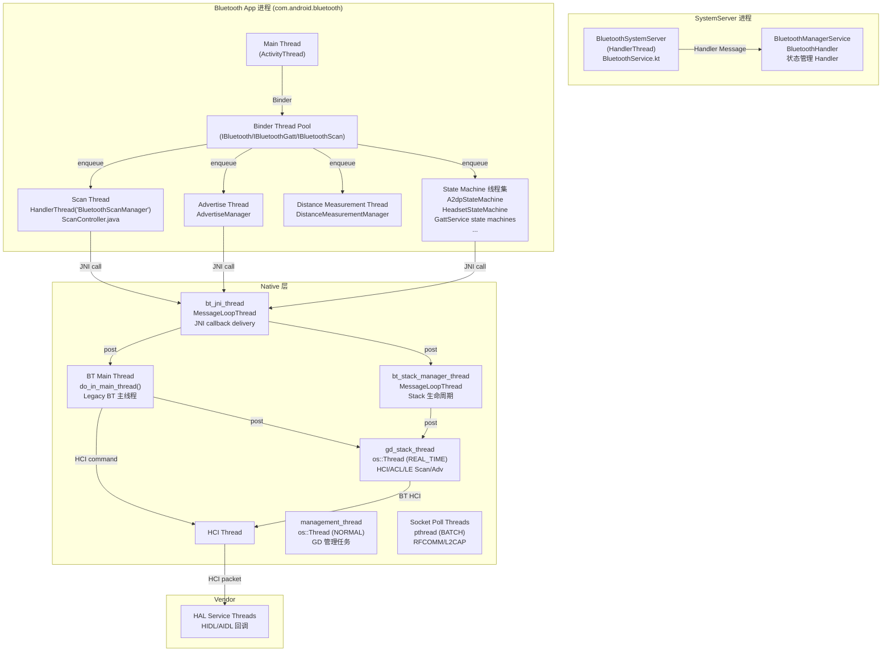
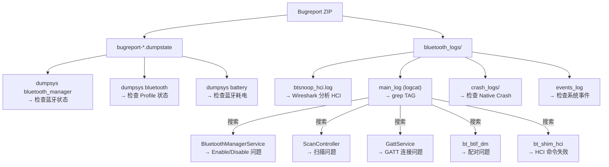

# V8 蓝牙 Framework 架构地图

> **基于 Android 16 Fluoride 源码的实际代码阅读报告**
> **版本**: V8 | **代码基准**: packages/modules/Bluetooth (AOSP)

---

## 目录

1. [系统架构总览](#1-系统架构总览)
2. [开机启动链路：SystemServer → BluetoothAdapter 可用](#2-开机启动链路systemserver--bluetoothadapter-可用)
3. [App API 到 Vendor 的完整调用路径](#3-app-api-到-vendor-的完整调用路径)
4. [BLE Scan 调用链全景](#4-ble-scan-调用链全景)
5. [BLE Connect 调用链全景](#5-ble-connect-调用链全景)
6. [GATT Client 调用链全景](#6-gatt-client-调用链全景)
7. [Pairing/Bonding 调用链全景](#7-pairingbonding-调用链全景)
8. [Profile 服务生命周期](#8-profile-服务生命周期)
9. [线程模型全景](#9-线程模型全景)
10. [关键锁与并发模式](#10-关键锁与并发模式)
11. [日志 Tag 参考表](#11-日志-tag-参考表)
12. [dumpsys 入口与排查路径](#12-dumpsys-入口与排查路径)
13. [各模块易踩坑清单](#13-各模块易踩坑清单)

---

## 1. 系统架构总览

```
┌─────────────────────────────────────────────────────────────────────┐
│                       App Process (第三方APK)                       │
│  ┌──────────────────────────────────────────────────────────────┐  │
│  │  android.bluetooth.BluetoothAdapter / BluetoothManager       │  │
│  │  android.bluetooth.BluetoothDevice / BluetoothGatt           │  │
│  │  android.bluetooth.le.BluetoothLeScanner                     │  │
│  └──────────────────┬───────────────────────────────────────────┘  │
│                     │ Binder IPC (IBluetooth/IBluetoothGatt       │
│                     │ IBluetoothScan AIDL)                        │
├─────────────────────┼─────────────────────────────────────────────┤
│            SystemServer Process (system_server)                   │
│  ┌──────────────────┴───────────────────────────────────────────┐  │
│  │  BluetoothService.kt  (extends SystemService)                │  │
│  │  BluetoothManagerService.java  (IBluetoothManager.Stub)      │  │
│  │  BluetoothServiceBinder.java  (IBluetoothManager IPC)        │  │
│  │  ShellCommand.kt  (adb shell 入口)                           │  │
│  └──────────────────┬───────────────────────────────────────────┘  │
│                     │ bindService → com.android.bluetooth          │
│                     │ IAdapter AIDL (AdapterBinder.kt)            │
├─────────────────────┼─────────────────────────────────────────────┤
│           Bluetooth App Process (com.android.bluetooth)           │
│  ┌──────────────────┴───────────────────────────────────────────┐  │
│  │  AdapterService.java  (主Service, 状态机 AdapterState.java)   │  │
│  │  AdapterServiceBinder.java  (IBluetooth.Stub 实现)           │  │
│  │  ├─ Profile Services:                                        │  │
│  │  │  A2dpService.java, HeadsetService.java                    │  │
│  │  │  GattService.java, HID/HOGP/Map/Pbap/Pan/...             │  │
│  │  ├─ BLE: ScanController.java, GattService.java               │  │
│  │  │  AdvertiseManager.java, DistanceMeasurementManager.java   │  │
│  │  └─ JNI: AdapterNativeInterface.java                         │  │
│  └──────────────────┬───────────────────────────────────────────┘  │
│                     │ JNI (System.loadLibrary("bluetooth_jni"))    │
├─────────────────────┼─────────────────────────────────────────────┤
│               Native Layer (C++)                                  │
│  ┌──────────────────┴───────────────────────────────────────────┐  │
│  │  btif_jni_task.cc  (bt_jni_thread)                           │  │
│  │  btif_*.cc  (Bluetooth Interface)                            │  │
│  │  ├─ btif_dm.cc  (设备管理/配对)                              │  │
│  │  ├─ btif_av.cc  (A2DP)                                       │  │
│  │  ├─ btif_hf.cc  (HFP)                                        │  │
│  │  ├─ btif_gatt.cc / btif_gatt_client.cc (GATT)               │  │
│  │  └─ btif_sock.cc  (RFCOMM)                                   │  │
│  │                                                               │  │
│  │  main/shim/  (GD Shim)                                        │  │
│  │  ├─ stack.cc  (GD Stack 生命周期)                             │  │
│  │  ├─ le_scanning_manager.cc  (BLE扫描)                         │  │
│  │  ├─ le_advertising_manager.cc  (BLE广播)                      │  │
│  │  └─ acl.cc / btm_api.cc                                       │  │
│  │                                                               │  │
│  │  stack/  (Legacy Stack)                                       │  │
│  │  ├─ l2c/  (L2CAP)                                             │  │
│  │  ├─ rfc/  (RFCOMM)                                            │  │
│  │  ├─ sdp/  (SDP)                                               │  │
│  │  ├─ gatt/  (GATT)                                             │  │
│  │  └─ btm/  (BTM, 安全管理)                                    │  │
│  │                                                               │  │
│  │  gd/  (Gabeldorsche 模块化栈)                                 │  │
│  │  ├─ hci/  (HCI 层, LE扫描/广播/ACL管理器)                    │  │
│  │  └─ ...                                                       │  │
│  └──────────────────┬───────────────────────────────────────────┘  │
│                     │ HCI (UART/USB)                               │
├─────────────────────┼─────────────────────────────────────────────┤
│               Vendor Layer (HAL)                                   │
│  ┌──────────────────┴───────────────────────────────────────────┐  │
│  │  HIDL / AIDL HAL  (com.android.bluetooth.hal)               │  │
│  │  audio_hal_interface/  (音频HAL)                              │  │
│  └──────────────────────────────────────────────────────────────┘  │
└─────────────────────────────────────────────────────────────────────┘
```

---

## 2. 开机启动链路：SystemServer → BluetoothAdapter 可用

### 2.1 完整启动时序



### 2.2 关键文件与行号

| 步骤 | 文件 | 行号 | 说明 |
|------|------|------|------|
| SystemService 注册 | `service/src/BluetoothService.kt` | 34-71 | `extends SystemService`, `onStart()` 发布 Binder |
| 用户启动触发 | `service/src/BluetoothService.kt` | 73-103 | `onUserStarting()` 触发 boot phase |
| Boot 处理 | `BluetoothManagerService.java` | 1230-1268 | `handleOnBootPhase()` → `sendEnableMsg(SYSTEM_BOOT)` |
| Enable 处理 | `BluetoothManagerService.java` | 1717-1728 | `handleEnable()` → `OFF → BLE_TURNING_ON` |
| 绑定服务 | `BluetoothManagerService.java` | 1744-1764 | `bindToAdapter()` → `bindServiceAsUser()` |
| 服务连接 | `BluetoothManagerService.java` | 1343-1351 | `onServiceConnected()` → `propagateOffToBleOn()` |
| App 侧初始 | `AdapterService.java` | 930-948 | `offToBleOn()` → post `init()` to handler |
| 加载 JNI 库 | `AdapterService.java` | 992 | `System.loadLibrary("bluetooth_jni")` |
| Native init | `AdapterNativeInterface.java` | 305-310 | `initNative()` JNI entry |
| Stack 初始化 | `stack_manager.cc` | 198-217 | `init_stack_internal()` 同步初始化 |
| 协议初始化 | `stack_manager.cc` | 236-294 | `event_start_up_stack()` → btm/l2c/sdp/gatt/SMP/RFCOMM init |
| GD 启动 | `shim/stack.cc` | 172-225 | `StartEverything()` → gd_stack_thread |
| BLE 启动 | `AdapterState.java` (app) | 238-278 | `TurningBleOnState` → `bringUpBle()` |
| 启动完成 | `stack_manager.cc` | 393-398 | `event_signal_stack_up()` → `invoke_adapter_state_changed_cb(STATE_ON)` |
| 服务端状态 | `BluetoothManagerService.java` | 1885-1933 | `bluetoothStateChangeHandler()` → 广播 STATE_CHANGED |

### 2.3 状态机（AdapterService 侧）

```
       ┌─────────────────────────────────────────────────┐
       │              AdapterState.java                    │
       │  (com.android.bluetooth.btservice)               │
       │                                                   │
       │  Off  ←────── TurningBleOff  ←────── BLE_ON      │
       │   │                          ┌───────────┘       │
       │   │  BLE_TURN_ON             │ USER_TURN_ON      │
       │   v                          v                    │
       │  TurningBleOn ──→ BleOn ──→ TurningOn ──→ On    │
       │   │                            │                 │
       │   │  BLE_STARTED               │ BREDR_STARTED   │
       │   └────────────────────────────┘                 │
       │                                                   │
       │       On ──→ TurningOff ──→ BleOn                │
       │          USER_TURN_OFF    BREDR_STOPPED          │
       │       BleOn ──→ TurningBleOff ──→ Off           │
       │          BLE_TURN_OFF      BLE_STOPPED           │
       └─────────────────────────────────────────────────┘
```

---

## 3. App API 到 Vendor 的完整调用路径

以 `BluetoothAdapter.enable()` 为例展示完整跨层调用链：



### 3.1 Binder 边界总览

| 边界 | AIDL 接口 | Stub 实现 | 方向 |
|------|-----------|-----------|------|
| App → SystemServer | `IBluetoothManager.aidl` | `BluetoothServiceBinder.java` | 状态管理、enable/disable |
| App → BT App | `IBluetooth.aidl` | `AdapterServiceBinder.java` | 设备操作(scan/bond/pair) |
| App → BT App | `IBluetoothGatt.aidl` | `GattServiceBinder.java` | GATT 客户端/服务端 |
| App → BT App | `IBluetoothScan.aidl` | `ScanBinder.kt` | BLE 扫描 |
| App → BT App | `IBluetoothAdv.aidl` | `AdvBinder.kt` | BLE 广播 |

---

## 4. BLE Scan 调用链全景

### 4.1 调用链



### 4.2 关键类清单

| 类 | 文件 | 行号 | 职责 |
|----|------|------|------|
| `BluetoothLeScanner` | `framework/.../BluetoothLeScanner.java` | 61 | App 入口，管理 scanner 回调 |
| `BleScanCallbackWrapper` | `BluetoothLeScanner.java` | 399 | 内部类，IScannerCallback.Stub，管理注册+结果分发 |
| `ScanBinder` | `android/app/.../le_scan/ScanBinder.kt` | 44 | IBluetoothScan 的 Binder 服务端 |
| `ScanController` | `android/app/.../le_scan/ScanController.java` | 95 | 核心管理类，线程强制(on scan thread) |
| `ScanManager` | `android/app/.../le_scan/ScanManager.java` | - | 扫描队列和状态机管理 |
| `ScanNativeInterface` | `android/app/.../le_scan/ScanNativeInterface.java` | - | JNI 桥接层 |
| `JniScanningCallbacks` | `android/app/jni/com_android_bluetooth_scan.cpp` | 142 | JNI 回调到 Java |
| `BleScannerInterface` | `system/include/hardware/ble_scanner.h` | 78 | 抽象接口层 |
| `BleScannerInterfaceImpl` | `system/main/shim/le_scanning_manager.cc` | - | Legacy → GD 桥接 |
| `LeScanningManagerImpl` | `system/gd/hci/le_scanning_manager_impl.cc` | 1810 | GD 实现，发送 HCI 命令 |
| `LeScanningManager` | `system/gd/hci/le_scanning_manager.h` | 35 | 抽象管理器 |

### 4.3 线程模型

| 步骤 | 线程 | 说明 |
|------|------|------|
| `startScan()` 调用 | App 任意线程 | 框架内部 post 到 Binder 线程 |
| Binder IPC 调用 | Binder 线程池 | 跨进程边界 |
| `ScanBinder.registerScanner()` | 强制 `ScanController.mScanThread` | `enforceScanThread()` 检查 |
| JNI callback delivery | `bt_jni_thread` | `do_in_jni_thread()` |
| GD HCI 命令 | `gd_stack_thread` (REAL_TIME) | `os::Handler` post |
| 结果回调到 App | App 主线程 | `Handler(Looper.getMainLooper())` |

### 4.4 易踩坑

1. **扫描频率限制**: `ScanController` 有 `maxScansPerApp` 和 `cooldownMs` 限制，高频起停会触发 `SCAN_FAILED_SCANNING_TOO_FREQUENTLY`
2. **Scanner ID 失效**: 重新注册后 scannerId 会变，持有的旧 scannerId 调用 stopScan 无效果
3. **线程强制**: `ScanController` 有 `enforceScanThread()` 检查，在错误线程调用会抛 `IllegalStateException`
4. **权限延迟**: `ScanSettings.CALLBACK_TYPE_FIRST_MATCH` 需要在 filter 匹配时做权限检查，未授权应用收不到结果
5. **Binder 死亡**: `IScannerCallback` 是 oneway Binder，远程端死亡时回调静默丢失
6. **硬件限制**: max 32 scanner slots，大量 App 同时扫描会竞争

---

## 5. BLE Connect 调用链全景

### 5.1 调用链



### 5.2 关键类清单

| 类 | 文件 | 职责 |
|----|------|------|
| `BluetoothGatt` | `framework/.../BluetoothGatt.java` | App GATT 客户端代理 |
| `BluetoothDevice` | `framework/.../BluetoothDevice.java` | 远程设备代表 |
| `IBluetoothGatt` AIDL | `aidl/android/bluetooth/IBluetoothGatt.aidl` | GATT 服务 AIDL |
| `GattService` | `android/app/.../gatt/GattService.java` | GATT 服务端实现 |
| `btif_gatt_client.cc` | `system/btif/src/btif_gatt_client.cc` | GATT 客户端 JNI→Native |
| `gatt_api.cc` | `system/stack/gatt/gatt_api.cc` | GATT API 层 |
| `gatt_main.cc` | `system/stack/gatt/gatt_main.cc` | GATT 状态机 |
| `att_protocol.cc` | `system/stack/gatt/att_protocol.cc` | ATT 协议处理 |

---

## 6. GATT Client 调用链全景

| 操作 | API | 文件 | JNI | Native |
|------|-----|------|-----|--------|
| 读 Characteristic | `BluetoothGatt.readCharacteristic()` | `BluetoothGatt.java:726` | `btif_gattc_read_char()` | `GATTC_Read()` |
| 写 Characteristic | `BluetoothGatt.writeCharacteristic()` | `BluetoothGatt.java:1006` | `btif_gattc_write_char()` | `GATTC_Write()` |
| 读 Descriptor | `BluetoothGatt.readDescriptor()` | `BluetoothGatt.java:1126` | `btif_gattc_read_desc()` | - |
| 写 Descriptor | `BluetoothGatt.writeDescriptor()` | `BluetoothGatt.java:1195` | `btif_gattc_write_desc()` | - |
| 开启 Notification | `BluetoothGatt.setCharacteristicNotification()` | `BluetoothGatt.java:1300` | `btif_gattc_write_desc()` (配 CCCD) | - |
| Request MTU | `BluetoothGatt.requestMtu()` | `BluetoothGatt.java:760` | `btif_gattc_exchange_mtu()` | `GATTC_ExchangeMtu()` |
| Connection Priority | `BluetoothGatt.requestConnectionPriority()` | `BluetoothGatt.java:1405` | `btif_gattc_connection_priority()` | - |

### GATT 状态机 (BluetoothGatt 侧)

```mermaid
graph TD
    IDLE["IDLE"] -->|connect()| CONNECTING["CONNECTING"]
    CONNECTING -->|onConnectionStateChange CONNECTED| CONNECTED["CONNECTED"]
    CONNECTED -->|discoverServices()| DISCOVERING["DISCOVERING"]
    DISCOVERING -->|onServicesDiscovered| DISCOVERED["DISCOVERED"]
    DISCOVERED -->|read/write| BUSY["BUSY (操作中)"]
    BUSY -->|callback complete| DISCOVERED
    DISCOVERED -->|disconnect()| DISCONNECTING["DISCONNECTING"]
    CONNECTING -->|fail/timeout| DISCONNECTED["DISCONNECTED"]
    CONNECTED -->|disconnect| DISCONNECTING
    DISCONNECTING -->|onConnectionStateChange DISCONNECTED| DISCONNECTED
    DISCONNECTED -->|connect()| CONNECTING
    
    style BUSY fill:#FFE4B5
    style DISCONNECTED fill:#FFB5B5
```

---

## 7. Pairing/Bonding 调用链全景

### 7.1 完整路径



### 7.2 关键文件

| 文件 | 关键函数 | 行号 | 说明 |
|------|---------|------|------|
| `BluetoothDevice.java` | `createBond()` | 2050 | App 入口 |
| `AdapterServiceBinder.java` | `createBond()` | 388 | Binder 实现 |
| `btif_dm.cc` | `btif_dm_create_bond()` | 2774 | JNI→Native |
| `btif_dm.cc` | `btif_dm_proc_io_req()` | 3271 | IO 能力交换 |
| `btif_dm.cc` | `btif_in_hf_client_event()` | - | BLE 配对处理 |
| `btm_sec.cc` | `btm_sec_execute_procedure()` | 104 | 安全流程引擎 |

### 7.3 配对算法选择

```
根据 IO Capability + OOB + MITM 需求
┌──────────────┬──────────────┬──────────────┬──────────────┐
│ Initiator  → │  DisplayOnly │ DisplayYesNo │ KeyboardOnly │
│ Responder  ↓ │              │              │              │
├──────────────┼──────────────┼──────────────┼──────────────┤
│ NoInputNoOutput  │ Just Works │ Just Works  │ Just Works   │
│ DisplayOnly      │ Just Works │ Numeric Cmp │ Passkey Entry│
│ DisplayYesNo     │ Just Works │ Numeric Cmp │ Passkey Entry│
│ KeyboardOnly     │ Passkey Ent│ Passkey Ent │ Passkey Entry│
│ KeyboardDisplay  │ Passkey Ent│ Numeric Cmp │ Passkey Entry│
└──────────────┴──────────────┴──────────────┴──────────────┘
```

---

## 8. Profile 服务生命周期

### 8.1 Profile 服务启动



### 8.2 Profile 生命周期状态

```
ProfileService.java
┌─────────────┐
│   STARTING  │ ← onCreate()
└──────┬──────┘
       ↓
┌─────────────┐
│   STARTED   │ ← 子类 initProfile() 完成
└──────┬──────┘
       ↓ (Bluetooth OFF)
┌─────────────┐
│  STOPPING   │ ← onDestroy()
└──────┬──────┘
       ↓
┌─────────────┐
│   STOPPED   │
└─────────────┘
```

---

## 9. 线程模型全景

### 9.1 线程总览



### 9.2 线程详细说明

| 线程名 | 进程 | 优先级 | 用途 | 创建位置 |
|--------|------|--------|------|----------|
| `BluetoothSystemServer` | system_server | NORMAL | 系统服务消息分发 | `BluetoothService.kt:35` |
| Binder pool (IBluetoothManager) | system_server | - | 处理 App 的蓝牙管理请求 | 系统 Binder 框架 |
| Main (ActivityThread) | com.android.bluetooth | NORMAL | Android 主线程，UI 与广播 | Android 框架 |
| Binder pool | com.android.bluetooth | - | 处理 App 的 Binder 调用 | 系统 Binder 框架 |
| `BluetoothScanManager` | com.android.bluetooth | NORMAL | BLE 扫描的专用线程 | `ScanController.java:134` |
| `AdvertiseManager` | com.android.bluetooth | NORMAL | BLE 广播管理的专用线程 | `AdvertiseManager.java` |
| `DistanceMeasurement` | com.android.bluetooth | NORMAL | 测距专用线程 | `DistanceMeasurementManager.java` |
| StateMachines | com.android.bluetooth | NORMAL | Profile 状态机专用线程 | 各 StateMachine 构造 |
| `bt_jni_thread` | native | NORMAL | JNI 回调分发 | `btif_jni_task.cc:40` |
| `bt_stack_manager_thread` | native | NORMAL | Stack 生命周期 | `stack_manager.cc:107` |
| BT Main Thread | native | NORMAL | Legacy stack 主线程 | `main_thread.h` |
| `gd_stack_thread` | native | **REAL_TIME** | HCI、ACL、扫描/广播 | `shim/stack.cc:178` |
| `management_thread` | native | NORMAL | GD 启动协调 | `shim/stack.cc:181` |
| Socket Poll | native | BATCH | 蓝牙 Socket I/O | `btif_sock_thread.cc` |

### 9.3 线程安全检查机制

```java
// ScanController.java:1631 — 强制在扫描线程执行
private void enforceScanThread() {
    if (Thread.currentThread() != mScanThread) {
        throw new IllegalStateException("Not on scan thread");
    }
}

// 同样的模式用于:
// - DistanceMeasurementManager.enforceThread()
// - AdvertiseManager.enforceThread()
```

```cpp
// message_loop_thread.cc:141 — 死锁防护
log::assert_that(thread_id_ != base::PlatformThread::CurrentId(),
    "should not be called on the thread itself. Otherwise, deadlock may happen.");
```

---

## 10. 关键锁与并发模式

### 10.1 锁总览

| 锁对象 | 位置 | 类型 | 保护范围 |
|--------|------|------|----------|
| `mServiceLock` | `BluetoothAdapter.java` | `ReentrantReadWriteLock` | `mService`（IBluetooth 代理） |
| `sServiceLock` | `BluetoothAdapter.java` | `ReentrantReadWriteLock` | `sService`（全进程 IBluetooth 代理） |
| `sProxyServiceStateCallbacks` | `BluetoothAdapter.java` | `WeakHashMap` 同步 | 进程级 proxy 回调集 |
| `mCrashTimestamps` | `BluetoothManagerService.java` | `synchronized` | Crash 时间戳列表 |
| `mStateLock` | `BluetoothGatt.java` | 内部锁 | GATT 连接状态 |
| `mDeviceBusyLock` | `BluetoothGatt.java` | 内部锁 | GATT 操作序列化 |
| `mLeScanClients` | `BluetoothLeScanner.java` | `synchronized` | 扫描回调管理 |
| `mCallbackMap` | 多种 Profile | `synchronized` | 回调注册 |
| `mStateMachines` | `VolumeControlService.java` | `synchronized` | 状态机线程安全 |
| `TRACKER_LOCK` | `SdpManager.java` | `synchronized` | SDP 记录管理 |
| `mPendingGattOperationsLock` | `TbsGatt.java` | `synchronized` | GATT 操作序列化 |
| `api_mutex_` | `message_loop_thread.cc` | `std::recursive_mutex` | 消息循环线程安全 |
| `instance_mutex_` | `address_obfuscator.cc` | `std::recursive_mutex` | 单例保护 |

### 10.2 易出问题的锁模式

**1. ReentrantReadWriteLock + 锁降级** (`BluetoothAdapter.java:3410`)
```java
mServiceLock.readLock().lock();
try {
    IBluetooth service = mService;
    if (service == null) {
        // 读锁→写锁降级
        mServiceLock.readLock().unlock();
        mServiceLock.writeLock().lock();
        try {
            ...
        } finally {
            mServiceLock.writeLock().unlock();
        }
        mServiceLock.readLock().lock();
    }
} finally {
    mServiceLock.readLock().unlock();
}
```

**2. 回调中持锁** (`BluetoothLeScanner.java`)
```java
// 同步块内调用外部 callback — Binder 线程阻塞风险
synchronized (mLeScanClients) {
    ...
    wrapper.onScanResult(...); // 可能触发 Binder IPC
    ...
}
```

**3. 双重锁嵌套** (`BluetoothGatt.java`)
```java
synchronized (mStateLock) {
    ...
    synchronized (mDeviceBusyLock) {
        ...
    }
}
```
> 注意：如果反向顺序调用（先 `mDeviceBusyLock` 再 `mStateLock`），存在死锁风险。

**4. Audio Framework 死锁防护** (`HeadsetService.java:1433`)
```java
// do the task outside synchronized to avoid deadlock with Audio Fwk
```

---

## 11. 日志 Tag 参考表

### 11.1 Java/Kotlin 层

| Tag | 文件 | 说明 |
|-----|------|------|
| `BluetoothManagerService` | `BluetoothManagerService.java` | 系统服务状态管理 |
| `BluetoothServiceBinder` | `BluetoothServiceBinder.java` | IBluetoothManager Binder |
| `BluetoothAdapter` | `framework/.../BluetoothAdapter.java` | 核心 API |
| `BluetoothGatt` | `framework/.../BluetoothGatt.java` | GATT 客户端 |
| `BluetoothLeScanner` | `framework/.../le/BluetoothLeScanner.java` | BLE 扫描 |
| `BluetoothDevice` | `framework/.../BluetoothDevice.java` | 设备管理 |
| `BluetoothManager` | `framework/.../BluetoothManager.java` | 蓝牙管理器 |
| `ScanController` | `android/app/.../ScanController.java` | BLE 扫描控制器 |
| `GattService` | `android/app/.../GattService.java` | GATT 服务 |
| `AdapterService` | `android/app/.../AdapterService.java` | 主服务 |
| `AdapterState` | `android/app/.../AdapterState.java` | 状态机 |
| `BluetoothA2dp` | `android/app/.../A2dpService.java` | A2DP 服务 |
| `HeadsetService` | `android/app/.../HeadsetService.java` | HFP 服务 |
| `PermissionChecker` | `service/src/PermissionChecker.kt` | 权限检查 |
| `AutoOn` | `service/src/AutoOn.kt` | 自动打开 |

### 11.2 C++ 层

| LOG_TAG | 文件 | 说明 |
|---------|------|------|
| `bt_stack_manager` | `stack_manager.cc` | Stack 生命周期 |
| `bt_btif_core` | `btif_core.cc` | BTIF 核心 |
| `bt_btif_dm` | `btif_dm.cc` | 设备管理/配对 |
| `bt_btif_gattc` | `btif_gatt_client.cc` | GATT 客户端 |
| `bt_btif_gatt` | `btif_gatt.cc` | GATT 接口 |
| `bt_btif_hf` | `btif_hf.cc` | HFP |
| `bt_shim_scanner` | `le_scanning_manager.cc` | BLE 扫描 (GD) |
| `bt_shim_advertiser` | `le_advertising_manager.cc` | BLE 广播 (GD) |
| `bt_shim_hci` | `hci_layer.cc` | HCI 层 |
| `bt_gd_shim` | `stack.cc` | GD Shim |
| `bluetooth-a2dp` | `btif_av.cc` | A2DP 音频 |
| `bt_btif_sock_rfcomm` | `btif_sock_rfc.cc` | RFCOMM |

---

## 12. dumpsys 入口与排查路径

### 12.1 dumpsys 命令

```bash
# 蓝牙管理器状态 (system_server 侧)
dumpsys bluetooth_manager

# 蓝牙服务状态 (com.android.bluetooth 进程)
dumpsys bluetooth

# 过滤特定 profile
dumpsys bluetooth | grep -A 50 "A2dpService"
dumpsys bluetooth | grep -A 50 "HeadsetService"
dumpsys bluetooth | grep -A 50 "ScanController"

# 查看扫描状态
dumpsys bluetooth | grep -A 30 "ScanController"

# 查看配对设备
dumpsys bluetooth | grep -A 20 "BondedDevices"

# adb shell 蓝牙控制
adb shell cmd bluetooth_manager enable
adb shell cmd bluetooth_manager disable
adb shell cmd bluetooth_manager enableBle
adb shell cmd bluetooth_manager wait-for-state:STATE_ON
```

### 12.2 各模块 dumpsys 输出

| 模块 | 源码 | 输出内容 |
|------|------|---------|
| 蓝牙管理器 | `BluetoothManagerService.java:2170` | enabled, state, address, name, 启动时间, crash 历史 |
| BLE 扫描 | `ScanController.java:1724` | 扫描状态, 注册的 app, filter, pending intent |
| 扫描统计 | `AppScanStats.java:602` | 每个 App 的扫描频率、扫描时长 |
| A2DP 状态 | `A2dpService.java` | 当前 codec, 连接设备 |
| HFP 状态 | `HeadsetService.java:2592` | 通话状态, SCO 连接 |
| LE Audio | `LeAudioService.java:5712` | 音频配置, 连接的 LE Audio 设备 |
| 数据库 | `DatabaseManager.java:1243` | 存储的 bonded device 信息 |
| GD 状态 | `shim/dumpsys.cc` | HCI 控制器, ACL 历史, 广播状态, wakelock |
| ACL 日志 | `shim/acl.cc:1190` | 连接/断开历史 |

### 12.3 Bugreport 分析路径



---

## 13. 各模块易踩坑清单

### 13.1 BLE 扫描模块

| 坑 | 现象 | 原因 | 排查 |
|----|------|------|------|
| 扫描频率限制 | `onScanFailed(SCAN_FAILED_SCANNING_TOO_FREQUENTLY)` | 5秒内起停超过5次 | `dumpsys bluetooth` 查看 `AppScanStats` |
| Filter 不生效 | 收到不匹配的结果 | ScanFilter 在 native 端过滤，Java 端仍需手动过滤 | 检查 filter 构造参数 |
| 扫描断连 | 扫描一段时间后自动停止 | HW 扫描窗口结束，或 App 被杀 | 检查 `onScanManagerErrorCallback` |
| Permission 延迟 | 首次扫描无结果 | `BLUETOOTH_SCAN` + `ACCESS_FINE_LOCATION` 需在运行时获取 | `adb shell dumpsys bluetooth_manager` 查看权限 |

### 13.2 GATT 模块

| 坑 | 现象 | 原因 | 排查 |
|----|------|------|------|
| autoConnect=true 不连 | connectGatt 后永远不连 | autoConnect 使用后台扫描，延迟大，无触发事件 | 检查 HCI log 中 `LE Create Connection` |
| onMtuChanged 不回调 | Request MTU 无响应 | 需在 `onConnectionStateChange` 连接后调用，且 ATT MTU Exchange 在服务发现前完成 | 检查 ATT header |
| Write 不回调 | `onCharacteristicWrite` 未触发 | WriteType 为 WRITE_TYPE_NO_RESPONSE 时无回调 | 确认 WriteType 设置 |
| Notification 收不到 | `onCharacteristicChanged` 未调 | CCCD 未正确写入 | 检查 `setCharacteristicNotification` 在 write descriptor 前调用 |

### 13.3 配对/绑定模块

| 坑 | 现象 | 原因 | 排查 |
|----|------|------|------|
| 自动配对弹窗 | 应用不可见时配对弹窗不出现 | BT 权限 + Activity 上下文 | 使用 `createBond()` 前确保 Activity 可见 |
| LE 配对失败 | bond 状态回 `BOND_NONE` | SMP 超时或配对算法不兼容 | 检查 log `bt_btif_dm` + HCI pairing events |
| 配对后断开重连无 key | 需要重新配对 | Link key 未存储 | 检查 `btif_storage.cc` 的 key persist 日志 |
| 多手机绑定冲突 | 第3台手机绑定导致第1台丢失 | 车载场景下 max bond devices 限制 | `dumpsys bluetooth` 查看 bonded list |

### 13.4 Enable/Disable 模块

| 坑 | 现象 | 原因 | 排查 |
|----|------|------|------|
| 快速切换卡死 | enable/disable 快速操作后无响应 | 状态迁移 race condition | 检查 `BluetoothManagerService.bluetoothStateChangeHandler()` |
| 飞行模式恢复 | 退出飞行模式后蓝牙不自启 | `AirplaneModeListener` 未正确注册 | 检查 `handleOnBootPhase()` 中的初始化 |
| 用户切换断连 | 切换用户后蓝牙重连失败 | `onUserSwitching()` 中清理逻辑 | 检查 `handleSwitchUser()` 流程 |
| BLE 开关分离 | `enableBle` 后 BR/EDR 也启动 | 系统可能将 BLE_ON 提升为 ON | 检查 `handleEnableMessage()` 中的 `bleOnToOn()` 调用 |

### 13.5 线程安全

| 坑 | 现象 | 原因 | 排查 |
|----|------|------|------|
| Not on scan thread | `IllegalStateException("Not on scan thread")` | 从错误线程调用了 ScandController | 调用栈指向 `ScanController.java:1631` |
| Handler 死锁 | 蓝牙进程无响应 | 在 Handler 所在线程调 `ShutDown()` | ANR trace 检查 `message_loop_thread.cc:141` |
| Binder 线程阻塞 | App 主线程等待 Binder 回调 | 回调在 Binder 池执行，而非 App 主线程 | 检查 `BluetoothGatt` 回调是否 post 到正确的 Handler |
| synchronized 回调 | ANR | 在 `synchronized` 块内调外部 callback | 检查 `BluetoothLeScanner.java` 中 `synchronized (mLeScanClients)` |

### 13.6 权限模块

| 坑 | 现象 | 原因 | 排查 |
|----|------|------|------|
| 遗漏 BLUETOOTH_SCAN | `SecurityException` | Android 12+ 新增细粒度权限 | 在 AndroidManifest.xml 添加 |
| 位置权限降级 | 扫描返回空列表 | Android 10+ 需要 `ACCESS_FINE_LOCATION` | 确认运行时权限已授予 |
| BLUETOOTH_PRIVILEGED | 系统 API 调用失败 | 签名权限，仅系统应用可用 | 非系统应用避免使用 `@SystemApi` 方法 |

### 13.7 Profile 服务

| 坑 | 现象 | 原因 | 排查 |
|----|------|------|------|
| Profile 未连接 | `getConnectedDevices()` 返回空但实际已连 | Profile 绑定未完成 | 检查 `ProfileService` 的 `onBind()` 状态 |
| A2DP 音频断续 | 播歌卡顿 | L2CAP FlushTimeout 配置不匹配 | HCI log 检查 ACL flush |
| HFP 通话无音频 | SCO 连接失败 | Audio HAL 或 SCO 路由问题 | logcat `bt_btif_hf` + `audio_hal_interface` |
| GATT Server 不能广播 | `onServiceAdded` 不回调 | GATT database 在服务启动前未正确初始化 | 检查 `GattService.java` 启动时序 |

---

> **编制依据**: 基于 AOSP Android 16 Fluoride 蓝牙源码（packages/modules/Bluetooth）的实际代码阅读
> **下一次更新**: 随源码版本更新或新发现的问题模式补充

---

## 参考文件清单

| 文件 | 说明 |
|------|------|
| `framework/java/android/bluetooth/BluetoothAdapter.java` | 核心 API，5533 行 |
| `framework/java/android/bluetooth/BluetoothManager.java` | 管理器入口 |
| `framework/java/android/bluetooth/BluetoothGatt.java` | GATT 客户端 |
| `framework/java/android/bluetooth/le/BluetoothLeScanner.java` | BLE 扫描 |
| `service/src/BluetoothService.kt` | SystemService 入口 |
| `service/src/BluetoothSupervisor.kt` | 桥接 |
| `service/src/com/android/server/bluetooth/BluetoothManagerService.java` | 管理服务，2448 行 |
| `service/src/com/android/server/bluetooth/BluetoothServiceBinder.java` | IBluetoothManager 实现 |
| `service/src/AdapterBinder.kt` | IAdapter 代理 |
| `service/src/AdapterState.kt` | 状态管理 |
| `service/src/ShellCommand.kt` | adb shell 命令 |
| `android/app/.../btservice/AdapterService.java` | 主服务，5030 行 |
| `android/app/.../btservice/AdapterServiceBinder.java` | IBluetooth 实现 |
| `android/app/.../btservice/AdapterState.java` | 状态机，407 行 |
| `android/app/.../btservice/AdapterNativeInterface.java` | JNI 桥接 |
| `android/app/.../le_scan/ScanController.java` | BLE 扫描控制器，1728 行 |
| `android/app/.../le_scan/ScanBinder.kt` | IBluetoothScan 实现 |
| `android/app/.../le_scan/ScanNativeInterface.java` | 扫描 JNI |
| `android/app/jni/com_android_bluetooth_scan.cpp` | 扫描 JNI C++，1039 行 |
| `system/include/hardware/ble_scanner.h` | BleScannerInterface 定义 |
| `system/main/shim/le_scanning_manager.cc` | GD 扫描管理，875 行 |
| `system/main/shim/stack.cc` | GD Stack 生命周期 |
| `system/main/shim/dumpsys.cc` | GD dumpsys |
| `system/gd/hci/le_scanning_manager_impl.cc` | GD 扫描实现，1810 行 |
| `system/btif/src/btif_jni_task.cc` | JNI 线程 |
| `system/btif/src/stack_manager.cc` | Stack 生命周期 |
| `system/btif/src/btif_dm.cc` | 设备管理/配对 |
| `system/btif/src/btif_gatt_client.cc` | GATT 客户端 Native |
| `system/stack/btm/btm_sec.cc` | 安全引擎 |

---
## 相关章节

- **第1章 Architecture Overview**：[01_Architecture_Overview.md](01_Architecture_Overview.md)
- **第5章 Service Layer**：[05_Service_Layer.md](05_Service_Layer.md)
- **第14章 GD Architecture**：[14_GD_Architecture.md](14_GD_Architecture.md)
- **第8章 BTIF Layer**：[08_BTIF_Layer.md](08_BTIF_Layer.md)

## 车载场景

架构地图展示了车载蓝牙系统的完整分层和线程模型，可直接用于车厂进行蓝牙系统集成时的架构评审。

> **下一步**: 阅读 [第1章 Architecture Overview](01_Architecture_Overview.md)
