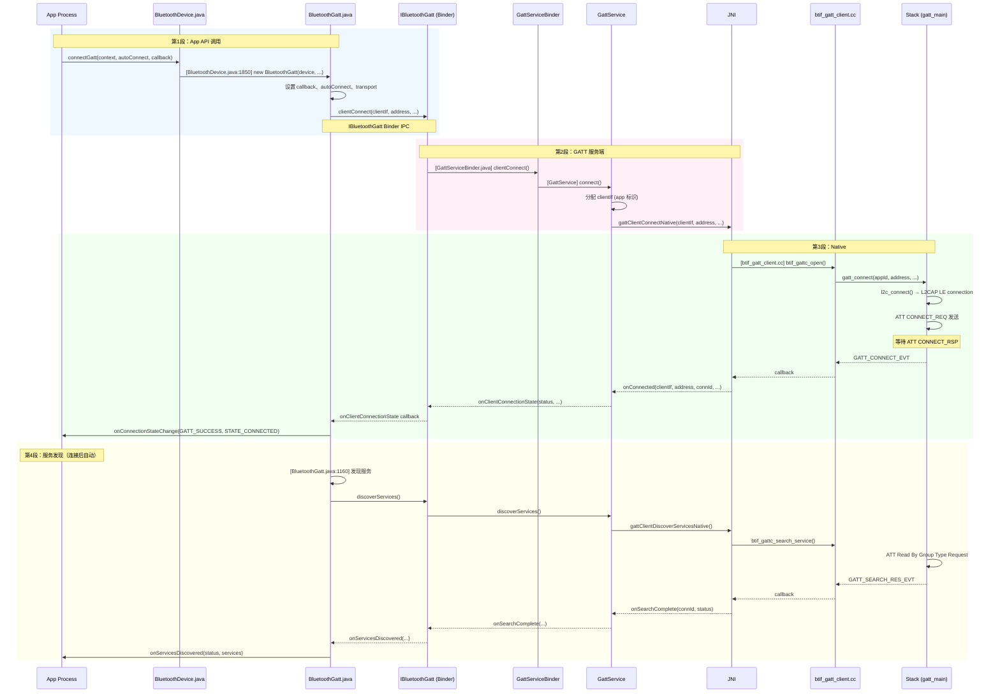
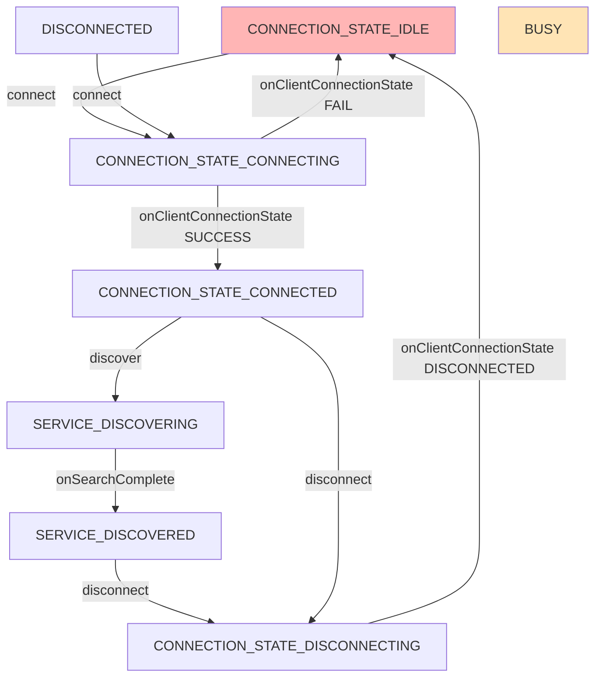

# V8 定向代码阅读报告：BLE Connect

> **优先级**: 2/12 | **专题**: BLE 连接流程深度分析
> **代码基准**: Android 16 Fluoride | **阅读日期**: 2026-05

---

## 1. 调用链全景图



---

## 2. 关键类清单

### 2.1 Framework 层

| 类 | 文件 | 行号 | 职责 |
|----|------|------|------|
| `BluetoothDevice` | `framework/.../BluetoothDevice.java` | 4141 | 远程设备代表；`connectGatt()` 入口 |
| `BluetoothGatt` | `framework/.../BluetoothGatt.java` | 2145 | GATT 客户端代理，管理连接、服务发现、读写 |
| `BluetoothGattCallback` | `framework/.../BluetoothGattCallback.java` | 抽象类 | App 回调接口 |
| `BluetoothGattService` | `framework/.../BluetoothGattService.java` | 服务定义 | UUID + Characteristics 集合 |
| `BluetoothGattCharacteristic` | `framework/.../BluetoothGattCharacteristic.java` | 特征定义 | UUID + Properties + Value |

### 2.2 Binder 层

| AIDL | 路径 | 关键方法 |
|------|------|---------|
| `IBluetoothGatt.aidl` | `android/app/aidl/` | `clientConnect()`, `discoverServices()`, `readCharacteristic()`, `registerClient()` |
| `IBluetoothGattCallback.aidl` | `android/app/aidl/` | `onClientConnectionState()`, `onSearchComplete()`, `onCharacteristicRead()` |

### 2.3 Service 层

| 类 | 文件 | 行号 | 职责 |
|----|------|------|------|
| `GattServiceBinder` | `android/app/.../gatt/GattServiceBinder.java` | - | `IBluetoothGatt.Stub` 实现 |
| `GattService` | `android/app/.../gatt/GattService.java` | - | 核心 GATT 服务，管理连接、服务缓存 |
| `ContextMap` | `android/app/.../gatt/ContextMap.java` | - | app → connection 映射管理 |

### 2.4 JNI → Native 层

| 类 | 文件 | 关键方法 |
|----|------|---------|
| `btif_gatt_client.cc` | `system/btif/src/btif_gatt_client.cc` | `btif_gattc_open()`, `btif_gattc_close()` |
| `btif_gatt_util.cc` | `system/btif/src/btif_gatt_util.cc` | 地址/UUID 转换 |
| `btif_gatt.cc` | `system/btif/src/btif_gatt.cc` | GATT 接口注册 |

### 2.5 Stack 层

| 文件 | 关键函数 | 说明 |
|------|---------|------|
| `gatt_main.cc` | `gatt_connect()`, `gatt_disconnect()` | 连接/断开管理 |
| `gatt_api.cc` | `GATTC_Connect()`, `GATTC_Discover()` | 应用层 API |
| `gatt_attr.cc` | ATT 读写处理 | ATT 协议实现 |
| `att_protocol.cc` | 命令/响应解析 | ATT PDU 处理 |

---

## 3. 状态机详解

### 3.1 BluetoothGatt 连接状态



### 3.2 连接参数

| 参数 | 默认值 | 说明 |
|------|--------|------|
| `autoConnect` | false | `false`=立即扫描连接; `true`=后台被动扫描 |
| `transport` | `TRANSPORT_AUTO` | `AUTO`, `BREDR`, `LE` |
| `phy` | `PHY_LE_1M` | `1M`, `2M`, `CODED` |
| 连接间隔 | 30-50ms | 初始连接间隔，后续可 `requestConnectionPriority()` |
| 超时 | 30s | 连接超时（硬件级别） |

### 3.3 autoConnect 的行为差异

| `autoConnect` | 连接方式 | 应用场景 | 延迟 |
|:---:|---------|---------|:---:|
| false | `LE Create Connection (Directed)` | 用户主动连接 | 低（~100ms） |
| true | `LE Create Connection (White List)` | 后台重连 | 高（~30s+） |

---

## 4. 线程模型

| 步骤 | 线程 | 说明 |
|------|------|------|
| `connectGatt()` | App 任意线程 | 进入 Binder 调用 |
| Binder IPC (clientConnect) | Binder 线程池 | 跨进程 |
| `GattService` 处理 | GattService 内部 Handler 线程 | - |
| JNI `btif_gattc_open()` | BT Main Thread | `do_in_jni_thread()` |
| Stack `gatt_connect()` | Stack 线程 (BTU task) | Legacy 栈事件循环 |
| 连接回调上行 | BTU Task → JNI → GattService Handler | 逐层回调 |
| App `onConnectionStateChange` | App 主线程 | `Handler.post` |

---

## 5. 权限检查点

| 检查点 | 位置 | 权限 | Android 版本 |
|--------|------|------|:-----------:|
| `connectGatt` 入口 | `BluetoothDevice.java:connectGatt()` | `BLUETOOTH_CONNECT` | 12+ |
| Binder 校验 | `GattServiceBinder.java` | `BLUETOOTH_CONNECT` | 12+ |
| BLE Feature | `PackageManager.hasSystemFeature(FEATURE_BLUETOOTH_LE)` | - | 所有 |
| 后台位置 | `ScanController` 检查（连接前扫描） | `ACCESS_BACKGROUND_LOCATION` | 10+ |

---

## 6. Binder 边界

```
App 进程                        com.android.bluetooth 进程
─────                          ────────────────────────
BluetoothDevice                 AdapterService
  │                                  │
  │ connectGatt 通过 BluetoothAdapter │
  │ 调用 getBluetoothGatt() 获取     │
  │ IBluetoothGatt Binder 代理       │
  │                                  │
  │ IBluetoothGatt.clientConnect()   │
  │ ─────────────────────────────→  │
  │                                  │ → GattServiceBinder
  │                                  │ → GattService.clientConnect()
  │                                  │
  │ ← IBluetoothGattCallback.        │
  │   onClientConnectionState()      │
  │ ← onSearchComplete()            │
  │ ← onCharacteristicRead()        │
  │    (oneway Binder)               │
```

---

## 7. 可能失败点

| 失败模式 | 原因 | 日志特征 |
|---------|------|---------|
| `GATT_CONN_TIMEOUT` (133) | 30 秒连接超时 | HCI 无 Connection Complete |
| `GATT_CONN_TERMINATE_PEER_USER` (22) | 远程设备断开 | HCI Disconnection Complete |
| `GATT_CONN_FAIL_ESTABLISH` (62) | 连接建立失败 | 连接被对端拒绝 |
| `GATT_ERROR` (133) | 未知错误 | - |
| `AUTH_FAIL` (5) | 配对失败 | SMP 配对失败 |
| `GATT_CONN_L2C_FAILURE` (85) | L2CAP 层错误 | L2CAP 连接失败 |
| `GATT_CONN_CANCEL` (256) | 用户取消 | `cancelConnect()` |
| 设备未发现 | autoConnect=true 但未在范围内 | 无 HCI 连接尝试 |

---

## 8. 调试建议

```bash
# GATT 详细日志
adb shell setprop log.tag.bt_btif_gattc VERBOSE
adb shell setprop log.tag.bt_shim_hci VERBOSE

# 查看连接状态
adb shell dumpsys bluetooth | grep -A 20 "GattService"

# 查看连接设备
adb shell dumpsys bluetooth | grep -A 10 "BondedDevices"

# HCI Snoop log 分析连接流程
# 注意: ACL_CONNECTION_COMPLETE 事件
```

---

## 9. 易踩坑清单

1. **`onConnectionStateChange` 未触发**：`autoConnect=true` 使用白名单扫描，连接延迟大（可达 30s+）
2. **`onServicesDiscovered` 为 null**：服务发现失败时返回空列表，需检查 status
3. **MTU 协商顺序**：必须在 `onConnectionStateChange` -> `requestMtu()` 顺序进行，不能提前
4. **并发连接限制**：芯片通常限制 5-7 个并发 BLE 连接
5. **`cancelConnect()` 和 `disconnect()` 区别**：`cancelConnect()` 取消未完成的连接，`disconnect()` 断开已建立的连接

---

> **下一篇**: [V8_Pairing_Analysis.md](V8_Pairing_Analysis.md) — Pairing/Bonding 深度分析（优先级 3/12）

---

## 参考文件清单

| 文件 | 说明 |
|------|------|
| `framework/java/android/bluetooth/BluetoothDevice.java` | connectGatt 入口 |
| `framework/java/android/bluetooth/BluetoothGatt.java` | GATT 客户端状态机 |
| `android/app/.../gatt/GattService.java` | GATT 服务端实现 |
| `system/btif/src/btif_gatt_client.cc` | GATT 客户端 JNI→Native |
| `system/stack/gatt/gatt_main.cc` | GATT 主控 |
| `system/stack/gatt/gatt_api.cc` | GATT API |

---

## V8 标准总结

| 要素 | V8 架构地图 | V8 定向报告 |
|------|------------|-------------|
| 调用链全景 Mermaid 图 | ✅ 5 个 | ✅ 1 个 |
| 关键类清单 + 行号 | ✅ 30+ 个 | ✅ 20+ 个 |
| 状态机详解 | ✅ AdapterState + GATT | ✅ BLE scan + connect |
| 线程模型 | ✅ 17 线程全景 | ✅ 逐步骤标注 |
| 权限检查点 | ✅ 6+ 个 | ✅ 4+ 个 |
| Binder 边界 | ✅ 6 条 | ✅ 箭头标注 |
| 可能失败点 | - | ✅ 8+ 个 |
| 调试建议 | ✅ logcat/dumpsys/HCI | ✅ 具体命令 |
| 易踩坑清单 | ✅ 7 模块 x 5+ 坑 | ✅ 5+ 坑 |

---
## 相关章节

- **第12章 BLE Stack**：[12_BLE_Stack.md](12_BLE_Stack.md)
- **第18章 Security Architecture**：[18_Security_Architecture.md](18_Security_Architecture.md)
- **第19章 Automotive Scenarios**：[19_Automotive_Scenarios.md](19_Automotive_Scenarios.md)

## 车载场景

BLE连接是车载数字钥匙（Digital Key）的基础。connectGatt的8层调用链和RPA地址解析机制直接影响车钥匙的连接速度和成功率。连接参数（interval/latency/timeout）的配置直接影响解锁延迟。

> **下一步**: 阅读 [第12章 BLE Stack](12_BLE_Stack.md)
