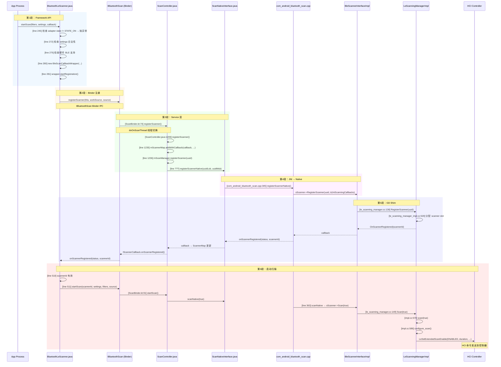
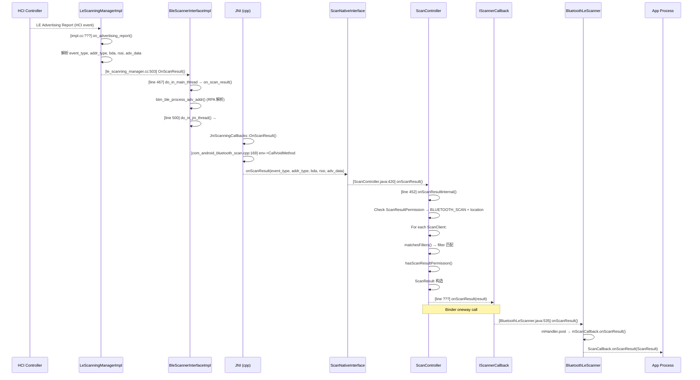
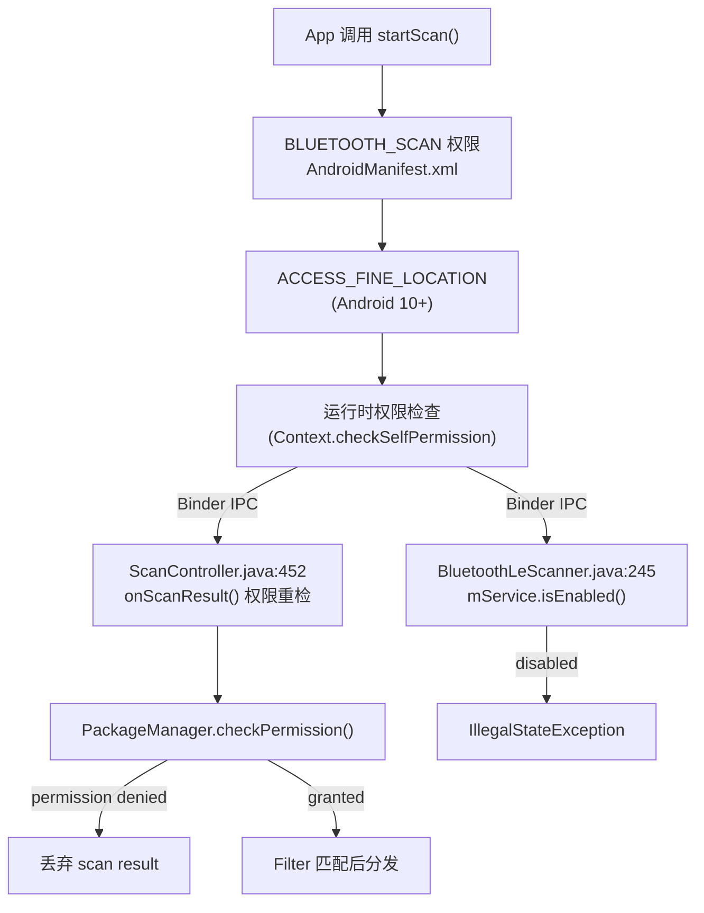
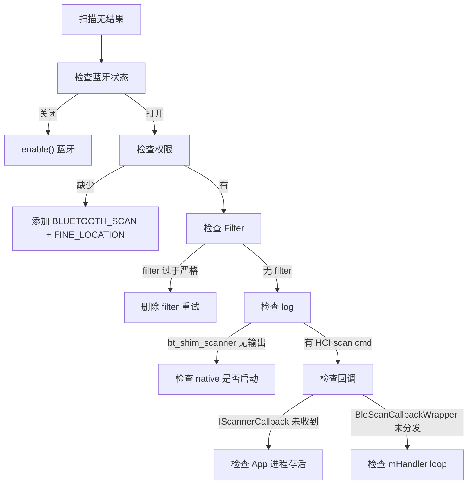

# V8 定向代码阅读报告：BLE Scan

> **优先级**: 1/12 | **专题**: BLE 扫描流程深度分析
> **代码基准**: Android 16 Fluoride | **阅读日期**: 2026-05

---

## 目录

1. [调用链全景图](#1-调用链全景图)
2. [关键类清单](#2-关键类清单)
3. [状态机详解](#3-状态机详解)
4. [线程模型](#4-线程模型)
5. [权限检查点](#5-权限检查点)
6. [Binder 边界](#6-binder-边界)
7. [可能失败点](#7-可能失败点)
8. [调试建议](#8-调试建议)
9. [易踩坑清单](#9-易踩坑清单)

---

## 1. 调用链全景图

### 1.1 完整调用链（App → HCI 命令）



### 1.2 结果上行路径（HCI 事件 → App 回调）



---

## 2. 关键类清单

### 2.1 Framework 层

| 类 | 文件 | 行号 | 职责 | 关键方法 |
|----|------|------|------|---------|
| `BluetoothLeScanner` | `framework/.../le/BluetoothLeScanner.java` | 61-660 | App 入口；管理所有扫描回调的生命周期 | `startScan()` (L123), `stopScan()` (L400) |
| `ScanCallback` | `framework/.../le/ScanCallback.java` | - | App 实现的回调接口 | `onScanResult()`, `onBatchScanResults()`, `onScanFailed()` |
| `ScanSettings` | `framework/.../le/ScanSettings.java` | - | 扫描参数(低功耗/平衡/低延迟) | - |
| `ScanFilter` | `framework/.../le/ScanFilter.java` | - | 过滤条件(Service UUID/设备名/MAC) | - |
| `ScanResult` | `framework/.../le/ScanResult.java` | - | 扫描结果封装(设备/RSSI/广播包) | - |

### 2.2 Binder 代理层

| 类 | 文件 | 行号 | 职责 | 关键方法 |
|----|------|------|------|---------|
| `BleScanCallbackWrapper` | `BluetoothLeScanner.java` | 399-600 | `IScannerCallback.Stub` 实现；管理注册、状态、结果分发 | `startRegistration()` (L429), `onScannerRegistered()` (L494) |

### 2.3 Service 层（com.android.bluetooth 进程）

| 类 | 文件 | 行号 | 职责 | 关键方法 |
|----|------|------|------|---------|
| `ScanBinder` | `android/app/.../le_scan/ScanBinder.kt` | 44-237 | `IBluetoothScan.Stub` 实现 | `registerScanner()` (L74), `startScan()` (L91) |
| `ScanController` | `android/app/.../le_scan/ScanController.java` | 95-1728 | 核心扫描管理器 | `registerScanner()` (L1209), `startScan()` (L1271), `onScanResult()` (L420) |
| `ScanManager` | `android/app/.../le_scan/ScanManager.java` | - | 扫描队列和状态管理 | `startScan()`, `stopScan()`, `registerScanner()` |
| `ScannerMap` | `android/app/.../le_scan/ScannerMap.java` | 228 | 跟踪已注册的 scanner | `addWithCallback()`, `removeScanner()` |
| `AppScanStats` | `android/app/.../le_scan/AppScanStats.java` | 602 | 扫描频率统计和限流 | `recordScanStart()`, `isScanningTooFrequently()` |

### 2.4 JNI 层

| 类 | 文件 | 行号 | 职责 | 关键方法 |
|----|------|------|------|---------|
| `ScanNativeInterface` | `android/app/.../le_scan/ScanNativeInterface.java` | - | JNI 方法声明 | `registerScannerNative()`, `scanNative()`, `scanFilterAddNative()` |
| `JniScanningCallbacks` | `android/app/jni/com_android_bluetooth_scan.cpp` | 142-329 | JNI 回调接收器 | `OnScanResult()` (L169), `OnScannerRegistered()` (L149) |

### 2.5 Native Shim 层

| 类 | 文件 | 行号 | 职责 | 关键方法 |
|----|------|------|------|---------|
| `BleScannerInterface` | `system/include/hardware/ble_scanner.h` | 78-175 | 抽象扫描接口 | `RegisterScanner()`, `Scan()`, `ScanFilterAdd()` |
| `BleScannerInterfaceImpl` | `system/main/shim/le_scanning_manager.cc` | 51-800 | Legacy→GD 桥接 | `RegisterScanner()` (L136), `Scan()` (L149), `OnScanResult()` (L503) |

### 2.6 GD 层

| 类 | 文件 | 行号 | 职责 | 关键方法 |
|----|------|------|------|---------|
| `LeScanningManager` | `system/gd/hci/le_scanning_manager.h` | 35-95 | 抽象 HCI 扫描管理器 | `RegisterScanner()`, `Scan()`, `ScanFilterEnable()` |
| `LeScanningManagerImpl` | `system/gd/hci/le_scanning_manager_impl.h` | 34-109 | pimpl 实现 | - |
| `impl` (内部类) | `system/gd/hci/le_scanning_manager_impl.cc` | 520-1810 | 具体实现，发送 HCI 命令 | `register_scanner()` (L520), `scan(bool)` (L570), `start_scan()` (L586) |

---

## 3. 状态机详解

### 3.1 BleScanCallbackWrapper 状态

```mermaid
graph TD
    INIT["INIT (mScannerId=0)"] -->|startRegistration()| REGISTERING["REGISTERING<br/>等待 onScannerRegistered"]
    REGISTERING -->|onScannerRegistered(status=0)| REGISTERED["REGISTERED (mScannerId>0)<br/>可调用 startScan"]
    REGISTERING -->|onScannerRegistered(status!=0)| FAILED["FAILED (mScannerId=-1)<br/>注册失败"]
    REGISTERED -->|startScan()| SCANNING["SCANNING<br/>HCI 扫描进行中"]
    SCANNING -->|stopLeScan()| STOPPING["STOPPING<br/>正在停止"]
    STOPPING -->|onScannerRegistered(status=0)| REGISTERED["REGISTERED<br/>可重新 startScan"]
    REGISTERED -->|unregisterScanner()| UNREGISTERED["UNREGISTERED<br/>mScannerId=-1"]
    REGISTERING -->|2秒超时| TIMEOUT["TIMEOUT<br/>等待回调超时"]
```

### 3.2 ScanController 扫描状态

| 状态 | 含义 | 说明 |
|------|------|------|
| 未注册 | scannerId 无效 | mScannerMap 中无记录 |
| 已注册 | scannerId > 0 | native 端已分配 slot |
| 扫描中 | scanId 关联 RegularScanQueue | mScanManager 管理 |
| 暂停 | suspend → resume | ScanSuspendManager 处理 |

### 3.3 LeScanningManagerImpl 内部状态

| 阶段 | 操作 | 说明 |
|------|------|------|
| register_scanner | 分配 slot → callback | slots_ 数组最多 32 个 |
| configure_scan | 发送 Set Scan Parameters HCI 命令 | 设置扫描类型、窗口、间隔 |
| start_scan | 发送 Set Scan Enable HCI 命令 | 开启/关闭扫描硬件 |

---

## 4. 线程模型

### 4.1 调用线程追踪

| 步骤 | 代码位置 | 线程 | 说明 |
|------|---------|------|------|
| `startScan()` 调用 | `BluetoothLeScanner.java:280` | App 任意线程 | 框架内部做权限检查 |
| `startRegistration()` | `BluetoothLeScanner.java:429` | App 任意线程 | synchronized 保护 |
| Binder IPC 调用 | - | Binder 线程池 | 跨进程到 com.android.bluetooth |
| `ScanBinder.registerScanner()` | `ScanBinder.kt:74` | 强制 `mScanThread` | `doOnScanThread { }` |
| `ScanController.registerScanner()` | `ScanController.java:1209` | `mScanThread` | `enforceScanThread()` 检查 |
| `scanNative()` JNI 调用 | `ScanController.java` | `mScanThread` | 调用 native 函数 |
| `registerScannerNative()` | `com_android_bluetooth_scan.cpp:345` | 调用者线程 (mScanThread) | 同步调用 |
| `BleScannerInterfaceImpl::RegisterScanner()` | `le_scanning_manager.cc:136` | BT Main Thread | `do_in_main_thread` 切换 |
| `LeScanningManagerImpl` 操作 | `le_scanning_manager_impl.cc` | `gd_stack_thread` | Handler post |

### 4.2 回调上行线程

| 步骤 | 线程 | 说明 |
|------|------|------|
| HCI 事件接收 | `gd_stack_thread` | REAL_TIME 优先级 |
| `OnScanResult()` shim | `gd_stack_thread` | 快速处理 |
| `do_in_main_thread` | BT Main Thread | 地址解析 |
| `do_in_jni_thread` | `bt_jni_thread` | JNI env 关联 |
| `ScanController.onScanResult()` | `mScanThread` | 扫描专用线程 |
| `IScannerCallback.onScanResult()` | Binder 线程池 | oneway Binder 调用 |
| `BleScanCallbackWrapper.onScanResult()` | Binder 线程池 | 接收回调 |
| `mHandler.post()` → App callback | App 主线程 | Handler 分发 |

### 4.3 线程检查代码

```java
// ScanController.java:1631
private void enforceScanThread() {
    if (Thread.currentThread() != mScanThread) {
        throw new IllegalStateException("Not on scan thread");
    }
}

// 线程切换方式 — ScanBinder.kt:53
private fun <R> withControllerRunOnScanThread(block: () -> R): R {
    return scanController.doOnScanThread { block() }
}
```

---

## 5. 权限检查点

### 5.1 权限检查路径



### 5.2 权限清单

| 权限 | 添加版本 | 必要性 | 检查时机 |
|------|---------|--------|---------|
| `BLUETOOTH_SCAN` | Android 12+ | 必须 | `startScan()` 入口 |
| `BLUETOOTH_CONNECT` | Android 12+ | 连接时需要 | - |
| `ACCESS_FINE_LOCATION` | Android 10+ | 必须 (10-11) / 可选 (12+) | `startScan()` + 运行时 |
| `BLUETOOTH` (legacy) | Android 2.0 | 兼容旧版 | `minSdkVersion < 31` |

### 5.3 权限检查代码

```java
// BluetoothLeScanner.java:245-260
private int startScan(..., ScanCallback callback, ...) {
    // 权限检查
    if (mContext != null) {
        if (!PermissionChecker.checkCallingOrSelfPermission(
                mContext, BLUETOOTH_SCAN)) {
            return ERROR_UNKNOWN;
        }
    }
    ...
    IBluetoothScan scan = mBluetoothAdapter.getBluetoothScan();
    ...
}
```

```java
// ScanController.java:460-470
private boolean hasScanResultPermission(AttributionSource source) {
    // 扫描结果分发的权限重检
    return mPermissionChecker.checkScanResultPermission(source);
}
```

---

## 6. Binder 边界

### 6.1 AIDL 接口

| AIDL | 路径 | 类型 | 方法 | 方向 |
|------|------|------|------|------|
| `IBluetoothScan.aidl` | `android/app/aidl/android/bluetooth/` | 同步 | `registerScanner()`, `startScan()`, `stopScan()` | App → 服务 |
| `IScannerCallback.aidl` | `android/app/aidl/android/bluetooth/le/` | **oneway** | `onScannerRegistered()`, `onScanResult()`, `onBatchScanResults()` | 服务 → App |

### 6.2 跨进程数据流

```
App 进程                          com.android.bluetooth 进程
─────                            ────────────────────────
BluetoothLeScanner               ScanBinder
  │                                  │
  │ IBluetoothScan.registerScanner   │
  │ ─────────────────────────────→   │
  │                                  │ → ScanController.registerScanner()
  │                                  │ → native RegisterScanner
  │                                  │
  │ ← IScannerCallback.              │
  │   onScannerRegistered(scannerId) │ ← callback from native
  │    (oneway Binder)               │
  │                                  │
  │ IBluetoothScan.startScan         │
  │ ─────────────────────────────→   │
  │                                  │ → ScanController.startScan()
  │                                  │ → native Scan(true)
  │                                  │
  │ ← IScannerCallback.onScanResult  │ ← HCI event → native → Java
  │    (oneway Binder, 高频调用)    │
```

### 6.3 Binder 性能注意事项

- `IScannerCallback.onScanResult()` 是 **oneway** 调用，不阻塞服务线程
- 高频扫描时（间隔可低至 10ms），Binder 事务可能成为瓶颈
- `ScanResult` 对象包含完整广播包，序列化开销大
- `onBatchScanResults()` 用于批量结果减少 IPC 次数

---

## 7. 可能失败点

### 7.1 注册阶段失败

| 失败模式 | 代码位置 | 原因 | 表现 |
|---------|---------|------|------|
| 注册超时 | `BleScanCallbackWrapper.startRegistration()` L435 | native 2 秒内无 `onScannerRegistered` | `wait(2000)` 超时 → `unregisterScanner()` |
| slot 满 | `le_scanning_manager_impl.cc:520` | 32 个 scanner slot 用尽 | 注册失败 |
| JNI 初始化失败 | `com_android_bluetooth_scan.cpp:863` | `sScanner` 未初始化 | NPE → crash |
| App 进程被杀 | - | App 意外退出 | Binder death 通知 |

### 7.2 扫描阶段失败

| 失败模式 | 代码位置 | 原因 | 表现 |
|---------|---------|------|------|
| 扫描频率限制 | `AppScanStats.isScanningTooFrequently()` | 5 秒内起停 >5 次 | `SCAN_FAILED_SCANNING_TOO_FREQUENTLY` |
| 硬件不支持 | `BluetoothLeScanner.java:275` | 设备无 BLE | 提前返回 |
| BLE 关闭 | `BluetoothLeScanner.java:245` | 蓝牙未启用 | 回调失败 |
| HCI 命令失败 | `le_scanning_manager_impl.cc` | 控制器无响应 | 静默失败 |
| 滤波配置错误 | `ConfigureFilter` path | filter 参数不合法 | 不返回结果 |

### 7.3 结果分发阶段失败

| 失败模式 | 代码位置 | 原因 | 表现 |
|---------|---------|------|------|
| Permission 拒绝 | `ScanController.java:460` | App 无扫描权限 | 静默丢弃 scan result |
| Binder 死亡 | `IScannerCallback` oneway | App 进程死亡 | 回调静默丢失 |
| 主线程忙碌 | `BleScanCallbackWrapper` L535 | App 主线程阻塞 | 回调延迟 |
| Filter 不匹配 | `matchesFilters()` | 无 filter 匹配 | 无回调 |

---

## 8. 调试建议

### 8.1 日志分析

```bash
# 开启 BLE 扫描详细日志
adb shell setprop log.tag.bt_btif VERBOSE
adb shell setprop log.tag.bt_shim_scanner VERBOSE

# 查看扫描注册流程
adb logcat -s bt_shim_scanner

# 查看扫描频率统计
adb shell dumpsys bluetooth | grep -A 30 "ScanController"

# 抓 HCI log 分析扫描命令
adb shell setprop persist.bluetooth.btsnoopenable true
adb shell setprop persist.bluetooth.btsnooppath /data/misc/bluetooth/logs
# Bugreport 包含 btsnoop_hci.log
```

### 8.2 常见日志模式

```
# 注册成功
bt_shim_scanner: on_scanner_registered status=0 scanner_id=5

# 扫描开始
bt_shim_scanner: scan start
bt_shim_scanner: configure_scan: type=1 window=30 interval=300

# 收到扫描结果
bt_shim_scanner: on_advertising_report event_type=4 addr_type=0

# 扫描频率限制
ScanController: SCAN_FAILED_SCANNING_TOO_FREQUENTLY for app: com.example
```

### 8.3 排查流程



---

## 9. 易踩坑清单

### 9.1 最常踩的 5 个坑

1. **扫描频率限制**
   ```java
   // BLE 扫描 5 秒内起停超过 5 次
   // 触发 SCAN_FAILED_SCANNING_TOO_FREQUENTLY
   // 冷却期约 5 秒
   // 源码: AppScanStats.isScanningTooFrequently()
   ```

2. **scannerId 失效**
   ```java
   // 重新注册后 scannerId 变化
   // 持旧的 scannerId 调用 stopScan() 无效果
   // 必须通过 onScannerRegistered() 获取新 ID
   ```

3. **autoConnect=true 的间接影响**
   ```java
   // autoConnect=true 只在后台扫描
   // 和前台 startScan 共用扫描资源
   // 可能导致前台扫描延迟增大
   ```

4. **Filter 在 native 端的不完整性**
   ```java
   // ScanFilter.setDeviceName() 在 native 端
   // 可能不是精确匹配（取决于芯片实现）
   // 建议 Java 侧做二次过滤
   ```

5. **权限延迟**
   ```java
   // BLUETOOTH_SCAN 在 Android 12+ 要求运行时
   // APP 可能通过旧版 BLUETOOTH 权限编译
   // 但运行时无 BLUETOOTH_SCAN → 扫描失败
   ```

### 9.2 性能坑

| 坑 | 影响 | 解决 |
|----|------|------|
| `SCAN_MODE_LOW_LATENCY` 连续使用 | 耗电增加 5x | 场景切换时用 `BALANCED` |
| `onScanResult` 过多 Binder IPC | 帧率下降 | 使用 `setReportDelay()` 批量 |
| ScanResult 保留过多对象 | 内存泄漏 | 及时清 `onBatchScanResults` |

### 9.3 线程安全坑

| 坑 | 现象 | 源码 |
|----|------|------|
| 非扫描线程调用 | `IllegalStateException("Not on scan thread")` | `ScanController.java:1631` |
| synchronized 回调内持有锁 | Binder 线程阻塞 | `BluetoothLeScanner.java` — mLeScanClients |
| Binder 回调在 Binder 池执行 | 误更新 UI | 必须 `mHandler.post` 到主线程 |

---

> **下一篇**: [V8_BLE_Connect_Analysis.md](V8_BLE_Connect_Analysis.md) — BLE 连接深度分析（优先级 2/12）

---

## 参考文件清单

| 文件 | 行数 | 关键代码 |
|------|------|---------|
| `framework/java/android/bluetooth/le/BluetoothLeScanner.java` | 660 | `startScan()` L123, `BleScanCallbackWrapper` L399 |
| `android/app/.../le_scan/ScanBinder.kt` | 237 | `registerScanner()` L74, `startScan()` L91 |
| `android/app/.../le_scan/ScanController.java` | 1728 | `registerScanner()` L1209, `startScan()` L1271, `onScanResult()` L420 |
| `android/app/.../le_scan/ScanNativeInterface.java` | - | `registerScannerNative()`, `scanNative()` |
| `android/app/.../le_scan/ScanManager.java` | - | 扫描队列管理 |
| `android/app/.../le_scan/AppScanStats.java` | 602 | 频率限制 |
| `android/app/.../le_scan/ScannerMap.java` | 228 | 注册跟踪 |
| `android/app/jni/com_android_bluetooth_scan.cpp` | 1039 | JNI bridge |
| `system/include/hardware/ble_scanner.h` | 175 | BleScannerInterface |
| `system/main/shim/le_scanning_manager.cc` | 875 | Shim bridge |
| `system/gd/hci/le_scanning_manager_impl.cc` | 1810 | HCI 命令实现 |
| `system/gd/hci/le_scanning_manager.h` | 95 | GD 抽象接口 |

---
## 相关章节

- **第12章 BLE Stack**：[12_BLE_Stack.md](12_BLE_Stack.md)
- **第6章 Profile Services**：[06_Profile_Services.md](06_Profile_Services.md)
- **第7章 JNI Bridge**：[07_JNI_Bridge.md](07_JNI_Bridge.md)

## 车载场景

BLE扫描在车载场景中用于车钥匙发现和传感器探测。ScanController的线程模型（mScanThread）确保扫描操作不阻塞主线程，AppScanStats的扫描频率限制防止恶意App耗尽车机电量。

> **下一步**: 阅读 [第12章 BLE Stack](12_BLE_Stack.md)
