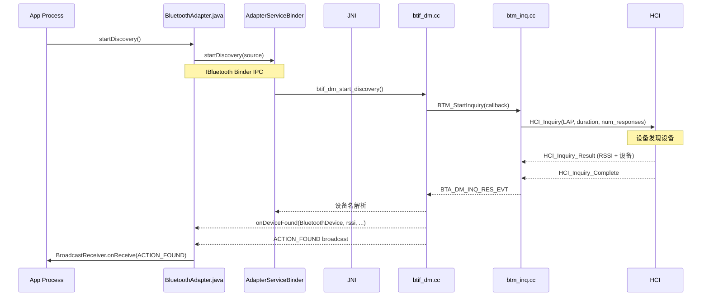

# V8 定向代码阅读报告：Classic Discovery

> **优先级**: 10/12 | **专题**: 经典蓝牙发现/扫描深度分析
> **代码基准**: Android 16 Fluoride | **阅读日期**: 2026-05

---

## 1. 调用链全景图



---

## 2. 关键类清单

| 类 | 文件 | 职责 |
|----|------|------|
| `BluetoothAdapter` | `framework/.../BluetoothAdapter.java` | `startDiscovery()` `cancelDiscovery()` |
| `BluetoothDevice` | `framework/.../BluetoothDevice.java` | 发现的设备 |
| `AdapterServiceBinder` | `android/app/.../AdapterServiceBinder.java` | Binder 实现 |
| `btif_dm.cc` | `system/btif/src/btif_dm.cc` | 发现管理 |
| `btm_inq.cc` | `system/stack/btm/btm_inq.cc` | Inquiry 引擎 |
| `btm_inq.h` | `system/stack/include/btm_inq.h` | Inquiry API |

---

## 3. 状态机

```
Inquiry 状态:
IDLE → INQUIRY_STARTED → INQUIRY_RESULT → INQUIRY_COMPLETE → IDLE

背靠背扫描 (Interlaced Scan):
INQUIRY → PAGE → INQUIRY → PAGE → ...
```

---

## 4. 线程模型

| 步骤 | 线程 | 说明 |
|------|------|------|
| `startDiscovery()` | App 任意线程 | Binder IPC |
| `AdapterServiceBinder` | Binder 线程池 | 权限检查 |
| `btif_dm_start_discovery()` | BT Main Thread | JNI 分发 |
| `BTM_StartInquiry()` | BTU Task | 状态机运行 |
| HCI Inquiry 命令 | HCI 线程 | 硬件通信 |
| 发现结果回调 | BTU → JNI → Main Thread | 逐层上行 |
| `ACTION_FOUND` 广播 | App 主线程 | BroadcastReceiver |

---

## 5. 权限检查点

| API | 权限 | 备注 |
|-----|------|------|
| `startDiscovery()` | `BLUETOOTH_SCAN` + `ACCESS_FINE_LOCATION` | Android 12+ |
| `cancelDiscovery()` | `BLUETOOTH_SCAN` | - |
| `startDiscovery()` (legacy) | `BLUETOOTH_ADMIN` | Android < 12 |

---

## 6. Binder 边界

```
App 进程                        com.android.bluetooth 进程
─────                          ────────────────────────
BluetoothAdapter                AdapterServiceBinder
  │                                  │
  │ IBluetooth.startDiscovery()      │
  │ ─────────────────────────────→  │ → btif_dm_start_discovery()
  │                                  │
  │ ← Broadcast ACTION_FOUND        │
  │ ← Broadcast ACTION_DISCOVERY_FINISHED │
```

---

## 7. 可能失败点

| 失败模式 | 原因 | 表现 |
|---------|------|------|
| 无发现结果 | 附近无可发现设备 | 超时无回调 |
| 发现被中断 | `cancelDiscovery()` 或 `connect()` | HCI Inquiry Cancel |
| 多次发现冲突 | `startDiscovery()` 已在进行中 | `cancelDiscovery()` → `startDiscovery()` |

---

## 8. 调试建议

```bash
# 发现日志
adb logcat -s bt_btif_dm:* bt_btm_inq:*

# HCI log 分析
# 搜索: HCI_Inquiry, HCI_Inquiry_Result, HCI_Inquiry_Complete
```

---

## 9. 易踩坑清单

1. **发现过程中不能连接**: `startDiscovery()` 期间发起连接会中断发现
2. **多次发现限制**: 30 秒内不能多次发现，需等待完成
3. **发现周期**: 默认发现周期 12.8 秒，可配 `EXTRA_DISCOVERABLE_DURATION`
4. **设备名解析**: 发现后需 `fetchUuidsWithSdp()` 获取名称和服务 UUID

---

> **下一篇**: [V8_Dumpsys_Analysis.md](V8_Dumpsys_Analysis.md) — dumpsys 输出解读（优先级 11/12）

---

## 参考文件清单

| 文件 | 说明 |
|------|------|
| `framework/.../BluetoothAdapter.java` | `startDiscovery()` |
| `system/btif/src/btif_dm.cc` | 发现管理 |
| `system/stack/btm/btm_inq.cc` | Inquiry 引擎 |

---
## 相关章节

- **第10章 Classic Stack Core**：[10_Classic_Stack_Core.md](10_Classic_Stack_Core.md)
- **第11章 Classic Profiles**：[11_Classic_Profiles.md](11_Classic_Profiles.md)
- **第19章 Automotive Scenarios**：[19_Automotive_Scenarios.md](19_Automotive_Scenarios.md)

## 车载场景

Classic发现流程用于车载设备发现（手机配对前的扫描）。startDiscovery在BR/EDR和BLE同时扫描时存在信道冲突，车载场景下建议优先使用BLE扫描以提高发现速度。HCI_Inquiry/Inquiry_Result的RSSI信息可用于粗略测距。

> **下一步**: 阅读 [第10章 Classic Stack Core](10_Classic_Stack_Core.md)
