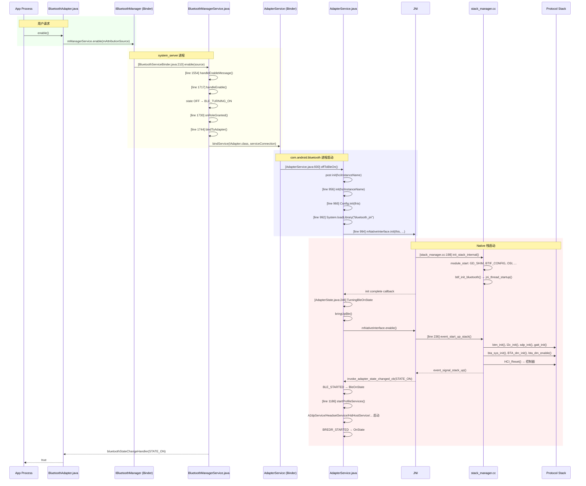
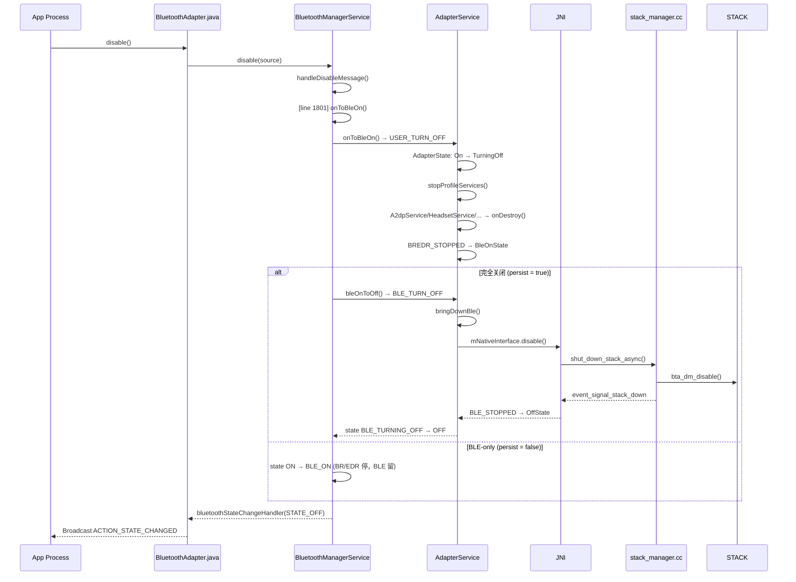

# V8 定向代码阅读报告：Bluetooth Enable / Disable

> **优先级**: 5/12 | **专题**: 蓝牙启用/关闭流程深度分析
> **代码基准**: Android 16 Fluoride | **阅读日期**: 2026-05

---

## 1. 调用链全景图

### 1.1 Enable 完整路径



### 1.2 Disable 完整路径



---

## 2. 关键类清单

| 类 | 文件 | 行号 | 职责 |
|----|------|------|------|
| `BluetoothManagerService` | `service/.../BluetoothManagerService.java` | 2448 | 系统服务端状态管理 |
| `BluetoothServiceBinder` | `service/.../BluetoothServiceBinder.java` | 448 | IBluetoothManager Binder |
| `AdapterService` | `android/app/.../btservice/AdapterService.java` | 5030 | 主 Service，状态机 |
| `AdapterState` | `android/app/.../btservice/AdapterState.java` | 407 | 状态机实现 |
| `AdapterNativeInterface` | `android/app/.../btservice/AdapterNativeInterface.java` | 434 | JNI 桥接 |
| `BluetoothService` | `service/src/BluetoothService.kt` | 112 | SystemService 入口 |
| `BluetoothSupervisor` | `service/src/BluetoothSupervisor.kt` | 68 | 桥接 |
| `AdapterBinder` | `service/src/AdapterBinder.kt` | 77 | IAdapter 代理 |
| `BluetoothComponent` | `service/src/BluetoothComponent.kt` | 66 | 组件解析 |
| `AutoOn` | `service/src/AutoOn.kt` | - | 自动打开管理 |
| `stack_manager.cc` | `system/btif/src/stack_manager.cc` | 422 | Native 栈生命周期 |

---

## 3. 状态机详解

### 3.1 服务端状态机 (BluetoothManagerService)

```mermaid
graph TD
    OFF["STATE_OFF"] -->|handleEnable| BLE_TURNING_ON["STATE_BLE_TURNING_ON"]
    BLE_TURNING_ON -->|bind + init + bringUpBle| BLE_ON["STATE_BLE_ON"]
    BLE_ON -->|bleOnToOn (user enable)| TURNING_ON["STATE_TURNING_ON"]
    TURNING_ON -->|startProfileServices + BREDR_STARTED| ON["STATE_ON"]
    ON -->|onToBleOn (disable)| TURNING_OFF["STATE_TURNING_OFF"]
    TURNING_OFF -->|stopProfileServices + BREDR_STOPPED| BLE_ON
    BLE_ON -->|bleOnToOff| BLE_TURNING_OFF["STATE_BLE_TURNING_OFF"]
    BLE_TURNING_OFF -->|bringDownBle + BLE_STOPPED| OFF
    OFF -->|handleEnable| BLE_TURNING_ON
    BLE_TURNING_ON -->|bleTurningOnToOff| OFF
```

### 3.2 状态转换触发方法 (BluetoothManagerService.java)

| 转换 | 方法 | 行号 | 说明 |
|------|------|------|------|
| OFF→BLE_TURNING_ON | `handleEnable()` | 1717 | 设置 mState, 触发绑定 |
| BLE_TURNING_ON→BLE_ON | `propagateOffToBleOn()` | 1788 | 绑定完成, 调用 app offToBleOn |
| BLE_ON→TURNING_ON | `bleOnToOn()` | 1815 | BR/EDR 开启 |
| TURNING_ON→ON | `bluetoothStateChangeHandler()` | 1885 | Profile 启动完成 |
| ON→TURNING_OFF | `onToBleOn()` | 1801 | 禁用请求 |
| TURNING_OFF→BLE_ON | `bluetoothStateChangeHandler()` | 1885 | BR/EDR 停止 |
| BLE_ON→BLE_TURNING_OFF | `bleOnToOff()` | 1829 | BLE 关闭 |
| BLE_TURNING_OFF→OFF | `bluetoothStateChangeHandler()` | 1885 | BLE 停止 |

### 3.3 App 侧状态机 (AdapterState.java)

```
                    USER_TURN_ON
       BLE_TURN_OFF ─────→ ─────→ USER_TURN_OFF
            ↓       TurningOn    TurningOff      ↓
         Off ─────────→ BleOn ←────────────────── On
            ←───────────  ←─────────────────────
           BLE_TURN_OFF  BLE TURN_ON
                BLE_STOPPED  BLE_STARTED
                TurningBleOff  TurningBleOn
                        ←──────────
                     USER_TURN_OFF on BLE_ON
```

---

## 4. 线程模型

| 步骤 | 线程 | 说明 |
|------|------|------|
| `enable()` 调用 | App 任意线程 | Binder IPC |
| BluetoothHandler 处理 | `BluetoothSystemServer` Thread | Handler message 驱动 |
| bindToAdapter() | `BluetoothSystemServer` Thread | `bindServiceAsUser()` |
| AdapterService.init() | Main Thread (bt app) | `Handler.post` |
| Native init | `bt_stack_manager_thread` | 同步初始化 |
| State machine 转换 | Main Thread (bt app) | Handler message |
| Profile 启动 | Main Thread (bt app) | 子线程启动 state machines |
| 状态广播 | Main Thread (bt app) | `sendBroadcast()` |

---

## 5. 权限检查点

| 操作 | 权限 | 说明 |
|------|------|------|
| `enable()` | `BLUETOOTH_CONNECT` | Android 12+ |
| `disable()` | `BLUETOOTH_CONNECT` | Android 12+ |
| `enableNoAutoConnect()` | `BLUETOOTH_CONNECT` | NFC 等场景 |
| 飞行模式切换 | 无需 App 权限 | 系统广播 |
| adb shell enable/disable | `DUMP` | Shell 命令 |

---

## 6. Binder 边界

```
App 进程               system_server          com.android.bluetooth
─────                 ──────────────          ─────────────────────
BluetoothAdapter      BluetoothServiceBinder  AdapterService
  │                         │                       │
  │ enable()                │                       │
  ├─→ IBluetoothManager ─→ │                       │
  │                         ├─ handleEnable()       │
  │                         ├─ bindToAdapter() ──→ │
  │                         │                       ├─ init()
  │                         │                       ├─ loadLibrary
  │                         │                       ├─ enable()
  │                         │                       │
  │ ← broadcast            │                       │
  │   STATE_CHANGED        │                       │
```

---

## 7. 可能失败点

| 失败模式 | 原因 | 日志特征 |
|---------|------|---------|
| 绑定超时 | AdapterService 未在 30s 内启动 | `MESSAGE_TIMEOUT_BIND` |
| Native init 失败 | JNI 库加载失败 | `System.loadLibrary` 异常 |
| HCI Reset 超时 | 控制器无响应 | `bt_shim_hci` timeout |
| 权限拒绝 | 用户/设备策略禁止 | `DISALLOW_BLUETOOTH` |
| 飞行模式 | 无线电关闭 | `AirplaneModeListener` |
| 安全模式 | 系统安全模式 | `handleOnBootPhase` 提前返回 |
| 热启动 crash | `BluetoothCrashRecovery` | 自动重试 |

---

## 8. 调试建议

```bash
# 跟踪 Enable/Disable 流程
adb logcat -s BluetoothManagerService:* BluetoothServiceBinder:* bt_btif_core:*

# 查看当前状态
adb shell dumpsys bluetooth_manager

# adb 控制
adb shell cmd bluetooth_manager enable
adb shell cmd bluetooth_manager disable
adb shell cmd bluetooth_manager enableBle
adb shell cmd bluetooth_manager wait-for-state:STATE_ON

# 查看启动时间
adb shell dumpsys bluetooth_manager | grep "Time"
```

---

## 9. 易踩坑清单

1. **快速切换**: Enable 进行中又 Disable → 状态机 race condition，可能导致 hang
2. **ON→BLE_ON→OFF** 三态: 系统支持 BLE-only 模式，Disable 可能只停 BR/EDR
3. **bindService 延迟**: 首次启用需等待 AdapterService 进程启动（~500ms-2s）
4. **Native 初始化失败**: `init_stack_internal()` 中任一模块失败导致整个栈不可用
5. **Profile 启动失败**: 单个 Profile 服务崩溃不影响整体 ON 状态

---

> **下一篇**: [V8_Profile_Analysis.md](V8_Profile_Analysis.md) — Profile Service 生命周期分析（优先级 6/12）

---

## 参考文件清单

| 文件 | 行数 | 关键方法 |
|------|------|---------|
| `BluetoothManagerService.java` | 2448 | `handleEnable()` L1717, `bindToAdapter()` L1744 |
| `BluetoothServiceBinder.java` | 448 | `enable()` L210, `disable()` L297 |
| `BluetoothService.kt` | 112 | `onUserStarting()` L73 |
| `BluetoothSupervisor.kt` | 68 | `handleOnBootPhase()` L52 |
| `AdapterBinder.kt` | 77 | `offToBleOn()` L44 |
| `AdapterService.java` | 5030 | `init()` L956, `bringUpBle()` L1114 |
| `AdapterState.java` | 407 | 状态机 |
| `AdapterNativeInterface.java` | 434 | `initNative()` L305, `enableNative()` L314 |
| `stack_manager.cc` | 422 | `init_stack_internal()` L198 |

---
## 相关章节

- **第5章 Service Layer**：[05_Service_Layer.md](05_Service_Layer.md)
- **第1章 Architecture Overview**：[01_Architecture_Overview.md](01_Architecture_Overview.md)
- **第17章 Power Management**：[17_Power_Management.md](17_Power_Management.md)

## 车载场景

车载电源管理（ACC ON/OFF、Deep Sleep/Wakeup）直接影响蓝牙启停流程。enable/disable的race condition在车载ACC快速切换场景中极易触发，需关注BluetoothManagerService.handleEnableMessage()中的状态机保护。

> **下一步**: 阅读 [第5章 Service Layer](05_Service_Layer.md)
