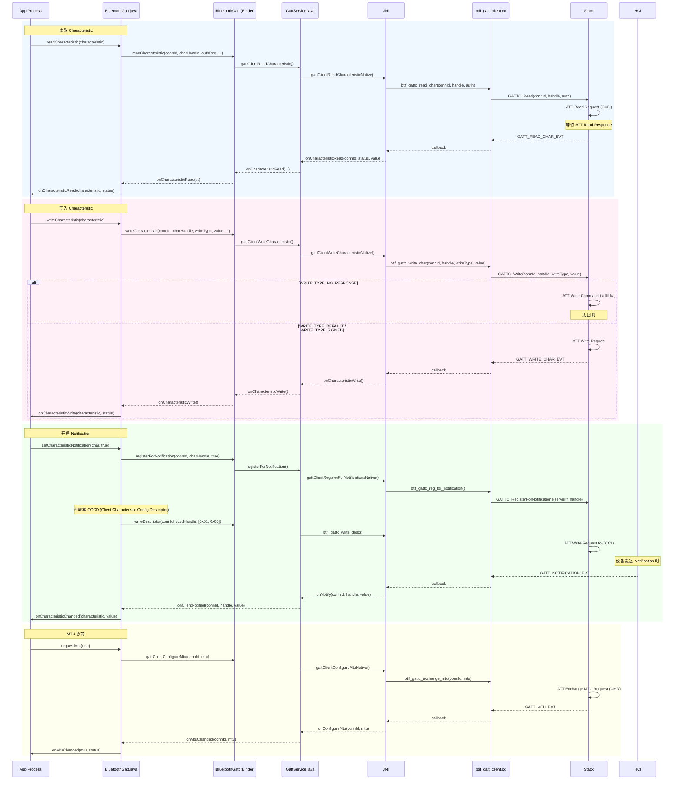
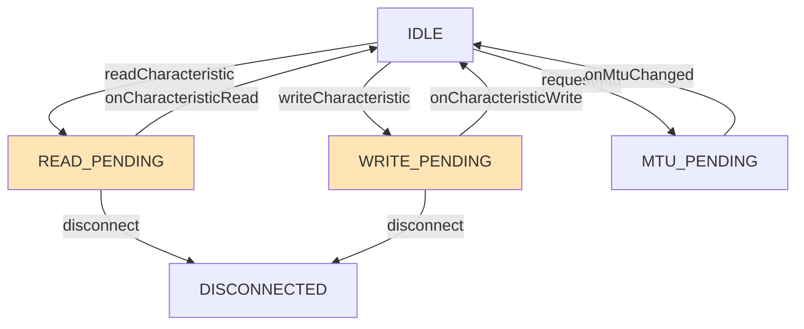

# V8 定向代码阅读报告：GATT Client

> **优先级**: 4/12 | **专题**: GATT 客户端操作深度分析
> **代码基准**: Android 16 Fluoride | **阅读日期**: 2026-05

---

## 1. 调用链全景图



---

## 2. 关键类清单

### 2.1 Framework 层

| 类 | 文件 | 行号 | 职责 |
|----|------|------|------|
| `BluetoothGatt` | `framework/.../BluetoothGatt.java` | 2145 | GATT 客户端，管理连接/服务/读写 |
| `BluetoothGattCallback` | `framework/.../BluetoothGattCallback.java` | - | 回调抽象类 |
| `BluetoothGattService` | `framework/.../BluetoothGattService.java` | - | 服务定义 |
| `BluetoothGattCharacteristic` | `framework/.../BluetoothGattCharacteristic.java` | - | 特征定义 |
| `BluetoothGattDescriptor` | `framework/.../BluetoothGattDescriptor.java` | - | 描述符定义 |

### 2.2 Service 层

| 类 | 文件 | 职责 |
|----|------|------|
| `GattServiceBinder` | `android/app/.../gatt/` | IBluetoothGatt.Stub 实现 |
| `GattService` | `android/app/.../gatt/GattService.java` | 核心 GATT 服务，连接/操作管理 |
| `ContextMap` | `android/app/.../gatt/ContextMap.java` | app→connId 映射 |

### 2.3 Native 层

| 文件 | 关键函数 | 说明 |
|------|---------|------|
| `btif_gatt_client.cc` | `btif_gattc_read_char()` | 读 Characteristic |
| `btif_gatt_client.cc` | `btif_gattc_write_char()` | 写 Characteristic |
| `btif_gatt_client.cc` | `btif_gattc_write_desc()` | 写 Descriptor |
| `btif_gatt_client.cc` | `btif_gattc_exchange_mtu()` | MTU 协商 |
| `btif_gatt_client.cc` | `btif_gattc_reg_for_notification()` | 通知注册 |
| `btif_gatt_client.cc` | `btif_gattc_search_service()` | 服务发现 |
| `gatt_api.cc` | `GATTC_Read()`, `GATTC_Write()` | GATT API |
| `att_protocol.cc` | ATT PDU 处理 | ATT 协议 |

---

## 3. GATT 操作状态机

### 3.1 BluetoothGatt 操作状态



### 3.2 GATT 操作串行化

```
BluetoothGatt.mDeviceBusyLock 确保一次只有一个 GATT 操作：
1. readCharacteristic() → mDeviceBusyLock → ATT Read Req
2. 等待 onCharacteristicRead() → mDeviceBusyLock 释放
3. 下一个操作才能开始

注意: mStateLock 和 mDeviceBusyLock 是双重锁
```

---

## 4. 线程模型

| 操作 | 线程 | 说明 |
|------|------|------|
| `readCharacteristic()` | App 任意线程 | 进入 Binder 调用 |
| Binder IPC | Binder 线程池 | 跨进程 |
| GattService 处理 | GattService Handler | - |
| Native GATTC_Read | Stack 线程 | - |
| ATT Read Response | HCI 线程 | HCI event → Stack |
| 回调上行 | Stack → JNI → GattService | 逐层回传 |
| `onCharacteristicRead` | App 主线程 | `Handler.post` |

---

## 5. 权限检查点

| 操作 | 权限 | 备注 |
|------|------|------|
| `readCharacteristic()` | `BLUETOOTH_CONNECT` | - |
| `writeCharacteristic()` | `BLUETOOTH_CONNECT` | - |
| `setCharacteristicNotification()` | `BLUETOOTH_CONNECT` | - |
| `requestMtu()` | `BLUETOOTH_CONNECT` | - |
| `readDescriptor()` | `BLUETOOTH_CONNECT` | - |

---

## 6. Binder 边界

```
App 进程                        com.android.bluetooth 进程
─────                          ────────────────────────
BluetoothGatt                   GattServiceBinder
  │                                  │
  │ IBluetoothGatt.clientConnect()   │
  │ ─────────────────────────────→  │
  │ IBluetoothGatt.discoverServices()│
  │ ─────────────────────────────→  │
  │ IBluetoothGatt.readCharacteristic() │
  │ ─────────────────────────────→  │
  │ ← IBluetoothGattCallback         │
  │   onCharacteristicRead()         │
  │   onCharacteristicWrite()        │
  │   onNotify()                     │
  │    (oneway Binder)               │
```

---

## 7. 可能失败点

| 失败码 | 含义 | 原因 |
|--------|------|------|
| `GATT_SUCCESS` (0) | 成功 | - |
| `GATT_READ_NOT_PERMIT` (2) | 无读权限 | Characteristic 属性不含 Read |
| `GATT_WRITE_NOT_PERMIT` (3) | 无写权限 | Characteristic 属性不含 Write |
| `GATT_INSUFFICIENT_AUTHENTICATION` (5) | 需要配对 | 加密特征未配对 |
| `GATT_INSUFFICIENT_ENCRYPTION` (15) | 需要加密 | Link 未加密 |
| `GATT_INVALID_OFFSET` (7) | 偏移量非法 | 长读偏移错误 |
| `GATT_INVALID_ATTR_LEN` (13) | 属性长度非法 | ATT MTU 超限 |
| `GATT_CONN_TIMEOUT` (22) | 连接超时 | 操作中连接断开 |
| `GATT_REQUEST_NOT_SUPPORTED` (10) | 不支持的操作 | ATT opcode 不支持 |
| MTU 协商失败 | MTU 不变 | 对端不支持 MTU Exchange |

---

## 8. 调试建议

```bash
# GATT 详细日志
adb shell setprop log.tag.bt_btif_gattc VERBOSE
adb shell setprop log.tag.bt_shim_hci VERBOSE

# 查看 GATT 服务状态
adb shell dumpsys bluetooth | grep -A 30 "GattService"

# 查看连接状态
adb shell dumpsys bluetooth | grep -A 10 "ConnectionState"

# HCI log 分析 ATT 操作
# 搜索: ATT_READ_REQ, ATT_READ_RSP, ATT_WRITE_REQ, ATT_HANDLE_VALUE_NTF
```

---

## 9. 易踩坑清单

1. **操作顺序**: `discoverServices()` 完成后才能 `readCharacteristic()`，否则 handle 无效
2. **MTU 协商时机**: `requestMtu()` 必须在 `onConnectionStateChange(CONNECTED)` 后调用，且在 `discoverServices()` 之前或之后均可
3. **WRITE_TYPE_NO_RESPONSE 不回回调**: 写 Command 类型无 ATT Response，`onCharacteristicWrite` 不会触发
4. **CCCD 写入顺序**: `setCharacteristicNotification()` 必须在 `writeDescriptor(CCCD)` 之前调用
5. **双重锁死锁风险**: `BluetoothGatt` 中 `mStateLock` + `mDeviceBusyLock` 锁顺序需固定
6. **长数据读写 (Long Read/Write)**: 数据跨多个 ATT MTU 时框架自动分片，但 `onCharacteristicRead` 只回调一次包含完整数据
7. **Notification 频率**: 高频 Notification 可能导致 Binder 事务溢出

---

> **下一篇**: [V8_Enable_Disable_Analysis.md](V8_Enable_Disable_Analysis.md) — Bluetooth Enable/Disable 流程分析（优先级 5/12）

---

## 参考文件清单

| 文件 | 说明 |
|------|------|
| `framework/.../BluetoothGatt.java` | 2145 | GATT 客户端 |
| `framework/.../BluetoothGattCallback.java` | 回调接口 |
| `framework/.../BluetoothGattCharacteristic.java` | 特征定义 |
| `android/app/.../gatt/GattService.java` | GATT 服务端 |
| `system/btif/src/btif_gatt_client.cc` | GATT 客户端 Native |
| `system/stack/gatt/gatt_api.cc` | GATT API |
| `system/stack/gatt/att_protocol.cc` | ATT 协议 |

---
## 相关章节

- **第12章 BLE Stack**：[12_BLE_Stack.md](12_BLE_Stack.md)
- **第6章 Profile Services**：[06_Profile_Services.md](06_Profile_Services.md)
- **第7章 JNI Bridge**：[07_JNI_Bridge.md](07_JNI_Bridge.md)

## 车载场景

GATT客户端操作用于车载诊断（OBD）和传感器数据读取。ATT操作串行化的限制在同时读取多个传感器时可能成为瓶颈，EATT（BLE 5.2+）的5个并发通道可缓解此问题。

> **下一步**: 阅读 [第12章 BLE Stack](12_BLE_Stack.md)
