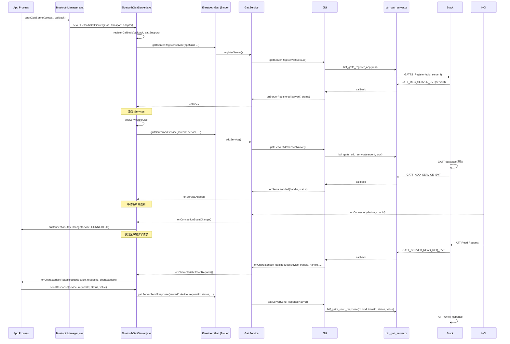
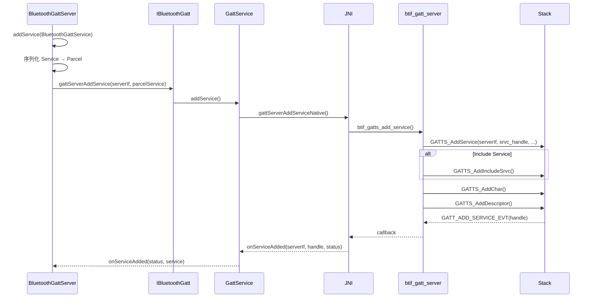

# V8 定向代码阅读报告：GATT Server

> **优先级**: 9/12 | **专题**: GATT 服务端操作深度分析
> **代码基准**: Android 16 Fluoride | **阅读日期**: 2026-05

---

## 1. 调用链全景图



---

## 2. 关键类清单

| 类 | 文件 | 职责 |
|----|------|------|
| `BluetoothGattServer` | `framework/.../BluetoothGattServer.java` | GATT 服务端代理 |
| `BluetoothGattServerCallback` | `framework/.../BluetoothGattServerCallback.java` | 服务端回调抽象类 |
| `BluetoothGattService` | `framework/.../BluetoothGattService.java` | Service 定义 |
| `BluetoothGattCharacteristic` | `framework/.../BluetoothGattCharacteristic.java` | Characteristic 定义 |
| `GattService` | `android/app/.../gatt/GattService.java` | GATT 服务端实现 |
| `btif_gatt_server.cc` | `system/btif/src/btif_gatt_server.cc` | GATT 服务端 Native |

---

## 3. GATT Server 生命周期

```
Server 注册
  │
  ├─ openGattServer() → registerCallback()
  │    → native 注册 UUID → 获取 serverIf
  │
  ├─ addService()
  │    → 构建 GATT database (Include Service → Characteristic → Descriptor)
  │    → native 添加 → onServiceAdded()
  │
  ├─ 等待客户端连接
  │    → onConnected(client, connId)
  │
  ├─ 处理读写
  │    → onCharacteristicReadRequest()
  │    → onCharacteristicWriteRequest()
  │    → sendResponse()
  │
  └─ close()
       → unregisterServer()
```

---

## 4. 服务添加流程



---

## 5. 线程模型

| 步骤 | 线程 | 说明 |
|------|------|------|
| `openGattServer()` | App 任意线程 | Binder IPC |
| GattService `registerServer()` | GattService Handler | - |
| `addService()` | GattService Handler | - |
| 客户端读写回调 | GattService Handler | `onCharacteristicReadRequest()` |
| `sendResponse()` | GattService Handler | - |
| App 回调 | App 主线程 | `Handler.post` |

---

## 6. 权限检查点

| 操作 | 权限 | 说明 |
|------|------|------|
| `openGattServer()` | `BLUETOOTH_CONNECT` | - |
| `notifyCharacteristicChanged()` | `BLUETOOTH_CONNECT` | + BLUETOOTH_PRIVILEGED |
| `sendResponse()` | 内部操作 | 无需额外权限 |

---

## 7. 可能失败点

| 失败模式 | 原因 | 表现 |
|---------|------|------|
| `registerCallback` 失败 | native 端 UUID 冲突 | `openGattServer` 返回 null |
| `addService` 失败 | GATT database 超过 512 句柄限制 | `onServiceAdded` status != 0 |
| Characteristic 属性冲突 | 同时设 Read + WriteWithoutResponse 属性 | 对端操作异常 |
| Notification 发送失败 | 客户端 CCCD 未启用 | notify 无回应 |

---

## 8. 调试建议

```bash
# GATT Server 日志
adb logcat -s bt_btif_gatt:* GattService:*

# 查看已注册的服务
adb shell dumpsys bluetooth | grep -A 30 "GattService"

# HCI log 分析
# 搜索: ATT_READ_REQ, ATT_WRITE_REQ, ATT_HANDLE_VALUE_NTF
```

---

## 9. 易踩坑清单

1. **`onServiceAdded` 等待**: `addService` 是异步的，需等待回调后再接受连接
2. **Service 类型**: 主 Service (Primary) vs 从 Service (Secondary)，对端发现行为不同
3. **Notify/Indicate 区别**: Notify 无确认，Indicate 需要客户端确认 (`onNotificationSent`)
4. **Characteristic 属性**: 需正确设置 `PROPERTY_READ/WRITE/NOTIFY/INDICATE`
5. **MTU 协商**: Server 端可通过 `onMtuChanged` 感知客户端 MTU

---

> **下一篇**: [V8_Discovery_Analysis.md](V8_Discovery_Analysis.md) — Classic Discovery 分析（优先级 10/12）

---

## 参考文件清单

| 文件 | 说明 |
|------|------|
| `framework/.../BluetoothGattServer.java` | GATT 服务端 |
| `framework/.../BluetoothGattServerCallback.java` | 服务端回调 |
| `android/app/.../gatt/GattService.java` | GATT 服务端实现 |
| `system/btif/src/btif_gatt_server.cc` | GATT Server Native |
| `system/stack/gatt/gatt_main.cc` | GATT 主控 |

---
## 相关章节

- **第12章 BLE Stack**：[12_BLE_Stack.md](12_BLE_Stack.md)
- **第6章 Profile Services**：[06_Profile_Services.md](06_Profile_Services.md)
- **第19章 Automotive Scenarios**：[19_Automotive_Scenarios.md](19_Automotive_Scenarios.md)

## 车载场景

GATT Server在车载中用于暴露车辆状态信息（如车门状态、胎压、续航）。onCharacteristicReadRequest的线程模型确保并发读取不冲突。addService的时序GATT database初始化常见启动时序问题。

> **下一步**: 阅读 [第12章 BLE Stack](12_BLE_Stack.md)
