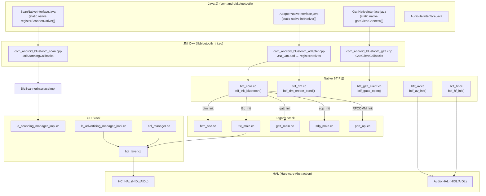
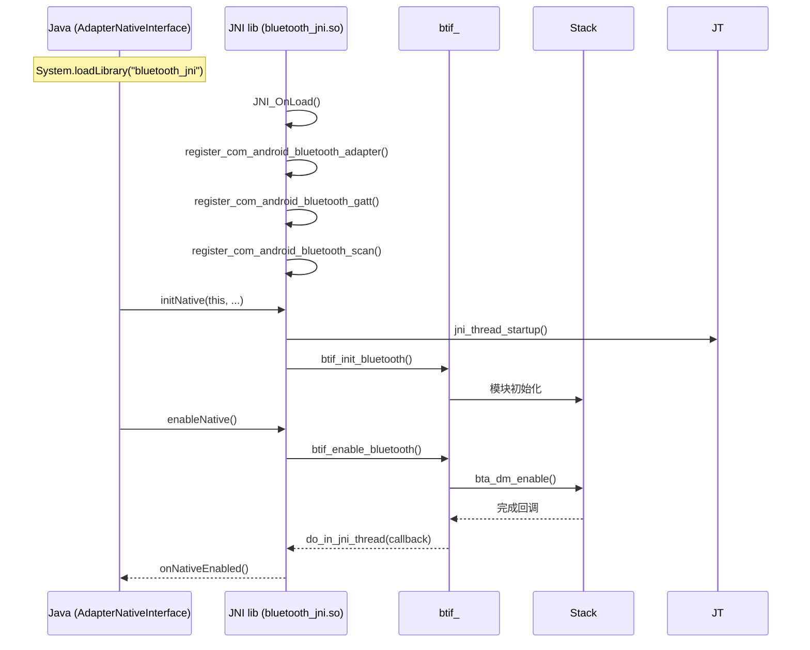
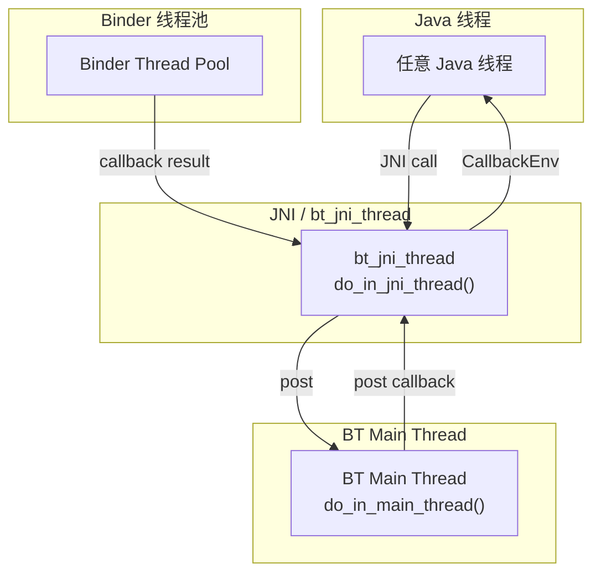
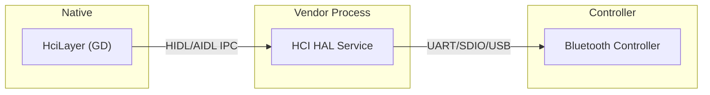

# V8 定向代码阅读报告：HAL / JNI / Native 边界

> **优先级**: 7/12 | **专题**: 跨层调用边界深度分析
> **代码基准**: Android 16 Fluoride | **阅读日期**: 2026-05

---

## 1. 调用链全景图

### 1.1 JNI 边界架构



### 1.2 JNI 注册与调用流程



---

## 2. 关键类清单

### 2.1 JNI 接口层

| Java 文件 | JNI C++ 文件 | 注册函数 |
|-----------|-------------|---------|
| `AdapterNativeInterface.java` | `com_android_bluetooth_adapter.cpp` | `register_com_android_bluetooth_adapter()` |
| `ScanNativeInterface.java` | `com_android_bluetooth_scan.cpp` | `register_com_android_bluetooth_scan()` |
| `GattNativeInterface.java` | `com_android_bluetooth_gatt.cpp` | `register_com_android_bluetooth_gatt()` |
| `BleAdvertiserNativeInterface.java` | `com_android_bluetooth_ble_adv.cpp` | `register_com_android_bluetooth_ble_adv()` |

### 2.2 JNI 回调类

| C++ 回调类 | Java 回调目标 | 说明 |
|-----------|-------------|------|
| `JniScanningCallbacks` (cpp:142) | `ScanNativeInterface.onScanResult()` | 扫描结果 |
| `GattClientCallbacks` | `GattNativeInterface.onConnected()` | GATT 连接 |
| `JniCallbacks` (Adapter) | `AdapterNativeInterface.onNativeEnabled()` | 栈状态 |
| `BleAdvertiserCallbacks` | `BleAdvertiserNativeInterface` | 广播状态 |

### 2.3 HAL 接口

| HAL | 类型 | 文件 |
|-----|------|------|
| `HCI HAL` | HIDL / AIDL | `system/hci/` |
| `Audio A2DP HAL` | HIDL / AIDL | `system/audio_hal_interface/aidl/hidl` |
| `Audio HFP HAL` | HIDL / AIDL | `system/audio_hal_interface/hfp_client_interface.cc` |
| `Audio LE Audio HAL` | AIDL | `system/audio_hal_interface/le_audio_software.cc` |

---

## 3. JNI 线程模型



### 3.1 JNI 线程管理

```cpp
// btif_jni_task.cc:40
static MessageLoopThread jni_thread("bt_jni_thread");

// btif_jni_task.cc:108-114
bt_status_t do_in_jni_thread(base::OnceClosure task) {
    // 确保在 bt_jni_thread 上执行回调
    if (!jni_thread.DoInThread(task)) {
        return BT_STATUS_FAIL;
    }
    return BT_STATUS_SUCCESS;
}
```

---

## 4. 回调链线程追踪

| 发起层 | 目标层 | 线程切换 | 同步方式 |
|--------|--------|---------|---------|
| Java → JNI | JNI C++ | 调用的 Java 线程 | 同步调用 |
| JNI → BTIF | btif_*.cc | `do_in_jni_thread` | 消息投递 |
| BTIF → Stack | Stack | `do_in_main_thread` | 消息投递 |
| Stack → BTIF | Stack 回调 | 内部 callback | 直接调用 |
| BTIF → JNI | Java | `do_in_jni_thread` → `CallbackEnv` | 消息投递 |
| JNI → Java | Java 回调 | `bt_jni_thread` → Handler | JNI CallVoidMethod |

---

## 5. HAL 边界

### 5.1 HCI HAL 架构



---

## 6. 常见失败点

| 边界 | 失败模式 | 原因 |
|------|---------|------|
| JNI | `UnsatisfiedLinkError` | `bluetooth_jni.so` 未找到 |
| JNI | JNI crash | native 代码访问非法内存 |
| JNI | `CallbackEnv` 获取失败 | Thread 未 attach JVM |
| HAL | `HAL service not found` | 设备无蓝牙 HAL |
| HAL | HAL crash | Vendor 实现异常 |
| Binder | `DeadObjectException` | Profile 进程死亡 |

---

## 7. 调试建议

```bash
# JNI 日志
adb logcat -s bt_btif_core:* bt_btif_jni:*

# 查看 JNI 库是否加载
adb logcat | grep "System.loadLibrary"

# HCI HAL 日志
adb logcat -s bt_shim_hci:*

# 音频 HAL 日志
adb logcat -s bt_audio_hal:*
```

---

> **下一篇**: [V8_Permission_Analysis.md](V8_Permission_Analysis.md) — Permission/AppOps 分析（优先级 8/12）

---

## 参考文件清单

| 文件 | 说明 |
|------|------|
| `android/app/jni/com_android_bluetooth_adapter.cpp` | 适配器 JNI |
| `android/app/jni/com_android_bluetooth_scan.cpp` | 扫描 JNI (1039 行) |
| `android/app/jni/com_android_bluetooth_gatt.cpp` | GATT JNI |
| `system/btif/src/btif_jni_task.cc` (133 行) | JNI 线程管理 |
| `system/btif/src/btif_gatt_client.cc` | GATT 客户端 Native |
| `system/btif/src/btif_dm.cc` (4423 行) | 设备管理 Native |
| `system/audio_hal_interface/` | 音频 HAL 接口 |
| `system/audio_hal_interface/hfp_client_interface.cc` | HFP 音频 HAL |
| `system/audio_hal_interface/a2dp_encoding.cc` | A2DP 编码 |

---
## 相关章节

- **第7章 JNI Bridge**：[07_JNI_Bridge.md](07_JNI_Bridge.md)
- **第8章 BTIF Layer**：[08_BTIF_Layer.md](08_BTIF_Layer.md)
- **第15章 HCI HAL**：[15_HCI_HAL.md](15_HCI_HAL.md)
- **第1章 Architecture Overview**：[01_Architecture_Overview.md](01_Architecture_Overview.md)

## 车载场景

JNI/HAL边界是车载蓝牙最常出问题的区域。UnsatisfiedLinkError和HAL service crash在车厂集成阶段频发。bt_jni_thread的线程模型和CallbackEnv模式是理解Java-Native通信的关键。

> **下一步**: 阅读 [第7章 JNI Bridge](07_JNI_Bridge.md)
