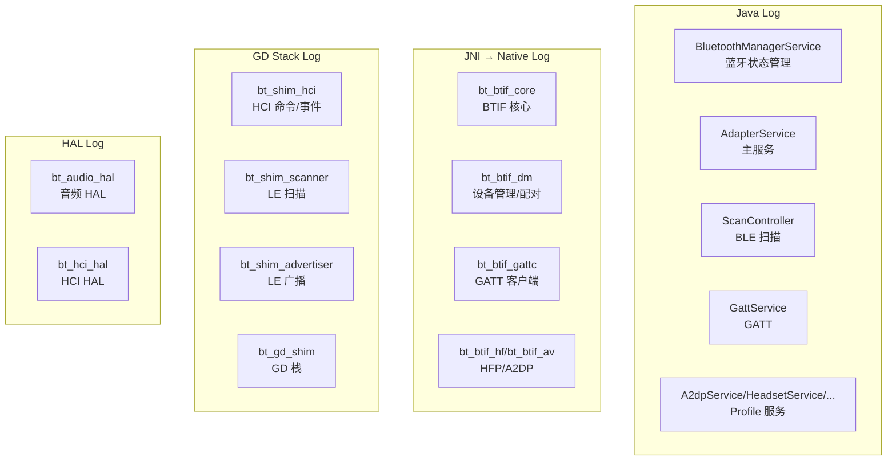
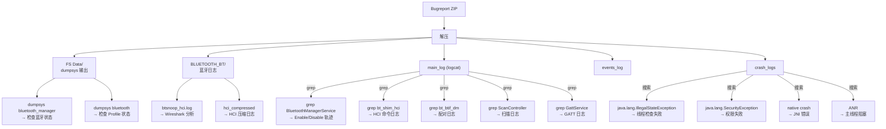

# V8 定向代码阅读报告：Log / Bugreport 分析方法

> **优先级**: 12/12 | **专题**: 日志分析和 Bugreport 解读
> **代码基准**: Android 16 Fluoride | **阅读日期**: 2026-05

---

## 1. 日志分层视图



---

## 2. 日志 Tag 速查表

### 2.1 Java/Kotlin

| Tag | 模块 | 关注点 |
|-----|------|--------|
| `BluetoothManagerService` | 系统服务 | enable/disable 状态变化 |
| `BluetoothServiceBinder` | Binder 接口 | API 调用请求 |
| `ScanController` | BLE 扫描 | 注册/结果/频率限制 |
| `GattService` | GATT | 连接/服务发现 |
| `BluetoothGatt` | App 侧 GATT | 客户端操作 |
| `BluetoothLeScanner` | App 侧扫描 | start/stop |
| `A2dpService`/`HeadsetService` | 音频/通话 | 连接状态/SCO |
| `AdapterService` | 主服务 | init/bringUp |
| `LeAudioService` | LE Audio | 配置/流状态 |
| `PermissionChecker` | 权限 | 权限检查结果 |

### 2.2 C++

| LOG_TAG | 模块 | 关注点 |
|---------|------|--------|
| `bt_btif_core` | BTIF 核心 | 初始化/启用 |
| `bt_btif_dm` | 设备管理 | 配对/发现/IO cap |
| `bt_btif_gattc` | GATT 客户端 | 连接/读写 |
| `bt_btif_gatt` | GATT 接口 | 注册 |
| `bt_btif_hf` | HFP | AT 命令/SCO |
| `bt_shim_scanner` | LE 扫描 (GD) | HCI 扫描命令 |
| `bt_shim_hci` | HCI 层 | HCI 命令/事件 |
| `bt_shim_advertiser` | LE 广播 (GD) | 广播配置 |
| `bt_gd_shim` | GD 栈 | 栈生命周期 |
| `bt_btm_sec` | 安全引擎 | Link key/SMP |
| `bt_btif_av` | A2DP | 音频流/编码 |

---

## 3. Bugreport 分析路径



---

## 4. HCI Snoop Log 分析

### 4.1 关键 HCI 事件

| HCI 事件 | 含义 | 常见问题 |
|---------|------|---------|
| `HCI_Inquiry` | 启动发现 | 发现时间过长 |
| `HCI_Inquiry_Result` | 发现设备 | RSSI 过弱 |
| `HCI_Create_Connection` | 发起经典连接 | 连接超时 |
| `LE_Create_Connection` | 发起 LE 连接 | 白名单问题 |
| `LE_Connection_Complete` | LE 连接建立 | 失败看 status |
| `HCI_Disconnection_Complete` | 断开 | 断开原因码 |
| `LE_Advertising_Report` | LE 扫描结果 | 扫描结果频率 |
| `LE_Set_Scan_Enable` | 开启/关闭扫描 | 扫描未开启 |
| `SMP_Pairing_Request` | SMP 配对请求 | 配对失败 |
| `SMP_Pairing_Failed` | SMP 配对失败 | 原因码 |

### 4.2 Wireshark 过滤

```
# 过滤特定设备
btbdaa:bb:cc:dd:ee:ff

# 过滤 ATT 操作
att.opcode == 0x02  # Read Request
att.opcode == 0x12  # Write Request
att.opcode == 0x1B  # Handle Value Notification

# 过滤 HCI 命令
hci_cmd == 0x2005   # LE Set Scan Enable
hci_cmd == 0x200D   # LE Create Connection

# 过滤 HCI 事件
hci_event == 0x0F   # LE Meta Event
hci_event == 0x05   # Disconnection Complete
```

---

## 5. 常见问题排查流程

### 5.1 蓝牙打不开

```text
1. dumpsys bluetooth_manager → State?
2. logcat -s BluetoothManagerService → handleEnable() 调用?
3. logcat -s bt_btif_core → initNative() 成功?
4. logcat -s bt_shim_hci → HCI_Reset 和 HCI_Command_Complete?
5. logcat -s bt_gd_shim → GD Stack 启动?
```

### 5.2 BLE 扫描无结果

```text
1. dumpsys bluetooth → ScanController 状态?
2. logcat -s ScanController → hasScanResultPermission?
3. logcat -s bt_shim_scanner → LE_Set_Scan_Enable 发出?
4. HCI log → LE_Advertising_Report 事件?
5. logcat -s BluetoothLeScanner → onScannerRegistered?
```

### 5.3 配对失败

```text
1. logcat -s bt_btif_dm → createBond 调用?
2. logcat -s bt_btm_sec → btm_sec_execute_procedure?
3. HCI log → SMP_Pairing_Failed 原因码?
4. dumpsys bluetooth → BondedDevices 列表?
5. logcat -s BluetoothDevice → onBondStateChanged?
```

---

## 6. 启用详细日志

```bash
# 启用所有蓝牙详细日志
adb shell setprop log.tag.bt_btif VERBOSE
adb shell setprop log.tag.bt_shim VERBOSE

# 特定模块
adb shell setprop log.tag.bt_btif_gattc VERBOSE
adb shell setprop log.tag.bt_shim_scanner VERBOSE
adb shell setprop log.tag.bt_btif_dm VERBOSE
adb shell setprop log.tag.bt_btm_sec VERBOSE

# 启用 HCI Snoop
adb shell setprop persist.bluetooth.btsnoopenable true
adb shell setprop persist.bluetooth.btsnooppath /data/misc/bluetooth/logs
adb shell setprop persist.bluetooth.btsnooplevel 2  # 0=off,1=filtered,2=full
```

---

## 参考文件清单

| 文件 | 说明 |
|------|------|
| `framework/.../BluetoothAdapter.java` | TAG, API |
| `service/.../BluetoothManagerService.java` | TAG, enable/disable |
| `android/app/.../le_scan/ScanController.java` | TAG, 扫描 |
| `system/btif/src/btif_dm.cc` | LOG_TAG="bt_btif_dm" |
| `system/btif/src/stack_manager.cc` | LOG_TAG="bt_stack_manager" |
| `system/main/shim/le_scanning_manager.cc` | LOG_TAG="bt_shim_scanner" |
| `system/main/shim/stack.cc` | LOG_TAG="bt_gd_shim" |
| `system/stack/btm/btm_sec.cc` | LOG_TAG="bt_btm_sec" |

---
## 相关章节

- **第2章 Environment Setup**：[02_Environment_Setup.md](02_Environment_Setup.md)
- **第12章 BLE Stack**：[12_BLE_Stack.md](12_BLE_Stack.md)
- **第11章 Classic Profiles**：[11_Classic_Profiles.md](11_Classic_Profiles.md)
- **第18章 Security Architecture**：[18_Security_Architecture.md](18_Security_Architecture.md)

## 车载场景

日志分析是车载蓝牙问题排查的基石。模块化LOG_TAG设计允许精准过滤特定组件日志。HCI Snoop Log是定位底层协议问题的最终手段。Bugreport中的dumpsys+logcat+eventlog三位一体分析流程适用于所有车载蓝牙疑难问题。

> **下一步**: 阅读 [第2章 Environment Setup](02_Environment_Setup.md)
