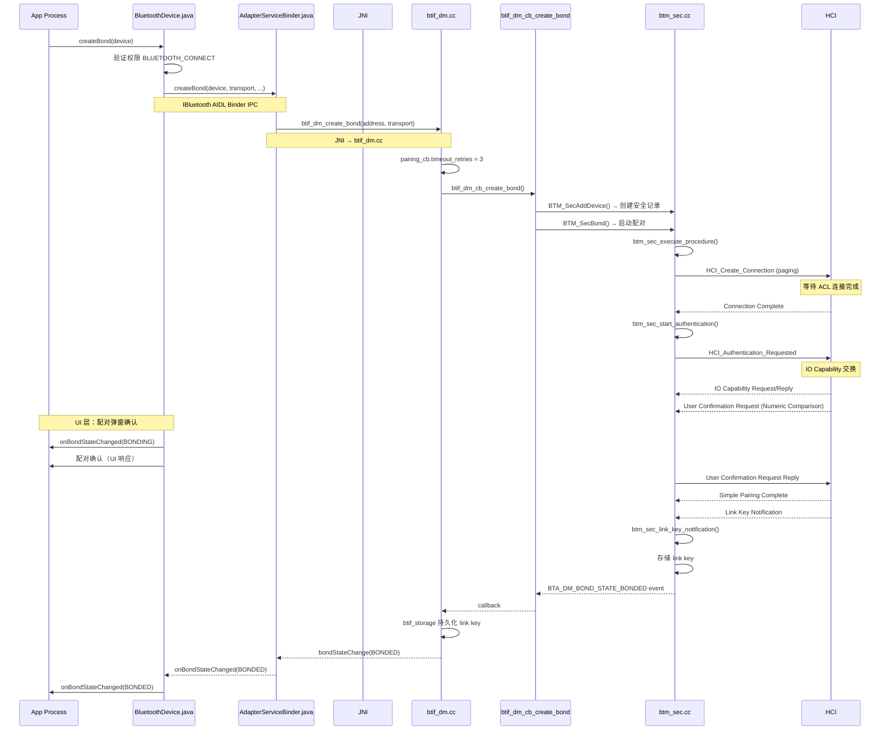
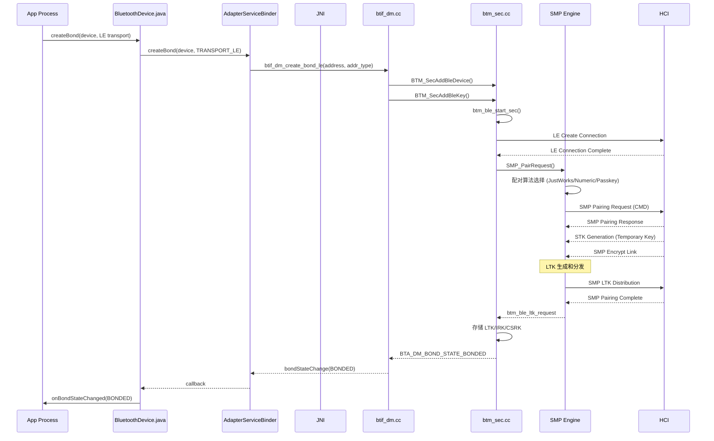

# V8 定向代码阅读报告：Pairing / Bonding

> **优先级**: 3/12 | **专题**: 配对/绑定流程深度分析
> **代码基准**: Android 16 Fluoride | **阅读日期**: 2026-05

---

## 1. 调用链全景图

### 1.1 Classic BR/EDR 配对



### 1.2 BLE 配对（SMP）



---

## 2. 关键类清单

### 2.1 Framework 层

| 类 | 文件 | 行号 | 职责 |
|----|------|------|------|
| `BluetoothDevice` | `framework/.../BluetoothDevice.java` | 4141 | `createBond()` App 入口 |
| `BluetoothAdapter` | `framework/.../BluetoothAdapter.java` | 5533 | `getBondedDevices()`, 配对状态广播 |

### 2.2 Service 层

| 类 | 文件 | 行号 | 职责 |
|----|------|------|------|
| `AdapterServiceBinder` | `android/app/.../btservice/AdapterServiceBinder.java` | 2145 | `createBond()` Binder 实现 |
| `AdapterService` | `android/app/.../btservice/AdapterService.java` | 5030 | 配对状态管理 |

### 2.3 Native 层

| 类 | 文件 | 行号 | 职责 |
|----|------|------|------|
| `btif_dm.cc` | `system/btif/src/btif_dm.cc` | 2774 | `btif_dm_create_bond()` 入口 |
| `btif_dm.cc` | `system/btif/src/btif_dm.cc` | 2793 | `btif_dm_create_bond_le()` LE 配对 |
| `btif_dm.cc` | `system/btif/src/btif_dm.cc` | 2816 | `btif_dm_create_bond_out_of_band()` OOB |
| `btif_storage.cc` | `system/btif/src/btif_storage.cc` | - | Link key 持久化 |
| `btm_sec.cc` | `system/stack/btm/btm_sec.cc` | 5280 | 安全引擎核心 |
| `btm_ble_sec.cc` | `system/stack/btm/btm_ble_sec.cc` | - | BLE 安全 (SMP) |
| `btm_sec.h` | `system/stack/include/btm_sec.h` | - | 安全 API 定义 |

---

## 3. 状态机详解

### 3.1 BTM 安全状态机

```mermaid
graph TD
    IDLE["BTM_SEC_STATE_IDLE"] -->|BTM_SecBond()| BONDING["BTM_SEC_STATE_BONDING"]
    BONDING -->|ACL 连接完成| AUTHING["BTM_SEC_STATE_AUTHENTICATING"]
    AUTHING -->|IO Cap 交换| WAIT_IO["BTM_SEC_STATE_GETTING_IO_CAPS"]
    WAIT_IO -->|IO Cap 响应| ENCRYPT["BTM_SEC_STATE_ENCRYPTING"]
    ENCRYPT -->|Link Key 生成| KEY_EXCH["BTM_SEC_STATE_KEY_EXCHANGING"]
    KEY_EXCH -->|Link Key 通知| BONDED["BTM_SEC_STATE_BONDED"]
    BONDING -->|超时/失败| IDLE
    
    style BONDED fill:#90EE90
    style IDLE fill:#FFB5B5
```

### 3.2 配对算法选择

```
根据双方 IO Capability + OOB + MITM 需求
┌──────────────┬──────────────┬──────────────┬──────────────┐
│ Initiator  → │  DisplayOnly │ DisplayYesNo │ KeyboardOnly │
│ Responder  ↓ │              │              │              │
├──────────────┼──────────────┼──────────────┼──────────────┤
│ NoInputNoOutput  │ Just Works │ Just Works  │ Just Works   │
│ DisplayOnly      │ Just Works │ Numeric Cmp │ Passkey Entry│
│ DisplayYesNo     │ Just Works │ Numeric Cmp │ Passkey Entry│
│ KeyboardOnly     │ Passkey Ent│ Passkey Ent │ Passkey Entry│
│ KeyboardDisplay  │ Passkey Ent│ Numeric Cmp │ Passkey Entry│
└──────────────┴──────────────┴──────────────┴──────────────┘
```

### 3.3 BLE SMP 状态

| 状态 | 说明 |
|------|------|
| `SMP_STATE_IDLE` | 初始状态 |
| `SMP_STATE_PAIRING_SETUP` | 配对参数协商中 |
| `SMP_STATE_WAIT_FOR_SEC_REQ` | 等待安全请求 |
| `SMP_STATE_WAIT_FOR_PAIR_RSP` | 等待配对响应 |
| `SMP_STATE_ENCRYPTION_PENDING` | 加密进行中 |
| `SMP_STATE_BONDING_PENDING` | 绑定进行中 |

---

## 4. 线程模型

| 步骤 | 线程 | 说明 |
|------|------|------|
| `createBond()` 调用 | App 任意线程 | Binder IPC 调用 |
| `AdapterServiceBinder` | Binder 线程池 | 权限检查 |
| `btif_dm_create_bond()` | BT Main Thread | JNI 回调线程 |
| `btm_sec_execute_procedure()` | BTU Task | 安全状态机运行 |
| HCI 命令收发 | HCI 线程 | 硬件通信 |
| 配对弹窗 UI | App 主线程 | Activity 上下文 |
| 配对状态回调 | App 主线程 | `Handler.post` |

---

## 5. 权限检查点

| 检查点 | 位置 | 权限 |
|--------|------|------|
| `createBond()` 入口 | `BluetoothDevice.java` | `BLUETOOTH_CONNECT` |
| Binder 调用 | `AdapterServiceBinder.java` | `BLUETOOTH_CONNECT` |
| 取消配对 | `BluetoothDevice.java` | `BLUETOOTH_PRIVILEGED` |
| 获取配对设备列表 | `BluetoothAdapter.getBondedDevices()` | `BLUETOOTH_CONNECT` |
| BLE 配对扫描 | `ScanController` | `BLUETOOTH_SCAN` |

---

## 6. Binder 边界

```
App 进程                        com.android.bluetooth 进程
─────                          ────────────────────────
BluetoothDevice                 AdapterServiceBinder
  │                                  │
  │ createBond()                     │
  │ ─────────────────────────────→  │ → btif_dm_create_bond()
  │                                  │ (JNI → Native)
  │ ← onBondStateChanged(BONDING)   │
  │ ← onBondStateChanged(BONDED)    │
  │    (BroadcastReceiver)           │
```

---

## 7. 可能失败点

| 失败码 | 含义 | 原因 |
|--------|------|------|
| `BOND_RESULT_AUTH_FAILURE` (1) | 配对认证失败 | PIN 码错误/SSP 拒绝 |
| `BOND_RESULT_AUTH_REJ_BY_REMOTE` (2) | 被对端拒绝 | 对端取消配对 |
| `BOND_RESULT_REMOTE_DEVICE_DOWN` (3) | 设备断开 | 连接超时 |
| `BOND_RESULT_AUTH_FAILURE_NO_PAIRING` (4) | 配置禁止配对 | 对端 policy 限制 |
| `BOND_RESULT_NON_AUTH` (5) | 非认证配对 | Just Works 无 MITM |
| SMP 超时 (SMP_TIMEOUT) | BLE 配对超时 | 30 秒 SMP 超时 |

---

## 8. 调试建议

```bash
# 配对详情日志
adb logcat -s bt_btif_dm:* bt_btm_sec:* bt_shim_hci:*

# 检查已配对的设备
adb shell dumpsys bluetooth | grep -A 20 "BondedDevices"

# 检查存储的 link keys (需要 root)
adb shell sqlite3 /data/misc/bluetooth/bt_config.conf

# HCI log 分析配对事件
# 搜索: HCI_IO_Capability_Request, HCI_Simple_Pairing_Complete
#       LE_Security_Request, SMP_Pairing_Request

# 清除配对信息
adb shell am broadcast -a android.bluetooth.device.action.PAIRING_REQUEST
```

---

## 9. 易踩坑清单

1. **配对弹窗不可见**: `createBond()` 需要 Activity 上下文，后台 Service 调用可能弹窗不显示
2. **多设备配对冲突**: 同时发起多个 `createBond()` 会失败，一次只能配对一台设备
3. **BLE LTK 丢失**: 系统 OTA 或清除数据后 LTK 丢失，需要重新配对
4. **SMP 超时**: BLE 配对需在 30 秒内完成，Link Layer 不稳定会导致超时
5. **跨传输配对**: 同一设备 BR/EDR + BLE 可能有两种 link key，需确保传输一致性
6. **Just Works vs. MITM**: Just Works 无中间人防护，安全性较低
7. **Link key 存储失败**: `btif_storage.cc` 写入失败导致每次重连都需要重新配对

---

> **下一篇**: [V8_GATT_Client_Analysis.md](V8_GATT_Client_Analysis.md) — GATT Client 深度分析（优先级 4/12）

---

## 参考文件清单

| 文件 | 行数 | 关键函数 |
|------|------|---------|
| `framework/.../BluetoothDevice.java` | 4141 | `createBond()` L2050 |
| `android/app/.../AdapterServiceBinder.java` | 2145 | `createBond()` L388 |
| `system/btif/src/btif_dm.cc` | 4423 | `btif_dm_create_bond()` L2774 |
| `system/stack/btm/btm_sec.cc` | 5280 | 安全引擎 |
| `system/stack/btm/btm_ble_sec.cc` | - | BLE 安全 |
| `system/btif/src/btif_storage.cc` | - | Link key 持久化 |

---
## 相关章节

- **第18章 Security Architecture**：[18_Security_Architecture.md](18_Security_Architecture.md)
- **第5章 Service Layer**：[05_Service_Layer.md](05_Service_Layer.md)
- **第10章 Classic Stack Core**：[10_Classic_Stack_Core.md](10_Classic_Stack_Core.md)
- **第19章 Automotive Scenarios**：[19_Automotive_Scenarios.md](19_Automotive_Scenarios.md)

## 车载场景

配对是车载蓝牙最频繁的操作之一。ssp配对失败（如PinCode不匹配、IO Capability不兼容）在车机售后问题中排名靠前。车载环境下Driver Distraction法规要求配对交互必须在3秒内完成。

> **下一步**: 阅读 [第18章 Security Architecture](18_Security_Architecture.md)
