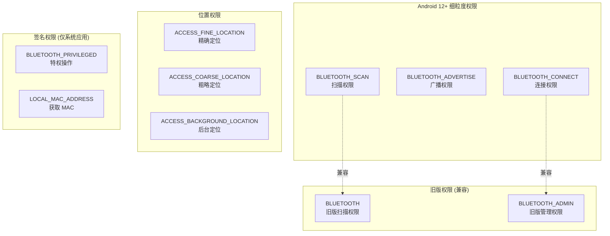
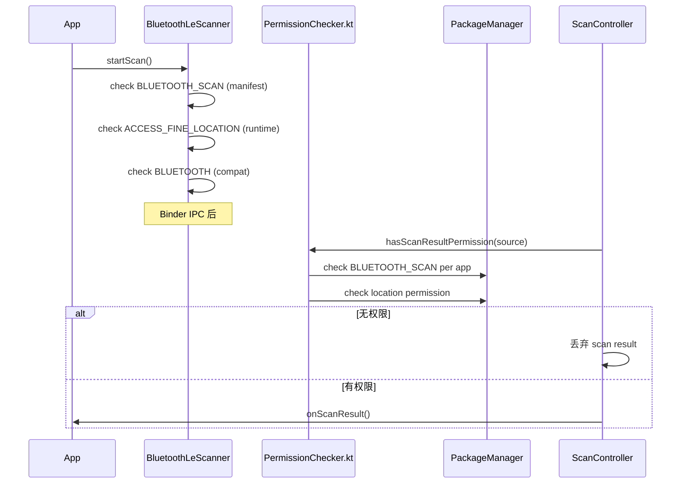

# V8 定向代码阅读报告：Permission / AppOps

> **优先级**: 8/12 | **专题**: 蓝牙权限和 AppOps 检查体系分析
> **代码基准**: Android 16 Fluoride | **阅读日期**: 2026-05

---

## 1. 权限体系架构



---

## 2. 权限检查路径

### 2.1 扫描权限链



### 2.2 连接权限链

| API | 权限 | 检查位置 |
|-----|------|---------|
| `connectGatt()` | `BLUETOOTH_CONNECT` | `BluetoothDevice.java` |
| `createBond()` | `BLUETOOTH_CONNECT` | `BluetoothDevice.java` |
| `getConnectedDevices()` | `BLUETOOTH_CONNECT` | `BluetoothManager.java` |
| `getBondedDevices()` | `BLUETOOTH_CONNECT` | `BluetoothAdapter.java` |

---

## 3. 关键检查点

### 3.1 PermissionChecker.kt

```kotlin
// service/src/PermissionChecker.kt
class PermissionChecker {
    fun checkScanResultPermission(source: AttributionSource): Boolean
    fun checkConnectPermission(source: AttributionSource): Boolean
    fun checkAdvertisePermission(source: AttributionSource): Boolean
}
```

### 3.2 AppOps 检查

```kotlin
// service/src/BleAppManager.kt
// 检查 App 是否有 BLE 操作权限
fun checkBleAppAllowed(packageName: String): Boolean {
    // 检查 AppOpsManager.OP_BLUETOOTH_SCAN
}
```

---

## 4. 各 API 权限需求

| API | Android 12+ | Android 10-11 | Android 9- |
|-----|-------------|---------------|------------|
| `startScan()` | `BLUETOOTH_SCAN` + `ACCESS_FINE_LOCATION` | `ACCESS_FINE_LOCATION` | `BLUETOOTH` + `ACCESS_FINE_LOCATION` |
| `startAdvertising()` | `BLUETOOTH_ADVERTISE` | `BLUETOOTH` | `BLUETOOTH` |
| `connectGatt()` | `BLUETOOTH_CONNECT` | `BLUETOOTH_ADMIN` | `BLUETOOTH_ADMIN` |
| `createBond()` | `BLUETOOTH_CONNECT` | `BLUETOOTH_ADMIN` | `BLUETOOTH_ADMIN` |
| `listenUsingRfcomm()` | `BLUETOOTH_CONNECT` | `BLUETOOTH` | `BLUETOOTH` |
| `enable()` | `BLUETOOTH_CONNECT` | `BLUETOOTH_ADMIN` | `BLUETOOTH_ADMIN` |
| `getProfileProxy()` | `BLUETOOTH_CONNECT` | `BLUETOOTH` | `BLUETOOTH` |
| 获取 MAC 地址 | `LOCAL_MAC_ADDRESS` | `LOCAL_MAC_ADDRESS` | `BLUETOOTH` |

---

## 5. 常见权限失败

| 症状 | 原因 | 日志特征 |
|------|------|---------|
| `SecurityException: Need BLUETOOTH_CONNECT` | Android 12+ 未添加 `BLUETOOTH_CONNECT` | `AdapterServiceBinder.java` |
| 扫描无结果 | 缺少 `ACCESS_FINE_LOCATION` 运行时权限 | `ScanController.hasScanResultPermission()` |
| GATT 操作失败 | 配对后未加密 | `GATT_INSUFFICIENT_AUTHENTICATION` |
| API 返回 false | AppOps 限制 | `PermissionChecker.kt` |
| 后台扫描不返回 | 缺少 `ACCESS_BACKGROUND_LOCATION` | Android 10+ 要求 |

---

> **下一篇**: [V8_GATT_Server_Analysis.md](V8_GATT_Server_Analysis.md) — GATT Server 分析（优先级 9/12）

---

## 参考文件清单

| 文件 | 说明 |
|------|------|
| `service/src/PermissionChecker.kt` | 权限检查核心 |
| `framework/.../annotations/*.java` | 权限注解定义 |
| `framework/.../BluetoothAdapter.java` | API 权限标注 |
| `service/src/BleAppManager.kt` | BLE App 管理 |
| `android/app/.../le_scan/ScanController.java` | 扫描权限检查 |

---
## 相关章节

- **第4章 Public API Framework**：[04_Public_API_Framework.md](04_Public_API_Framework.md)
- **第18章 Security Architecture**：[18_Security_Architecture.md](18_Security_Architecture.md)
- **第19章 Automotive Scenarios**：[19_Automotive_Scenarios.md](19_Automotive_Scenarios.md)

## 车载场景

Android 12+的细粒度权限模型直接影响车载App开发。BLUETOOTH_SCAN/CONNECT/ADVERTISE三权分离后，未声明必要权限是App被Google Play拒绝的首要蓝牙相关原因。车载系统App可使用BLUETOOTH_PRIVILEGED绕过部分限制。

> **下一步**: 阅读 [第4章 Public API Framework](04_Public_API_Framework.md)
