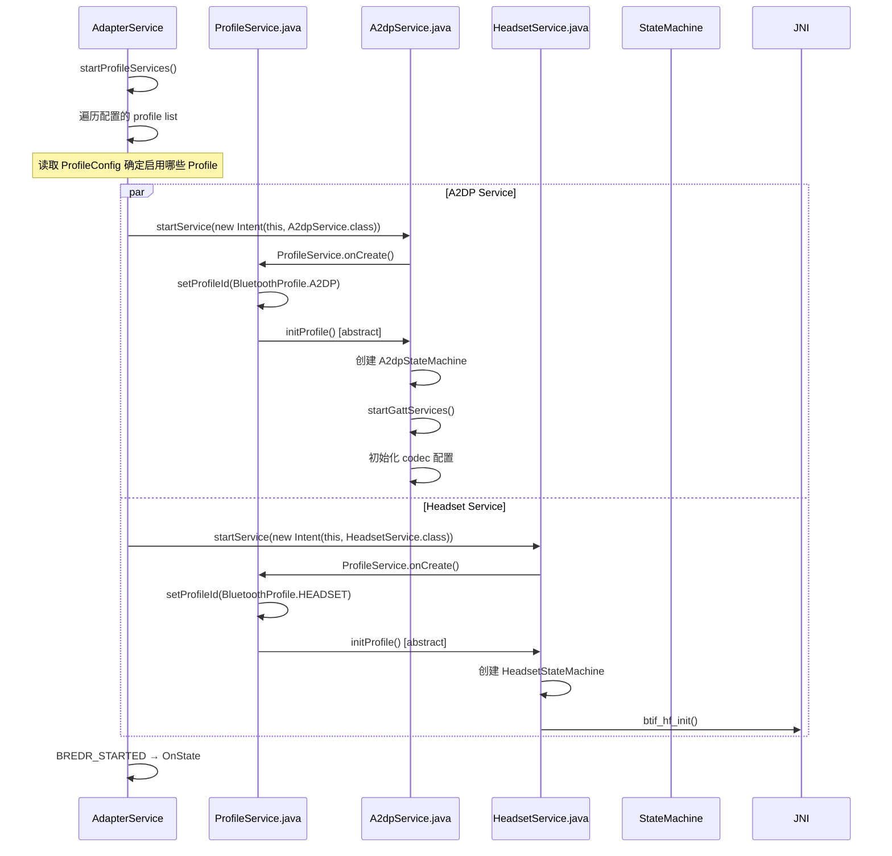
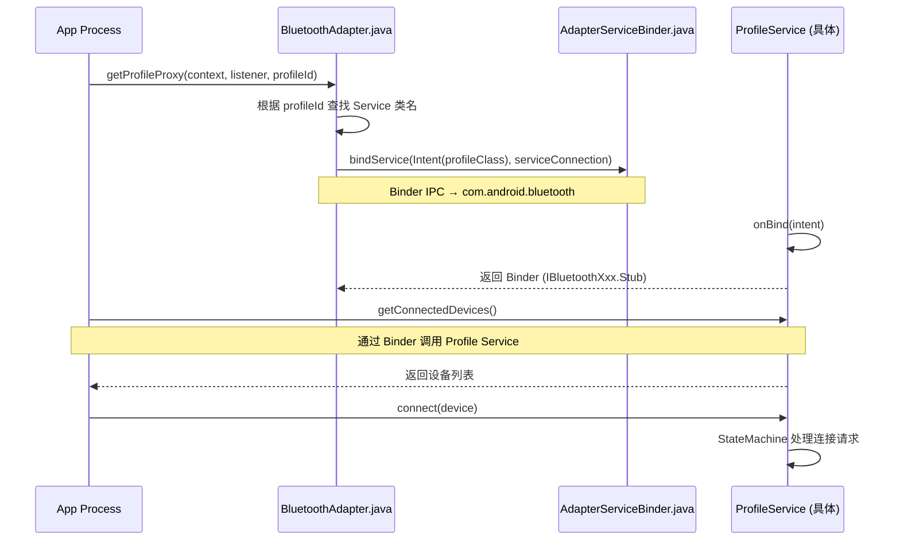
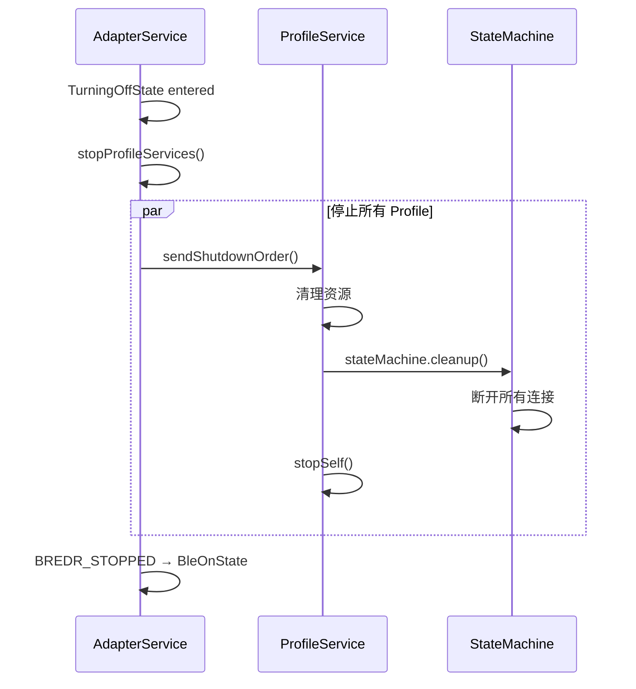

# V8 定向代码阅读报告：Profile Service 生命周期

> **优先级**: 6/12 | **专题**: Profile 服务生命周期深度分析
> **代码基准**: Android 16 Fluoride | **阅读日期**: 2026-05

---

## 1. 调用链全景图

### 1.1 Profile 服务创建



### 1.2 Profile 服务绑定



### 1.3 Profile 服务销毁



---

## 2. 关键类清单

### 2.1 Profile 基础框架

| 类 | 文件 | 行号 | 职责 |
|----|------|------|------|
| `ProfileService` | `android/app/.../btservice/ProfileService.java` | - | Profile Service 基类 |
| `ConnectableProfile` | `android/app/.../profile/ConnectableProfile.java` | - | 可连接 Profile 接口 |
| `AdapterService` | `android/app/.../btservice/AdapterService.java` | 5030 | 主 Service |
| `BluetoothProfile` | `framework/.../BluetoothProfile.java` | - | Profile 常量定义 |
| `BluetoothAdapter` | `framework/.../BluetoothAdapter.java` | 5533 | `getProfileProxy()` 入口 |

### 2.2 具体 Profile 服务

| Profile | 服务类 | StateMachine | 关键行号 |
|---------|--------|-------------|---------|
| A2DP Sink | `A2dpService.java` | `A2dpStateMachine.java` | - |
| A2DP Source | `A2dpSinkService.java` | `A2dpSinkStateMachine.java` | - |
| HFP | `HeadsetService.java` | `HeadsetStateMachine.java` | 2592 (dump) |
| HFP Client | `HeadsetClientService.java` | `HeadsetClientStateMachine.java` | 951 (dump) |
| HID Host | `HidHostService.java` | - | 1113 (dump) |
| PAN | `PanService.java` | - | 534 (dump) |
| MAP | `BluetoothMapService.java` | - | 1107 (dump) |
| MAP Client | `MapClientService.java` | `MceStateMachine.java` | 360 (dump) |
| PBAP | `BluetoothPbapService.java` | `PbapStateMachine.java` | - |
| PBAP Client | `PbapClientService.java` | `PbapClientStateMachine.java` | 293 (dump) |
| LE Audio | `LeAudioService.java` | `LeAudioStateMachine.java` | 5712 (dump) |
| Hearing Aid | `BluetoothHearingAid.java` | - | - |
| SAP | `SapService.java` | - | - |
| Battery | `BatteryService.java` | `BatteryStateMachine.java` | - |
| Volume Control | `VolumeControlService.java` | `VolumeControlStateMachine.java` | 97 (thread) |
| HAP | `BluetoothHapClient.java` | - | - |
| CSIP | `BluetoothCsipSetCoordinator.java` | - | - |
| BASS | `BassClientService.java` | `BassClientStateMachine.java` | - |
| MCP | `McpService.java` | `MediaControlProfile.java` | 75 (dump) |

### 2.3 StateMachine 框架

| 类 | 文件 | 说明 |
|----|------|------|
| `StateMachine` | `android/app/.../btservice/StateMachine.java` | 内部状态机框架 |
| 各 Profile StateMachine | 各 Profile 目录 | 继承 StateMachine |

---

## 3. Profile 生命周期

### 3.1 ProfileService 生命周期

```
ProfileService.java
  │
  ├─ onCreate()
  │    ├─ setProfileId(id) → 关联 BluetoothProfile 常量
  │    ├─ initProfile()    → 子类具体实现 (抽象方法)
  │    │    ├─ 创建 StateMachine → HandlerThread(Looper)
  │    │    ├─ 初始化 native 层 (btif_xxx_init)
  │    │    └─ 注册 GATT 服务 (BLE Profiles)
  │    └─ 状态 = STARTED
  │
  ├─ onBind(intent)
  │    └─ 返回 IBluetoothXxx.Stub Binder
  │
  ├─ onDestroy()
  │    ├─ cleanup() → 断开所有连接
  │    ├─ StateMachine → cleanup → quit
  │    └─ 状态 = STOPPED
  │
  └─ dump(StringBuilder sb)
       └─ 输出 Profile 状态 → dumpsys bluetooth
```

### 3.2 连接生命周期

```
断开 → 连接中 → 已连接 → 断开中 → 断开
STATE_DISCONNECTED → STATE_CONNECTING → STATE_CONNECTED → STATE_DISCONNECTING → STATE_DISCONNECTED
```

---

## 4. 线程模型

| Profile | 状态机线程 | 说明 |
|---------|-----------|------|
| A2DP | `A2dpStateMachine` Handler | 独立线程 |
| HFP | `HeadsetStateMachine` Handler | 独立线程 |
| HFP Client | `HeadsetClientStateMachine` Handler | 独立线程 |
| LE Audio | `LeAudioStateMachine` Handler | 独立线程 |
| Volume Control | `VolumeControlService.StateMachines` | HandlerThread |
| 其他 | 各 StateMachine 的 Handler | 独立或共享 Looper |

---

## 5. 权限检查点

| Profile | 连接权限 | 扫描权限 | 备注 |
|---------|---------|---------|------|
| A2DP | `BLUETOOTH_CONNECT` | - | - |
| HFP | `BLUETOOTH_CONNECT` | - | + `MODIFY_PHONE_STATE` |
| HID | `BLUETOOTH_CONNECT` | - | - |
| MAP | `BLUETOOTH_CONNECT` | - | 需短信权限 |
| PBAP | `BLUETOOTH_CONNECT` | - | 需通讯录权限 |
| PAN | `BLUETOOTH_CONNECT` | - | + `TETHER_PRIVILEGED` |

---

## 6. Binder 边界

每个 Profile Service 都有自己的 AIDL 接口：

```
App 进程                        com.android.bluetooth 进程
─────                          ────────────────────────
BluetoothA2dp                   A2dpService
  │                                  │
  │ IBluetoothA2dp.aidl              │
  │ connect(), disconnect()          │
  │ getConnectedDevices()            │
  │ setActiveDevice()                │
  ──────────────────────────────→  │
  
BluetoothHeadset                 HeadsetService
  │ IBluetoothHeadset.aidl           │
  │ connect(), disconnect()          │
  │ startVoiceRecognition()          │
  ──────────────────────────────→  │
```

---

## 7. 可能失败点

| 失败模式 | 原因 | 表现 |
|---------|------|------|
| Profile 未绑定 | `getProfileProxy` 未完成 | serviceConnection 未回调 |
| StateMachine 崩溃 | 未捕获异常 | Profile 服务重启 |
| native 初始化失败 | btif_xxx_init 失败 | Profile 不可用 |
| 连接超时 | 30 秒无响应 | STATE_DISCONNECTED |
| Binder 死亡 | 进程被杀 | Proxy 变为空 |

---

## 8. 调试建议

```bash
# 查看所有 Profile 状态
adb shell dumpsys bluetooth

# 查看特定 Profile
adb shell dumpsys bluetooth | grep -A 30 "A2dpService"
adb shell dumpsys bluetooth | grep -A 30 "HeadsetService"
adb shell dumpsys bluetooth | grep -A 30 "LeAudioService"

# Profile 连接日志
adb logcat -s bt_btif_av:* bt_btif_hf:*

# 查看 A2DP codec 信息
adb shell dumpsys bluetooth | grep -A 20 "Codec"
```

---

## 9. 易踩坑清单

1. **`getProfileProxy()` 异步**: 绑定 Profile 是异步的，不能调用后立即 `getConnectedDevices()`
2. **Profile 间依赖**: HFP 和 A2DP 共享音频路径，`setActiveDevice()` 可能相互影响
3. **StateMachine 线程安全**: StateMachine 消息驱动，外部直接调用方法可能导致并发问题
4. **Profile 重启**: Profile 服务 crash 后自动重启，但监听 `BluetoothProfile` 的 `onServiceDisconnected` 可感知
5. **多 Profile 同一设备**: 同一设备可连接多个 Profile（如 HFP + A2DP + MAP），各 StateMachine 独立管理

---

> **下一篇**: [V8_HAL_JNI_Analysis.md](V8_HAL_JNI_Analysis.md) — HAL/JNI/Native 边界分析（优先级 7/12）

---

## 参考文件清单

| 文件 | 说明 |
|------|------|
| `android/app/.../btservice/ProfileService.java` | Profile 基类 |
| `android/app/.../a2dp/A2dpService.java` | A2DP 服务 |
| `android/app/.../hfp/HeadsetService.java` | HFP 服务，2592 行 (dump) |
| `android/app/.../le_audio/LeAudioService.java` | LE Audio 服务，5712 行 (dump) |
| `android/app/.../hid/HidHostService.java` | HID 服务，1113 行 (dump) |
| `android/app/.../pan/PanService.java` | PAN 服务，534 行 (dump) |
| `android/app/.../vc/VolumeControlService.java` | VCP 服务 |
| `android/app/.../btservice/AdapterService.java` | 主 Service，5030 行 |

---
## 相关章节

- **第6章 Profile Services**：[06_Profile_Services.md](06_Profile_Services.md)
- **第11章 Classic Profiles**：[11_Classic_Profiles.md](11_Classic_Profiles.md)
- **第19章 Automotive Scenarios**：[19_Automotive_Scenarios.md](19_Automotive_Scenarios.md)

## 车载场景

车载HFP（免提通话）和A2DP（媒体音频）是最核心的Profile。ActiveDeviceManager的多设备切换策略直接影响驾驶员体验。ProfileService的binderDied()自动恢复机制是车载7x24运行的关键保障。

> **下一步**: 阅读 [第6章 Profile Services](06_Profile_Services.md)
